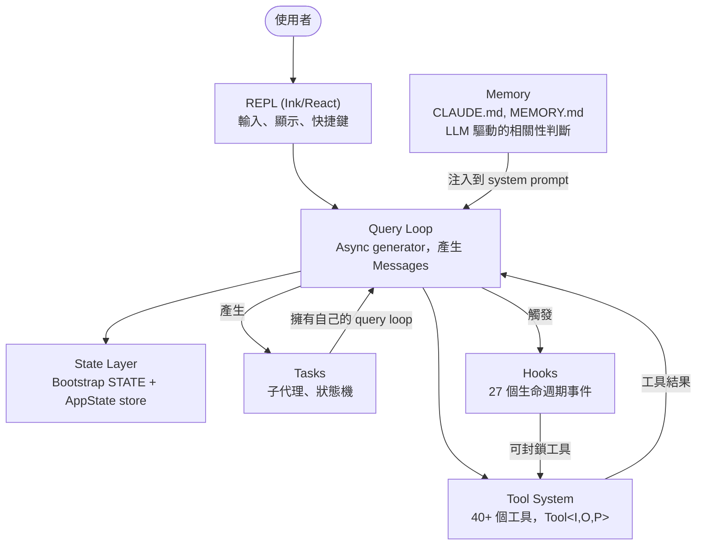
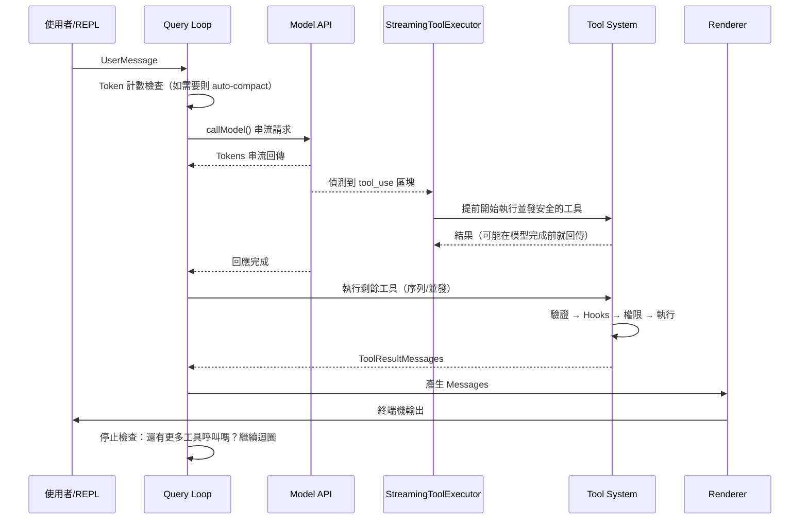
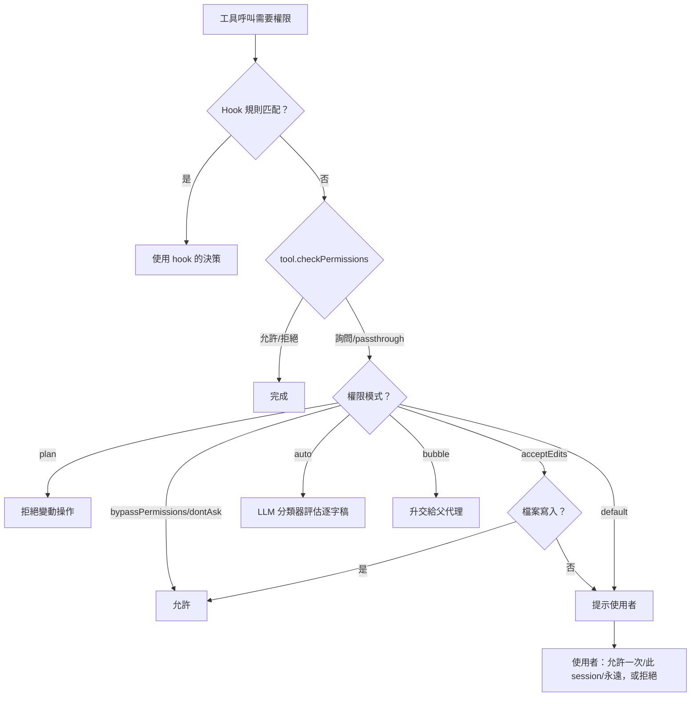
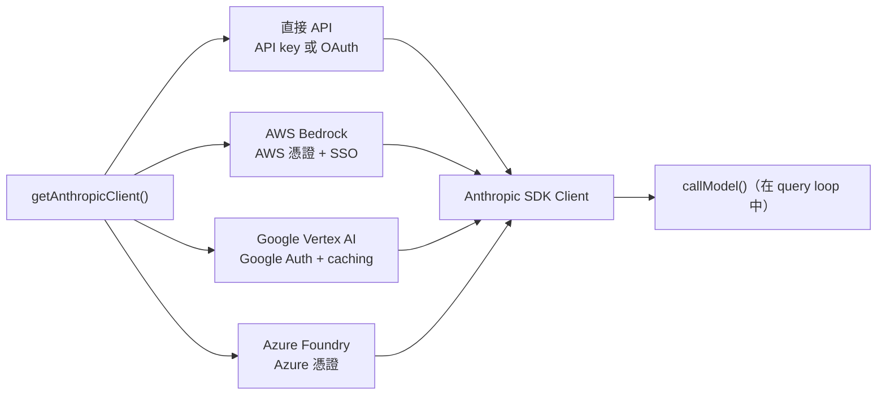
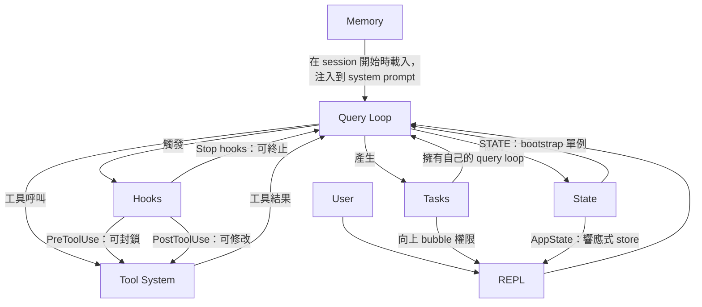

# 第一章：AI 代理的架構

## 你正在看什麼

傳統的 CLI 是一個函數。它接受參數、執行工作，然後退出。`grep` 不會決定順便也執行 `sed`。`curl` 不會開啟檔案並根據下載的內容修補它。合約很簡單：一個指令、一個動作、確定性的輸出。

代理式 CLI 打破了這份合約的每一個部分。它接受自然語言的 prompt，決定要使用哪些工具，以情況所需的任何順序執行它們，評估結果，並持續循環直到任務完成或使用者停止為止。「程式」不是一個固定的指令序列——它是一個圍繞語言模型的迴圈，在執行期即時產生自己的指令序列。工具呼叫是副作用。模型的推理是控制流程。

Claude Code 是 Anthropic 對這個概念的生產環境實作：一個近兩千個檔案的 TypeScript 單體應用，將終端機變成由 Claude 驅動的完整開發環境。它發布給數十萬名開發者，這意味著每一個架構決策都承載著真實世界的後果。本章提供你所需的心智模型。六個抽象定義了整個系統。一條單一的資料流將它們串連。一旦你內化了從按鍵到最終輸出的黃金路徑，後續每一章都只是放大這條路徑的某個片段。

接下來的內容是一種回溯性的分解——這六個抽象並非事先在白板上設計出來的。它們是在向大量使用者交付生產環境代理的壓力下逐漸浮現的。以「它們現在的樣子」而非「當初計畫的樣子」來理解它們，才能為閱讀本書其餘部分設定正確的預期。

---

## 六個核心抽象

Claude Code 建立在六個核心抽象之上。其他所有東西——400 多個工具函數、fork 過的終端機渲染器、vim 模擬、成本追蹤器——都是為了支撐這六個而存在。



以下是每一個抽象的用途及其存在的原因。

**1. Query Loop**（`query.ts`，約 1,700 行）。一個 async generator，是整個系統的心跳。它串流模型回應、收集工具呼叫、執行它們、將結果附加到訊息歷史，然後循環。每一個互動——REPL、SDK、子代理、無介面的 `--print`——都流經這個單一函數。它產生 `Message` 物件供 UI 消費。它的回傳類型是一個名為 `Terminal` 的可辨別聯集，精確編碼了迴圈停止的原因：正常完成、使用者中止、token 預算耗盡、stop hook 介入、達到最大回合數，或無法恢復的錯誤。選用 generator 模式——而非 callback 或 event emitter——提供了天然的背壓、乾淨的取消機制，以及有型別的終止狀態。第五章完整介紹迴圈的內部實作。

**2. Tool System**（`Tool.ts`、`tools.ts`、`services/tools/`）。工具是代理在現實世界中能做的任何事：讀取檔案、執行 shell 指令、編輯程式碼、搜尋網路。這個目的的簡單性背後隱藏著相當複雜的機制。每個工具實作了一個涵蓋身份識別、schema、執行、權限與渲染的豐富介面。工具不只是函數——它們自帶權限邏輯、並發宣告、進度回報與 UI 渲染。系統將工具呼叫分區為並發批次和序列批次，而串流執行器甚至在模型完成回應之前就開始執行並發安全的工具。第六章介紹完整的工具介面與執行管線。

**3. Tasks**（`Task.ts`、`tasks/`）。Tasks 是背景工作單元——主要是子代理。它們遵循狀態機：`pending -> running -> completed | failed | killed`。`AgentTool` 會產生一個新的 `query()` generator，擁有自己的訊息歷史、工具集與權限模式。Tasks 賦予 Claude Code 遞迴能力：代理可以委派給子代理，子代理還可以繼續委派。

**4. State**（兩層）。系統在兩個層次維護狀態。一個可變的單例（`STATE`）持有約 80 個 session 層級的基礎設施欄位：工作目錄、模型設定、成本追蹤、遙測計數器、session ID。它在啟動時設定一次，並直接修改——沒有響應性。一個最小化的響應式 store（34 行，Zustand 風格）驅動 UI：訊息、輸入模式、工具批准、進度指示器。這種分離是有意為之的：基礎設施狀態變化不頻繁，不需要觸發重新渲染；UI 狀態不斷變化，必須如此。第三章深入介紹雙層架構。

**5. Memory**（`memdir/`）。代理在 session 之間的持久化 context。三個層次：專案層級（儲存庫中的 `CLAUDE.md` 檔案）、使用者層級（`~/.claude/MEMORY.md`），以及團隊層級（透過 symlink 共享）。在 session 開始時，系統掃描所有記憶檔案、解析 frontmatter，然後由 LLM 選取與當前對話相關的記憶。Memory 是 Claude Code「記住」你的程式庫慣例、架構決策和除錯歷史的方式。

**6. Hooks**（`hooks/`、`utils/hooks/`）。使用者定義的生命週期攔截器，在 4 種執行類型的 27 個不同事件點觸發：shell 指令、單次 LLM prompt、多回合代理對話，以及 HTTP webhook。Hooks 可以封鎖工具執行、修改輸入、注入額外 context，或短路整個 query loop。權限系統本身部分透過 hook 實作——`PreToolUse` hook 可以在互動式權限提示觸發之前就拒絕工具呼叫。

---

## 黃金路徑：從按鍵到輸出

追蹤一個請求在系統中的完整流程。使用者輸入「為登入函數加上錯誤處理」並按下 Enter。



這個流程有三件事值得注意。

第一，query loop 是一個 generator，而非 callback 鏈。REPL 透過 `for await` 從中拉取訊息，這意味著背壓是天然的——如果 UI 跟不上，generator 就會暫停。這是相對於 event emitter 或 observable stream 的刻意選擇。

第二，工具執行與模型串流是重疊的。`StreamingToolExecutor` 不會等待模型完成才開始執行並發安全的工具。一個 `Read` 呼叫可以完成並回傳結果，而模型仍在產生回應的其餘部分。這就是投機執行——如果模型的最終輸出使工具呼叫無效（罕見但可能），結果會被丟棄。

第三，整個迴圈是可重入的。當模型進行工具呼叫時，結果會被附加到訊息歷史，迴圈再次以更新後的 context 呼叫模型。沒有單獨的「工具結果處理」階段——全部都在同一個迴圈中。模型透過不再進行任何工具呼叫來決定它何時完成。

---

## 權限系統

Claude Code 在你的機器上執行任意的 shell 指令。它編輯你的檔案。它可以產生子程序、發出網路請求，並修改你的 git 歷史。沒有權限系統，這將是一場安全災難。

系統定義了七種權限模式，從最寬鬆到最嚴格排列：

| 模式 | 行為 |
|------|------|
| `bypassPermissions` | 一切允許，無任何檢查。僅供內部/測試使用。 |
| `dontAsk` | 全部允許，但仍記錄日誌。不向使用者提示。 |
| `auto` | 逐字稿分類器（LLM）決定允許/拒絕。 |
| `acceptEdits` | 檔案編輯自動批准；所有其他變動操作則提示。 |
| `default` | 標準互動模式。使用者批准每一個動作。 |
| `plan` | 唯讀。所有變動操作被封鎖。 |
| `bubble` | 將決策升交給父代理（子代理模式）。 |

當工具呼叫需要權限時，解析遵循嚴格的鏈條：



`auto` 模式值得特別關注。它執行一個獨立的、輕量級的 LLM 呼叫，將工具呼叫與對話逐字稿進行分類。分類器看到工具輸入的緊湊表示，並決定該動作是否與使用者的要求一致。這是讓 Claude Code 能夠半自主運作的模式——批准例行操作，同時標記任何看起來偏離使用者意圖的事情。

子代理預設使用 `bubble` 模式，這意味著它們無法批准自己的危險動作。權限請求會向上傳遞給父代理，最終傳遞給使用者。這防止子代理在使用者從未察覺的情況下悄悄執行破壞性指令。

---

## 多提供者架構

Claude Code 透過四條不同的基礎設施路徑與 Claude 通訊，對系統其餘部分完全透明。



關鍵洞察在於：Anthropic SDK 為每個雲端提供者提供了包裝類別，呈現與直接 API 客戶端相同的介面。`getAnthropicClient()` 工廠函數讀取環境變數和設定來決定使用哪個提供者，構建相應的客戶端並回傳它。從那時起，`callModel()` 和所有其他消費者都將其視為一個通用的 Anthropic 客戶端。

提供者選擇在啟動時確定並儲存在 `STATE` 中。Query loop 從不檢查哪個提供者處於活動狀態。這意味著從直接 API 切換到 Bedrock 是一個設定變更，而非程式碼變更——代理迴圈、工具系統和權限模型完全與提供者無關。

---

## 建置系統

Claude Code 同時作為 Anthropic 的內部工具和公開的 npm 套件發布。同一份程式碼庫服務兩者，透過編譯期 feature flag 控制包含的內容。

```typescript
// 由 feature flag 保護的條件式 import
const reactiveCompact = feature('REACTIVE_COMPACT')
  ? require('./services/compact/reactiveCompact.js')
  : null
```

`feature()` 函數來自 `bun:bundle`，即 Bun 的內建 bundler API。在建置時，每個 feature flag 都解析為布林字面值。當 flag 為 false 時，bundler 的 dead code elimination 會完全移除 `require()` 呼叫——該模組永遠不會被載入、不會包含在 bundle 中，也不會被發布。

這個模式是一致的：一個頂層的 `feature()` 守衛包裹著一個 `require()` 呼叫。使用 `require()` 而非 `import` 的原因正是：當守衛為 false 時，動態 `require()` 可以被 bundler 完全消除，而動態 `import()` 則不行（它回傳一個 bundler 必須保留的 Promise）。

有一個值得一提的諷刺之處。早期 npm 發布版本附帶的 source map 包含了 `sourcesContent`——完整的原始 TypeScript 原始碼，包括僅供內部使用的程式碼路徑。feature flag 成功地剝除了執行期程式碼，卻將原始碼留在了 map 中。這就是 Claude Code 原始碼得以公開閱讀的原因。

---

## 各部分如何串連

六個抽象形成了一個依賴關係圖：



Memory 作為 system prompt 的一部分被注入到 query loop。Query loop 驅動工具執行。工具結果以訊息形式回饋到 query loop。Tasks 是帶有隔離訊息歷史的遞迴 query loop。Hooks 在定義的點攔截 query loop。State 被所有人讀寫，響應式 store 橋接到 UI。

Query loop 與 tool system 之間的循環依賴是這個系統的定義特徵。模型產生工具呼叫。工具執行並產生結果。結果被附加到訊息歷史。模型看到結果並決定下一步。這個循環持續到模型停止產生工具呼叫，或外部約束（token 預算、最大回合數、使用者中止）終止它為止。

以下是它們如何連接到後續章節：從輸入到輸出的黃金路徑是貫穿整本書的線索。第二章追蹤系統啟動至這條路徑可以執行的過程。第三章解釋路徑所讀寫的雙層狀態架構。第四章涵蓋 query loop 呼叫的 API 層。後續每一章都放大你剛才端對端看到的路徑中的某一個片段。

---

## 應用這些

如果你正在建構一個代理系統——任何 LLM 在執行期決定採取什麼動作的系統——以下是 Claude Code 架構中可以轉移的模式。

**Generator 迴圈模式。** 使用 async generator 作為你的代理迴圈，而非 callback 或 event emitter。Generator 提供天然的背壓（消費者以自己的節奏拉取）、乾淨的取消（對 generator 呼叫 `.return()`），以及用於終止狀態的型別化回傳值。它所解決的問題：在基於 callback 的代理迴圈中，很難知道迴圈何時「完成」以及原因。Generator 使終止成為型別系統的一等公民。

**自我描述的工具介面。** 每個工具應該宣告自己的並發安全性、權限要求和渲染行為。不要把這個邏輯放在一個「了解」每個工具的中央協調器中。它所解決的問題：中央協調器會變成一個神物件，每次新增工具都必須更新。自我描述的工具是線性擴展的——新增第 N+1 個工具不需要對現有程式碼做任何修改。

**將基礎設施狀態與響應式狀態分開。** 不是所有狀態都需要觸發 UI 更新。Session 設定、成本追蹤和遙測屬於普通的可變物件。訊息歷史、進度指示器和批准佇列屬於響應式 store。它所解決的問題：讓一切都具有響應性會為啟動時只變更一次、被讀取上千次的狀態增加訂閱開銷和複雜性。兩個層次對應兩種存取模式。

**權限模式，而非權限檢查。** 定義一小組命名模式（plan、default、auto、bypass），並透過模式解析每一個權限決策。不要在工具實作中散布 `if (isAllowed)` 檢查。它所解決的問題：不一致的權限執行。當每個工具都經過相同的基於模式的解析鏈時，你可以透過知道哪個模式處於活動狀態來推斷系統的安全態勢。

**透過 tasks 實現遞迴代理架構。** 子代理應該是相同代理迴圈的新實例，擁有自己的訊息歷史，而不是特殊處理的程式碼路徑。權限升級透過 `bubble` 模式向上流動。它所解決的問題：子代理邏輯與主代理迴圈背離，導致行為和錯誤處理上的細微差異。如果子代理是相同的迴圈，它就繼承了所有相同的保證。
