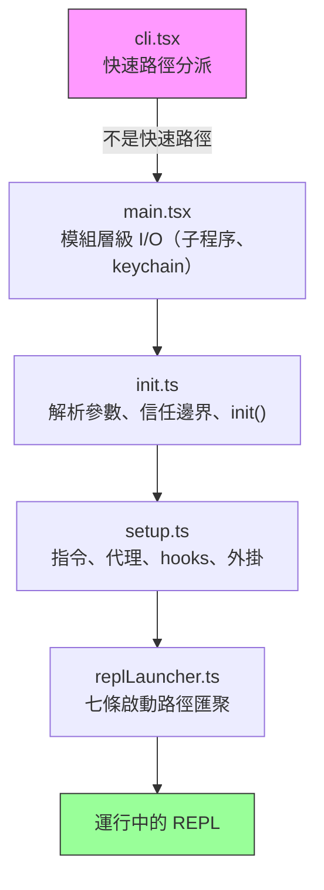
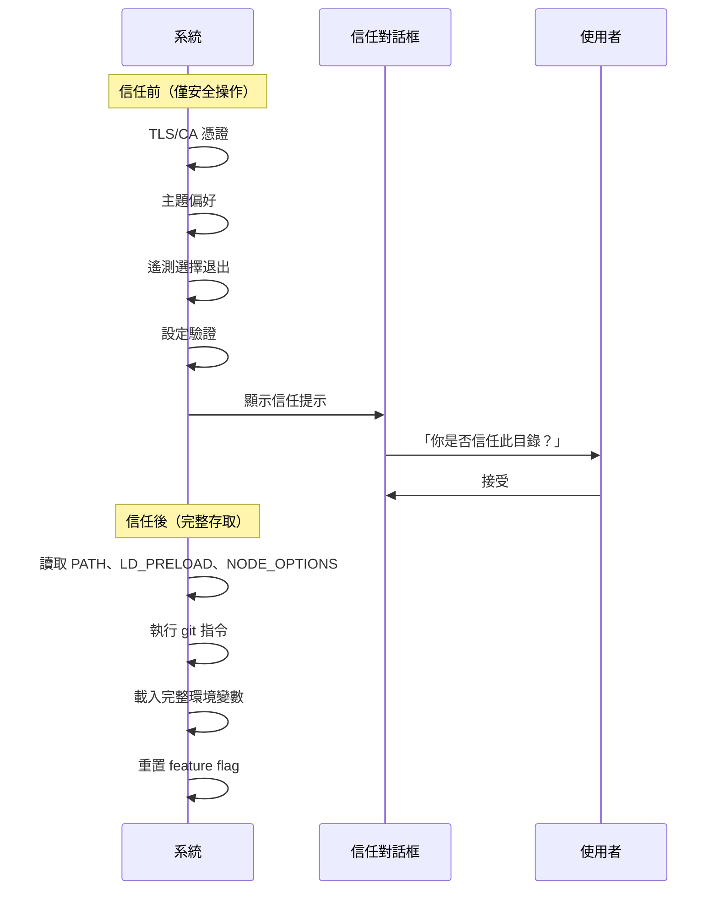

# 第二章：快速啟動——啟動引導管線

如果第一章給了你 Claude Code 架構的地圖，本章則告訴你它抵達工作狀態所走的路線。第一章介紹的六個抽象中的每一個元件——query loop、tool system、state 層、hooks、memory——都必須在使用者看到游標之前完成初始化。所有這一切的預算：300 毫秒。

三百毫秒是人類感知到工具「瞬間完成」的臨界值。超過它，CLI 就會感覺遲鈍。超出太多，開發者就會放棄使用。本章中的一切都是為了維持在這條線之內。

啟動引導必須完成四件事：驗證環境、建立安全邊界、設定通訊層，以及渲染 UI。它必須在 300ms 以內完成這四件事。架構上的洞察是：這四項工作可以部分重疊、謹慎排序，並積極削減，以適應對這麼複雜的系統來說看似不可能的預算。

關於方法論的說明：本章中的時間戳是近似值，來自程式碼庫自身的效能分析檢查點。它們代表現代硬體上的典型暖啟動計時。冷啟動較慢。絕對數字不如相對結構重要：哪些操作重疊、哪些阻塞，以及哪些被推遲。

---

## 管線的形狀

啟動管線存在於五個依序執行的檔案中。每個檔案都縮小了系統下一步需要做的事情的範圍：



每個檔案在將控制權傳遞給下一個之前執行最少必要的工作。`cli.tsx` 嘗試在 import 任何重量級模組之前就退出。`main.tsx` 在模組評估期間以副作用的形式觸發慢速操作。`init.ts` 解析設定並建立信任邊界。`setup.ts` 註冊各種能力。`replLauncher.ts` 選擇正確的進入點並啟動 UI。

三種平行化策略讓這一切變得快速：

1. **模組層級的子程序分派。** 在 import 評估期間以副作用的形式觸發 keychain 和 MDM 讀取。子程序在剩餘約 135ms 的靜態 import 載入時就已在執行。
2. **setup 中的 Promise 平行化。** Socket 綁定、hook 快照、指令載入和代理定義載入全部並發執行。
3. **渲染後延遲的預取操作。** 使用者在輸入第一條訊息前不需要的一切——git 狀態、模型能力、AWS 憑證——在 prompt 可見後才執行。

第四個策略不那麼顯眼，但同樣重要：**動態 import 以延遲模組評估**。程式碼庫在至少十幾個地方使用 `await import('./module.js')` 來避免在需要之前載入程式碼。OpenTelemetry（400KB + 700KB gRPC）只在遙測初始化時載入。React 元件只在渲染時載入。每個動態 import 以冷路徑延遲（首次使用觸發模組評估）換取熱路徑速度（啟動不需要為可能永遠不用的模組付出代價）。

---

## 階段 0：快速路徑分派（cli.tsx）

程序進入的第一個檔案 `cli.tsx` 只有一個工作：判斷是否根本不需要完整的啟動引導管線。許多呼叫——`claude --version`、`claude --help`、`claude mcp list`——只需要一個特定的答案。載入 React、初始化遙測、讀取 keychain，以及設置 tool system 都是純粹的浪費。

模式是：檢查 `argv`，動態 import 你需要的處理器，然後在系統其餘部分載入之前就退出。

```typescript
// 快速路徑模式的虛擬碼
if (args.length === 1 && args[0] === '--version') {
  const { printVersion } = await import('./commands/version.js')
  await printVersion()
  process.exit(0)
}
```

大約有十幾條快速路徑，涵蓋版本、說明、設定、MCP 伺服器管理和更新檢查。具體細節不重要——模式才重要。每條路徑動態 import 恰好一個模組，呼叫一個函數，然後退出。其餘的程式碼庫永遠不會載入。

這是貫穿整個啟動引導反覆出現的一個原則的第一個實例：**透過更了解意圖來做更少的事**。`argv` 陣列揭示了使用者的意圖。如果意圖是窄的，執行路徑也應該是窄的。

如果沒有快速路徑匹配，`cli.tsx` 就會落到完整的 `main.tsx` import，真正的啟動開始了。

---

## 階段 1：模組層級 I/O（main.tsx）

當 `main.tsx` 被 import 時，它的模組層級副作用在評估期間就會觸發——在檔案中的任何函數被呼叫之前。這是整個啟動引導中最重要的效能技術：

```typescript
// 這些在 import 時執行，而非在呼叫時執行
const mdmPromise = startMDMSubprocess()
const keychainPromise = readKeychainCredentials()
```

當 JavaScript 引擎評估 `main.tsx` 及其遞移 import（約 138ms 的模組評估）時，這兩個 Promise 已經在飛行中了。MDM（行動裝置管理）子程序檢查組織的安全政策。Keychain 讀取獲取儲存的憑證。兩者都是 I/O 密集型操作，否則會在關鍵路徑上序列化。

洞察點在於：模組評估不是空閒時間——它是你可以與 I/O 重疊的時間。當 `main.tsx` 匯出的函數第一次被呼叫時，這些 Promise 通常已經解析了。

這項技術需要在相關檔案中抑制 ESLint 的 top-level-await 和 side-effect-in-module-scope 規則。程式碼庫有一個專門針對 `process.env` 存取模式的自訂 ESLint 規則，允許在模組作用域的受控副作用，同時防止其他地方的不受控副作用。

---

## 階段 2：解析與信任（init.ts）

`init()` 函數是記憶化的——多次呼叫是安全的，並回傳相同的結果。這很重要，因為多個進入點（REPL、print 模式、SDK 模式）都可能各自呼叫 `init()`，而記憶化保證它恰好只執行一次。

函數透過 Commander 解析命令列參數，從多個來源載入設定（全域設定、專案設定、環境變數），然後遇到管線中最重要的邊界。

### 信任邊界

在信任邊界之前，系統以受限模式運作。在它之後，完整的能力才可用。這個邊界存在是因為 Claude Code 讀取環境變數——而環境變數可能被污染。



信任邊界不是關於使用者信任 Claude Code。它是關於 Claude Code 信任*環境*。惡意的 `.bashrc` 可以設定 `LD_PRELOAD` 來將程式碼注入每個子程序。信任對話框確保使用者明確同意在一個可能由他人設定的目錄中運作。

系統有十個不同的對信任敏感的操作。在使用者接受信任對話框之前，只執行安全操作：TLS 憑證設定、主題偏好、遙測選擇退出。信任後，系統讀取潛在危險的環境變數（PATH、LD_PRELOAD、NODE_OPTIONS）、執行 git 指令，並套用完整的環境設定。

### preAction Hook

Commander 的 `preAction` hook 是架構上的關鍵。Commander 解析指令結構（flags、子指令、位置參數）而*不*執行任何東西。`preAction` hook 在解析後、匹配的指令處理器執行前觸發：

```typescript
program.hook('preAction', async (thisCommand) => {
  await init(thisCommand)
})
```

這種分離意味著快速路徑指令（在 `cli.tsx` 中於 Commander 載入前處理）永遠不需要付出 `init()` 的代價。只有需要完整環境的指令才會觸發初始化。

---

## 階段 3：Setup（setup.ts）

`init()` 完成後，`setup()` 註冊系統需要的所有能力：

```mermaid
gantt
    title 階段 3：平行 Setup
    dateFormat X
    axisFormat %Lms

    section 序列
    指令註冊             :0, 5
    section 平行
    代理定義             :5, 15
    Hook 註冊            :5, 12
    外掛初始化           :5, 20
    MCP 伺服器連線       :5, 25
```



在可能的情況下，指令、代理、hook 和外掛全部平行註冊。setup 階段是系統從「我知道我的設定」過渡到「我擁有所有能力」的時刻。setup 之後，每個工具都已註冊、每個 hook 都已串接，系統已準備好處理使用者輸入。

Setup 也處理安全 hook 快照。Hook 設定從磁碟讀取一次，凍結為不可變快照，並在整個 session 期間使用。之後對磁碟上的 hooks 設定檔的修改會被忽略。這防止攻擊者在 session 開始後修改 hook 規則——凍結的快照是權限決策的唯一真實來源。

---

## 階段 4：啟動（replLauncher.ts）

七條不同的程式碼路徑匯聚在 `replLauncher.ts`：互動式 REPL、print 模式（`--print`）、SDK 模式、恢復（`--resume`）、繼續（`--continue`）、管道模式，以及無介面模式。啟動器檢查 `init()` 產生的設定，並分派到正確的進入點。

兩個例子說明了範圍的廣度：

**互動式 REPL**——標準情況。啟動器掛載 React/Ink 元件樹、啟動終端機渲染器，並進入事件迴圈。使用者看到 prompt 可以開始輸入。

**Print 模式**（`--print`）——來自 `argv` 的單一 prompt。啟動器建立一個沒有 React 樹的無介面 query loop，執行到完成，將輸出串流到 stdout，然後退出。相同的代理迴圈，不同的呈現方式。

重要細節：所有七條路徑最終都呼叫 `query()`——即第一章中相同的代理迴圈。啟動路徑決定迴圈*如何*呈現（互動式終端機、單次執行、SDK 協定），而不是*做什麼*。這種匯聚正是讓架構可測試且可預測的原因：無論使用者如何呼叫 Claude Code，核心行為都是相同的。

---

## 啟動時間線

完整管線的時間流如下：

```mermaid
gantt
    title 啟動引導時間線（約 240ms）
    dateFormat X
    axisFormat %Lms

    section 階段 0
    快速路徑檢查              :0, 5

    section 階段 1
    模組評估                  :5, 143
    MDM 子程序（平行）        :8, 60
    Keychain 讀取（平行）     :8, 50

    section 階段 2
    Commander 解析            :143, 146
    init()                    :146, 160
    信任邊界                  :160, 175

    section 階段 3
    setup() + 平行註冊        :175, 210

    section 階段 4
    啟動路徑選擇              :210, 215
    首次渲染                  :215, 240
```



關鍵路徑貫穿模組評估（最長的單一階段，約 138ms），然後是 Commander 解析、init，以及 setup。平行 I/O 操作（MDM、keychain）與模組評估重疊，通常在需要前就已解析。

### 效能預算

| 階段 | 時間 | 發生什麼 |
|------|------|----------|
| 快速路徑檢查 | 約 5ms | 檢查 argv，若可能則提早退出 |
| 模組評估 | 約 138ms | Import 樹，觸發平行 I/O |
| Commander 解析 | 約 3ms | 解析 flag 和子指令 |
| init() | 約 14ms | 設定解析、信任邊界 |
| setup() | 約 35ms | 指令、代理、hooks、外掛 |
| 啟動 + 首次渲染 | 約 25ms | 選擇路徑、掛載 React、首次繪製 |
| **總計** | **約 240ms** | 在 300ms 預算之內 |

在現代機器上總計約 240ms——在 300ms 預算下有 60ms 的餘裕。冷啟動（重開機後第一次執行、OS 快取為空）可能讓模組評估推進到 200ms 以上，使總計更接近上限。

---

## 遷移系統

關於 init 期間執行的一個子系統的簡短說明：schema 遷移。Claude Code 在本地檔案和目錄中儲存設定和 session 資料。當格式在版本之間發生變化時，遷移在啟動時自動執行。

每個遷移都是一個帶有版本號的函數。系統將當前 schema 版本與最高的遷移版本進行比較，按順序執行待處理的遷移，並更新版本。遷移是冪等的，而且速度很快（操作小型本地檔案，而非資料庫）。整個遷移過程通常在 5ms 以內完成。如果某個遷移失敗，它會記錄錯誤並繼續——可用性優先於本地設定的嚴格一致性。

---

## 啟動教給我們的系統設計道理

啟動引導管線是一個縮小範圍的研究案例。每個階段都減少了系統下一步需要做的可能性空間：

- 階段 0 從「任何 CLI 呼叫」縮小到「需要完整啟動引導」
- 階段 1 從「一切都必須載入」縮小到「與 I/O 平行載入」
- 階段 2 從「未知環境」縮小到「受信任的、已設定的環境」
- 階段 3 從「沒有能力」縮小到「完全註冊」
- 階段 4 從「七種可能模式」縮小到「一條具體的啟動路徑」

當 REPL 渲染時，每一個決策都已做出。Query loop 收到一個完全設定好的環境，對自己處於哪種模式、哪些工具可用、適用哪些權限毫無歧義。300ms 的預算不只是一個效能目標——它是一個強迫函數，防止啟動引導變成一個懶惰初始化系統，使決策被推遲和分散到整個程式碼庫。

---

## 應用這些

**將 I/O 與初始化重疊。** 在模組評估時——在需要之前——就觸發慢速操作（子程序產生、憑證讀取、網路檢查）。JavaScript 引擎無論如何都在做同步工作——利用這段時間進行平行 I/O。模式：在檔案頂部寫 `const promise = startSlowThing()`，在使用點寫 `await promise`。

**盡早縮小範圍。** 啟動引導管線的五個檔案形成一個漏斗：每個階段消除後續階段不需要做的工作。快速路徑分派是最戲劇性的例子，但這個原則適用於任何地方。如果你能在解析時就確定某條程式碼路徑是不必要的，就跳過它。

**明確建立信任邊界。** 如果你的應用程式從它不控制的環境中讀取（環境變數、設定檔、shell 設定），在「使用者同意前可安全讀取」和「僅在同意後才讀取」之間畫一條清晰的界線。信任邊界防止了一類攻擊，即惡意環境在使用者有機會評估之前就污染應用程式。

**記憶化你的 init 函數。** 使初始化具有冪等性——呼叫兩次產生相同的結果。這消除了當多個進入點都可能觸發初始化時的排序錯誤。記憶化模式很簡單，但能消除整整一類重複初始化的 bug。

**在讓出控制權之前捕獲早期輸入。** 在事件驅動系統中，初始化期間到達的使用者輸入可能會丟失。Claude Code 在任何非同步工作開始之前就從 argv 捕獲初始 prompt，確保 `claude "修復這個 bug"` 即使初始化花費比預期更長的時間也不會丟失這個 prompt。
