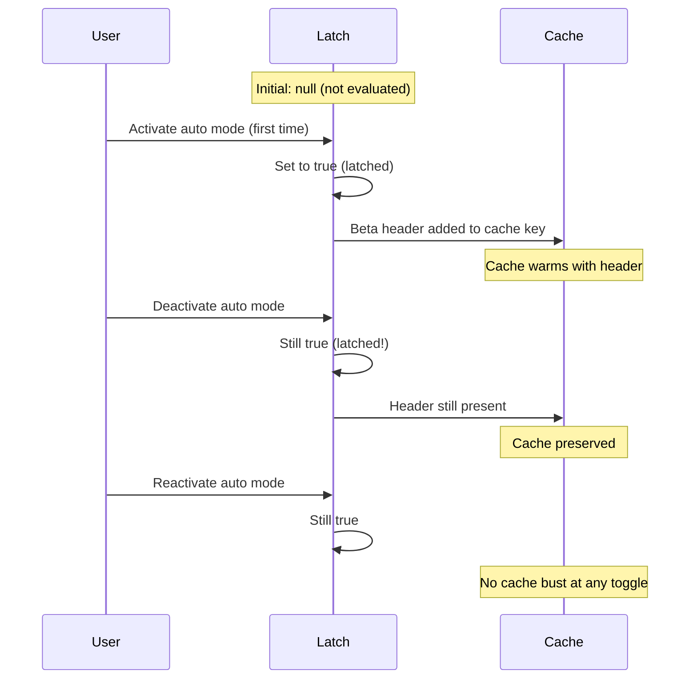
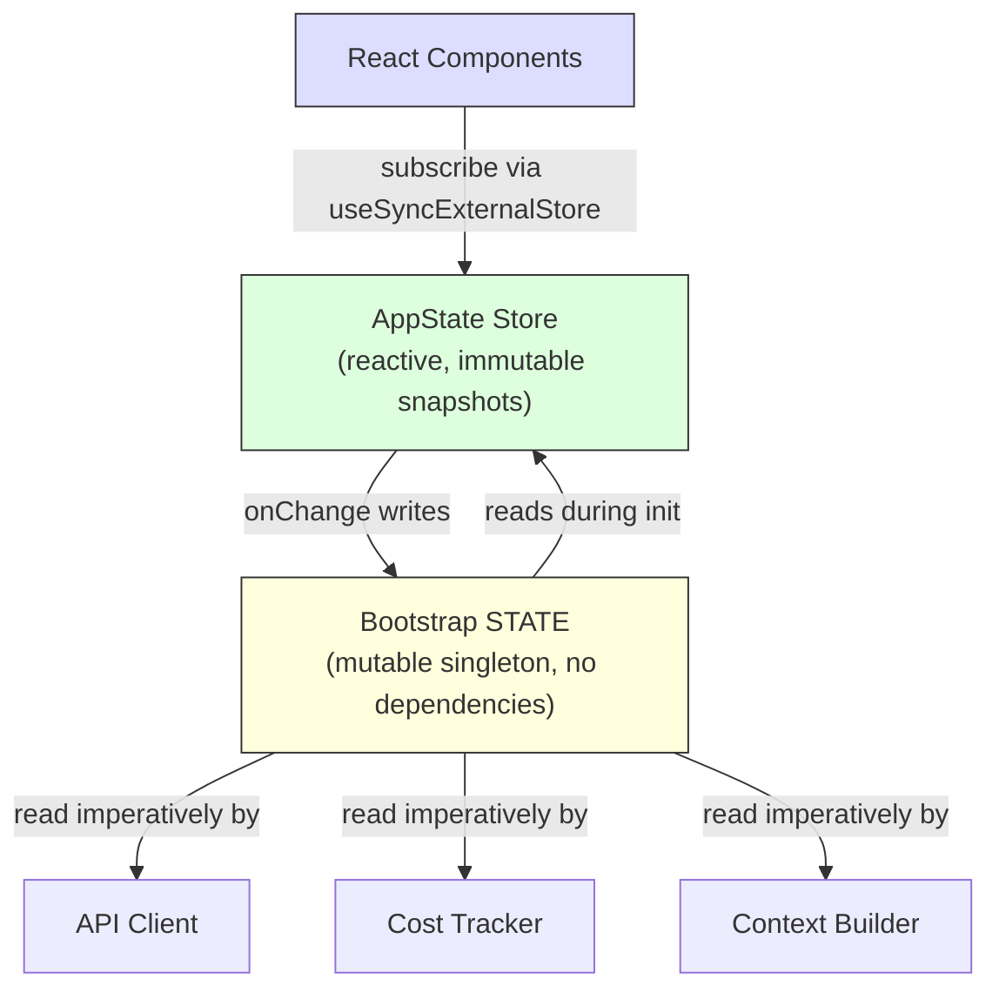

# 第三章：狀態——雙層架構

第二章追蹤了從行程啟動到首次渲染的引導流水線。到那個時間點為止，系統已擁有一個完整設定好的環境。但「設定」了什麼？Session ID 存放在哪裡？目前的模型？訊息歷史？費用追蹤器？權限模式？狀態住在哪裡，又為何住在那裡？

每一個長時間運行的應用程式最終都會面對這個問題。對於簡單的 CLI 工具而言，答案很平凡——`main()` 裡的幾個變數。但 Claude Code 並不是一個簡單的 CLI 工具。它是一個透過 Ink 渲染的 React 應用程式，行程生命週期可以橫跨數小時，有一個在任意時間點載入的插件系統，有一個必須從快取上下文建構提示的 API 層，有一個在行程重啟後仍然存活的費用追蹤器，以及數十個需要讀寫共享資料、卻又不能互相引入的基礎設施模組。

最直觀的做法——單一全域儲存——立刻就會失敗。如果費用追蹤器更新的是同一個驅動 React 重新渲染的儲存，每次 API 呼叫都會觸發完整的元件樹對帳。基礎設施模組（引導、上下文建構、費用追蹤、遙測）無法引入 React。它們在 React 掛載之前就已執行。它們在 React 卸載之後才執行。它們在根本沒有元件樹的情境下執行。把所有東西都放進一個感知 React 的儲存，會在整個引入圖中造成循環相依。

Claude Code 用雙層架構解決這個問題：一個可變的行程單例用於基礎設施狀態，以及一個最小化的響應式儲存用於 UI 狀態。本章說明這兩層、連接它們的副作用系統，以及依賴此基礎的各個子系統。後續每一章都預設你已理解狀態住在哪裡，以及為何住在那裡。

---

## 3.1 引導狀態——行程單例

### 為什麼用可變單例

引導狀態模組（`bootstrap/state.ts`）是一個在行程啟動時建立一次的單一可變物件：

```typescript
const STATE: State = getInitialState()
```

這行上方的注解寫著：`AND ESPECIALLY HERE`。在型別定義上方兩行：`DO NOT ADD MORE STATE HERE - BE JUDICIOUS WITH GLOBAL STATE`。這些注解帶著工程師吃虧後才學到的苦澀語氣。

在這裡，可變單例是正確的選擇，原因有三。第一，引導狀態必須在任何框架初始化之前就能取用——在 React 掛載之前、在儲存建立之前、在插件載入之前。模組作用域初始化是唯一能保證在引入時即可取用的機制。第二，這些資料本質上是行程作用域的：Session ID、遙測計數器、費用累加器、快取路徑。沒有什麼有意義的「前一個狀態」可以做差異比較，沒有需要通知的訂閱者，也沒有撤銷歷史。第三，這個模組必須是引入相依圖中的葉節點。如果它引入了 React、儲存，或任何服務模組，就會造成破壞第二章所述引導順序的循環。藉由只依賴工具型別和 `node:crypto`，它得以從任何地方引入。

### 約 80 個欄位

`State` 型別包含大約 80 個欄位。從中取樣可看出其廣度：

**身份識別與路徑** —— `originalCwd`、`projectRoot`、`cwd`、`sessionId`、`parentSessionId`。`originalCwd` 在行程啟動時透過 `realpathSync` 解析並做 NFC 正規化，之後永不改變。

**費用與指標** —— `totalCostUSD`、`totalAPIDuration`、`totalLinesAdded`、`totalLinesRemoved`。這些值在 Session 過程中單調遞增，並在結束時持久化到磁碟。

**遙測** —— `meter`、`sessionCounter`、`costCounter`、`tokenCounter`。OpenTelemetry 句柄，全部可為 null（直到遙測初始化前為 null）。

**模型設定** —— `mainLoopModelOverride`、`initialMainLoopModel`。覆寫值在使用者於 Session 過程中更換模型時設定。

**Session 旗標** —— `isInteractive`、`kairosActive`、`sessionTrustAccepted`、`hasExitedPlanMode`。控制 Session 期間行為的布林值。

**快取最佳化** —— `promptCache1hAllowlist`、`promptCache1hEligible`、`systemPromptSectionCache`、`cachedClaudeMdContent`。這些欄位的存在是為了避免重複計算和破壞提示快取。

### Getter/Setter 模式

`STATE` 物件從不被直接匯出。所有存取都透過大約 100 個獨立的 getter 和 setter 函式進行：

```typescript
// Pseudocode — illustrates the pattern
export function getProjectRoot(): string {
  return STATE.projectRoot
}

export function setProjectRoot(dir: string): void {
  STATE.projectRoot = dir.normalize('NFC')  // NFC normalization on every path setter
}
```

這個模式強制執行封裝性、每個路徑 setter 的 NFC 正規化（防止 macOS 上的 Unicode 不匹配）、型別縮窄，以及引導隔離。代價是冗長——八十個欄位對應一百個函式。但在一個錯誤的修改可能破壞 50,000 個 token 提示快取的程式碼庫中，明確性勝出。

### Signal 模式

引導層無法引入監聽器（它是 DAG 葉節點），因此它使用一個名為 `createSignal` 的最小化發布/訂閱原語。`sessionSwitched` signal 只有一個消費者：`concurrentSessions.ts`，負責保持 PID 檔案同步。該 signal 以 `onSessionSwitch = sessionSwitched.subscribe` 的形式公開，讓呼叫者能自行註冊，而引導層不需要知道它們是誰。

### 五個黏性鎖存器

引導狀態中最微妙的欄位，是五個遵循相同模式的布林鎖存器：一旦某個功能在 Session 中首次被啟用，對應的旗標就會在 Session 剩餘時間內保持 `true`。它們存在的原因只有一個：保護提示快取。



Claude 的 API 支援伺服器端提示快取。當連續請求共享相同的系統提示前綴時，伺服器會重用快取的計算結果。但快取鍵包含了 HTTP 標頭和請求主體欄位。如果第 N 個請求出現了某個 beta 標頭，而第 N+1 個請求沒有，快取就會失效——即使提示內容完全相同。對於超過 50,000 個 token 的系統提示，快取未命中的代價相當昂貴。

五個鎖存器：

| 鎖存器 | 防止的問題 |
|-------|-----------------|
| `afkModeHeaderLatched` | Shift+Tab 切換自動模式時，AFK beta 標頭會反覆開關 |
| `fastModeHeaderLatched` | 進入/退出快速模式冷卻時，快速模式標頭會反覆開關 |
| `cacheEditingHeaderLatched` | 遠端功能旗標的變更會讓每個活躍使用者的快取失效 |
| `thinkingClearLatched` | 在確認快取未命中（閒置超過 1 小時）時觸發。防止重新啟用思考區塊使剛預熱好的快取失效 |
| `pendingPostCompaction` | 遙測用的一次性旗標：區分壓縮引起的快取未命中與 TTL 過期引起的未命中 |

五個鎖存器都使用三態型別：`boolean | null`。`null` 的初始值表示「尚未評估」。`true` 表示「已鎖存為開啟」。一旦設為 `true`，永遠不會回到 `null` 或 `false`。這是鎖存器的定義性質。

實作模式：

```typescript
function shouldSendBetaHeader(featureCurrentlyActive: boolean): boolean {
  const latched = getAfkModeHeaderLatched()
  if (latched === true) return true       // Already latched -- always send
  if (featureCurrentlyActive) {
    setAfkModeHeaderLatched(true)          // First activation -- latch it
    return true
  }
  return false                             // Never activated -- don't send
}
```

為什麼不直接總是送出所有 beta 標頭？因為標頭是快取鍵的一部分。送出一個未被識別的標頭會創建不同的快取命名空間。鎖存器確保你只有在真正需要時才進入某個快取命名空間，然後一直待在那裡。

---

## 3.2 AppState——響應式儲存

### 34 行的實作

UI 狀態儲存位於 `state/store.ts`：

儲存的實作大約 30 行：一個覆蓋 `state` 變數的閉包、一個 `Object.is` 相等性檢查以防止多餘的更新、同步的監聽器通知，以及一個用於副作用的 `onChange` 回呼。骨架如下：

```typescript
// Pseudocode — illustrates the pattern
function makeStore(initial, onTransition) {
  let current = initial
  const subs = new Set()
  return {
    read:      () => current,
    update:    (fn) => { /* Object.is guard, then notify */ },
    subscribe: (cb) => { subs.add(cb); return () => subs.delete(cb) },
  }
}
```

三十四行。沒有中介軟體，沒有開發工具，沒有時間旅行除錯，沒有 action 型別。只是一個覆蓋可變變數的閉包、一個監聽器的 Set，以及一個 `Object.is` 相等性檢查。這就是沒有函式庫的 Zustand。

值得審視的設計決策：

**更新函式模式。** 沒有 `setState(newValue)`——只有 `setState((prev) => next)`。每次修改都接收當前狀態並必須產生下一個狀態，消除了來自並發修改的陳舊狀態問題。

**`Object.is` 相等性檢查。** 如果更新函式回傳相同的參考，修改就是空操作。不觸發任何監聽器，也不執行任何副作用。這對效能至關重要——展開後再設定但沒有改變值的元件不會產生重新渲染。

**`onChange` 在監聽器之前觸發。** 可選的 `onChange` 回呼同時接收新舊兩個狀態，並在任何訂閱者被通知之前同步觸發。這用於副作用（第 3.4 節），這些副作用必須在 UI 重新渲染之前完成。

**沒有中介軟體，沒有開發工具。** 這不是疏忽。當你的儲存恰好只需要三個操作（get、set、subscribe）、一個 `Object.is` 相等性檢查，以及一個同步 `onChange` 鉤子時，34 行你自己掌控的程式碼比一個你不掌控的相依套件更好。你控制了確切的語意。你可以在三十秒內讀完整個實作。

### AppState 型別

`AppState` 型別（約 452 行）是 UI 渲染所需一切的形狀。大多數欄位都包在 `DeepImmutable<>` 中，但持有函式型別的欄位有明確的例外：

```typescript
export type AppState = DeepImmutable<{
  settings: SettingsJson
  verbose: boolean
  // ... ~150 more fields
}> & {
  tasks: { [taskId: string]: TaskState }  // Contains abort controllers
  agentNameRegistry: Map<string, AgentId>
}
```

這個交集型別讓大多數欄位深度不可變，同時豁免持有函式、Map 和可變參考的欄位。完全不可變是預設值，在型別系統與執行期語意相衝突的地方有精確的逃生艙口。

### React 整合

儲存透過 `useSyncExternalStore` 與 React 整合：

```typescript
// Standard React pattern — useSyncExternalStore with a selector
export function useAppState<T>(selector: (state: AppState) => T): T {
  const store = useContext(AppStoreContext)
  return useSyncExternalStore(
    store.subscribe,
    () => selector(store.getState()),
  )
}
```

選擇器必須回傳現有的子物件參考（而非新建構的物件）才能讓 `Object.is` 比較正常運作，以防止不必要的重新渲染。如果你寫 `useAppState(s => ({ a: s.a, b: s.b }))`，每次渲染都會產生一個新的物件參考，元件就會在每次狀態變更時重新渲染。這是 Zustand 使用者面對的相同限制——更便宜的比較，但選擇器的作者必須理解參考身份的概念。

---

## 3.3 兩層如何關聯

兩層透過明確、狹窄的介面進行溝通。



引導狀態在初始化過程中流入 AppState：`getDefaultAppState()` 從磁碟讀取設定（引導層協助定位）、檢查功能旗標（引導層已評估），並設定初始模型（引導層從 CLI 引數和設定中解析出來）。

AppState 透過副作用回流到引導狀態：當使用者更換模型時，`onChangeAppState` 會呼叫引導層中的 `setMainLoopModelOverride()`。當設定改變時，引導層中的憑證快取會被清除。

但兩層從不共享參考。引入引導狀態的模組不需要知道 React 的存在。讀取 AppState 的元件不需要知道行程單例的存在。

一個具體例子可以說清楚資料流向。當使用者輸入 `/model claude-sonnet-4`：

1. 命令處理器呼叫 `store.setState(prev => ({ ...prev, mainLoopModel: 'claude-sonnet-4' }))`
2. 儲存的 `Object.is` 檢查偵測到變更
3. `onChangeAppState` 觸發，偵測到模型已更換，呼叫 `setMainLoopModelOverride()`（更新引導狀態）和 `updateSettingsForSource()`（持久化到磁碟）
4. 所有儲存訂閱者觸發——React 元件重新渲染以顯示新的模型名稱
5. 下一次 API 呼叫從引導狀態中的 `getMainLoopModelOverride()` 讀取模型

步驟 1-4 是同步的。步驟 5 中的 API 客戶端可能在數秒後才執行。但它從引導狀態（在步驟 3 中已更新）讀取，而非從 AppState 讀取。這就是雙層交接：UI 儲存是使用者選擇了什麼的真實來源，但引導狀態是 API 客戶端使用什麼的真實來源。

DAG 屬性——引導層不依賴任何東西、AppState 在初始化時依賴引導層、React 依賴 AppState——由一條 ESLint 規則強制執行，防止 `bootstrap/state.ts` 引入其允許集合之外的模組。

---

## 3.4 副作用：onChangeAppState

`onChange` 回呼是兩層同步的地方。每次 `setState` 呼叫都會觸發 `onChangeAppState`，它接收前後兩個狀態並決定要觸發哪些外部效果。

**權限模式同步**是主要的使用案例。在這個集中式處理器出現之前，權限模式只有 2 條修改路徑（共 8 條以上）會同步到遠端 Session（CCR）。其他六條——Shift+Tab 循環切換、對話選項、斜線命令、倒退、橋接器回呼——全都在修改 AppState 時沒有通知 CCR。外部中繼資料因此漂移而不同步。

修復方法：不再把通知散落在各個修改點，而是在一個地方鉤住狀態差異。原始碼中的注解列出了所有損壞的修改路徑，並指出「上面那些散落的呼叫點不需要任何改動。」這就是集中式副作用的架構優勢——覆蓋率是結構性的，而非手動的。

**模型變更**讓引導狀態與 UI 渲染保持同步。**設定變更**清除憑證快取並重新應用環境變數。**詳細輸出切換**和**展開檢視**持久化到全域設定。

這個模式——在可差異比較的狀態轉換上集中副作用——本質上是觀察者模式，只是應用在狀態差異的粒度上，而非個別事件。它比散落的事件發射擴展性更好，因為副作用的數量增長遠比修改點的數量慢得多。

---

## 3.5 上下文建構

`context.ts` 中三個被記憶化的非同步函式，負責建構前置於每次對話的系統提示上下文。每個函式每個 Session 只計算一次，而非每次輪到時才計算。

`getGitStatus` 並行執行五個 git 命令（`Promise.all`），產生包含當前分支、預設分支、最近提交和工作樹狀態的區塊。`--no-optional-locks` 旗標防止 git 取用可能干擾另一個終端機並發 git 操作的寫入鎖。

`getUserContext` 載入 CLAUDE.md 內容，並透過 `setCachedClaudeMdContent` 快取到引導狀態。這個快取打破了一個循環相依：自動模式分類器需要 CLAUDE.md 的內容，但 CLAUDE.md 的載入要經過檔案系統，而檔案系統要經過權限系統，而權限系統又會呼叫分類器。透過快取在引導狀態（DAG 葉節點）中，這個循環被打破了。

三個上下文函式全都使用 Lodash 的 `memoize`（計算一次，永久快取）而非基於 TTL 的快取。原因是：如果 git 狀態每 5 分鐘重新計算一次，這個改變就會破壞伺服器端的提示快取。系統提示甚至告訴模型：「這是對話開始時的 git 狀態。請注意此狀態是某個時間點的快照。」

---

## 3.6 費用追蹤

每個 API 回應都會流經 `addToTotalSessionCost`，它累加每個模型的使用量、更新引導狀態、向 OpenTelemetry 報告，並遞迴處理顧問工具的使用量（回應中嵌套的模型呼叫）。

費用狀態透過儲存到專案設定檔並在之後讀取，得以在行程重啟後存活。Session ID 被用作守衛——只有在持久化的 Session ID 與被恢復的 Session 匹配時，費用才會被還原。

直方圖使用蓄水池取樣（Algorithm R）在保持有限記憶體的同時準確表示分佈情況。1,024 個項目的蓄水池可以計算出 p50、p95 和 p99 百分位數。為什麼不用簡單的滾動平均值？因為平均值隱藏了分佈形狀。一個 Session 中 95% 的 API 呼叫耗時 200ms 而 5% 耗時 10 秒，與所有呼叫都耗時 690ms 的 Session 具有相同的平均值，但使用者體驗截然不同。

---

## 3.7 我們學到了什麼

這個程式碼庫從一個簡單的 CLI 成長為一個擁有約 450 行狀態型別定義、約 80 個行程狀態欄位、一個副作用系統、多個持久化邊界，以及快取最佳化鎖存器的系統。這些都不是一開始就設計好的。黏性鎖存器是在快取失效成為可量測的成本問題後才加入的。`onChange` 處理器是在發現 8 條權限同步路徑中有 6 條損壞後才集中化的。CLAUDE.md 快取是在出現循環相依後才加入的。

這是複雜應用程式中狀態自然成長的模式。雙層架構提供了足夠的結構來容納這種成長——新的引導欄位不影響 React 渲染，新的 AppState 欄位不創造引入循環——同時又足夠靈活，能夠容納原始設計中未曾預料到的模式。

---

## 3.8 狀態架構摘要

| 屬性 | Bootstrap State | AppState |
|---|---|---|
| **位置** | 模組作用域單例 | React context |
| **可變性** | 透過 setter 可變 | 透過更新函式的不可變快照 |
| **訂閱者** | Signal（發布/訂閱）用於特定事件 | `useSyncExternalStore` 用於 React |
| **可用性** | 引入時（React 之前） | Provider 掛載後 |
| **持久化** | 行程結束處理器 | 透過 onChange 寫入磁碟 |
| **相等性** | 不適用（命令式讀取） | `Object.is` 參考檢查 |
| **相依性** | DAG 葉節點（不引入任何東西） | 從整個程式碼庫引入型別 |
| **測試重置** | `resetStateForTests()` | 建立新的儲存實例 |
| **主要消費者** | API 客戶端、費用追蹤器、上下文建構器 | React 元件、副作用 |

---

## 應用這些概念

**依存取模式分離狀態，而非依領域。** Session ID 屬於單例，不是因為它抽象地算是「基礎設施」，而是因為它必須在 React 掛載之前可讀，並且可以在不通知訂閱者的情況下寫入。權限模式屬於響應式儲存，因為改變它必須觸發重新渲染和副作用。讓存取模式驅動層級，架構就會自然形成。

**黏性鎖存器模式。** 任何與快取互動的系統（提示快取、CDN、查詢快取）都面對同樣的問題：在 Session 過程中改變快取鍵的功能切換會導致失效。一旦某個功能被啟用，它對快取鍵的貢獻就在整個 Session 期間保持活躍。三態型別（`boolean | null`，表示「尚未評估／開啟／永不關閉」）讓意圖自我說明。在快取不在你掌控之下時尤為有價值。

**在狀態差異上集中副作用。** 當多條程式碼路徑可以改變相同的狀態時，不要把通知散落在各個修改點。鉤住儲存的 `onChange` 回呼，偵測哪些欄位發生了變化。覆蓋率就會變成結構性的（任何修改都會觸發效果），而非手動的（每個修改點都必須記得通知）。

**選擇你掌控的 34 行，而非你不掌控的函式庫。** 當你的需求恰好是 get、set、subscribe 和一個變更回呼時，最小化的實作讓你完全掌控語意。在一個狀態管理問題可能帶來真實費用的系統中，這種透明性是有價值的。關鍵洞察是認識到你*不*需要函式庫的時機。

**有意識地以行程結束作為持久化邊界。** 多個子系統在行程結束時持久化狀態。這個取捨是明確的：非正常終止（SIGKILL、OOM）會丟失累積的資料。這是可接受的，因為這些資料是診斷性的，而非交易性的；而且對每次狀態變更都寫入磁碟，對於每次 Session 可能遞增數百次的計數器來說代價太高了。

---

本章建立的雙層架構——基礎設施用引導單例、UI 用響應式儲存、副作用在兩者之間橋接——是後續每一章的基礎。對話迴圈（第四章）從記憶化的建構器讀取上下文。工具系統（第五章）從 AppState 檢查權限。代理人系統（第八章）在 AppState 中建立任務條目，同時在引導狀態中追蹤費用。理解狀態住在哪裡以及為何住在那裡，是理解這些系統如何運作的前提。

有些欄位橫跨這個邊界。主迴圈模型同時存在於兩層：AppState 中的 `mainLoopModel`（用於 UI 渲染）和引導狀態中的 `mainLoopModelOverride`（供 API 客戶端使用）。`onChangeAppState` 處理器讓它們保持同步。這個重複是雙層分割的代價。但替代方案——讓 API 客戶端引入 React 儲存，或讓 React 元件從行程單例讀取——會違反讓架構穩健的相依方向。少量受控的重複，由集中的同步點橋接，好過糾纏不清的相依圖。
