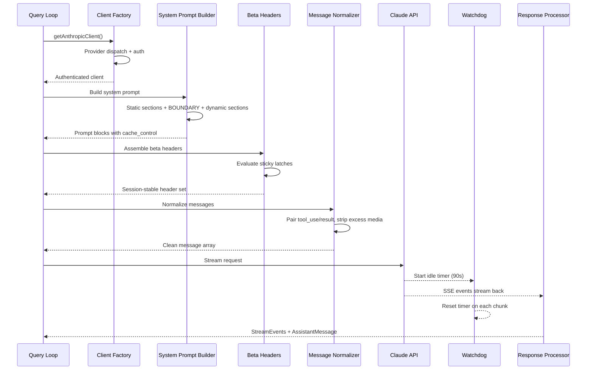
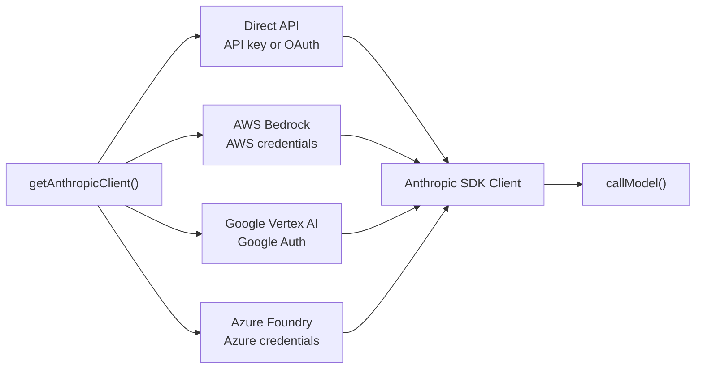
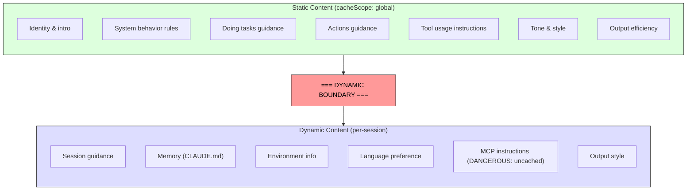

# 第四章：與 Claude 對話——API 層

第三章確立了狀態住在哪裡，以及兩層如何溝通。現在我們跟隨那個狀態被實際使用時發生的事：系統需要與語言模型對話。Claude Code 中的一切——引導序列、狀態系統、權限框架——都是為了服務這個時刻。

這一層處理的故障模式比系統中任何其他部分都多。它必須透過單一透明介面路由到四個雲端提供商。它必須以位元組層級的感知能力建構系統提示，因為伺服器的提示快取機制容不得一個放錯位置的段落，一旦放錯就可能破壞價值 50,000 個 token 以上的快取。它必須以主動的故障偵測來串流回應，因為 TCP 連線會靜默地斷掉。而且它必須維護 Session 穩定不變的屬性，使得對話途中對功能旗標的變更不會造成看不見的效能懸崖。

讓我們從頭到尾追蹤一次 API 呼叫。

---

## 多提供商客戶端工廠

`getAnthropicClient()` 函式是所有模型通訊的單一工廠。它回傳一個為部署目標提供商設定好的 Anthropic SDK 客戶端：

派發完全由環境變數驅動，依固定的優先順序評估。四個特定提供商的 SDK 類別都透過 `as unknown as Anthropic` 被轉型為 `Anthropic`。原始碼中的注解坦率地承認：「我們一直在謊稱回傳型別。」這個刻意的型別抹除意味著每個消費者看到的都是統一的介面。程式碼庫的其他部分從不基於提供商進行分支。

每個提供商的 SDK 都使用動態引入——`AnthropicBedrock`、`AnthropicFoundry`、`AnthropicVertex` 是帶有自己相依樹的重量級模組。動態引入確保未使用的提供商永遠不會被載入。

提供商的選擇在啟動時決定，並儲存在引導 `STATE` 中。查詢迴圈從不檢查哪個提供商是活躍的。從 Direct API 切換到 Bedrock 是一個設定變更，而非程式碼變更。

### buildFetch 包裝器

每個對外的 fetch 請求都會被包裝，以注入一個 `x-client-request-id` 標頭——每個請求產生一個 UUID。當請求逾時，伺服器就無法為那個回應指定一個請求 ID。沒有客戶端的 ID，API 團隊就無法把這次逾時與伺服器端的日誌對應起來。這個標頭彌補了這個差距。它只會發送到第一方的 Anthropic 端點——第三方提供商可能會拒絕未知的標頭。

---

## 系統提示建構

系統提示是整個系統中對快取最敏感的產物。Claude 的 API 提供伺服器端的提示快取：跨請求相同的提示前綴可以被快取，節省延遲和費用。一個 200K token 的對話可能有 50-70K 個 token 與上一次輪到時完全相同。破壞該快取會強迫伺服器重新處理所有這些 token。

### 動態邊界標記

提示以字串段落陣列的形式建構，有一條至關重要的分界線：

邊界之前的所有內容在所有 Session、使用者和組織之間都是相同的——它獲得最高層級的伺服器端快取。邊界之後的所有內容包含使用者特定的內容，降級為每個 Session 的快取。

段落的命名慣例刻意設計得很顯眼。新增一個段落需要在 `systemPromptSection`（安全，已快取）和 `DANGEROUS_uncachedSystemPromptSection`（會破壞快取，需要一個原因字串）之間做選擇。`_reason` 參數在執行期不使用，但作為強制性文件——每個破壞快取的段落都在原始碼中帶有其理由。

### 2^N 問題

`prompts.ts` 中的一個注解說明了為什麼條件式段落必須放在邊界之後：

> Each conditional here is a runtime bit that would otherwise multiply the Blake2b prefix hash variants (2^N).

邊界之前的每個布林條件都會讓唯一的全域快取條目數量翻倍。三個條件式創造 8 個變體；五個創造 32 個。靜態段落刻意不帶條件式。由打包工具在編譯期解析的功能旗標在邊界之前是可接受的。執行期的檢查（這是 Haiku 嗎？使用者有自動模式嗎？）必須放在邊界之後。

這是一種在你違反它之前都看不見的約束。一個出於好意在邊界之前添加了被使用者設定控制的段落的工程師，可能會在不知不覺中讓全域快取碎片化，並讓整個服務群的提示處理費用翻倍。

---

## 串流

### 原始 SSE 而非 SDK 抽象

串流實作使用原始的 `Stream<BetaRawMessageStreamEvent>`，而非 SDK 較高層級的 `BetaMessageStream`。原因是：`BetaMessageStream` 在每個 `input_json_delta` 事件上都會呼叫 `partialParse()`。對於有大型 JSON 輸入的工具呼叫（有數百行的檔案編輯），這會在每個 chunk 上從頭重新解析不斷增長的 JSON 字串——O(n^2) 行為。Claude Code 自己處理工具輸入的累積，所以部分解析是純粹的浪費。

### 閒置看門狗

TCP 連線可以在沒有通知的情況下斷掉。伺服器可能崩潰，負載均衡器可能靜默地丟棄連線，或者企業代理伺服器可能逾時。SDK 的請求逾時只涵蓋初始的 fetch——一旦 HTTP 200 到達，逾時就算滿足了。如果串流主體停止接收，沒有任何東西能捕捉到這個狀況。

看門狗：一個 `setTimeout`，在每次收到 chunk 時重置。如果 90 秒內沒有 chunk 到達，串流就被中止，系統回退到非串流的重試。在 45 秒標記時會觸發一個警告。當看門狗觸發時，它會記錄帶有客戶端請求 ID 的事件以便關聯。

### 非串流回退

當串流在回應途中失敗（網路錯誤、停頓、截斷）時，系統回退到同步的 `messages.create()` 呼叫。這處理了代理伺服器失敗的情況，即代理伺服器回傳 HTTP 200 但主體不是 SSE，或者在途中截斷了 SSE 串流。

當串流工具執行活躍時，回退可以被停用，因為回退會重新執行整個請求，可能導致工具執行兩次。

---

## 提示快取系統

### 三個層級

提示快取在三個層級上運作：

**暫時性快取**（預設）：每個 Session 的快取，TTL 由伺服器定義（約 5 分鐘）。所有使用者都有此層級。

**1 小時 TTL**：符合資格的使用者獲得延長的快取。資格由訂閱狀態決定，並在引導狀態中被鎖存——第三章的 `promptCache1hEligible` 黏性鎖存器確保 Session 途中的超額翻轉不會改變 TTL。

**全域範圍**：系統提示快取條目獲得跨 Session、跨組織的共享。系統提示的靜態部分對所有 Claude Code 使用者而言都是相同的，因此一份快取副本可以服務所有人。當有 MCP 工具存在時，全域範圍會被停用，因為 MCP 工具定義是使用者特定的，會將快取碎片化為數百萬個唯一的前綴。

### 黏性鎖存器的實際運用

第三章的五個黏性鎖存器在這裡——請求建構期間——被評估。每個鎖存器起始為 `null`，一旦設為 `true`，就在整個 Session 中保持 `true`。鎖存器區塊上方的注解很精確：「動態 beta 標頭的黏性開啟鎖存器。每個標頭一旦首次被送出，在 Session 的剩餘時間內會一直被送出，這樣 Session 途中的切換就不會改變伺服器端的快取鍵，從而破壞 ~50-70K 個 token 的快取。」

完整的鎖存器模式說明、五個具體的鎖存器，以及為什麼「總是送出所有標頭」不是正確解法，請參閱第三章第 3.1 節。

---

## queryModel 產生器

`queryModel()` 函式是一個非同步產生器（約 700 行），負責編排整個 API 呼叫的生命週期。它產出 `StreamEvent`、`AssistantMessage` 和 `SystemAPIErrorMessage` 物件。

請求的組裝遵循一個精心排序的順序：

1. **終止開關檢查** —— 最昂貴模型層的安全閥
2. **Beta 標頭組裝** —— 特定於模型，套用黏性鎖存器
3. **工具 schema 建構** —— 透過 `Promise.all()` 並行進行，延遲發現的工具被排除在外
4. **訊息正規化** —— 修復孤立的 tool_use/tool_result 不匹配，去除多餘的媒體，移除過時的區塊
5. **系統提示區塊建構** —— 在動態邊界處分割，指定快取範圍
6. **有重試包裝的串流** —— 處理 529（過載）、模型回退、思考降級、OAuth 重整

### 輸出 Token 上限

預設的輸出上限是 8,000 個 token，而非典型的 32K 或 64K。生產資料顯示 p99 輸出為 4,911 個 token——標準上限過度保留了 8-16 倍。當回應達到上限時（少於 1% 的請求），它會在 64K 上限下進行一次乾淨的重試。這在整個服務群規模下節省了可觀的費用。

### 錯誤處理與重試

`withRetry()` 函式本身是一個非同步產生器，它產出 `SystemAPIErrorMessage` 事件，讓 UI 可以顯示重試狀態。重試策略：

- **529（過載）**：等待並重試，可選擇降級快速模式
- **模型回退**：主要模型失敗，嘗試回退模型（例如從 Opus 到 Sonnet）
- **思考降級**：上下文視窗溢位觸發縮減思考預算
- **OAuth 401**：重整 token 後重試一次

產生器模式意味著重試進度（「伺服器過載，5 秒後重試...」）作為事件串流的自然組成部分出現，而非作為旁路通知。

---

## 應用這些概念

**將提示快取視為架構約束，而非功能開關。** 大多數 LLM 應用程式「開啟」快取。Claude Code 將其視為一個設計約束，影響提示排序、段落記憶化、標頭鎖存，以及設定管理。一個結構良好的提示（50K token 快取命中）和一個結構不良的提示（每次輪到都完整重新處理）之間的差異，是系統中最大的單一費用槓桿。

**對昂貴的逃生艙口使用 DANGEROUS 命名慣例。** 當一個程式碼庫有一個很容易被意外違反的不變條件時，用一個醒目的前綴命名逃生艙口能做到三件事：讓違規在程式碼審查中顯而易見、強制記錄文件（必填的原因參數），並在心理上製造向安全預設靠攏的摩擦力。這可以推廣到快取之外的任何具有隱性代價的操作。

**用看門狗建構串流，而非只用逾時。** SDK 的請求逾時在 HTTP 200 時就算滿足，但回應主體可以在任何時間點停止接收。一個在每個 chunk 收到時重置的 `setTimeout` 可以捕捉到這種情況。非串流回退處理在企業環境中比你預期更常見的代理伺服器失敗模式（HTTP 200 但主體不是 SSE、串流途中截斷）。

**讓重試策略基於產出，而非基於例外。** 藉由讓重試包裝器成為一個產出狀態事件的非同步產生器，呼叫者可以將重試進度作為事件串流的自然組成部分顯示出來。模型回退模式（Opus 失敗，嘗試 Sonnet）對生產彈性特別有用。

**將快速路徑與完整流水線分開。** 並非每個 API 呼叫都需要工具搜尋、顧問整合、思考預算和串流基礎設施。Claude Code 的 `queryHaiku()` 函式為內部操作（壓縮、分類）提供了一條精簡的路徑，跳過了所有代理人相關的考量。一個具有簡化介面的獨立函式可以防止意外的複雜性洩漏。

---

## 展望

API 層位於後續一切的基礎上。第五章將說明查詢迴圈如何使用串流回應來驅動工具執行——包括工具如何在模型完成回應之前就開始執行。第六章將解釋壓縮系統如何在對話接近上下文限制時保護快取效率。第七章將說明每個代理人執行緒如何獲得自己的訊息陣列和請求鏈。

所有這些系統都繼承了這裡確立的約束：快取穩定性作為架構不變條件、透過客戶端工廠的提供商透明性，以及透過鎖存器系統的 Session 穩定設定。API 層不只是發送請求——它定義了所有其他系統運作的規則。
