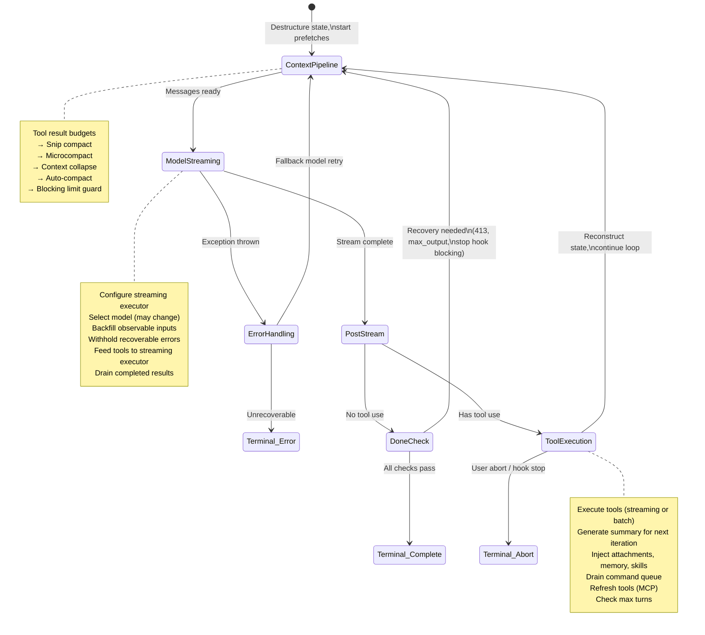
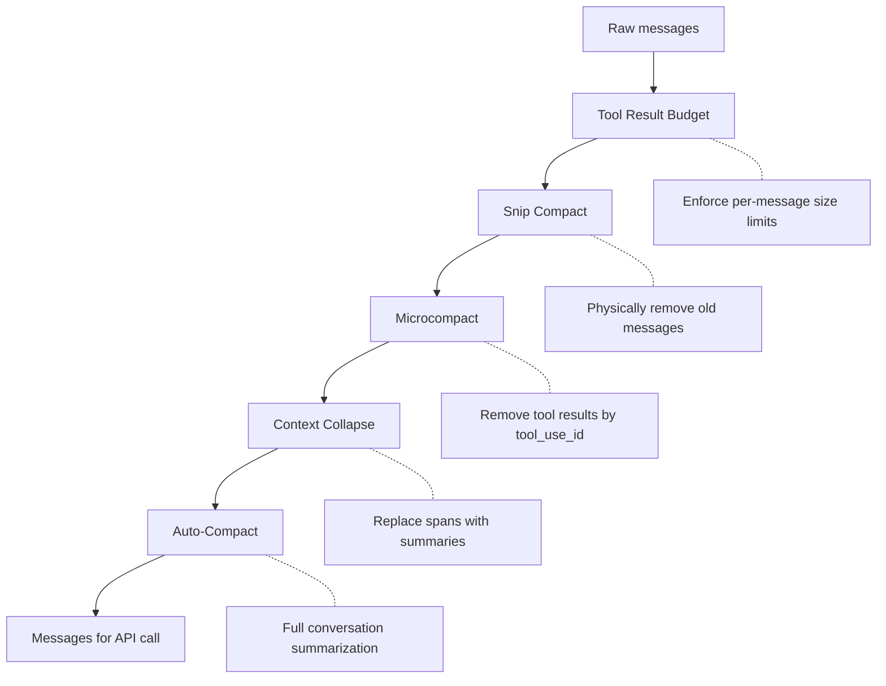
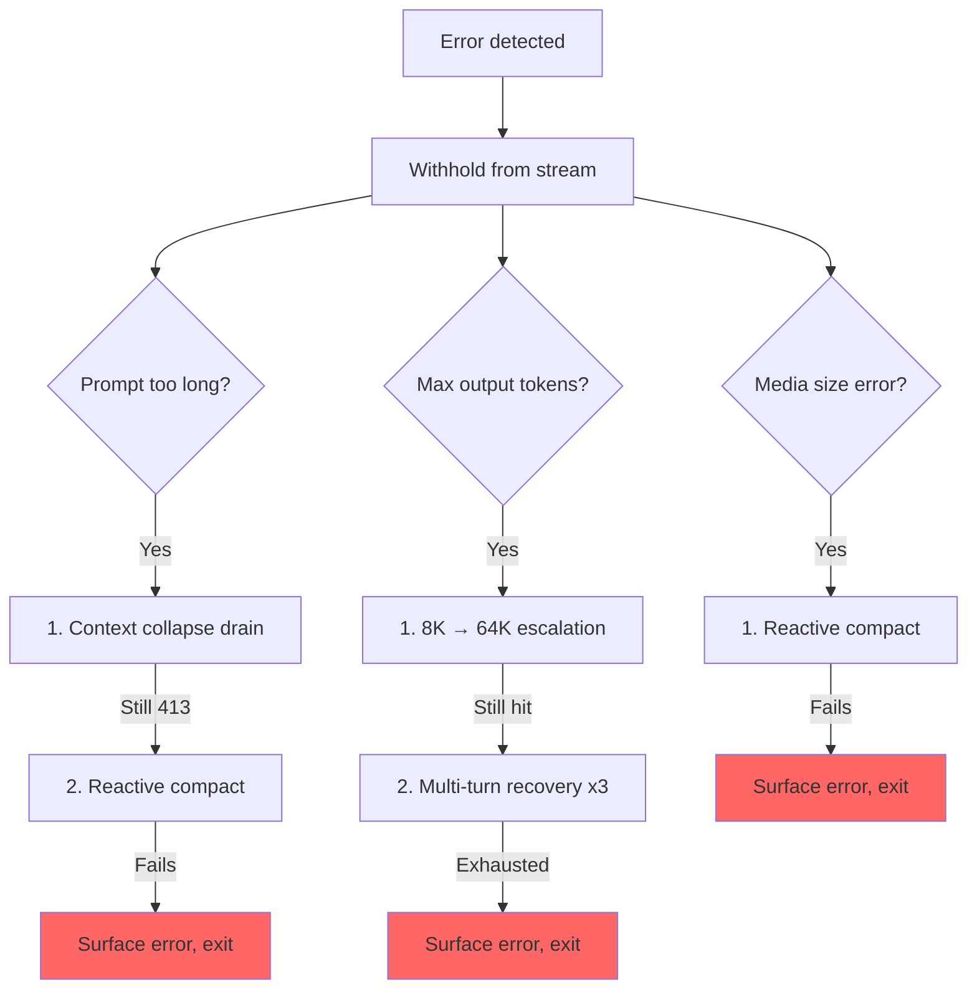

# 第五章：代理人迴圈

## 跳動的心臟

第四章展示了 API 層如何將設定轉化為串流 HTTP 請求——如何建構客戶端、如何組裝系統提示、如何以伺服器推送事件的形式接收回應。那一層處理的是與模型對話的*機制*。但單一的 API 呼叫並不是一個代理人。代理人是一個迴圈：呼叫模型、執行工具、將結果送回、再次呼叫模型，直到工作完成。

每個系統都有一個重心。在資料庫中，那是儲存引擎。在編譯器中，那是中間表示。在 Claude Code 中，那是 `query.ts`——一個 1,730 行的單一檔案，包含執行每一次互動的非同步產生器，從 REPL 中的第一次按鍵到無頭模式 `--print` 呼叫的最後一個工具呼叫。

這並非誇大。只有唯一一條程式碼路徑能與模型對話、執行工具、管理上下文、從錯誤中恢復，並決定何時停止。那條程式碼路徑就是 `query()` 函式。REPL 呼叫它。SDK 呼叫它。子代理人呼叫它。無頭執行器呼叫它。如果你正在使用 Claude Code，你就在 `query()` 裡面。

這個檔案很稠密，但它的複雜性不像糾纏的繼承層次那樣複雜。它的複雜性更像一艘潛水艇的複雜性：一個單一的艦體，配備許多冗餘系統，每一個都是在海洋找到入侵方式後才加入的。每一個 `if` 分支都有一段故事。每一個被保留起來的錯誤訊息，都代表一個真實發生過的、SDK 消費者在恢復途中斷線的問題。每一個斷路器的閾值，都是針對真實 Session 調整出來的——那些 Session 在無限迴圈中燒掉了數千次 API 呼叫。

本章從頭到尾追蹤整個迴圈。讀完之後，你不只會知道發生了什麼，還會知道每個機制為何存在，以及缺少它會導致什麼問題。

---

## 為什麼用非同步產生器

第一個架構問題：為什麼代理人迴圈是一個產生器，而不是基於回呼的事件發射器？

```typescript
// Simplified — shows the concept, not the exact types
async function* agentLoop(params: LoopParams): AsyncGenerator<Message | Event, TerminalReason>
```

實際的簽名會產出幾種訊息和事件型別，並回傳一個說明迴圈為何停止的可辨識聯集。

三個原因，依重要性排列。

**背壓。** 事件發射器不管消費者是否準備好都會觸發。產生器只有在消費者呼叫 `.next()` 時才產出值。當 REPL 的 React 渲染器正忙於繪製上一個畫面時，產生器自然地暫停。當 SDK 消費者正在處理工具結果時，產生器等待。沒有緩衝區溢位，沒有訊息遺失，沒有「快速生產者／慢速消費者」問題。

**回傳值語意。** 產生器的回傳型別是 `Terminal`——一個精確編碼迴圈停止原因的可辨識聯集。是正常完成嗎？使用者中止嗎？Token 預算耗盡嗎？停止鉤子介入嗎？達到最大輪數限制嗎？無法恢復的模型錯誤嗎？共有 10 種不同的終止狀態。呼叫者不需要訂閱一個「結束」事件並希望酬載包含原因。他們從 `for await...of` 或 `yield*` 的型別化回傳值中得到它。

**透過 `yield*` 的可組合性。** 外層的 `query()` 函式用 `yield*` 委派給 `queryLoop()`，後者透明地轉發每個產出值和最終回傳。像 `handleStopHooks()` 這樣的子產生器使用相同的模式。這創造了一個乾淨的責任鏈，沒有回呼、沒有 Promise 套 Promise，也沒有事件轉發的樣板程式碼。

這個選擇有其代價——JavaScript 中的非同步產生器無法被「倒退」或分叉。但代理人迴圈不需要這些。它是一個嚴格向前移動的狀態機。

還有一個微妙之處：`function*` 語法讓函式變得*懶惰*。在第一次呼叫 `.next()` 之前，主體不會執行。這意味著 `query()` 立刻回傳——所有繁重的初始化（設定快照、記憶預先取得、預算追蹤器）只有在消費者開始拉取值時才發生。在 REPL 中，這意味著在迴圈的第一行執行之前，React 渲染流水線就已經設定好了。

---

## 呼叫者提供什麼

在追蹤迴圈之前，先了解輸入什麼會有幫助：

```typescript
// Simplified — illustrates the key fields
type LoopParams = {
  messages: Message[]
  prompt: SystemPrompt
  permissionCheck: CanUseToolFn
  context: ToolUseContext
  source: QuerySource         // 'repl', 'sdk', 'agent:xyz', 'compact', etc.
  maxTurns?: number
  budget?: { total: number }  // API-level task budget
  deps?: LoopDeps             // Injected for testing
}
```

值得注意的欄位：

- **`querySource`**：一個字串鑑別子，例如 `'repl_main_thread'`、`'sdk'`、`'agent:xyz'`、`'compact'` 或 `'session_memory'`。許多條件式以此為分支。壓縮代理人使用 `querySource: 'compact'`，這樣阻塞限制守衛就不會發生死鎖（壓縮代理人需要執行才能*減少* token 數量）。

- **`taskBudget`**：API 層級的任務預算（`output_config.task_budget`）。與 `+500k` 自動繼續 token 預算功能不同。`total` 是整個代理人輪次的預算；`remaining` 在每次迭代時根據累計的 API 使用量計算，並跨越壓縮邊界進行調整。

- **`deps`**：可選的相依注入。預設為 `productionDeps()`。這是測試中換入假模型呼叫、假壓縮和確定性 UUID 的接縫。

- **`canUseTool`**：一個回傳某個工具是否被允許的函式。這是權限層——它檢查信任設定、鉤子決策和當前的權限模式。

---

## 雙層進入點

公開的 API 是真正迴圈的薄包裝：

外層函式包裝內層迴圈，追蹤哪些已排隊的命令在本次輪次中被消耗。內層迴圈完成後，已消耗的命令被標記為 `'completed'`。如果迴圈拋出例外或產生器被 `.return()` 關閉，完成通知就不會觸發。在輪次過程中排隊的命令（透過 `/` 斜線命令或任務通知）在迴圈內部被標記為 `'started'`，在包裝器中被標記為 `'completed'`。如果迴圈拋出例外或產生器被 `.return()` 關閉，完成通知就不會觸發。這是刻意的——一次失敗的輪次不應該把命令標記為已成功處理。

---

## 狀態物件

迴圈在一個單一型別物件中攜帶其狀態：

```typescript
// Simplified — illustrates the key fields
type LoopState = {
  messages: Message[]
  context: ToolUseContext
  turnCount: number
  transition: Continue | undefined
  // ... plus recovery counters, compaction tracking, pending summaries, etc.
}
```

十個欄位。每一個都有其存在的理由：

| 欄位 | 存在原因 |
|-------|---------------|
| `messages` | 對話歷史，每次迭代都會增長 |
| `toolUseContext` | 可變上下文：工具、中止控制器、代理人狀態、選項 |
| `autoCompactTracking` | 追蹤壓縮狀態：輪次計數器、輪次 ID、連續失敗次數、已壓縮旗標 |
| `maxOutputTokensRecoveryCount` | 輸出 token 限制的多輪恢復嘗試次數（最多 3 次） |
| `hasAttemptedReactiveCompact` | 防止無限響應式壓縮迴圈的一次性守衛 |
| `maxOutputTokensOverride` | 在升級期間設定為 64K，之後清除 |
| `pendingToolUseSummary` | 來自上一次迭代的 Haiku 摘要 Promise，在當前串流期間解析 |
| `stopHookActive` | 防止在阻塞重試後重新執行停止鉤子 |
| `turnCount` | 單調計數器，用於對照 `maxTurns` 檢查 |
| `transition` | 上一次迭代為何繼續——第一次迭代時為 `undefined` |

### 可變迴圈中的不可變轉換

這是在迴圈中每個 `continue` 陳述式都會出現的模式：

```typescript
const next: State = {
  messages: [...messagesForQuery, ...assistantMessages, ...toolResults],
  toolUseContext: toolUseContextWithQueryTracking,
  autoCompactTracking: tracking,
  turnCount: nextTurnCount,
  maxOutputTokensRecoveryCount: 0,
  hasAttemptedReactiveCompact: false,
  pendingToolUseSummary: nextPendingToolUseSummary,
  maxOutputTokensOverride: undefined,
  stopHookActive,
  transition: { reason: 'next_turn' },
}
state = next
```

每個繼續點都建構一個完整的新 `State` 物件。不是 `state.messages = newMessages`，也不是 `state.turnCount++`。是完整的重建。好處是每次轉換都自我說明。你可以讀取任何 `continue` 點，並確切看到哪些欄位改變了，哪些被保留了。新狀態上的 `transition` 欄位記錄了迴圈*為何*繼續——測試對此進行斷言，以驗證正確的恢復路徑被觸發了。

---

## 迴圈主體

以下是單次迭代的完整執行流程，壓縮到其骨架：



這就是整個迴圈。Claude Code 中的每一個功能——從記憶到子代理人到錯誤恢復——都饋入或消耗這個單一的迭代結構。

---

## 上下文管理：四個壓縮層

在每次 API 呼叫之前，訊息歷史會通過最多四個上下文管理階段。它們以特定的順序執行，而這個順序很重要。



### 第 0 層：工具結果預算

在任何壓縮之前，`applyToolResultBudget()` 對工具結果強制執行每則訊息的大小限制。沒有有限 `maxResultSizeChars` 的工具可以豁免。

### 第 1 層：Snip 壓縮

最輕量的操作。Snip 從陣列中物理移除舊訊息，並產出一個邊界訊息向 UI 示意此移除。它報告釋放了多少個 token，而那個數字會被輸入到自動壓縮的閾值檢查中。

### 第 2 層：微壓縮

微壓縮移除不再需要的工具結果，以 `tool_use_id` 識別。對於有快取的微壓縮（編輯 API 快取），邊界訊息要等到 API 回應後才產出。原因是：客戶端的 token 估算並不可靠。來自 API 回應的實際 `cache_deleted_input_tokens` 才能告訴你真正釋放了什麼。

### 第 3 層：上下文折疊

上下文折疊用摘要替換一段對話。它在自動壓縮之前執行，而這個順序是刻意的：如果折疊將上下文降低到自動壓縮閾值以下，自動壓縮就成了空操作。這在可能的情況下保留了細粒度的上下文，而非用一個單一的整體摘要替換所有東西。

### 第 4 層：自動壓縮

最重的操作：它分叉整個 Claude 對話來總結歷史。實作有一個斷路器——在連續 3 次失敗後，它會停止嘗試。這防止了在生產中觀察到的噩夢場景：Session 卡在超過上下文限制的情況下，每天燒掉 250K 次 API 呼叫在無限的壓縮-失敗-重試迴圈中。

### 自動壓縮閾值

閾值從模型的上下文視窗推導出來：

```
effectiveContextWindow = contextWindow - min(modelMaxOutput, 20000)

Thresholds (relative to effectiveContextWindow):
  Auto-compact fires:      effectiveWindow - 13,000
  Blocking limit (hard):   effectiveWindow - 3,000
```

| 常數 | 數值 | 用途 |
|----------|-------|---------|
| `AUTOCOMPACT_BUFFER_TOKENS` | 13,000 | 自動壓縮觸發點在有效視窗以下的緩衝空間 |
| `MANUAL_COMPACT_BUFFER_TOKENS` | 3,000 | 保留空間使 `/compact` 仍然可用 |
| `MAX_CONSECUTIVE_AUTOCOMPACT_FAILURES` | 3 | 斷路器閾值 |

13,000 個 token 的緩衝意味著自動壓縮在硬性限制之前很久就會觸發。自動壓縮閾值和阻塞限制之間的差距，是響應式壓縮運作的地方——如果主動的自動壓縮失敗或被停用，響應式壓縮會捕捉 413 錯誤並按需壓縮。

### Token 計數

標準函式 `tokenCountWithEstimation` 將權威的 API 回報 token 計數（來自最近的回應）與粗略的估算（針對該回應後新增的訊息）結合起來。這個近似值是保守的——它傾向於高估，意味著自動壓縮會稍微提早而非稍微延遲地觸發。

---

## 模型串流

### callModel() 迴圈

API 呼叫在一個允許模型回退的 `while(attemptWithFallback)` 迴圈中發生：

```typescript
let attemptWithFallback = true
while (attemptWithFallback) {
  attemptWithFallback = false
  try {
    for await (const message of deps.callModel({ messages, systemPrompt, tools, signal })) {
      // Process each streamed message
    }
  } catch (innerError) {
    if (innerError instanceof FallbackTriggeredError && fallbackModel) {
      currentModel = fallbackModel
      attemptWithFallback = true
      continue
    }
    throw innerError
  }
}
```

當啟用時，`StreamingToolExecutor` 會在串流期間一旦 `tool_use` 區塊到達就立刻開始執行工具——而非等待完整回應完成。工具如何被編排進並發批次，是第七章的主題。

### 保留模式

這是這個檔案中最重要的模式之一。可恢復的錯誤被從產出串流中抑制：

```typescript
let withheld = false
if (contextCollapse?.isWithheldPromptTooLong(message)) withheld = true
if (reactiveCompact?.isWithheldPromptTooLong(message)) withheld = true
if (isWithheldMaxOutputTokens(message)) withheld = true
if (!withheld) yield yieldMessage
```

為什麼要保留？因為 SDK 消費者——Cowork、桌面應用程式——在收到任何帶有 `error` 欄位的訊息時就會終止 Session。如果你產出一個提示太長的錯誤，然後透過響應式壓縮成功恢復，消費者已經斷線了。恢復迴圈繼續執行，但沒有人在聽。因此錯誤被保留，推入 `assistantMessages` 讓下游的恢復檢查能找到它。如果所有恢復路徑都失敗了，保留的訊息才最終被呈現出來。

### 模型回退

當捕捉到 `FallbackTriggeredError`（主要模型需求量高），迴圈切換模型並重試。但思考簽名是繫結於模型的——將一個模型的受保護思考區塊重播給另一個回退模型，會導致 400 錯誤。程式碼在重試前會去除簽名區塊。來自失敗嘗試的所有孤立助理訊息都被標記為墓碑，讓 UI 移除它們。

---

## 錯誤恢復：升級階梯

`query.ts` 中的錯誤恢復不是單一策略。它是一個越來越激進的介入階梯，每一階在前一階失敗時觸發。



### 死亡螺旋守衛

最危險的故障模式是無限迴圈。程式碼有多個守衛：

1. **`hasAttemptedReactiveCompact`**：一次性旗標。響應式壓縮在每種錯誤型別中只觸發一次。
2. **`MAX_OUTPUT_TOKENS_RECOVERY_LIMIT = 3`**：多輪恢復嘗試的硬性上限。
3. **自動壓縮的斷路器**：在連續 3 次失敗後，自動壓縮完全停止嘗試。
4. **錯誤回應不觸發停止鉤子**：當最後一條訊息是 API 錯誤時，程式碼在到達停止鉤子之前明確回傳。注解解釋道：「錯誤 -> 鉤子阻塞 -> 重試 -> 錯誤 -> ...（鉤子每個週期都注入更多 token）。」
5. **跨停止鉤子重試保留 `hasAttemptedReactiveCompact`**：當停止鉤子回傳阻塞錯誤並強制重試時，響應式壓縮守衛被保留。注解記錄了那個問題：「在這裡重置為 false 導致了一個無限迴圈，燒掉了數千次 API 呼叫。」

這些守衛每一個都是因為有人在生產中遇到了那個故障模式才被加入的。

---

## 實際案例：「修復 auth.ts 中的 bug」

為了讓迴圈變得具體，讓我們追蹤一次真實互動的三次迭代。

**使用者輸入：** `Fix the null pointer bug in src/auth/validate.ts`

**第一次迭代：模型讀取檔案。**

迴圈進入。上下文管理執行（不需要壓縮——對話還很短）。模型串流回應：「讓我看看這個檔案。」它發出一個 `tool_use` 區塊：`Read({ file_path: "src/auth/validate.ts" })`。串流執行器看到一個並發安全的工具，立刻啟動它。當模型完成其回應文字時，檔案內容已經在記憶體中了。

後串流處理：模型使用了一個工具，所以我們進入工具使用路徑。Read 結果（帶行號的檔案內容）被推入 `toolResults`。一個 Haiku 摘要 Promise 在背景啟動。狀態以新訊息、`transition: { reason: 'next_turn' }` 重建，迴圈繼續。

**第二次迭代：模型編輯檔案。**

上下文管理再次執行（仍低於閾值）。模型串流：「我看到了第 42 行的 bug——`userId` 可以是 null。」它發出 `Edit({ file_path: "src/auth/validate.ts", old_string: "const user = getUser(userId)", new_string: "if (!userId) return { error: 'unauthorized' }\nconst user = getUser(userId)" })`。

Edit 不是並發安全的，所以串流執行器將它排隊等到回應完成。然後 14 步執行流水線觸發：Zod 驗證通過，輸入回填展開路徑，PreToolUse 鉤子檢查權限（使用者批准），編輯被應用。第一次迭代的待處理 Haiku 摘要在串流過程中解析——其結果作為 `ToolUseSummaryMessage` 被產出。狀態重建，迴圈繼續。

**第三次迭代：模型宣告完成。**

模型串流：「我透過新增一個防護子句修復了 null 指標 bug。」沒有 `tool_use` 區塊。我們進入「完成」路徑。提示太長的恢復？不需要。最大輸出 token？否。停止鉤子執行——沒有阻塞錯誤。Token 預算檢查通過。迴圈回傳 `{ reason: 'completed' }`。

總計：三次 API 呼叫、兩次工具執行、一次使用者權限提示。迴圈處理了串流工具執行、與 API 呼叫重疊的 Haiku 摘要，以及完整的權限流水線——全都通過同一個 `while(true)` 結構。

---

## Token 預算

使用者可以為一次輪次請求 token 預算（例如 `+500k`）。預算系統在模型完成回應後決定是繼續還是停止。

`checkTokenBudget` 以三條規則做出繼續/停止的二元決策：

1. **子代理人總是停止。** 預算只是頂層的概念。
2. **90% 的完成閾值。** 如果 `turnTokens < budget * 0.9`，繼續。
3. **邊際效益遞減偵測。** 在 3 次或以上的繼續之後，如果當前和前一次的增量都低於 500 個 token，提早停止。模型每次繼續產生的輸出越來越少。

當決策是「繼續」時，一個告知模型剩餘預算的提示訊息會被注入。

---

## 停止鉤子：強迫模型繼續工作

停止鉤子在模型完成而不請求任何工具使用時——它認為自己已經完成——執行。鉤子評估它是否真的*完成了*。

流水線執行範本工作分類，觸發背景任務（提示建議、記憶提取），然後執行停止鉤子本身。當停止鉤子回傳阻塞錯誤——「你說你完成了，但 linter 找到了 3 個錯誤」——錯誤被附加到訊息歷史，迴圈以 `stopHookActive: true` 繼續。這個旗標防止在重試時重新執行相同的鉤子。

當停止鉤子發出 `preventContinuation` 信號時，迴圈立刻以 `{ reason: 'stop_hook_prevented' }` 退出。

---

## 狀態轉換：完整目錄

每次從迴圈退出都是兩種型別之一：`Terminal`（迴圈回傳）或 `Continue`（迴圈迭代）。

### 終止狀態（10 個原因）

| 原因 | 觸發條件 |
|--------|---------|
| `blocking_limit` | Token 計數達到硬性限制，自動壓縮關閉 |
| `image_error` | ImageSizeError、ImageResizeError，或無法恢復的媒體錯誤 |
| `model_error` | 無法恢復的 API/模型例外 |
| `aborted_streaming` | 模型串流期間使用者中止 |
| `prompt_too_long` | 所有恢復耗盡後被保留的 413 |
| `completed` | 正常完成（無工具使用、預算耗盡，或 API 錯誤） |
| `stop_hook_prevented` | 停止鉤子明確阻止了繼續 |
| `aborted_tools` | 工具執行期間使用者中止 |
| `hook_stopped` | PreToolUse 鉤子停止了繼續 |
| `max_turns` | 達到 `maxTurns` 限制 |

### 繼續狀態（7 個原因）

| 原因 | 觸發條件 |
|--------|---------|
| `collapse_drain_retry` | 上下文折疊在 413 後清空了暫存的折疊 |
| `reactive_compact_retry` | 響應式壓縮在 413 或媒體錯誤後成功 |
| `max_output_tokens_escalate` | 達到 8K 上限，升級到 64K |
| `max_output_tokens_recovery` | 64K 仍然達到，多輪恢復（最多 3 次嘗試） |
| `stop_hook_blocking` | 停止鉤子回傳阻塞錯誤，必須重試 |
| `token_budget_continuation` | Token 預算未耗盡，注入提示訊息 |
| `next_turn` | 正常的工具使用繼續 |

---

## 孤立工具結果：協議安全網

API 協議要求每個 `tool_use` 區塊後面都要跟著一個 `tool_result`。`yieldMissingToolResultBlocks` 函式為每個模型發出但從未獲得對應結果的 `tool_use` 區塊建立錯誤 `tool_result` 訊息。沒有這個安全網，串流期間的崩潰會留下孤立的 `tool_use` 區塊，在下一次 API 呼叫時導致協議錯誤。

它在三個地方觸發：外層錯誤處理器（模型崩潰）、回退處理器（串流途中模型切換），以及中止處理器（使用者中斷）。每條路徑有不同的錯誤訊息，但機制是相同的。

---

## 中止處理：兩條路徑

中止可以在兩個時間點發生：串流期間和工具執行期間。每個都有不同的行為。

**串流期間中止**：串流執行器（如果活躍）清空剩餘結果，為排隊的工具生成合成的 `tool_results`。沒有執行器的情況下，`yieldMissingToolResultBlocks` 填補空缺。`signal.reason` 檢查區分硬中止（Ctrl+C）和提交中斷（使用者輸入了新訊息）——提交中斷跳過中斷訊息，因為已排隊的使用者訊息已經提供了上下文。

**工具執行期間中止**：類似的邏輯，中斷訊息上帶有 `toolUse: true` 參數，向 UI 示意工具正在執行中。

---

## 思考規則

Claude 的 thinking/redacted_thinking 區塊有三條不可違反的規則：

1. 包含思考區塊的訊息必須是 `max_thinking_length > 0` 的查詢的一部分
2. 思考區塊不能是訊息中的最後一個區塊
3. 思考區塊在整個助理軌跡的持續時間內必須被保留

違反這些規則中的任何一條都會產生不透明的 API 錯誤。程式碼在幾個地方處理它們：回退處理器去除簽名區塊（這些區塊是繫結於模型的），壓縮流水線保留受保護的尾部，微壓縮層從不觸碰思考區塊。

---

## 相依注入

`QueryDeps` 型別刻意保持狹窄——四個相依，而非四十個：

四個注入的相依：模型呼叫器、壓縮器、微壓縮器，以及一個 UUID 產生器。測試將 `deps` 傳入迴圈參數以直接注入假實作。使用 `typeof fn` 作為型別定義讓簽名自動保持同步。除了可變的 `State` 和可注入的 `QueryDeps` 之外，一個不可變的 `QueryConfig` 在 `query()` 入口處一次性快照——功能旗標、Session 狀態和環境變數只擷取一次，之後不再重新讀取。三方分離（可變狀態、不可變設定、可注入相依）讓迴圈可測試，也讓最終重構為純 `step(state, event, config)` 規約函式變得簡單明了。

---

## 應用這些概念：建構你自己的代理人迴圈

**用產生器，不用回呼。** 背壓是免費的。回傳值語意是免費的。透過 `yield*` 的可組合性是免費的。代理人迴圈是嚴格向前移動的——你永遠不需要倒退或分叉。

**讓狀態轉換明確。** 在每個 `continue` 點重建完整的狀態物件。冗長就是特色——它防止了部分更新的問題，並讓每次轉換自我說明。

**保留可恢復的錯誤。** 如果你的消費者在遇到錯誤時斷線，在你確認恢復失敗之前不要產出錯誤。將它們推入內部緩衝區，嘗試恢復，只有在耗盡所有選項後才呈現。

**分層管理上下文。** 輕量操作在前（移除），重量操作在後（摘要）。這樣在可能時保留細粒度的上下文，只有在必要時才回退到整體摘要。

**為每個重試機制加入斷路器。** `query.ts` 中的每個恢復機制都有明確的限制：3 次自動壓縮失敗、3 次最大輸出恢復嘗試、1 次響應式壓縮嘗試。沒有這些限制，第一個在生產中觸發重試-失敗迴圈的 Session 將在一夜之間燒光你的 API 預算。

最小化的代理人迴圈骨架，如果你從零開始：

```
async function* agentLoop(params) {
  let state = initState(params)
  while (true) {
    const context = compressIfNeeded(state.messages)
    const response = await callModel(context)
    if (response.error) {
      if (canRecover(response.error, state)) { state = recoverState(state); continue }
      return { reason: 'error' }
    }
    if (!response.toolCalls.length) return { reason: 'completed' }
    const results = await executeTools(response.toolCalls)
    state = { ...state, messages: [...context, response.message, ...results] }
  }
}
```

Claude Code 迴圈中的每個功能都是這些步驟之一的延伸。四個壓縮層延伸了步驟 3（壓縮）。保留模式延伸了模型呼叫。升級階梯延伸了錯誤恢復。停止鉤子延伸了「無工具使用」的退出。從這個骨架開始。只有在你遇到某個功能所解決的問題時，才加入那個延伸。

---

## 摘要

代理人迴圈是一個 1,730 行的單一 `while(true)`，它做了所有事情。它串流模型回應、並發執行工具、透過四層壓縮上下文、從五類錯誤中恢復、以邊際效益遞減偵測追蹤 token 預算、執行能強迫模型繼續工作的停止鉤子、管理記憶和技能的預先取得流水線，並產出一個精確說明停止原因的型別化可辨識聯集。

它是系統中最重要的檔案，因為它是唯一一個觸及所有其他子系統的檔案。上下文流水線饋入它。工具系統從它饋出。錯誤恢復包裹著它。鉤子攔截它。狀態層透過它持久化。UI 從它渲染。

如果你理解了 `query()`，你就理解了 Claude Code。其他一切都是周邊。
