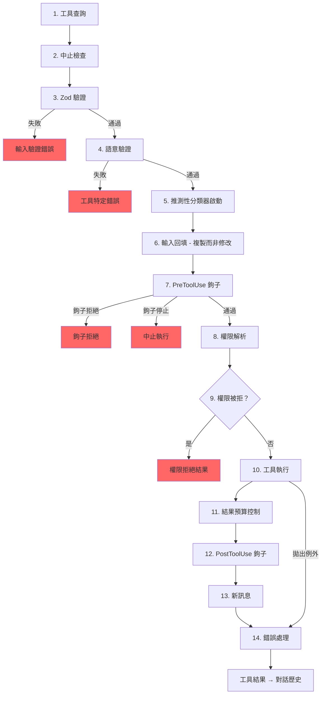

# 第六章：工具——從定義到執行

## 神經系統

第五章介紹了代理迴圈——持續串流模型回應、收集工具呼叫、並將結果回饋的 `while(true)`。迴圈是心跳，但若沒有神經系統將「模型想執行 `git status`」轉換成實際的 shell 指令，並搭配權限檢查、結果預算控制與錯誤處理，心跳便毫無意義。

工具系統就是那套神經系統。它涵蓋了 40 多個工具實作、一個帶有功能旗標閘控的集中式登錄表、14 步驟的執行管線、一個具備七種模式的權限解析器，以及一個在模型完成回應之前便能啟動工具的串流執行器。

Claude Code 中的每一次工具呼叫——每次讀取檔案、每次 shell 指令、每次 grep、每次子代理派送——都流經同一條管線。這種一致性正是重點所在：無論工具是內建的 Bash 執行器還是第三方 MCP 伺服器，它都會經歷相同的驗證、相同的權限檢查、相同的結果預算控制、相同的錯誤分類。

`Tool` 介面大約有 45 個成員。聽起來令人不知所措，但只有五個對於理解系統運作方式至關重要：

1. **`call()`** — 執行工具
2. **`inputSchema`** — 驗證並解析輸入
3. **`isConcurrencySafe()`** — 這個工具能否並行執行？
4. **`checkPermissions()`** — 這個操作是否被允許？
5. **`validateInput()`** — 這個輸入在語意上是否合理？

其他的一切——12 個渲染方法、分析鉤子、搜尋提示——都是為了支援 UI 與遙測層而存在。先掌握這五個，其餘的自然迎刃而解。

---

## 工具介面

### 三個型別參數

每個工具都以三種型別作為參數：

```typescript
Tool<Input extends AnyObject, Output, P extends ToolProgressData>
```

`Input` 是一個 Zod 物件綱要，承擔雙重職責：它生成發送給 API 的 JSON Schema（讓模型知道要提供哪些參數），同時在執行期間透過 `safeParse` 驗證模型的回應。`Output` 是工具結果的 TypeScript 型別。`P` 是工具執行時發出的進度事件型別——BashTool 發出標準輸出區塊，GrepTool 發出比對計數，AgentTool 發出子代理的對話紀錄。

### buildTool() 與失效關閉預設值

沒有任何工具定義直接建構 `Tool` 物件。每個工具都會通過 `buildTool()` 這個工廠函式，它會將一個預設值物件展開並置於工具特定定義之下：

```typescript
// 虛擬碼——說明失效關閉預設值模式
const SAFE_DEFAULTS = {
  isEnabled:         () => true,
  isParallelSafe:    () => false,   // 失效關閉：新工具預設串行執行
  isReadOnly:        () => false,   // 失效關閉：視為寫入操作
  isDestructive:     () => false,
  checkPermissions:  (input) => ({ behavior: 'allow', updatedInput: input }),
}

function buildTool(definition) {
  return { ...SAFE_DEFAULTS, ...definition }  // 定義覆蓋預設值
}
```

在安全性關鍵之處，預設值刻意採用失效關閉設計。一個忘記實作 `isConcurrencySafe` 的新工具，預設值為 `false`——它會串行執行，永不並行。忘記設定 `isReadOnly` 的工具，預設值為 `false`——系統將其視為寫入操作。忘記 `toAutoClassifierInput` 的工具，回傳空字串——自動模式安全分類器會跳過它，這意味著一般權限系統會處理它，而非透過自動化方式繞過。

唯一*不*採用失效關閉的預設值是 `checkPermissions`，它回傳 `allow`。在理解分層權限模型之前，這似乎有些反直覺：`checkPermissions` 是工具特定邏輯，在一般權限系統已評估過規則、鉤子與模式型策略*之後*才執行。工具從 `checkPermissions` 回傳 `allow`，意思是「我沒有工具層面的反對意見」——而非授予全面存取權。將欄位分組為子物件（`options`、名稱欄位如 `readFileState`）提供了清晰的結構，而不必為 40 多個呼叫點宣告、實作和串接五個獨立的介面型別。

### 並行性取決於輸入

方法簽名 `isConcurrencySafe(input: z.infer<Input>): boolean` 接收解析後的輸入，因為同一個工具在不同輸入下可能安全或不安全。BashTool 是典型範例：`ls -la` 是唯讀且並行安全的，但 `rm -rf /tmp/build` 則不然。工具會解析指令、對每個子指令與已知安全集合進行分類，只有當每個非中性部分都是搜尋或讀取操作時，才回傳 `true`。

### ToolResult 回傳型別

每個 `call()` 都回傳一個 `ToolResult<T>`：

```typescript
type ToolResult<T> = {
  data: T
  newMessages?: (UserMessage | AssistantMessage | AttachmentMessage | SystemMessage)[]
  contextModifier?: (context: ToolUseContext) => ToolUseContext
}
```

`data` 是序列化到 API `tool_result` 內容區塊的型別化輸出。`newMessages` 讓工具可以向對話中注入額外訊息——AgentTool 用它來附加子代理的對話記錄。`contextModifier` 是為後續工具修改 `ToolUseContext` 的函式——這就是 `EnterPlanMode` 切換權限模式的方式。脈絡修改器只對非並行安全的工具生效；如果工具並行執行，其修改器會排隊等到批次完成後再處理。

---

## ToolUseContext：萬能物件

`ToolUseContext` 是一個龐大的脈絡包，被串接傳遞給每個工具呼叫。它大約有 40 個欄位。以任何合理的定義來看，這都是一個萬能物件。它的存在是因為替代方案更糟。

像 BashTool 這樣的工具需要中止控制器、檔案狀態快取、應用程式狀態、訊息歷史、工具集、MCP 連線和半打 UI 回呼函式。如果將這些作為個別參數傳遞，函式簽名會有 15 個以上的引數。務實的解決方案是一個按關注點分組的單一脈絡物件：

**配置**（`options` 子物件）：工具集、模型名稱、MCP 連線、除錯旗標。在查詢開始時設定一次，大致上不可變更。

**執行狀態**：用於取消的 `abortController`、用於 LRU 檔案快取的 `readFileState`、完整對話歷史的 `messages`。這些在執行期間會改變。

**UI 回呼函式**：`setToolJSX`、`addNotification`、`requestPrompt`。只在互動式（REPL）脈絡中連接。SDK 和無頭模式讓它們保持未定義狀態。

**代理脈絡**：`agentId`、`renderedSystemPrompt`（分叉子代理使用的凍結父代理提示——重新渲染可能因功能旗標熱身而產生差異，進而破壞快取）。

`ToolUseContext` 的子代理變體特別能說明問題。當 `createSubagentContext()` 為子代理建立脈絡時，它會刻意選擇哪些欄位要共用、哪些要隔離：非同步代理的 `setAppState` 變成無操作、`localDenialTracking` 獲得一個全新物件、`contentReplacementState` 從父代理複製。每個選擇都編碼了從生產環境錯誤中學到的教訓。

---

## 登錄表

### getAllBaseTools()：唯一的事實來源

`getAllBaseTools()` 函式回傳目前進程中可能存在的每個工具的完整清單。始終存在的工具排在前面，接著是由功能旗標控制的條件性工具：

```typescript
const SleepTool = feature('PROACTIVE') || feature('KAIROS')
  ? require('./tools/SleepTool/SleepTool.js').SleepTool
  : null
```

來自 `bun:bundle` 的 `feature()` 匯入在打包時解析。當 `feature('AGENT_TRIGGERS')` 靜態為 false 時，打包器會消除整個 `require()` 呼叫——死碼消除讓二進位檔案保持精簡。

### assembleToolPool()：合併內建工具與 MCP 工具

最終傳遞給模型的工具集來自 `assembleToolPool()`：

1. 取得內建工具（搭配拒絕規則過濾、REPL 模式隱藏和 `isEnabled()` 檢查）
2. 依拒絕規則過濾 MCP 工具
3. 按名稱字母順序對每個分區排序
4. 依序串接內建工具（前綴）+ MCP 工具（後綴）

先排序再串接的方式不是審美偏好。API 伺服器在最後一個內建工具之後放置提示快取斷點。若對所有工具進行平鋪排序，MCP 工具會交錯插入內建工具清單，新增或移除 MCP 工具會改變內建工具的位置，從而使快取失效。

---

## 14 步驟執行管線

`checkPermissionsAndCallTool()` 函式是意圖轉化為行動的地方。每個工具呼叫都要通過這 14 個步驟。



### 步驟 1-4：驗證

**工具查詢**會退回到 `getAllBaseTools()` 進行別名比對，處理工具曾被更名的較舊會話記錄。**中止檢查**防止在 Ctrl+C 傳播之前已排隊的工具呼叫浪費計算資源。**Zod 驗證**捕捉型別不符；對於延遲工具，錯誤訊息會附上提示，要求先呼叫 ToolSearch。**語意驗證**超越綱要符合性——FileEditTool 拒絕無操作的編輯，BashTool 在 MonitorTool 可用時封鎖獨立的 `sleep`。

### 步驟 5-6：準備

**推測性分類器啟動**會並行啟動 Bash 指令的自動模式安全分類器，在常見路徑上節省數百毫秒。**輸入回填**複製解析後的輸入並添加衍生欄位（將 `~/foo.txt` 展開為絕對路徑）供鉤子和權限使用，同時保留原始輸入以確保記錄穩定性。

### 步驟 7-9：權限

**PreToolUse 鉤子**是擴充機制——它們可以做出權限決策、修改輸入、注入脈絡，或完全停止執行。**權限解析**橋接鉤子與一般權限系統：如果鉤子已做出決定，則以鉤子決定為最終結果；否則 `canUseTool()` 觸發規則比對、工具特定檢查、模式型預設值和互動式提示。**權限拒絕處理**建立錯誤訊息並執行 `PermissionDenied` 鉤子。

### 步驟 10-14：執行與清理

**工具執行**使用原始輸入執行實際的 `call()`。**結果預算控制**將超出大小的輸出持久化到 `~/.claude/tool-results/{hash}.txt`，並以包含預覽的替代內容取代。**PostToolUse 鉤子**可以修改 MCP 輸出或封鎖繼續執行。**新訊息**被附加（子代理記錄、系統提醒）。**錯誤處理**對錯誤進行分類以供遙測使用，從可能被混淆的名稱中提取安全字串，並發出 OTel 事件。

---

## 權限系統

### 七種模式

| 模式 | 行為 |
|------|------|
| `default` | 工具特定檢查；對未識別的操作提示使用者 |
| `acceptEdits` | 自動允許檔案編輯；對其他操作提示 |
| `plan` | 唯讀——拒絕所有寫入操作 |
| `dontAsk` | 自動拒絕任何通常需要提示的操作（背景代理） |
| `bypassPermissions` | 無需提示，允許一切操作 |
| `auto` | 使用記錄分類器來決定（功能旗標控制） |
| `bubble` | 子代理的內部模式，會將請求升級到父代理 |

### 解析鏈

當工具呼叫到達權限解析時：

1. **鉤子決定**：如果 PreToolUse 鉤子已回傳 `allow` 或 `deny`，則以鉤子決定為最終結果。
2. **規則比對**：三個規則集——`alwaysAllowRules`、`alwaysDenyRules`、`alwaysAskRules`——依工具名稱和可選的內容模式進行比對。`Bash(git *)` 比對任何以 `git` 開頭的 Bash 指令。
3. **工具特定檢查**：工具的 `checkPermissions()` 方法。大多數回傳 `passthrough`。
4. **模式型預設值**：`bypassPermissions` 允許一切。`plan` 拒絕寫入。`dontAsk` 拒絕提示。
5. **互動式提示**：在 `default` 和 `acceptEdits` 模式下，未解決的決定會顯示提示。
6. **自動模式分類器**：兩階段分類器（快速模型，再延伸思考處理模糊情形）。

`safetyCheck` 變體有一個 `classifierApprovable` 布林值：`.claude/` 和 `.git/` 的編輯是 `classifierApprovable: true`（不尋常但有時合法），而 Windows 路徑繞過嘗試是 `classifierApprovable: false`（幾乎總是惡意的）。

### 權限規則與比對

權限規則以 `PermissionRule` 物件儲存，包含三個部分：追蹤來源的 `source`（userSettings、projectSettings、localSettings、cliArg、policySettings、session 等）、`ruleBehavior`（allow、deny、ask）、以及包含工具名稱和可選內容模式的 `ruleValue`。

`ruleContent` 欄位啟用精細比對。`Bash(git *)` 允許任何以 `git` 開頭的 Bash 指令。`Edit(/src/**)` 只允許 `/src` 內的編輯。`Fetch(domain:example.com)` 允許從特定網域擷取。沒有 `ruleContent` 的規則比對該工具的所有呼叫。

BashTool 的權限比對器透過 `parseForSecurity()`（一個 bash AST 解析器）解析指令，並將複合指令分割為子指令。如果 AST 解析失敗（含有 heredoc 或巢狀子 shell 的複雜語法），比對器回傳 `() => true`——失效安全，意味著鉤子永遠執行。假設是：如果指令太複雜而無法解析，它就太複雜而無法自信地排除在安全檢查之外。

### 子代理的 Bubble 模式

協調者-工作者模式中的子代理無法顯示權限提示——它們沒有連接終端機。`bubble` 模式使得權限請求向上傳播到父代理脈絡。在主執行緒中以終端機存取運行的協調者代理處理提示，並將決定傳回。

---

## 工具延遲載入

帶有 `shouldDefer: true` 的工具會以 `defer_loading: true` 發送給 API——只有名稱和描述，沒有完整的參數綱要。這減少了初始提示的大小。要使用延遲工具，模型必須先呼叫 `ToolSearchTool` 來載入其綱要。失敗模式很有啟發性：在未載入的情況下呼叫延遲工具會導致 Zod 驗證失敗（所有型別化參數都以字串形式到達），系統會附加一個針對性的恢復提示。

延遲載入也提高了快取命中率：以 `defer_loading: true` 發送的工具只有名稱貢獻給提示，因此新增或移除延遲的 MCP 工具只會讓提示改變幾個 token，而不是數百個。

---

## 結果預算控制

### 每個工具的大小限制

每個工具宣告 `maxResultSizeChars`：

| 工具 | maxResultSizeChars | 原因 |
|------|-------------------|------|
| BashTool | 30,000 | 足以滿足大多數有用的輸出 |
| FileEditTool | 100,000 | 差異可能很大，但模型需要它們 |
| GrepTool | 100,000 | 含脈絡行的搜尋結果累積很快 |
| FileReadTool | Infinity | 透過自身的 token 限制自我約束；持久化會產生循環讀取迴圈 |

當結果超出閾值時，完整內容會儲存到磁碟，並以包含預覽和檔案路徑的 `<persisted-output>` 包裝器取代。模型可以在需要時使用 `Read` 存取完整輸出。

### 每次對話的整體預算

除了每個工具的限制外，`ContentReplacementState` 還追蹤整個對話的整體預算，防止死於千刀萬剮——許多工具各自回傳接近個別限制的 90% 仍然可能使脈絡視窗超載。

---

## 個別工具亮點

### BashTool：最複雜的工具

BashTool 是系統中迄今最複雜的工具。它解析複合指令、將子指令分類為唯讀或寫入、管理背景任務、透過魔術位元組偵測圖像輸出，並實作用於安全編輯預覽的 sed 模擬。

複合指令解析特別有趣。`splitCommandWithOperators()` 將 `cd /tmp && mkdir build && ls build` 這樣的指令分解為獨立的子指令。每個子指令都會對照已知安全的指令集（`BASH_SEARCH_COMMANDS`、`BASH_READ_COMMANDS`、`BASH_LIST_COMMANDS`）進行分類。只有當所有非中性部分都是安全的，複合指令才算是唯讀的。中性集合（echo、printf）被忽略——它們不會讓指令變成唯讀，但也不會讓它變成寫入。

sed 模擬（`_simulatedSedEdit`）值得特別關注。當使用者在權限對話中批准 sed 指令時，系統會透過在沙盒中執行 sed 指令並擷取輸出，預先計算結果。預先計算的結果作為 `_simulatedSedEdit` 注入到輸入中。當 `call()` 執行時，它直接套用編輯，繞過 shell 執行。這保證了使用者預覽的內容就是最終寫入的內容——而不是在預覽和執行之間檔案可能已經改變的重新執行。

### FileEditTool：過時偵測

FileEditTool 與 `readFileState` 整合，後者是在整個對話中維護的檔案內容和時間戳記的 LRU 快取。在套用編輯之前，它會檢查自模型上次讀取後檔案是否被修改。如果檔案已過時——被背景進程、另一個工具或使用者修改——編輯會被拒絕，並告知模型先重新讀取檔案。

`findActualString()` 中的模糊比對處理模型略微弄錯空白字元的常見情況。它在比對前正規化空白字元和引號樣式，因此針對有尾隨空格的 `old_string` 的編輯仍然能比對到檔案的實際內容。`replace_all` 旗標啟用大量替換；沒有它，非唯一的比對會被拒絕，要求模型提供足夠的脈絡來識別單一位置。

### FileReadTool：多功能讀取器

FileReadTool 是唯一內建 `maxResultSizeChars: Infinity` 的工具。如果 Read 輸出被持久化到磁碟，模型需要 Read 持久化的檔案，而該檔案本身可能超出限制，造成無限迴圈。工具改為透過 token 估算自我約束，並在來源處截斷。

這個工具非常多功能：它能讀取帶有行號的文字檔案、圖像（回傳 base64 多模態內容區塊）、PDF（透過 `extractPDFPages()`）、Jupyter 筆記本（透過 `readNotebook()`），以及目錄（退回到 `ls`）。它封鎖危險的設備路徑（`/dev/zero`、`/dev/random`、`/dev/stdin`），並處理 macOS 截圖檔案名稱的特殊情況（「Screen Shot」檔名中的 U+202F 窄不換行空格與一般空格）。

### GrepTool：透過 head_limit 分頁

GrepTool 包裝 `ripGrep()` 並透過 `head_limit` 添加分頁機制。預設值是 250 個條目——足以提供有用的結果，但又小到不會使脈絡膨脹。當截斷發生時，回應包含 `appliedLimit: 250`，通知模型在下次呼叫時使用 `offset` 進行分頁。明確設定 `head_limit: 0` 完全停用限制。

GrepTool 自動排除六個版本控制系統目錄（`.git`、`.svn`、`.hg`、`.bzr`、`.jj`、`.sl`）。搜尋 `.git/objects` 內部幾乎從來不是模型想要的，而意外包含二進位封包檔案會耗盡 token 預算。

### AgentTool 與脈絡修改器

AgentTool 產生子代理，它們執行自己的查詢迴圈。它的 `call()` 回傳包含子代理記錄的 `newMessages`，以及可選的將狀態變更傳播回父代理的 `contextModifier`。由於 AgentTool 預設並非並行安全，單一回應中的多個 Agent 工具呼叫會串行執行——每個子代理的脈絡修改器在下一個子代理開始之前套用。在協調者模式下，模式倒轉：協調者為獨立任務派送子代理，`isAgentSwarmsEnabled()` 檢查解鎖並行代理執行。

---

## 工具如何與訊息歷史互動

工具結果不只是將資料回傳給模型，它們以結構化訊息的形式參與對話。

API 期待工具結果以 `ToolResultBlockParam` 物件的形式出現，透過 ID 參照原始的 `tool_use` 區塊。大多數工具序列化為文字。FileReadTool 可以序列化為圖像內容區塊（base64 編碼）以進行多模態回應。BashTool 透過檢查標準輸出中的魔術位元組偵測圖像輸出，並相應切換到圖像區塊。

`ToolResult.newMessages` 是工具擴展對話超越簡單呼叫-回應模式的方式。**代理記錄**：AgentTool 將子代理的訊息歷史作為附件訊息注入。**系統提醒**：記憶工具注入在工具結果之後出現的系統訊息——模型在下一輪可見，但在 `normalizeMessagesForAPI` 邊界處被剝除。**附件訊息**：鉤子結果、額外脈絡和錯誤詳情攜帶結構化元資料，模型可以在後續輪次中參照。

`contextModifier` 函式是改變執行環境的工具的機制。當 `EnterPlanMode` 執行時，它回傳一個將權限模式設定為 `'plan'` 的修改器。當 `ExitWorktree` 執行時，它修改工作目錄。這些修改器是工具影響後續工具的唯一方式——直接修改 `ToolUseContext` 是不可能的，因為脈絡在每次工具呼叫之前會被展開複製。串行限制由協調層強制執行：如果兩個並行工具都修改了工作目錄，哪個獲勝？

---

## 應用這些原則：設計工具系統

**失效關閉預設值。** 新工具在被明確標記之前應該保守。忘記設定旗標的開發者得到安全的行為，而不是危險的行為。

**依輸入決定安全性。** `isConcurrencySafe(input)` 和 `isReadOnly(input)` 接收解析後的輸入，因為同一個工具在不同輸入下有不同的安全設定檔。將 BashTool 標記為「永遠串行」的工具登錄表是正確的但浪費的。

**分層你的權限。** 工具特定檢查、規則型比對、模式型預設值、互動式提示和自動化分類器各自處理不同情況。沒有任何單一機制是足夠的。

**預算結果，而不只是輸入。** 輸入的 token 限制是標準做法。但工具結果可以任意大，它們在多個輪次中積累。每個工具的限制防止個別爆炸。整體對話限制防止累積溢位。

**讓錯誤分類對遙測安全。** 在縮小化的建置中，`error.constructor.name` 會被混淆。`classifyToolError()` 函式提取最有資訊價值的安全字串——對遙測安全的訊息、errno 碼、穩定的錯誤名稱——而不會將原始錯誤訊息記錄到分析系統。

---

## 下一步

本章追蹤了單一工具呼叫如何從定義流經驗證、權限、執行和結果預算控制。但模型很少一次只請求一個工具。工具如何被協調成並行批次，是第七章的主題。
