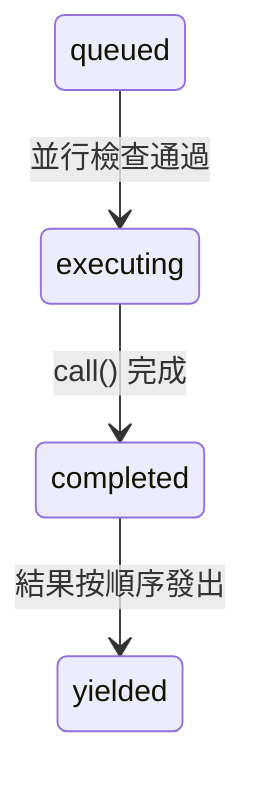

# 第七章：並行工具執行

## 等待的代價

第六章追蹤了單一工具呼叫的生命週期——從 API 回應中的原始 `tool_use` 區塊，到輸入驗證、權限檢查、執行和結果格式化。那條管線處理一個工具。但模型很少只請求一個。

典型的 Claude Code 互動，每輪包含三到五個工具呼叫。「讀取這兩個檔案、用 grep 搜尋這個模式、然後編輯這個函式。」模型在單一回應中發出所有這些請求。如果每個工具需要 200 毫秒，依序執行它們需要整整一秒。如果 Read 和 Grep 呼叫是獨立的——而它們確實是——並行執行它們只需要 200 毫秒。五倍的改善，免費得到。

但並非所有工具都是獨立的。修改 `config.ts` 的 Edit 不能與另一個修改 `config.ts` 的 Edit 同時執行。建立目錄的 Bash 指令必須在向該目錄寫入檔案的 Bash 指令之前完成。並行性不是工具的全域屬性，它是特定工具呼叫搭配特定輸入的屬性。

這就是驅動整個並行系統的洞見：**安全性是以每次呼叫為單位，而不是以工具型別為單位**。`Bash("ls -la")` 可以安全地並行化。`Bash("rm -rf build/")` 則不行。同一個工具，不同的輸入，不同的並行分類。系統必須在做出決定之前檢查輸入。

Claude Code 實作了兩層並行優化。第一層是**批次協調**：在模型回應完整接收後，將工具呼叫分割為並行和串行群組，然後適當地執行每個群組。第二層是**推測性執行**：在模型仍在串流回應時就*開始*執行工具，在回應完成之前就收穫結果。這兩種機制共同消除了大部分原本需要等待的實際時間。

---

## 分割演算法

進入點是 `toolOrchestration.ts` 中的 `partitionToolCalls()`。它接收一個有序的 `ToolUseBlock` 訊息陣列，並產生一個批次陣列，每個批次要麼是「全部並行安全」，要麼是「單一串行工具」。

```typescript
// 虛擬碼——說明分割演算法
type Group = { parallel: boolean; calls: ToolCall[] }

function groupBySafety(calls: ToolCall[], registry: ToolRegistry): Group[] {
  return calls.reduce((groups, call) => {
    const def = registry.lookup(call.name)
    const input = def?.schema.safeParse(call.input)
    // 失效關閉：解析失敗或例外 → 串行
    const safe = input?.success
      ? tryCatch(() => def.isParallelSafe(input.data), false)
      : false
    // 將連續的安全呼叫合併到同一個群組
    if (safe && groups.at(-1)?.parallel) {
      groups.at(-1)!.calls.push(call)
    } else {
      groups.push({ parallel: safe, calls: [call] })
    }
    return groups
  }, [] as Group[])
}
```

演算法從左到右走過陣列。對於每個工具呼叫：

1. **按名稱查詢工具定義**。
2. **使用工具的 Zod 綱要透過 `safeParse()` 解析輸入**。如果解析失敗，工具被保守地分類為非並行安全。
3. **在工具定義上呼叫 `isConcurrencySafe(parsedInput)`**。這是每個輸入分類發生的地方。Bash 工具解析指令字串，檢查每個子指令是否為唯讀（`ls`、`grep`、`cat`、`git status`），只有當整個複合指令是純讀取時才回傳 `true`。Read 工具總是回傳 `true`。Edit 工具總是回傳 `false`。呼叫被包裝在 try-catch 中——如果 `isConcurrencySafe` 拋出例外（例如 Bash 指令字串無法被 shell-quote 函式庫解析），工具預設為串行。
4. **合併或建立批次**。如果當前工具是並行安全的，且最近的批次也是並行安全的，則附加到該批次。否則，建立新批次。

結果是一個批次序列，交替出現並行群組和個別串行條目。來看一個具體範例：

```
模型請求：[Read, Read, Grep, Edit, Read]

步驟 1：Read  → 並行安全 → 新批次 {safe, [Read]}
步驟 2：Read  → 並行安全 → 附加   {safe, [Read, Read]}
步驟 3：Grep  → 並行安全 → 附加   {safe, [Read, Read, Grep]}
步驟 4：Edit  → 非安全   → 新批次 {serial, [Edit]}
步驟 5：Read  → 並行安全 → 新批次 {safe, [Read]}

結果：3 個批次
  批次 1：[Read, Read, Grep]  — 並行執行
  批次 2：[Edit]              — 單獨執行
  批次 3：[Read]              — 並行執行（只有一個工具）
```

分割是貪婪且保持順序的。連續的安全工具累積到單一批次中。任何不安全的工具會打斷串，並開始新批次。這意味著模型發出工具呼叫的順序很重要——如果它在兩個 Read 之間插入一個 Write，你會得到三個批次而不是兩個。實際上，模型傾向於將讀取操作聚集在一起，這正是演算法為之優化的常見情況。

---

## 批次執行

`runTools()` 生成器遍歷已分割的批次，並將每個批次派送到適當的執行器。

### 並行批次

對於並行批次，`runToolsConcurrently()` 使用 `all()` 工具函式並行啟動所有工具，該函式將活躍生成器數量限制在並行上限內：

```typescript
// 虛擬碼——說明並行派送模式
async function* dispatchParallel(calls, context) {
  yield* boundedAll(
    calls.map(async function* (call) {
      context.markInProgress(call.id)
      yield* executeSingle(call, context)
      context.markComplete(call.id)
    }),
    MAX_CONCURRENCY,  // 預設：10
  )
}
```

並行上限預設為 10，可透過 `CLAUDE_CODE_MAX_TOOL_USE_CONCURRENCY` 設定。10 是相當寬裕的——在單一模型回應中很少看到超過五、六個工具呼叫。這個限制作為病態情況的安全閥而存在，而非典型的限制。

`all()` 工具函式是具有有界並行性的 `Promise.all` 的生成器感知變體。它同時啟動最多 N 個生成器，從最先完成的任何一個產生結果，並在每個完成時啟動下一個排隊的生成器。機制類似於使用信號量守護的任務池，但為產生中間結果的非同步生成器進行了調整。

**脈絡修改器排隊**是微妙之處。有些工具產生*脈絡修改器*——轉換後續工具的 `ToolUseContext` 的函式。當工具並行執行時，你無法立即套用這些修改器，因為同一批次中的其他工具正在讀取相同的脈絡。相反，修改器被收集在以工具使用 ID 為鍵的映射中：

```typescript
const queuedContextModifiers: Record<
  string,
  ((context: ToolUseContext) => ToolUseContext)[]
> = {}
```

整個並行批次完成後，修改器按工具順序（不是完成順序）套用，保持確定性的脈絡演進：

```typescript
for (const block of blocks) {
  const modifiers = queuedContextModifiers[block.id]
  if (!modifiers) continue
  for (const modifier of modifiers) {
    currentContext = modifier(currentContext)
  }
}
```

實際上，目前沒有任何並行安全工具會產生脈絡修改器——程式碼庫中的注釋明確承認這一點。但基礎設施是存在的，因為工具可以由 MCP 伺服器添加，而自訂的唯讀 MCP 工具可能合理地需要修改脈絡（例如更新「已見檔案」集合）。

### 串行批次

串行執行很直接。每個工具執行，其脈絡修改器立即套用，下一個工具看到更新後的脈絡：

```typescript
for (const toolUse of toolUseMessages) {
  for await (const update of runToolUse(toolUse, /* ... */)) {
    if (update.contextModifier) {
      currentContext = update.contextModifier.modifyContext(currentContext)
    }
    yield { message: update.message, newContext: currentContext }
  }
}
```

這是關鍵差異。串行工具可以為後續工具改變世界。Edit 修改了一個檔案；下一個 Read 看到修改後的版本。Bash 指令建立一個目錄；下一個 Bash 指令向其中寫入。脈絡修改器是這種依賴關係的形式化：它們讓工具能夠說「執行環境已經改變，以下是改變的方式」。

---

## 串流工具執行器

批次協調消除了模型回應*到達後*不必要的串行化。但還有更大的機會：模型的回應需要時間串流。典型的多工具回應可能需要 2-3 秒才能完整到達。第一個工具呼叫在 500 毫秒後就可以解析。為什麼要等待剩下的 2 秒？

`StreamingToolExecutor` 類別實作推測性執行。當模型串流其回應時，每個 `tool_use` 區塊在完整解析後立即交給執行器。執行器立即開始執行它——在模型仍在生成下一個工具呼叫時。當回應完成串流時，幾個工具可能已經完成了。

```mermaid
gantt
    title 依序執行 vs 串流工具執行
    dateFormat X
    axisFormat %Ls

    section 依序執行
    模型串流回應     :a1, 0, 2500
    工具 1 (0.2s)    :a2, after a1, 200
    工具 2 (0.3s)    :a3, after a2, 300
    工具 3 (0.1s)    :a4, after a3, 100

    section 串流執行器
    模型串流回應     :b1, 0, 2500
    工具 1 在 0.5s 啟動  :b2, 500, 700
    工具 2 在 1.2s 啟動  :b3, 1200, 1500
    工具 3 串流後排水 :b4, 2500, 2600
```



依序執行總計：3.1 秒。串流執行總計：2.6 秒——工具 1 和 2 在串流期間完成，節省了 16% 的實際時間。

節省會累積。當模型請求五個唯讀工具且回應需要 3 秒串流時，所有五個工具可以在那 3 秒內啟動並完成。串流後的排水階段沒有剩餘工作要做。使用者幾乎在模型回應的最後一個字元出現後立即看到結果。

### 工具生命週期

執行器追蹤的每個工具會歷經四個狀態：



- **queued（已排隊）**：`tool_use` 區塊已被解析並登錄。等待並行條件允許執行。
- **executing（執行中）**：工具的 `call()` 函式正在執行。結果在緩衝區中累積。
- **completed（已完成）**：執行完成。結果已準備好產生到對話中。
- **yielded（已產生）**：結果已發出。終止狀態。

### addTool()：串流期間的排隊

```typescript
addTool(block: ToolUseBlock, assistantMessage: AssistantMessage): void
```

每次串流回應解析器完整接收到一個 `tool_use` 區塊時就會呼叫這個方法。該方法：

1. 查詢工具定義。如果找不到，立即建立帶有錯誤訊息的 `completed` 條目——排隊一個不存在的工具沒有意義。
2. 解析輸入並使用與 `partitionToolCalls()` 相同的邏輯確定 `isConcurrencySafe`。
3. 以 `'queued'` 狀態推送一個 `TrackedTool`。
4. 呼叫 `processQueue()`——這可能立即啟動工具。

對 `processQueue()` 的呼叫是射後不理（`void this.processQueue()`）。執行器不等待它。這是刻意的：`addTool()` 從串流解析器的事件處理器中呼叫，在那裡阻塞會使回應解析停頓。工具在背景中開始執行，而解析器繼續消費串流。

### processQueue()：準入檢查

準入檢查是一個單一謂詞：

```typescript
// 虛擬碼——說明互斥規則
canRun = noToolsRunning || (newToolIsSafe && allRunningAreSafe)
```

當且僅當以下條件成立，工具才能開始執行：
- **沒有工具正在執行**（佇列為空），或
- **新工具和所有當前執行的工具都是並行安全的。**

這是一個互斥契約。非並行工具需要獨佔存取——其他任何工具都不能在執行。並行工具可以與其他並行工具共用執行通道，但執行集合中的任何一個非並行工具都會阻止所有人。

`processQueue()` 方法按順序遍歷所有工具。對於每個已排隊的工具，它檢查 `canExecuteTool()`。如果工具可以執行，它就啟動。如果非並行工具還不能執行，迴圈會*中斷*——它完全停止檢查後續工具，因為非並行工具必須保持順序。如果並行工具無法執行（被執行中的非並行工具阻塞），迴圈*繼續*——但在實際中這很少有幫助，因為非並行阻塞器之後的並行工具通常依賴其結果。

### executeTool()：核心執行迴圈

這個方法是真正複雜性所在。它管理中止控制器、錯誤串聯、進度回報和脈絡修改器。

**子中止控制器。** 每個工具獲得自己的 `AbortController`，它是共用兄弟層級控制器的子控制器。

層次結構有三層深：查詢層級控制器（由 REPL 擁有，在使用者 Ctrl+C 時觸發）是兄弟控制器（由串流執行器擁有，在 Bash 錯誤時觸發）的父級，後者是每個工具的個別控制器的父級。中止兄弟控制器會殺死所有執行中的工具。中止工具的個別控制器只殺死那個工具——但如果中止原因不是兄弟錯誤，它也會向上傳播到查詢控制器。這種向上傳播防止系統在例如權限拒絕應該結束整個輪次時悄悄丟棄執行器。

這種向上傳播對於權限拒絕至關重要。當使用者在權限對話框中拒絕工具時，工具的中止控制器觸發。該訊號必須到達查詢迴圈，讓它可以結束本輪次。沒有它，查詢迴圈會繼續進行，好像什麼都沒發生，並將過時的拒絕訊息發送給模型。

**兄弟錯誤串聯。** 當工具產生錯誤結果時，執行器會檢查是否取消兄弟工具。規則：**只有 Bash 錯誤會串聯。** 當 shell 指令出錯時，執行器記錄失敗，擷取出錯工具的描述，並中止兄弟控制器——這會取消批次中所有其他執行中的工具。

理由很務實。Bash 指令通常形成隱含的依賴鏈：`mkdir build && cp src/* build/ && tar -czf dist.tar.gz build/`。如果 `mkdir` 失敗，執行 `cp` 和 `tar` 沒有意義。立即取消兄弟工具節省時間，並避免令人困惑的錯誤訊息。

相比之下，Read 和 Grep 錯誤是獨立的。如果一個檔案讀取失敗是因為檔案被刪除，這與在不同目錄中搜尋的並行 grep 無關。取消 grep 會浪費工作而無任何收益。

錯誤串聯為兄弟工具產生合成錯誤訊息：

```
Cancelled: parallel tool call Bash(mkdir build) errored
```

描述包含出錯工具的指令或檔案路徑的前 40 個字元，給模型足夠的脈絡來理解出了什麼問題。

**進度訊息**與結果分開處理。結果被緩衝並按順序產生，進度訊息（如「正在讀取檔案...」或「正在搜尋...」的狀態更新）進入 `pendingProgress` 陣列，並透過 `getCompletedResults()` 立即產生。解析回呼在新進度到達時喚醒 `getRemainingResults()` 迴圈，防止 UI 在長時間執行的工具期間看起來凍結。

**重新處理佇列。** 每個工具完成後，再次呼叫 `processQueue()`：

```typescript
void promise.finally(() => {
  void this.processQueue()
})
```

這就是被並行批次阻塞的串行工具如何被啟動的。當最後一個並行工具完成時，後續非並行工具的 `canExecuteTool()` 檢查通過，它開始執行。

### 結果收穫

串流執行器暴露兩個收穫方法，為回應生命週期的兩個不同階段設計。

**`getCompletedResults()` — 串流中收穫。** 這是在串流 API 回應的區塊之間呼叫的同步生成器。它按順序走過工具陣列，產生任何已完成工具的結果：

`getCompletedResults()` 是一個同步生成器，按提交順序走過工具陣列。對於每個工具，它首先排出任何待處理的進度訊息。如果工具已完成，它產生結果並將其標記為已產生。關鍵規則：如果非並行工具仍在執行，走查會**中斷**——其後的任何工具都不能被產生，即使後續工具已經完成。串行工具之後的結果可能依賴其脈絡修改，因此它們必須等待。對於並行工具，這個限制不適用；迴圈跳過執行中的並行工具並繼續檢查後續條目。

這個中斷是順序保持機制。如果非並行工具仍在執行，其後的任何工具都不能被產生——即使後續工具已經完成。串行工具之後的結果可能依賴其脈絡修改，因此它們必須等待。對於並行工具，這個限制不適用；迴圈跳過執行中的並行工具並繼續檢查後續條目。

**`getRemainingResults()` — 串流後排水。** 在模型回應完整接收後呼叫。這個非同步生成器迴圈直到每個工具都已產生：

`getRemainingResults()` 是串流後排水。它迴圈直到每個工具都已產生。在每次迭代中，它處理佇列（啟動任何新解鎖的工具），透過 `getCompletedResults()` 產生任何已完成的結果，然後——如果工具仍在執行但沒有新的完成——使用 `Promise.race` 等待任何執行中工具的承諾先完成，或等待進度可用訊號。這避免了繁忙輪詢，同時仍在事情發生的那一刻醒來。當沒有工具已完成且沒有新工具可以啟動時，執行器等待任何執行中的工具完成（或等待進度到達）。這避免了繁忙輪詢，同時仍在事情發生的那一刻醒來。

### 順序保持

結果按工具*接收*的順序產生，而不是*完成*的順序。這是刻意的設計選擇。

考慮一個請求 `[Read("a.ts"), Read("b.ts"), Read("c.ts")]` 的模型回應。三個都並行啟動。`c.ts` 最先完成（它較小），然後是 `a.ts`，然後是 `b.ts`。如果按完成順序產生結果，對話會顯示：

```
工具結果：c.ts 內容
工具結果：a.ts 內容
工具結果：b.ts 內容
```

但模型按 a-b-c 順序發出它們。對話歷史必須符合模型的期望，否則下一輪會對哪個結果對應哪個請求感到困惑。透過按到達順序產生，對話保持連貫：

```
工具結果：a.ts 內容  （第二個完成，第一個產生）
工具結果：b.ts 內容  （第三個完成，第二個產生）
工具結果：c.ts 內容  （第一個完成，第三個產生）
```

代價很小：如果工具 1 很慢而工具 2-5 很快，快速的結果在緩衝區中等待工具 1 完成。但替代方案——對話不連貫——要糟糕得多。

### discard()：串流回退的緊急出口

當 API 回應串流中途失敗（網路錯誤、伺服器斷線），系統會以新的 API 呼叫重試。但串流執行器可能已經從失敗的嘗試中啟動了工具。這些結果現在是孤立的——它們對應於從未完整接收的回應。

```typescript
discard(): void {
  this.discarded = true
}
```

設定 `discarded = true` 會導致：
- `getCompletedResults()` 立即回傳，沒有結果。
- `getRemainingResults()` 立即回傳，沒有結果。
- 任何開始執行的工具檢查 `getAbortReason()`，看到 `streaming_fallback`，並得到合成錯誤而不是實際執行。

被丟棄的執行器被放棄。為重試嘗試建立一個新的執行器。

---

## 工具並行屬性

每個內建工具透過 `isConcurrencySafe()` 方法宣告其並行特性。分類不是任意的——它反映了工具對共享狀態的實際效果。

| 工具 | 並行安全 | 條件 | 原因 |
|------|---------|------|------|
| **Read** | 永遠 | — | 純讀取。沒有副作用。 |
| **Grep** | 永遠 | — | 純讀取。包裝 ripgrep。 |
| **Glob** | 永遠 | — | 純讀取。檔案列表。 |
| **Fetch** | 永遠 | — | HTTP GET。沒有本地副作用。 |
| **WebSearch** | 永遠 | — | 對搜尋提供者的 API 呼叫。 |
| **Bash** | 有時 | 僅唯讀指令 | `isReadOnly()` 解析指令並分類子指令。`ls`、`git status`、`cat`、`grep` 是安全的。`rm`、`mkdir`、`mv` 則不是。 |
| **Edit** | 永不 | — | 修改檔案。兩個並行對同一檔案的編輯會損毀它。 |
| **Write** | 永不 | — | 建立或覆寫檔案。相同的損毀風險。 |
| **NotebookEdit** | 永不 | — | 修改 `.ipynb` 檔案。 |

Bash 工具的分類值得詳細說明。它使用 `splitCommandWithOperators()` 分解複合指令（`&&`、`||`、`;`、`|`），然後將每個子指令對照已知安全集合分類：

- **搜尋指令**：`grep`、`rg`、`find`、`fd`、`ag`、`ack`
- **讀取指令**：`cat`、`head`、`tail`、`wc`、`jq`、`less`、`file`、`stat`
- **列表指令**：`ls`、`tree`、`du`、`df`
- **中性指令**：`echo`、`printf`（沒有副作用但不是「讀取」）

只有當每個非中性子指令都在搜尋、讀取或列表集合中，複合指令才是唯讀的。`ls -la && cat README.md` 是安全的。`ls -la && rm -rf build/` 則不是——`rm` 污染了整個指令。

---

## 中斷行為契約

當工具執行時，使用者可以輸入新訊息。應該發生什麼？答案取決於工具。

每個工具宣告一個 `interruptBehavior()` 方法，回傳 `'cancel'` 或 `'block'`：

- **`'cancel'`**：立即停止工具，丟棄部分結果，並處理新的使用者訊息。用於部分執行無害的工具（讀取、搜尋）。
- **`'block'`**：讓工具繼續執行到完成。使用者的新訊息等待。用於中斷會讓系統處於不一致狀態的工具（執行中的寫入、長時間執行的 bash 指令）。這是預設值。

串流執行器追蹤當前工具集的可中斷狀態：

可中斷狀態透過檢查所有當前執行的工具來更新：只有當每個執行中的工具都支援取消時，集合才可中斷。如果甚至一個工具的中斷行為是 `'block'`，整個集合被視為不可中斷。

UI 只在所有執行中的工具都支援取消時才顯示「可中斷」指示符。如果甚至一個工具是 `'block'`，整個集合被視為不可中斷。這是保守但正確的：當一個工具無論如何都會繼續執行時，你無法有意義地中斷批次。

當使用者確實中斷且所有工具都可取消時，中止控制器以原因 `'interrupt'` 觸發。執行器的 `getAbortReason()` 方法單獨檢查每個工具的中斷行為——`'cancel'` 工具得到合成的 `user_interrupted` 錯誤，而 `'block'` 工具（不會出現在完全可中斷的集合中，但程式碼處理邊緣情況）繼續執行。

---

## 脈絡修改器：串行限定契約

脈絡修改器是型別為 `(context: ToolUseContext) => ToolUseContext` 的函式。它們讓工具能夠說「我已改變了執行環境中後續工具需要知道的某些事情。」

契約很簡單：**脈絡修改器只對串行（非並行安全）工具套用。** 這在原始碼中被明確說明：

```typescript
// 注意：我們目前不支援並行工具的脈絡修改器。
//       目前沒有任何工具在主動使用它們，但如果我們想在並行工具中使用它們，
//       我們需要在這裡支援它。
if (!tool.isConcurrencySafe && contextModifiers.length > 0) {
  for (const modifier of contextModifiers) {
    this.toolUseContext = modifier(this.toolUseContext)
  }
}
```

在批次協調路徑（`toolOrchestration.ts`）中，並行批次修改器被收集並在批次完成後按工具提交順序套用。這意味著批次內的並行工具無法看到彼此的脈絡變更，但它們之後的批次可以。

這種不對稱是刻意的。如果工具 A 修改脈絡且工具 B 讀取那個脈絡，它們有資料依賴。資料依賴意味著它們不能並行執行。根據定義，如果兩個工具是並行安全的，那麼兩者都不應該依賴對方的脈絡修改。系統透過延遲套用來強制執行這一點。

---

## 應用這些原則

Claude Code 中的並行模式可以推廣到任何協調多個獨立操作的系統。值得提取的三個原則。

**按安全性分割，而非按型別。** `isConcurrencySafe(input)` 方法接收解析後的輸入，而不只是工具名稱。這種每次呼叫的分類比靜態的「這個工具型別永遠安全」宣告更精確。在你自己的系統中，在決定是否並行化之前檢查操作的引數。資料庫讀取可以安全並行化；對同一列的資料庫寫入則不行。操作型別本身無法告訴你足夠的資訊。

**在 I/O 等待期間進行推測性執行。** 串流執行器在 API 回應仍在到達時啟動工具。同樣的模式適用於任何有慢速生產者和快速消費者的情況：在後續項目仍在生成時開始處理早期項目。HTTP/2 伺服器推送、編譯器管線並行性和推測性 CPU 執行都共享這種結構。關鍵要求是你能在完整的指令集可用之前識別獨立工作。

**以提交順序保持結果。** 以完成順序產生結果很誘人——它最小化了首個結果的延遲。但如果消費者（在這種情況下是語言模型）期望特定順序的結果，重新排序會造成混亂，解決成本遠超過延遲節省。緩衝完成的結果，並按請求順序釋放它們。實作成本是簡單的陣列走查；正確性的好處是絕對的。

串流執行器模式對代理系統特別強大。任何時候你的代理迴圈涉及「思考，然後行動」的週期，其中思考階段產生多個獨立的行動，你都可以將思考的尾部與行動的開始重疊。節省與思考時間對行動時間的比例成正比。對於語言模型代理，其中思考時間（API 回應生成）佔主導地位，節省是可觀的。

---

## 總結

Claude Code 的並行系統在兩個層次運作。分割演算法（`partitionToolCalls`）將連續的並行安全工具分組為並行執行的批次，同時將不安全的工具隔離到串行批次中，每個工具看到前一個工具的效果。串流工具執行器（`StreamingToolExecutor`）更進一步，在模型回應串流期間推測性地啟動工具，將工具執行與回應生成重疊。

安全模型在設計上是保守的。並行安全性透過檢查解析後的輸入按每次呼叫確定。未知工具預設為串行。解析失敗預設為串行。安全檢查中的例外預設為串行。系統絕不猜測某個操作是否可以安全地並行化——工具必須明確宣告。

錯誤處理遵循工具的依賴結構。Bash 錯誤串聯到兄弟工具，因為 shell 指令通常形成隱含的管線。Read 和搜尋錯誤被隔離，因為它們是獨立的操作。中止控制器層次結構——查詢控制器、兄弟控制器、每個工具的控制器——給每個層次取消其範圍的能力，而不干擾上層。

結果是一個系統，從模型的工具請求中提取最大並行性，同時維持對話歷史反映連貫、有序的行動序列的不變性。模型按請求順序看到結果。使用者看到工具以底層操作允許的最快速度完成。填補這兩者之間差距的——執行速度與呈現順序——是緩衝，而那個緩衝是整個系統中最簡單的部分。
