# 第八章：產生子代理

## 智能的倍增

單一代理功能強大。它可以讀取檔案、編輯程式碼、執行測試、搜尋網路，並對結果進行推理。但單一代理在單一對話中能做的事情有一個硬性上限：脈絡視窗會填滿，任務分支到需要不同能力的方向，工具執行的串行性質成為瓶頸。解決方案不是更大的模型，而是更多的代理。

Claude Code 的子代理系統讓模型可以請求幫助。當父代理遇到一個可從委派中受益的任務——一個不應污染主對話的程式碼庫搜尋、一個需要對抗性思維的驗證步驟、一組可以並行執行的獨立編輯——它就呼叫 `Agent` 工具。那個呼叫產生了一個子代理：一個完全獨立的代理，有自己的對話迴圈、自己的工具集、自己的權限邊界和自己的中止控制器。子代理完成工作並回傳結果。父代理永遠看不到子代理的內部推理，只看到最終輸出。

這不是一個方便功能。它是從並行檔案探索到協調者-工作者層次結構到多代理群集團隊的一切的架構基礎。這一切都流過兩個檔案：定義模型面向介面的 `AgentTool.tsx`，以及實作生命週期的 `runAgent.ts`。

設計挑戰相當重大。子代理需要足夠的脈絡來完成工作，但又不能在不相關的資訊上浪費 token。它需要嚴格到足以確保安全但又靈活到足以實用的權限邊界。它需要能清理所有接觸過的資源的生命週期管理，而不要求呼叫者記住要清理什麼。這一切必須適用於各種代理類型的範疇——從廉價、快速、唯讀的 Haiku 搜尋器，到在背景執行對抗性測試的昂貴、徹底、由 Opus 驅動的驗證代理。

本章追蹤從模型的「我需要幫助」到完全運作的子代理的路徑。我們將檢視模型看到的工具定義、創建執行環境的十五步驟生命週期、六種內建代理類型及各自的優化目標、讓使用者定義自訂代理的前言系統，以及從中浮現的設計原則。

關於術語的說明：在本章中，「父代理」指呼叫 `Agent` 工具的代理，「子代理」指被產生的代理。父代理通常（但不總是）是頂層 REPL 代理。在協調者模式下，協調者產生工作者，即子代理。在巢狀場景中，子代理本身可以產生孫代理——同樣的生命週期遞歸適用。

協調層橫跨 `tools/AgentTool/`、`tasks/`、`coordinator/`、`tools/SendMessageTool/` 和 `utils/swarm/` 中大約 40 個檔案。本章著重於產生機制——AgentTool 定義和 runAgent 生命週期。下一章涵蓋執行時期：進度追蹤、結果擷取和多代理協調模式。

---

## AgentTool 定義

`AgentTool` 以名稱 `"Agent"` 登錄，並帶有舊版別名 `"Task"`，以向後相容舊版記錄、權限規則和鉤子設定。它使用標準的 `buildTool()` 工廠建構，但其綱要比系統中任何其他工具都更動態。

### 輸入綱要

輸入綱要透過 `lazySchema()` 延遲建構——這是我們在第六章看到的模式，延遲 zod 編譯直到首次使用。有兩個層次：一個基礎綱要和一個添加多代理與隔離參數的完整綱要。

基礎欄位始終存在：

| 欄位 | 型別 | 必填 | 用途 |
|------|------|------|------|
| `description` | `string` | 是 | 任務的簡短 3-5 個字摘要 |
| `prompt` | `string` | 是 | 代理的完整任務描述 |
| `subagent_type` | `string` | 否 | 要使用的特定代理 |
| `model` | `enum('sonnet','opus','haiku')` | 否 | 此代理的模型覆蓋 |
| `run_in_background` | `boolean` | 否 | 非同步啟動 |

完整綱要在多代理參數（當群集功能啟用時）和隔離控制啟用時添加：

| 欄位 | 型別 | 用途 |
|------|------|------|
| `name` | `string` | 使代理可透過 `SendMessage({to: name})` 定址 |
| `team_name` | `string` | 產生的上下文 |
| `mode` | `PermissionMode` | 產生的隊友的權限模式 |
| `isolation` | `enum('worktree','remote')` | 檔案系統隔離策略 |
| `cwd` | `string` | 工作目錄的絕對路徑覆蓋 |

多代理欄位啟用第九章介紹的群集模式：命名代理可以在並行執行時透過 `SendMessage({to: name})` 相互發送訊息。隔離欄位啟用檔案系統安全性：工作樹隔離會建立一個臨時的 git 工作樹，讓代理在儲存庫副本上操作，防止多個代理同時在同一程式碼庫上工作時發生衝突的編輯。

這個綱要不尋常之處在於它**由功能旗標動態塑形**：

```typescript
// 虛擬碼——說明功能門控綱要模式
inputSchema = lazySchema(() => {
  let schema = baseSchema()
  if (!featureEnabled('ASSISTANT_MODE')) schema = schema.omit({ cwd: true })
  if (backgroundDisabled || forkMode)    schema = schema.omit({ run_in_background: true })
  return schema
})
```

當分叉實驗啟用時，`run_in_background` 完全從綱要中消失，因為在那個路徑下所有產生都被強制為非同步。當背景任務被停用（透過 `CLAUDE_CODE_DISABLE_BACKGROUND_TASKS`）時，該欄位也被剝除。當 KAIROS 功能旗標關閉時，`cwd` 被省略。模型永遠看不到它不能使用的欄位。

這是一個微妙但重要的設計選擇。綱要不只是驗證——它是模型的使用手冊。綱要中的每個欄位都在模型讀取的工具定義中有描述。移除模型不應使用的欄位比在提示中添加「不要使用這個欄位」更有效。模型無法誤用它看不到的東西。

### 輸出綱要

輸出是具有兩個公開變體的辨別聯合型別：

- `{ status: 'completed', prompt, ...AgentToolResult }` — 帶有代理最終輸出的同步完成
- `{ status: 'async_launched', agentId, description, prompt, outputFile }` — 背景啟動確認

另外兩個內部變體（`TeammateSpawnedOutput` 和 `RemoteLaunchedOutput`）存在，但被排除在匯出綱要之外，以在外部建置中實現死碼消除。當對應的功能旗標被停用時，打包器會剝除這些變體及其相關的程式碼路徑，讓分發的二進位檔案更小。

`async_launched` 變體值得注意的是它包含什麼：代理完成時其結果將被寫入的 `outputFile` 路徑。這讓父代理（或任何其他消費者）可以輪詢或監視檔案以等待結果，提供一個在進程重新啟動後仍然存在的基於檔案系統的通訊通道。

### 動態提示

`AgentTool` 的提示由 `getPrompt()` 生成，並且是脈絡感知的。它根據可用代理（以內聯形式列出或作為附件以避免破壞提示快取）、是否啟用了分叉（添加「何時分叉」指導）、會話是否處於協調者模式（精簡提示，因為協調者系統提示已涵蓋使用方式）和訂閱層級進行調整。非專業用戶會收到關於同時啟動多個代理的說明。

基於附件的代理清單值得強調。程式碼庫注釋提到「大約 10.2% 的舊版 cache_creation token」是由動態工具描述造成的。將代理清單從工具描述移到附件訊息，使工具描述保持靜態，這樣連接 MCP 伺服器或載入外掛程式不會破壞每個後續 API 呼叫的提示快取。

對於任何使用帶有動態內容的工具定義的系統，這個模式值得內化。Anthropic API 快取提示前綴——系統提示、工具定義和對話歷史——並為共用相同前綴的後續請求重用快取計算。如果工具定義在 API 呼叫之間發生變化（因為添加了代理或連接了 MCP 伺服器），整個快取就會失效。將易變內容從工具定義（屬於快取前綴的一部分）移到附件訊息（附加在快取部分之後）在保留快取的同時仍將資訊傳遞給模型。

理解了工具定義之後，我們現在可以追蹤模型實際呼叫它時發生的事情。

### 功能門控

子代理系統在程式碼庫中具有最複雜的功能門控。至少十二個功能旗標和 GrowthBook 實驗控制哪些代理可用、哪些參數出現在綱要中，以及採用哪些程式碼路徑：

| 功能門控 | 控制內容 |
|---------|---------|
| `FORK_SUBAGENT` | 分叉代理路徑 |
| `BUILTIN_EXPLORE_PLAN_AGENTS` | 探索和計畫代理 |
| `VERIFICATION_AGENT` | 驗證代理 |
| `KAIROS` | `cwd` 覆蓋、助理強制非同步 |
| `TRANSCRIPT_CLASSIFIER` | 移交分類、`auto` 模式覆蓋 |
| `PROACTIVE` | 主動模組整合 |

每個門控使用 Bun 死碼消除系統的 `feature()`（編譯時）或 GrowthBook 的 `getFeatureValue_CACHED_MAY_BE_STALE()`（執行時 A/B 測試）。編譯時門控在建置時被字串替換——當 `FORK_SUBAGENT` 是 `'ant'` 時，整個分叉程式碼路徑被包含；當它是 `'external'` 時，它可能被完全排除。GrowthBook 門控允許即時實驗：`tengu_amber_stoat` 實驗可以 A/B 測試移除探索和計畫代理是否改變使用者行為，而不需要發布新的二進位檔案。

### call() 決策樹

在 `runAgent()` 被呼叫之前，`AgentTool.tsx` 中的 `call()` 方法透過決策樹路由請求，以確定要產生*哪種*代理以及*如何*產生它：

```
1. 這是隊友產生嗎？（同時設定了 team_name + name）
   是 -> spawnTeammate() -> 回傳 teammate_spawned
   否 -> 繼續

2. 解析有效的代理型別
   - 提供了 subagent_type -> 使用它
   - 省略了 subagent_type，啟用了分叉 -> undefined（分叉路徑）
   - 省略了 subagent_type，停用了分叉 -> "general-purpose"（預設）

3. 這是分叉路徑嗎？（effectiveType === undefined）
   是 -> 遞歸分叉守衛檢查 -> 使用 FORK_AGENT 定義

4. 從 activeAgents 清單解析代理定義
   - 按權限拒絕規則過濾
   - 按 allowedAgentTypes 過濾
   - 找不到或被拒絕時拋出

5. 檢查必要的 MCP 伺服器（等待最多 30 秒等待待處理的）

6. 解析隔離模式（參數覆蓋代理定義）
   - "remote" -> teleportToRemote() -> 回傳 remote_launched
   - "worktree" -> createAgentWorktree()
   - null -> 正常執行

7. 確定同步或非同步
   shouldRunAsync = run_in_background || selectedAgent.background ||
                    isCoordinator || forceAsync || isProactiveActive

8. 組裝工作者工具池

9. 建構系統提示和提示訊息

10. 執行（非同步 -> registerAsyncAgent + void lifecycle；同步 -> iterate runAgent）
```

步驟 1 到 6 是純路由——尚未建立任何代理。實際生命週期從 `runAgent()` 開始，同步路徑直接迭代它，非同步路徑將它包裝在 `runAsyncAgentLifecycle()` 中。

路由在 `call()` 中完成而不是在 `runAgent()` 中完成，是有原因的：`runAgent()` 是一個純生命週期函式，不知道隊友、遠端代理或分叉實驗。它接收一個已解析的代理定義並執行它。決定*解析哪個*定義、*如何*隔離代理，以及*是否*同步執行屬於上層。這種分離使 `runAgent()` 可測試且可重用——它從正常 AgentTool 路徑和在恢復背景代理時從非同步生命週期包裝器中呼叫。

步驟 3 中的分叉守衛值得注意。分叉子代理在其工具池中保留 `Agent` 工具（用於與父代理的快取相同的工具定義），但遞歸分叉將是病態的。兩個守衛防止它：`querySource === 'agent:builtin:fork'`（在子代理的脈絡選項上設定，在自動壓縮後仍然存在）和 `isInForkChild(messages)`（掃描對話歷史中的 `<fork-boilerplate>` 標籤作為後備）。雙重保險——主要守衛快速且可靠；後備捕捉邊緣情況，即 querySource 未被正確傳遞的情況。

---

## runAgent 生命週期

`runAgent.ts` 中的 `runAgent()` 是一個驅動子代理整個生命週期的非同步生成器。它在代理工作時產生 `Message` 物件。每個子代理——分叉、內建、自訂、協調者工作者——都流過這個單一函式。這個函式大約有 400 行，每一行都有其存在的理由。

函式簽名揭示了問題的複雜性：

```typescript
export async function* runAgent({
  agentDefinition,       // 什麼類型的代理
  promptMessages,        // 告訴它什麼
  toolUseContext,        // 父代理的執行脈絡
  canUseTool,           // 權限回呼
  isAsync,              // 背景還是阻塞？
  canShowPermissionPrompts,
  forkContextMessages,  // 父代理的歷史（僅限分叉）
  querySource,          // 來源追蹤
  override,             // 系統提示、中止控制器、代理 ID 覆蓋
  model,                // 來自呼叫者的模型覆蓋
  maxTurns,             // 輪次限制
  availableTools,       // 預先組裝的工具池
  allowedTools,         // 權限範圍
  onCacheSafeParams,    // 背景摘要的回呼
  useExactTools,        // 分叉路徑：使用父代理的確切工具
  worktreePath,         // 隔離目錄
  description,          // 人類可讀的任務描述
  // ...
}: { ... }): AsyncGenerator<Message, void>
```

十七個參數。每個代表生命週期必須處理的一個變化維度。這不是過度工程——它是單一函式服務分叉代理、內建代理、自訂代理、同步代理、非同步代理、工作樹隔離代理和協調者工作者的自然結果。替代方案是七個具有重複邏輯的不同生命週期函式，那更糟糕。

`override` 物件特別重要——它是需要將預先計算的值（系統提示、中止控制器、代理 ID）注入生命週期而不需重新推導的分叉代理和已恢復代理的逃生艙。

以下是十五個步驟。

### 步驟 1：模型解析

```typescript
const resolvedAgentModel = getAgentModel(
  agentDefinition.model,                    // 代理的宣告偏好
  toolUseContext.options.mainLoopModel,      // 父代理的模型
  model,                                    // 呼叫者的覆蓋（來自輸入）
  permissionMode,                           // 當前權限模式
)
```

解析鏈為：**呼叫者覆蓋 > 代理定義 > 父代理模型 > 預設值**。`getAgentModel()` 函式處理特殊值如 `'inherit'`（使用父代理使用的任何模型）和特定代理類型的 GrowthBook 門控覆蓋。例如，探索代理預設為 Haiku，為外部使用者提供最便宜、最快速的模型，適合每週執行 3400 萬次的唯讀搜尋專家。

這個順序為何重要：呼叫者（父代理模型）可以透過在工具呼叫中傳遞 `model` 參數來覆蓋代理定義的偏好。這讓父代理可以將通常廉價的代理提升到更有能力的模型用於特別複雜的搜尋，或在任務簡單時降級昂貴的代理。但代理定義的模型是預設值，而不是父代理的——Haiku 探索代理不應該因為沒有人指定而意外繼承父代理的 Opus 模型。

理解模型解析鏈很重要，因為它建立了一個在整個生命週期中反覆出現的設計原則：**明確覆蓋優先於宣告，宣告優先於繼承，繼承優先於預設值。** 同樣的原則管理權限模式、中止控制器和系統提示。一致性使系統可預測——一旦你理解了一個解析鏈，你就理解了所有的解析鏈。

### 步驟 2：代理 ID 建立

```typescript
const agentId = override?.agentId ? override.agentId : createAgentId()
```

代理 ID 遵循 `agent-<hex>` 模式，其中十六進位部分從 `crypto.randomUUID()` 衍生。品牌型別 `AgentId` 在型別層面防止意外的字串混淆。覆蓋路徑存在於需要保留其原始 ID 以確保記錄連續性的已恢復代理。

### 步驟 3：脈絡準備

分叉代理和全新代理在這裡分歧：

```typescript
const contextMessages: Message[] = forkContextMessages
  ? filterIncompleteToolCalls(forkContextMessages)
  : []
const initialMessages: Message[] = [...contextMessages, ...promptMessages]

const agentReadFileState = forkContextMessages !== undefined
  ? cloneFileStateCache(toolUseContext.readFileState)
  : createFileStateCacheWithSizeLimit(READ_FILE_STATE_CACHE_SIZE)
```

對於分叉代理，父代理的整個對話歷史被複製到 `contextMessages` 中。但有一個關鍵過濾器：`filterIncompleteToolCalls()` 剝除任何缺少對應 `tool_result` 區塊的 `tool_use` 區塊。沒有這個過濾器，API 會拒絕格式不正確的對話。這發生在分叉時刻父代理正在執行工具的中途——tool_use 已被發出但結果尚未到達。

檔案狀態快取遵循相同的「分叉或全新」模式。分叉子代理獲得父代理快取的複製（它們已經「知道」哪些檔案被讀過）。全新代理從空白開始。複製是淺層複製——檔案內容字串透過引用共用，而非複製。這對記憶體很重要：有 50 個檔案快取的分叉子代理不會複製 50 個檔案內容，它複製 50 個指標。LRU 淘汰行為是獨立的——每個快取根據自己的存取模式進行淘汰。

### 步驟 4：CLAUDE.md 剝除

像探索和計畫這樣的唯讀代理在其定義中有 `omitClaudeMd: true`：

```typescript
const shouldOmitClaudeMd =
  agentDefinition.omitClaudeMd &&
  !override?.userContext &&
  getFeatureValue_CACHED_MAY_BE_STALE('tengu_slim_subagent_claudemd', true)
const { claudeMd: _omittedClaudeMd, ...userContextNoClaudeMd } = baseUserContext
const resolvedUserContext = shouldOmitClaudeMd
  ? userContextNoClaudeMd
  : baseUserContext
```

CLAUDE.md 檔案包含有關提交訊息、PR 慣例、lint 規則和編碼標準的專案特定指令。唯讀搜尋代理不需要這些——它無法提交、無法建立 PR、無法編輯檔案。父代理擁有完整脈絡並將解釋搜尋結果。在這裡丟棄 CLAUDE.md 每週可以為整個使用者群節省數十億個 token——這是一個可觀的總體成本降低，足以證明條件性脈絡注入的額外複雜性是合理的。

類似地，探索和計畫代理從系統脈絡中剝除 `gitStatus`。在會話開始時擷取的 git 狀態快照可能高達 40KB，並被明確標記為過時。如果這些代理需要 git 資訊，它們可以自己執行 `git status` 並獲取新鮮資料。

這些不是過早優化。在每週 3400 萬次探索產生時，每個不必要的 token 都會累積成可衡量的成本。終止開關（`tengu_slim_subagent_claudemd`）預設為 true，但如果剝除導致退化，可以透過 GrowthBook 翻轉。

### 步驟 5：權限隔離

這是最複雜的步驟。每個代理獲得一個自訂的 `getAppState()` 包裝器，將其權限配置疊加到父代理的狀態上：

```typescript
const agentGetAppState = () => {
  const state = toolUseContext.getAppState()
  let toolPermissionContext = state.toolPermissionContext

  // 覆蓋模式，除非父代理處於 bypassPermissions、acceptEdits 或 auto 模式
  if (agentPermissionMode && canOverride) {
    toolPermissionContext = {
      ...toolPermissionContext,
      mode: agentPermissionMode,
    }
  }

  // 對於無法顯示 UI 的代理，自動拒絕提示
  const shouldAvoidPrompts =
    canShowPermissionPrompts !== undefined
      ? !canShowPermissionPrompts
      : agentPermissionMode === 'bubble'
        ? false
        : isAsync
  if (shouldAvoidPrompts) {
    toolPermissionContext = {
      ...toolPermissionContext,
      shouldAvoidPermissionPrompts: true,
    }
  }

  // 限制工具允許規則的範圍
  if (allowedTools !== undefined) {
    toolPermissionContext = {
      ...toolPermissionContext,
      alwaysAllowRules: {
        cliArg: state.toolPermissionContext.alwaysAllowRules.cliArg,
        session: [...allowedTools],
      },
    }
  }

  return { ...state, toolPermissionContext, effortValue }
}
```

這裡有四個不同的關注點層疊在一起：

**權限模式串聯。** 如果父代理處於 `bypassPermissions`、`acceptEdits` 或 `auto` 模式，父代理的模式總是獲勝——代理定義無法削弱它。否則，代理定義的 `permissionMode` 被套用。這防止自訂代理在使用者已為會話明確設定寬鬆模式時降低安全性。

**提示迴避。** 背景代理無法顯示權限對話框——沒有連接終端機。因此 `shouldAvoidPermissionPrompts` 被設定為 `true`，這使權限系統自動拒絕而不是阻塞。例外是 `bubble` 模式：這些代理將提示傳遞到父代理的終端機，因此它們可以始終顯示提示，無論同步/非同步狀態如何。

**自動化檢查順序。** 可以顯示提示的背景代理（bubble 模式）設定 `awaitAutomatedChecksBeforeDialog`。這意味著分類器和權限鉤子首先執行；只有在自動化解析失敗時才打擾使用者。對於背景工作，等待額外一秒給分類器是可以的——使用者不應被不必要地打擾。

**工具權限範圍。** 當提供 `allowedTools` 時，它完全替換會話層級的允許規則。這防止父代理的批准洩漏到範圍限定的代理。但 SDK 層級的權限（來自 `--allowedTools` CLI 旗標）被保留——那些代表嵌入應用程式的明確安全策略，應該在所有地方適用。

### 步驟 6：工具解析

```typescript
const resolvedTools = useExactTools
  ? availableTools
  : resolveAgentTools(agentDefinition, availableTools, isAsync).resolvedTools
```

分叉代理使用 `useExactTools: true`，直接傳遞父代理的工具陣列而不改變。這不只是方便——它是快取優化。不同的工具定義有不同的序列化（不同的權限模式產生不同的工具元資料），任何差異都會破壞提示快取。分叉子代理需要逐位元組相同的前綴。

對於普通代理，`resolveAgentTools()` 套用分層過濾：
- `tools: ['*']` 表示所有工具；`tools: ['Read', 'Bash']` 表示只有這些
- `disallowedTools: ['Agent', 'FileEdit']` 從池中移除那些
- 內建代理和自訂代理有不同的基礎禁用工具集
- 非同步代理透過 `ASYNC_AGENT_ALLOWED_TOOLS` 過濾

結果是每個代理型別看到確切應該擁有的工具。探索代理不能呼叫 FileEdit。驗證代理不能呼叫 Agent（驗證器不能遞歸產生子代理）。自訂代理比內建代理有更嚴格的預設拒絕清單。

### 步驟 7：系統提示

```typescript
const agentSystemPrompt = override?.systemPrompt
  ? override.systemPrompt
  : asSystemPrompt(
      await getAgentSystemPrompt(
        agentDefinition, toolUseContext,
        resolvedAgentModel, additionalWorkingDirectories, resolvedTools
      )
    )
```

分叉代理透過 `override.systemPrompt` 接收父代理的預先渲染系統提示。這從 `toolUseContext.renderedSystemPrompt` 串接——父代理在其最後一次 API 呼叫中使用的確切位元組。透過 `getSystemPrompt()` 重新計算系統提示可能會產生差異。GrowthBook 功能可能在父代理的呼叫和子代理的呼叫之間從冷轉變為熱。系統提示中的任何一個位元組差異都會破壞整個提示快取前綴。

對於普通代理，`getAgentSystemPrompt()` 呼叫代理定義的 `getSystemPrompt()` 函式，然後用環境詳情增強——絕對路徑、表情符號指導（Claude 在某些脈絡下傾向於過度使用表情符號），以及特定模型的指令。

### 步驟 8：中止控制器隔離

```typescript
const agentAbortController = override?.abortController
  ? override.abortController
  : isAsync
    ? new AbortController()
    : toolUseContext.abortController
```

三行，三種行為：

- **覆蓋**：用於恢復已背景化的代理或特殊生命週期管理。優先使用。
- **非同步代理獲得新的、未連結的控制器。** 當使用者按 Escape 時，父代理的中止控制器觸發。非同步代理應該存活——它們是使用者選擇委派的背景工作。它們的獨立控制器意味著它們繼續執行。
- **同步代理共用父代理的控制器。** Escape 殺死兩者。子代理阻塞父代理；如果使用者想要停止，他們想要停止一切。

這是事後看來似乎顯而易見但如果弄錯將是災難性的決策之一。當父代理中止時也中止的非同步代理，每次使用者按 Escape 提問後續問題時都會失去所有工作。忽略父代理中止的同步代理會讓使用者盯著凍結的終端機。

### 步驟 9：鉤子登錄

```typescript
if (agentDefinition.hooks && hooksAllowedForThisAgent) {
  registerFrontmatterHooks(
    rootSetAppState, agentId, agentDefinition.hooks,
    `agent '${agentDefinition.agentType}'`, true
  )
}
```

代理定義可以在前言中宣告自己的鉤子（PreToolUse、PostToolUse 等）。這些鉤子透過 `agentId` 限定到代理的生命週期——它們只為這個代理的工具呼叫觸發，並在代理終止時的 `finally` 區塊中自動清理。

`isAgent: true` 旗標（最後的 `true` 參數）將 `Stop` 鉤子轉換為 `SubagentStop` 鉤子。子代理觸發 `SubagentStop`，而非 `Stop`，因此轉換確保鉤子在正確的事件觸發。

安全性在這裡很重要。當 `strictPluginOnlyCustomization` 對鉤子啟用時，只有外掛程式、內建和策略設定的代理鉤子被登錄。使用者控制的代理（來自 `.claude/agents/`）的鉤子被靜默跳過。這防止惡意或配置錯誤的代理定義注入繞過安全控制的鉤子。

### 步驟 10：技能預載

```typescript
const skillsToPreload = agentDefinition.skills ?? []
if (skillsToPreload.length > 0) {
  const allSkills = await getSkillToolCommands(getProjectRoot())
  // 解析名稱、載入內容、前置到 initialMessages
}
```

代理定義可以在其前言中指定 `skills: ["my-skill"]`。解析嘗試三種策略：完全比對、以代理的外掛程式名稱為前綴（例如 `"my-skill"` 變成 `"plugin:my-skill"`），以及對 `":skillName"` 的後綴比對，用於外掛程式命名空間的技能。三策略解析確保技能引用有效，無論代理作者使用完全限定名稱、短名稱還是外掛程式相對名稱。

載入的技能成為前置到代理對話的使用者訊息。這意味著代理在看到任務提示之前「讀取」其技能指令——與主 REPL 中斜線命令使用的相同機制，重新用於自動化技能注入。當指定多個技能時，技能內容透過 `Promise.all()` 並行載入，以最小化有多個技能時的啟動延遲。

### 步驟 11：MCP 初始化

```typescript
const { clients: mergedMcpClients, tools: agentMcpTools, cleanup: mcpCleanup } =
  await initializeAgentMcpServers(agentDefinition, toolUseContext.options.mcpClients)
```

代理可以在前言中定義自己的 MCP 伺服器，補充父代理的客戶端。支援兩種形式：

- **按名稱引用**：`"slack"` 查找現有的 MCP 配置並獲取共用的、已記憶的客戶端
- **內聯定義**：`{ "my-server": { command: "...", args: [...] } }` 建立一個在代理完成時清理的新客戶端

只有新建立的（內聯）客戶端被清理。共用客戶端在父代理層級被記憶，超出代理的生命週期持續存在。這種區分防止代理意外拆除其他代理或父代理仍在使用的 MCP 連線。

MCP 初始化發生在鉤子登錄和技能預載*之後*，但在脈絡建立*之前*。這個順序很重要：MCP 工具必須在 `createSubagentContext()` 將工具快照到代理選項之前合併到工具池中。重新排序這些步驟將意味著代理要麼沒有 MCP 工具，要麼有但它們不在其工具池中。

### 步驟 12：脈絡建立

```typescript
const agentToolUseContext = createSubagentContext(toolUseContext, {
  options: agentOptions,
  agentId,
  agentType: agentDefinition.agentType,
  messages: initialMessages,
  readFileState: agentReadFileState,
  abortController: agentAbortController,
  getAppState: agentGetAppState,
  shareSetAppState: !isAsync,
  shareSetResponseLength: true,
  criticalSystemReminder_EXPERIMENTAL:
    agentDefinition.criticalSystemReminder_EXPERIMENTAL,
  contentReplacementState,
})
```

`utils/forkedAgent.ts` 中的 `createSubagentContext()` 組裝新的 `ToolUseContext`。關鍵的隔離決策：

- **同步代理與父代理共用 `setAppState`**。狀態變更（如權限批准）對兩者立即可見。使用者看到一個連貫的狀態。
- **非同步代理獲得隔離的 `setAppState`**。父代理的副本對子代理的寫入是無操作的。但 `setAppStateForTasks` 到達根儲存——子代理仍然可以更新 UI 觀察的任務狀態（進度、完成）。
- **兩者都共用 `setResponseLength`** 以追蹤回應指標。
- **分叉代理繼承 `thinkingConfig`** 以進行快取相同的 API 請求。普通代理獲得 `{ type: 'disabled' }`——思考（延伸推理 token）被停用以控制輸出成本。父代理為思考付費；子代理執行。

`createSubagentContext()` 函式值得檢視它*隔離*什麼與*共用*什麼。隔離邊界不是全有或全無——它是一組精心選擇的共用和隔離通道：

| 關注點 | 同步代理 | 非同步代理 |
|--------|---------|-----------|
| `setAppState` | 共用（父代理看到變更） | 隔離（父代理副本是無操作） |
| `setAppStateForTasks` | 共用 | 共用（任務狀態必須到達根） |
| `setResponseLength` | 共用 | 共用（指標需要全域視圖） |
| `readFileState` | 自有快取 | 自有快取 |
| `abortController` | 父代理的 | 獨立的 |
| `thinkingConfig` | 分叉：繼承 / 普通：停用 | 分叉：繼承 / 普通：停用 |
| `messages` | 自有陣列 | 自有陣列 |

`setAppState`（非同步時隔離）和 `setAppStateForTasks`（始終共用）之間的不對稱是一個關鍵設計決策。非同步代理無法將狀態變更推送到父代理的反應式儲存——那會導致父代理的 UI 意外跳動。但代理仍然必須能夠更新全域任務登錄，因為那是父代理知道背景代理已完成的方式。分割通道解決了這兩個需求。

### 步驟 13：快取安全參數回呼

```typescript
if (onCacheSafeParams) {
  onCacheSafeParams({
    systemPrompt: agentSystemPrompt,
    userContext: resolvedUserContext,
    systemContext: resolvedSystemContext,
    toolUseContext: agentToolUseContext,
    forkContextMessages: initialMessages,
  })
}
```

這個回呼被背景摘要消費。當非同步代理執行時，摘要服務可以分叉代理的對話——使用這些確切的參數建構快取相同的前綴——並生成定期進度摘要，而不干擾主對話。這些參數是「快取安全的」，因為它們產生與代理使用的相同 API 請求前綴，最大化快取命中。

### 步驟 14：查詢迴圈

```typescript
try {
  for await (const message of query({
    messages: initialMessages,
    systemPrompt: agentSystemPrompt,
    userContext: resolvedUserContext,
    systemContext: resolvedSystemContext,
    canUseTool,
    toolUseContext: agentToolUseContext,
    querySource,
    maxTurns: maxTurns ?? agentDefinition.maxTurns,
  })) {
    // 轉發 API 請求開始以供指標使用
    // 產生附件訊息
    // 記錄到側鏈記錄
    // 向呼叫者產生可記錄的訊息
  }
}
```

第三章介紹的相同 `query()` 函式驅動子代理的對話。子代理的訊息被產生回呼叫者——對於同步代理（直接迭代生成器的 `AgentTool.call()`）或對於非同步代理（在分離的非同步脈絡中消費生成器的 `runAsyncAgentLifecycle()`）。

每個產生的訊息都透過 `recordSidechainTranscript()` 記錄到側鏈記錄——每個代理一個只追加的 JSONL 檔案。這啟用了恢復：如果會話被中斷，代理可以從其記錄中重建。記錄是每個訊息 `O(1)`，只附加新訊息並帶有對前一個 UUID 的引用以確保鏈連續性。

### 步驟 15：清理

`finally` 區塊在正常完成、中止或錯誤時執行。它是程式碼庫中最全面的清理序列：

```typescript
finally {
  await mcpCleanup()                              // 拆除代理特定的 MCP 伺服器
  clearSessionHooks(rootSetAppState, agentId)      // 移除代理範圍的鉤子
  cleanupAgentTracking(agentId)                    // 提示快取追蹤狀態
  agentToolUseContext.readFileState.clear()         // 釋放檔案狀態快取記憶體
  initialMessages.length = 0                        // 釋放分叉脈絡（GC 提示）
  unregisterPerfettoAgent(agentId)                 // Perfetto 追蹤層次結構
  clearAgentTranscriptSubdir(agentId)              // 記錄子目錄映射
  rootSetAppState(prev => {                        // 移除代理的待辦條目
    const { [agentId]: _removed, ...todos } = prev.todos
    return { ...prev, todos }
  })
  killShellTasksForAgent(agentId, ...)             // 殺死孤立的 bash 進程
}
```

代理在其生命週期中觸及的每個子系統都得到清理。MCP 連線、鉤子、快取追蹤、檔案狀態、perfetto 追蹤、待辦條目和孤立的 shell 進程。關於「鯨魚會話」產生數百個代理的注釋很能說明問題——沒有這個清理，每個代理都會留下小的洩漏，在長時間的會話中累積成可衡量的記憶體壓力。

`initialMessages.length = 0` 行是手動 GC 提示。對於分叉代理，`initialMessages` 包含父代理的整個對話歷史。將長度設為零會釋放那些引用，讓垃圾收集器可以回收記憶體。在一個有 200K token 脈絡、產生五個分叉子代理的會話中，每個子代理就是一兆位元組的重複訊息物件。

這裡有一個關於長時間執行代理系統中資源管理的教訓。每個清理步驟都解決了不同類型的洩漏：MCP 連線（檔案描述符）、鉤子（應用程式狀態儲存中的記憶體）、檔案狀態快取（記憶體中的檔案內容）、Perfetto 登錄（追蹤元資料）、待辦條目（反應式狀態鍵）和 shell 進程（OS 層級進程）。代理在其生命週期中與許多子系統互動，當代理完成時每個子系統必須被通知。`finally` 區塊是所有這些通知發生的單一地方，生成器協定保證它運行。這就是為什麼基於生成器的架構不只是方便——它是正確性要求。

### 生成器鏈

在檢視內建代理型別之前，值得退一步看看使這一切運作的結構模式。整個子代理系統建立在非同步生成器上。鏈流如下：

```mermaid
graph TD
    subgraph 同步路徑
        S1[AgentTool.call] -->|直接迭代| S2[runAgent 生成器]
        S2 -->|yield* query| S3[子查詢迴圈]
        S3 -->|訊息| S2
        S2 -->|最終結果| S1
        S1 -->|tool_result| S4[父查詢迴圈]
    end

    subgraph 非同步路徑
        A1[AgentTool.call] -->|分離| A2[runAsyncAgentLifecycle]
        A2 -->|包裝| A3[runAgent 生成器]
        A3 -->|yield* query| A4[子查詢迴圈]
        A1 -->|立即回傳| A5[父代理繼續]
        A4 -->|完成| A6[任務通知]
        A6 -->|注入| A5
    end

    subgraph 分叉路徑
        F1[AgentTool.call] -->|分離，強制非同步| F2[runAsyncAgentLifecycle]
        F2 -->|包裝| F3[runAgent 生成器]
        F3 -->|yield* query 帶\n逐位元組相同前綴| F4[子查詢迴圈]
        F1 -->|立即回傳| F5[父代理繼續]
        F4 -->|完成| F6[任務通知]
    end
```



這種基於生成器的架構啟用了四個關鍵能力：

**串流。** 訊息在系統中增量流動。父代理（或非同步生命週期包裝器）可以在每個訊息產生時觀察它——更新進度指示符、轉發指標、記錄記錄——而不需要緩衝整個對話。

**取消。** 回傳非同步迭代器會觸發 `runAgent()` 中的 `finally` 區塊。十五步驟的清理無論代理是正常完成、被使用者中止還是拋出錯誤都會執行。JavaScript 的非同步生成器協定保證這一點。

**背景化。** 執行時間過長的同步代理可以在執行中途背景化。迭代器從前景（`AgentTool.call()` 在那裡迭代它）移交給非同步脈絡（`runAsyncAgentLifecycle()` 接管）。代理不重新啟動——它從中斷的地方繼續。

**進度追蹤。** 每個產生的訊息都是一個觀察點。非同步生命週期包裝器使用這些觀察點來更新任務狀態機、計算進度百分比，並在代理完成時生成通知。

---

## 內建代理型別

內建代理透過 `builtInAgents.ts` 中的 `getBuiltInAgents()` 登錄。登錄是動態的——哪些代理可用取決於功能旗標、GrowthBook 實驗和會話的進入點型別。系統附帶六種內建代理，每種針對特定類型的工作進行優化。

### 通用型

當省略 `subagent_type` 且未啟用分叉時的預設代理。完整工具存取，不省略 CLAUDE.md，模型由 `getDefaultSubagentModel()` 決定。其系統提示將其定位為面向完成的工作者：「完整完成任務——不要鍍金，但也不要留下一半。」它包括搜尋策略指南（先廣後窄）和檔案建立規範（除非任務需要，否則永不建立檔案）。

這是主力工具。當模型不知道需要什麼類型的代理時，它得到一個可以做父代理能做的一切（減去產生自己的子代理）的通用型代理。「減去產生」的限制很重要：沒有它，通用型子代理可以產生自己的子代理，後者可以產生自己的，在幾秒鐘內創造出一個耗盡 API 預算的指數級扇出。`Agent` 工具在預設禁用清單中是有充分理由的。

### 探索型

唯讀搜尋專家。使用 Haiku（最便宜、最快速的模型）。省略 CLAUDE.md 和 git 狀態。從其工具池中移除 `FileEdit`、`FileWrite`、`NotebookEdit` 和 `Agent`，在工具層面和透過系統提示中的 `=== 重要：唯讀模式 ===` 部分雙重強制執行。

探索代理是最積極優化的內建代理，因為它是最頻繁產生的——每週在整個使用者群中 3400 萬次。它被標記為一次性代理（`ONE_SHOT_BUILTIN_AGENT_TYPES`），這意味著 agentId、SendMessage 指令和使用尾部從其提示中跳過，每次呼叫節省約 135 個字元。在 3400 萬次呼叫中，那 135 個字元累積成每週約 46 億個字元的節省提示 token。

可用性由 `BUILTIN_EXPLORE_PLAN_AGENTS` 功能旗標和 `tengu_amber_stoat` GrowthBook 實驗共同控制，後者 A/B 測試移除這些特定代理的影響。

### 計畫型

軟體架構師代理。與探索型相同的唯讀工具集，但使用 `'inherit'` 作為其模型（與父代理相同的能力）。其系統提示透過結構化的四步驟流程引導它：理解需求、徹底探索、設計解決方案、詳細規劃。它必須以「實作的關鍵檔案」清單結尾。

計畫代理繼承父代理的模型，因為架構需要與實作相同的推理能力。你不會希望 Haiku 等級的模型做 Opus 等級的模型必須執行的設計決策。模型不匹配會產生執行代理無法遵循的計畫——或者更糟，看起來合理但以更有能力的模型才能察覺的微妙錯誤方式的計畫。

與探索型相同的可用性門控（`BUILTIN_EXPLORE_PLAN_AGENTS` + `tengu_amber_stoat`）。

### 驗證型

對抗性測試者。唯讀工具、`'inherit'` 模型、始終在背景執行（`background: true`）、在終端機中以紅色顯示。其系統提示是任何內建代理中最詳細的，約 130 行。

讓驗證代理有趣的是其反迴避程式設計。提示明確列出模型可能求助的藉口，並指示它「認識它們並做相反的事」。每次檢查必須包含帶有實際終端輸出的「執行的指令」區塊——不能敷衍，不能說「這應該有效」。代理必須包含至少一個對抗性探針（並行性、邊界、冪等性、孤立清理）。在報告失敗之前，它必須檢查行為是否是有意為之或在其他地方處理的。

`criticalSystemReminder_EXPERIMENTAL` 欄位在每個工具結果後注入提醒，強化這是僅限驗證的。這是防止模型從「驗證」漂移到「修復」的護欄——這種傾向會破壞獨立驗證的整個目的。語言模型有強烈的傾向要有所幫助，而大多數脈絡中的「有幫助」意味著「修復問題」。驗證代理的整個價值主張取決於抵抗那種傾向。

`background: true` 旗標意味著驗證代理始終非同步執行。父代理不等待驗證結果——它在驗證者在背景中探測時繼續工作。當驗證者完成時，一個帶有結果的通知出現。這反映了人類程式碼審查的工作方式：開發者在審查者閱讀其 PR 時不會停止編碼。

可用性由 `VERIFICATION_AGENT` 功能旗標和 `tengu_hive_evidence` GrowthBook 實驗共同控制。

### Claude Code 指南型

一個用於回答關於 Claude Code 本身、Claude Agent SDK 和 Claude API 問題的文件擷取代理。使用 Haiku，以 `dontAsk` 權限模式執行（不需要使用者提示——它只讀取文件），並有兩個硬編碼的文件 URL。

其 `getSystemPrompt()` 是獨特的，因為它接收 `toolUseContext` 並動態包含關於專案的自訂技能、自訂代理、配置的 MCP 伺服器、外掛程式指令和使用者設定的脈絡。這讓它能夠透過知道已配置什麼來回答「如何配置 X？」。

當進入點是 SDK（TypeScript、Python 或 CLI）時被排除，因為 SDK 使用者不是在詢問 Claude Code 如何使用 Claude Code。他們在其上建構自己的工具。

指南代理是一個有趣的代理設計案例研究，因為它是唯一一個系統提示以依賴使用者專案的方式動態化的內建代理。它需要知道已配置什麼才能有效回答「如何配置 X？」。這使其 `getSystemPrompt()` 函式比其他代理更複雜，但取捨是值得的——不知道使用者已設定什麼的文件代理比知道的給出更差的答案。

### 狀態列設定型

一個用於配置終端機狀態列的特定代理。使用 Sonnet，以橙色顯示，僅限 `Read` 和 `Edit` 工具。知道如何將 shell PS1 跳脫序列轉換為 shell 指令、寫入 `~/.claude/settings.json`，以及處理 `statusLine` 指令的 JSON 輸入格式。

這是範圍最窄的內建代理——它的存在是因為狀態列配置是一個自包含的領域，有特定的格式規則，這些規則會使通用型代理的脈絡變得混亂。始終可用，沒有功能門控。

狀態列設定代理說明了一個重要原則：**有時候特定代理比帶有更多脈絡的通用型代理更好。** 給定狀態列文件作為脈絡的通用型代理可能會正確配置它。但它也會更昂貴（更大的模型）、更慢（需要處理更多脈絡），並且更可能因狀態列語法與手頭任務之間的互動而混淆。帶有 Read 和 Edit 工具以及聚焦系統提示的專用 Sonnet 代理更快、更便宜、更可靠地完成工作。

### 工作者代理（協調者模式）

不在 `built-in/` 目錄中，但在協調者模式啟用時動態載入：

```typescript
if (isEnvTruthy(process.env.CLAUDE_CODE_COORDINATOR_MODE)) {
  const { getCoordinatorAgents } = require('../../coordinator/workerAgent.js')
  return getCoordinatorAgents()
}
```

工作者代理在協調者模式下替換所有標準內建代理。它有一個單一型別 `"worker"` 和完整工具存取。這種簡化是刻意的——當協調者協調工作者時，協調者決定每個工作者做什麼。工作者不需要探索或計畫的特化；它需要靈活性來做協調者分配的任何事情。

---

## 分叉代理

分叉代理——子代理繼承父代理的完整對話歷史、系統提示和工具陣列以利用提示快取——是第九章的主題。當模型在 Agent 工具呼叫中省略 `subagent_type` 且分叉實驗啟用時，分叉路徑觸發。分叉系統中的每個設計決策都追溯到一個單一目標：並行子代理之間逐位元組相同的 API 請求前綴，在共用脈絡上實現 90% 的快取折扣。

---

## 來自前言的代理定義

使用者和外掛程式可以透過在 `.claude/agents/` 中放置 markdown 檔案來定義自訂代理。前言綱要支援代理配置的完整範圍：

```yaml
---
description: "何時使用這個代理"
tools:
  - Read
  - Bash
  - Grep
disallowedTools:
  - FileWrite
model: haiku
permissionMode: dontAsk
maxTurns: 50
skills:
  - my-custom-skill
mcpServers:
  - slack
  - my-inline-server:
      command: node
      args: ["./server.js"]
hooks:
  PreToolUse:
    - command: "echo validating"
      event: PreToolUse
color: blue
background: false
isolation: worktree
effort: high
---

# 我的自訂代理

你是一個專業代理，用於...
```

markdown 本文成為代理的系統提示。前言欄位直接映射到 `runAgent()` 消費的 `AgentDefinition` 介面。`loadAgentsDir.ts` 中的載入管線對照 `AgentJsonSchema` 驗證前言、解析來源（使用者、外掛程式或策略），並在可用代理清單中登錄代理。

存在四個代理定義來源，按優先順序：

1. **內建代理** — 在 TypeScript 中硬編碼，始終可用（受功能門控約束）
2. **使用者代理** — `.claude/agents/` 中的 markdown 檔案
3. **外掛程式代理** — 透過 `loadPluginAgents()` 載入
4. **策略代理** — 透過組織策略設定載入

當模型以 `subagent_type` 呼叫 `Agent` 時，系統在這個組合清單中解析名稱，按權限規則過濾（對 `Agent(AgentName)` 的拒絕規則）和工具規範的 `allowedAgentTypes`。如果請求的代理型別找不到或被拒絕，工具呼叫失敗並返回錯誤。

這種設計意味著組織可以透過外掛程式（程式碼審查代理、安全審計代理、部署代理）發布自訂代理，讓它們與內建代理無縫並排出現。模型在同一個清單中看到它們，有相同的介面，並以相同的方式委派給它們。

前言定義代理的力量在於它們不需要任何 TypeScript。想要「PR 審查」代理的團隊主管只需寫一個帶有正確前言的 markdown 檔案，放到 `.claude/agents/` 中，它就會出現在每個團隊成員下次會話時的代理清單中。系統提示是 markdown 本文。工具限制、模型偏好和權限模式在 YAML 中宣告。`runAgent()` 生命週期處理其餘一切——同樣的十五步驟、同樣的清理、同樣的隔離保證。

這也意味著代理定義與程式碼庫一起版本控制。儲存庫可以附帶針對其架構、慣例和工具設計的代理。代理隨程式碼演進。當團隊採用新的測試框架時，驗證代理的提示在添加框架依賴的同一個提交中更新。

有一個重要的安全考量：信任邊界。使用者代理（來自 `.claude/agents/`）是使用者控制的——它們的鉤子、MCP 伺服器和工具配置在這些策略啟用時受 `strictPluginOnlyCustomization` 限制的約束。外掛程式代理和策略代理是管理員信任的，繞過這些限制。內建代理是 Claude Code 二進位檔案本身的一部分。系統精確追蹤每個代理定義的 `source`，以便安全策略可以區分「使用者寫了這個」和「組織批准了這個」。

`source` 欄位不只是元資料——它控制實際行為。當外掛程式專屬策略對 MCP 啟用時，宣告 MCP 伺服器的使用者代理前言被靜默跳過（MCP 連線未建立）。當外掛程式專屬策略對鉤子啟用時，使用者代理前言鉤子未被登錄。代理仍然執行——只是在其完整能力受策略限制時在沒有不受信任擴充的情況下執行。這是優雅降級的原則：即使其完整能力受策略限制，代理也是有用的。

---

## 應用這些原則：設計代理型別

內建代理展示了一種代理設計的模式語言。如果你正在建構一個產生子代理的系統——無論是直接使用 Claude Code 的 AgentTool 還是設計你自己的多代理架構——設計空間可以分解為五個維度。

### 維度 1：它能看到什麼？

`omitClaudeMd`、git 狀態剝除和技能預載的組合控制代理的意識。唯讀代理看得少（它們不需要專案慣例）。特化代理看得多（預載的技能注入領域知識）。

關鍵洞見是脈絡不是免費的。系統提示、使用者脈絡或對話歷史中的每個 token 都要花錢並佔用工作記憶體。Claude Code 從探索代理中剝除 CLAUDE.md，不是因為那些指令有害，而是因為它們不相關——在每週 3400 萬次產生時的不相關成為基礎設施帳單上的一個項目。在設計你自己的代理型別時，問：「這個代理需要知道什麼才能完成工作？」並剝除其餘的一切。

### 維度 2：它能做什麼？

`tools` 和 `disallowedTools` 欄位設定了硬性邊界。驗證代理無法編輯檔案。探索代理無法寫入任何東西。通用型代理可以做一切，除了產生自己的子代理。

工具限制有兩個目的：**安全性**（驗證代理無法意外「修復」它發現的問題，保持其獨立性）和**聚焦**（工具更少的代理花更少時間決定使用哪個工具）。將工具層面的限制與系統提示指導（探索代理的 `=== 重要：唯讀模式 ===`）結合的模式是縱深防禦——工具機械地強制執行邊界，提示解釋邊界存在的*原因*，讓模型不會浪費輪次嘗試繞過它。

### 維度 3：它如何與使用者互動？

`permissionMode` 和 `canShowPermissionPrompts` 設定確定代理是否請求許可、自動拒絕，或將提示傳遞到父代理的終端機。無法打斷使用者的背景代理必須在預先批准的邊界內工作或進行傳遞。

`awaitAutomatedChecksBeforeDialog` 設定是一個值得理解的細節。可以顯示提示的背景代理（bubble 模式）在打斷使用者之前等待分類器和權限鉤子執行。這意味著使用者只為真正模糊的權限被打斷——而不是自動化系統可以解決的事情。在五個背景代理同時執行的多代理系統中，這是可用介面和權限提示轟炸之間的差異。

### 維度 4：它與父代理的關係是什麼？

同步代理阻塞父代理並共用其狀態。非同步代理獨立執行，有自己的中止控制器。分叉代理繼承完整的對話脈絡。選擇塑造了使用者體驗（父代理等待嗎？）和系統行為（Escape 殺死子代理嗎？）。

步驟 8 中的中止控制器決定使這一點具體化：同步代理共用父代理的控制器（Escape 殺死兩者），非同步代理獲得自己的（Escape 讓它們繼續執行）。分叉代理更進一步——它們繼承父代理的系統提示、工具陣列和訊息歷史以最大化提示快取共用。每種關係型別都有明確的使用案例：同步用於循序委派（「做這個，然後我會繼續」），非同步用於並行工作（「做這個，同時我做別的事」），分叉用於脈絡密集的委派（「你知道我知道的一切，現在去處理這部分」）。

### 維度 5：它有多昂貴？

模型選擇、思考配置和脈絡大小都對成本有貢獻。Haiku 用於廉價的唯讀工作。Sonnet 用於中等任務。從父代理繼承用於需要父代理推理能力的任務。思考對非分叉代理停用以控制輸出 token 成本——父代理為推理付費；子代理執行。

經濟維度在多代理系統設計中常常是事後才考慮的，但它是 Claude Code 架構的核心。使用 Opus 而非 Haiku 的探索代理在任何個別呼叫上都能正常工作。但在每週 3400 萬次呼叫時，模型選擇是一個乘法成本因子。每次探索呼叫節省 135 個字元的一次性優化，每週轉化為 46 億個字元的節省提示 token。這些不是微優化——它們是可行產品和無法承受的產品之間的差異。

### 統一生命週期

`runAgent()` 生命週期透過其十五個步驟實作所有五個維度，從同一組建構區塊為每種代理型別組裝獨特的執行環境。結果是一個系統，產生子代理不是「執行父代理的另一個副本」，而是創建一個精確範圍、資源控制、隔離的執行脈絡——針對手頭的工作量身定制，並在工作完成時完整清理。

架構的優雅在於其統一性。無論代理是 Haiku 驅動的唯讀搜尋器，還是擁有完整工具存取和 bubble 權限的 Opus 驅動分叉子代理，它都流過相同的十五個步驟。步驟不根據代理型別分支——它們參數化。模型解析選擇正確的模型。脈絡準備選擇正確的檔案狀態。權限隔離選擇正確的模式。代理型別不在控制流中編碼；它在配置中編碼。這就是使系統可擴充的原因：添加新的代理型別意味著寫一個定義，而不是修改生命週期。

### 設計空間總結

六種內建代理涵蓋了一個範疇：

| 代理 | 模型 | 工具 | 脈絡 | 同步/非同步 | 用途 |
|------|------|------|------|-----------|------|
| 通用型 | 預設 | 全部 | 完整 | 皆可 | 主力委派 |
| 探索型 | Haiku | 唯讀 | 精簡 | 同步 | 快速、廉價搜尋 |
| 計畫型 | 繼承 | 唯讀 | 精簡 | 同步 | 架構設計 |
| 驗證型 | 繼承 | 唯讀 | 完整 | 始終非同步 | 對抗性測試 |
| 指南型 | Haiku | 讀取 + 網路 | 動態 | 同步 | 文件查詢 |
| 狀態列型 | Sonnet | 讀取 + 編輯 | 最少 | 同步 | 配置任務 |

沒有兩個代理在所有五個維度上做出相同的選擇。每個都針對其特定使用案例進行了優化。`runAgent()` 生命週期透過相同的十五個步驟處理所有這些，由代理定義參數化。這就是架構的力量：生命週期是一台通用機器，代理定義是在其上運行的程式。

下一章深入研究分叉代理——使並行委派在經濟上可行的提示快取利用機制。第十章接著介紹協調層：非同步代理如何透過任務狀態機報告進度、父代理如何擷取結果，以及協調者模式如何協調數十個代理朝著單一目標努力。如果本章是關於*建立*代理，第九章是關於讓它們廉價，第十章是關於*管理*它們。
