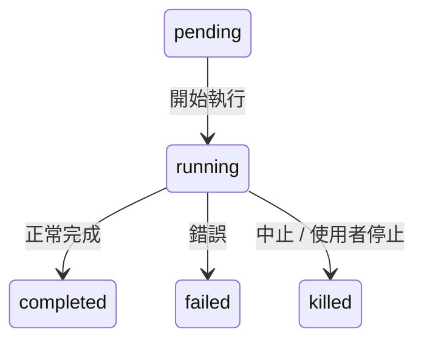
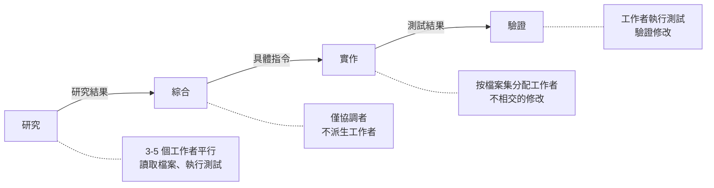
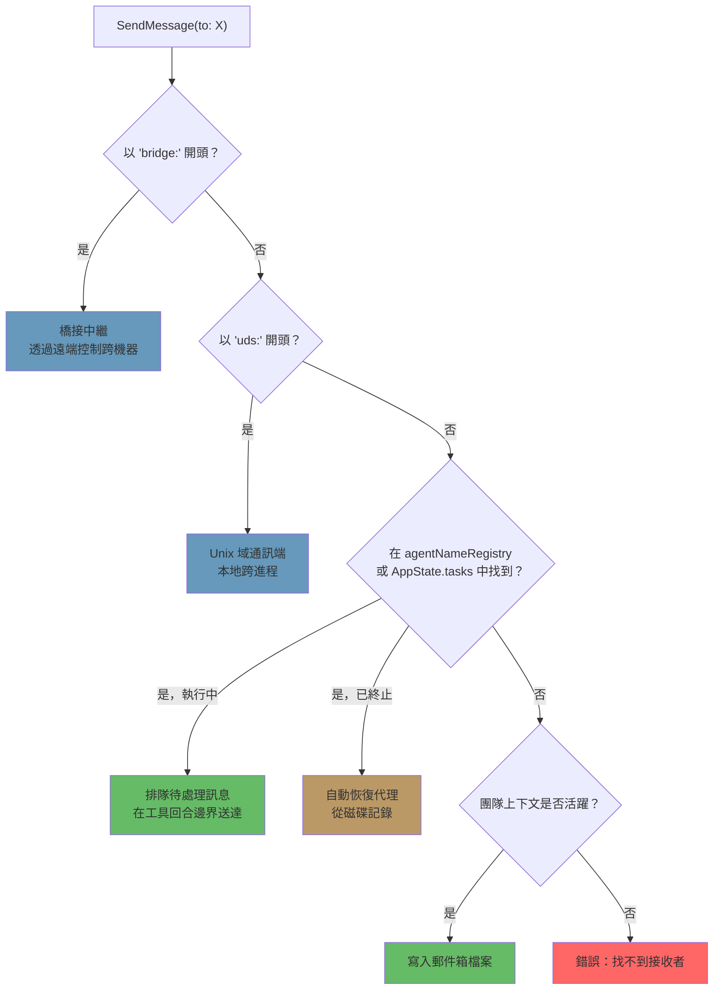

# 第十章：任務、協調與群集

## 單一執行緒的極限

第八章展示了如何建立子代理——從代理定義構建隔離執行上下文的十五步生命週期。第九章展示了如何透過提示詞快取利用讓平行派生變得划算。但建立代理和管理代理是不同的問題。本章處理的是第二個。

一個單一代理迴圈——一個模型、一段對話、一次一個工具——能完成相當可觀的工作。它可以讀取檔案、編輯程式碼、執行測試、搜尋網路，並對複雜問題進行推理。但它碰到了天花板。

天花板不是智能，而是平行性和範疇。在大型重構上工作的開發者需要更新 40 個檔案、在每批次後執行測試，並驗證沒有任何東西損壞。一次程式庫遷移同時觸及前端、後端和資料庫層。一次徹底的程式碼審查需要在背景執行測試套件的同時讀取數十個檔案。這些不是更難的問題——它們是更寬廣的問題。它們需要同時做多件事、將工作委派給專家、並協調結果的能力。

Claude Code 對這個問題的回答不是單一機制，而是一個分層的協調模式堆疊，每一種都適合不同形狀的工作。背景任務用於「發射後不管」的指令；協調者模式用於管理者-工作者層次結構；群集（Swarm）團隊用於點對點協作；以及一個將它們全部串聯的統一通訊協定。

協調層橫跨 `tools/AgentTool/`、`tasks/`、`coordinator/`、`tools/SendMessageTool/` 和 `utils/swarm/` 中大約 40 個檔案。儘管範圍廣泛，設計卻以一個所有模式共用的單一狀態機為錨。理解那個狀態機——`Task.ts` 中的 `Task` 抽象——是理解其他一切的前提。

本章從基礎任務狀態機開始，一路追溯到最複雜的多代理拓撲。

---

## 任務狀態機

Claude Code 中的每一個背景操作——一條 shell 指令、一個子代理、一個遠端會話、一個工作流程腳本——都被追蹤為一個*任務（task）*。任務抽象存在於 `Task.ts`，提供協調層其餘部分依賴的統一狀態模型。

### 七種類型

系統定義了七種任務類型，每種代表不同的執行模型：

七種任務類型是：`local_bash`（背景 shell 指令）、`local_agent`（背景子代理）、`remote_agent`（遠端會話）、`in_process_teammate`（群集隊友）、`local_workflow`（工作流程腳本執行）、`monitor_mcp`（MCP 伺服器監視器）和 `dream`（推測性背景思考）。

`local_bash` 和 `local_agent` 是主力——分別是背景 shell 指令和背景子代理。`in_process_teammate` 是群集的基本元件。`remote_agent` 橋接到遠端的 Claude Code Runtime 環境。`local_workflow` 執行多步驟腳本。`monitor_mcp` 監視 MCP 伺服器的健康狀況。`dream` 是最不尋常的——一個讓代理在等待使用者輸入時進行推測性思考的背景任務。

每種類型都有一個單字元 ID 前綴，方便即時視覺辨識：

| 類型 | 前綴 | ID 範例 |
|------|--------|------------|
| `local_bash` | `b` | `b4k2m8x1` |
| `local_agent` | `a` | `a7j3n9p2` |
| `remote_agent` | `r` | `r1h5q6w4` |
| `in_process_teammate` | `t` | `t3f8s2v5` |
| `local_workflow` | `w` | `w6c9d4y7` |
| `monitor_mcp` | `m` | `m2g7k1z8` |
| `dream` | `d` | `d5b4n3r6` |

任務 ID 使用單字元前綴（代理用 a、bash 用 b、隊友用 t 等），後跟從大小寫安全字母表（數字加小寫字母）中抽取的 8 個隨機英數字元。這產生大約 2.8 兆種組合——足以抵禦針對磁碟上任務輸出檔案的暴力符號連結攻擊。

當你在日誌行看到 `a7j3n9p2`，你立刻知道它是背景代理；看到 `b4k2m8x1`，就是 shell 指令。這個前綴是為人類讀者做的微最佳化，但在一個可能同時有數十個並發任務的系統中，這很重要。

### 五種狀態

生命週期是一個沒有循環的簡單有向圖：



`pending` 是介於註冊和首次執行之間的短暫狀態。`running` 代表任務正在積極工作。三個終態是 `completed`（成功）、`failed`（錯誤）和 `killed`（被使用者、協調者或中止信號明確停止）。一個輔助函式防止與已結束的任務互動：

```typescript
export function isTerminalTaskStatus(status: TaskStatus): boolean {
  return status === 'completed' || status === 'failed' || status === 'killed'
}
```

這個函式無處不在——出現在訊息注入防護、驅逐邏輯、孤兒清理，以及 SendMessage 路由中決定是排隊訊息還是恢復已死亡代理的邏輯。

### 基礎狀態

每個任務狀態都繼承 `TaskStateBase`，它攜帶所有七種類型共用的欄位：

```typescript
export type TaskStateBase = {
  id: string              // 帶前綴的隨機 ID
  type: TaskType          // 判別符
  status: TaskStatus      // 當前生命週期位置
  description: string     // 人類可讀的摘要
  toolUseId?: string      // 產生此任務的 tool_use 區塊
  startTime: number       // 建立時間戳
  endTime?: number        // 終態時間戳
  totalPausedMs?: number  // 累積的暫停時間
  outputFile: string      // 串流輸出的磁碟路徑
  outputOffset: number    // 增量輸出的讀取游標
  notified: boolean       // 完成是否已回報給父代理
}
```

兩個欄位值得關注。`outputFile` 是非同步執行與父代理對話之間的橋樑——每個任務將其輸出寫入磁碟上的一個檔案，父代理可以透過 `outputOffset` 增量讀取。`notified` 防止重複的完成訊息；一旦父代理被告知任務完成，旗標翻轉為 `true`，通知就不再發送。沒有這個防護，在兩次連續輪詢通知佇列之間完成的任務會產生重複通知，使模型誤以為有兩個任務完成，而實際上只有一個。

### 代理任務狀態

`LocalAgentTaskState` 是最複雜的變體，攜帶管理背景子代理完整生命週期所需的一切：

```typescript
export type LocalAgentTaskState = TaskStateBase & {
  type: 'local_agent'
  agentId: string
  prompt: string
  selectedAgent?: AgentDefinition
  agentType: string
  model?: string
  abortController?: AbortController
  pendingMessages: string[]       // 透過 SendMessage 排隊
  isBackgrounded: boolean         // 這是原本的前台代理嗎？
  retain: boolean                 // UI 正在持有此任務
  diskLoaded: boolean             // 旁鏈記錄已載入
  evictAfter?: number             // GC 截止時間
  progress?: AgentProgress
  lastReportedToolCount: number
  lastReportedTokenCount: number
  // ... 其他生命週期欄位
}
```

三個欄位揭示了重要的設計決策。`pendingMessages` 是收件匣——當 `SendMessage` 目標是一個執行中的代理時，訊息在此排隊而非立即注入。訊息在工具回合邊界處被排空，這保留了代理的回合結構。`isBackgrounded` 區分了生來就是非同步的代理，和最初作為前台同步代理之後被使用者按鍵背景化的代理。`evictAfter` 是一個垃圾回收機制：未被保留的已完成任務在其狀態從記憶體中清除之前有一段寬限期。

所有任務狀態都以帶前綴 ID 為鍵，存儲在 `AppState.tasks` 中，型別為 `Record<string, TaskState>`。這是一個扁平映射，不是樹狀結構——系統沒有在狀態儲存中建模父子關係。父子關係隱含在對話流程中：父代理持有產生子代理的 `toolUseId`。

### 任務登錄表

每種任務類型都有一個具有最小介面的 `Task` 物件：

```typescript
export type Task = {
  name: string
  type: TaskType
  kill(taskId: string, setAppState: SetAppState): Promise<void>
}
```

登錄表收集所有任務實作：

```typescript
export function getAllTasks(): Task[] {
  return [
    LocalShellTask,
    LocalAgentTask,
    RemoteAgentTask,
    DreamTask,
    ...(LocalWorkflowTask ? [LocalWorkflowTask] : []),
    ...(MonitorMcpTask ? [MonitorMcpTask] : []),
  ]
}
```

注意條件式引入——`LocalWorkflowTask` 和 `MonitorMcpTask` 受功能旗標控制，在執行期可能不存在。`Task` 介面刻意保持極簡。早期迭代包含 `spawn()` 和 `render()` 方法，但當發現這些方法從未被多型呼叫時就被移除了。每種任務類型都有自己的派生邏輯、狀態管理和渲染方式。真正需要按類型分派的唯一操作是 `kill()`，所以介面只需要這個。

這是透過減法進行介面演化的範例。最初的設計設想所有任務類型會共用一個通用的生命週期介面。實際上，各類型分歧得太嚴重，以至於共用介面變成了一個假象——對 shell 指令的 `spawn()` 和對 in-process 隊友的 `spawn()` 幾乎沒有共同之處。與其維護一個有洩漏的抽象，團隊移除了所有東西，只留下真正受益於多型的那一個方法。

---

## 通訊模式

一個在背景執行的任務，只有在父代理能觀察其進度並接收結果時才有用。Claude Code 支援三種通訊頻道，每種都針對不同的存取模式最佳化。

### 前台：生成器鏈

當代理同步執行時，父代理直接迭代其 `runAgent()` 非同步生成器，將每則訊息逐層往上傳遞。這裡有趣的機制是背景逃生艙——同步迴圈在「代理的下一則訊息」和「背景化信號」之間競速：

```typescript
const agentIterator = runAgent({ ...params })[Symbol.asyncIterator]()

while (true) {
  const nextMessagePromise = agentIterator.next()
  const raceResult = backgroundPromise
    ? await Promise.race([nextMessagePromise.then(...), backgroundPromise])
    : { type: 'message', result: await nextMessagePromise }

  if (raceResult.type === 'background') {
    // 使用者觸發背景化——轉換到非同步
    await agentIterator.return(undefined)
    void runAgent({ ...params, isAsync: true })
    return { data: { status: 'async_launched' } }
  }

  agentMessages.push(message)
}
```

如果使用者在執行過程中決定讓一個同步代理變成背景任務，前台迭代器就會被優雅地返回（觸發其 `finally` 區塊進行資源清理），代理以相同的 ID 重新派生為非同步任務。這個轉換是無縫的——沒有工作遺失，代理從中斷的地方繼續，使用一個與父代理的 ESC 鍵解鏈的非同步中止控制器。

這個狀態轉換要做正確確實很難。前台代理共用父代理的中止控制器（ESC 同時殺死兩者）。背景代理需要自己的控制器（ESC 不應殺死它）。代理的訊息需要從前台生成器串流轉移到背景通知系統。任務狀態需要翻轉 `isBackgrounded` 讓 UI 知道要在背景面板顯示它。而這一切必須原子性地發生——沒有訊息在轉換中遺失，沒有殭屍迭代器繼續執行。`Promise.race` 在下一則訊息和背景化信號之間的競速，正是讓這成為可能的機制。

### 背景：三個頻道

背景代理透過磁碟、通知和排隊訊息進行通訊。

**磁碟輸出檔案。** 每個任務都寫入一個 `outputFile` 路徑——指向代理在 JSONL 格式記錄的符號連結。父代理（或任何觀察者）可以使用追蹤已消費多少的 `outputOffset` 增量讀取這個檔案。`TaskOutputTool` 將這個暴露給模型：

```typescript
inputSchema = z.strictObject({
  task_id: z.string(),
  block: z.boolean().default(true),
  timeout: z.number().default(30000),
})
```

當 `block: true` 時，工具會輪詢直到任務達到終態或逾時。這是協調者派生工作者並等待其結果的主要機制。

**任務通知。** 當背景代理完成時，系統會生成一個 XML 通知並將其排隊以送入父代理的對話：

```xml
<task-notification>
  <task-id>a7j3n9p2</task-id>
  <tool-use-id>toolu_abc123</tool-use-id>
  <output-file>/path/to/output</output-file>
  <status>completed</status>
  <summary>代理「調查驗證 bug」已完成</summary>
  <result>在 src/auth/validate.ts:42 找到空指標...</result>
  <usage>
    <total_tokens>15000</total_tokens>
    <tool_uses>8</tool_uses>
    <duration_ms>12000</duration_ms>
  </usage>
</task-notification>
```

通知作為使用者角色訊息注入到父代理的對話中，這意味著模型在其正常訊息流中看到它。它不需要特殊工具來查詢完成情況——它們作為上下文送達。任務狀態上的 `notified` 旗標防止重複送達。

**指令佇列。** `LocalAgentTaskState` 上的 `pendingMessages` 陣列是第三個頻道。當 `SendMessage` 目標是一個執行中的代理時，訊息被排隊：

```typescript
if (isLocalAgentTask(task) && task.status === 'running') {
  queuePendingMessage(agentId, input.message, setAppState)
  return { data: { success: true, message: '訊息已排隊...' } }
}
```

這些訊息在工具回合邊界被 `drainPendingMessages()` 排空，作為使用者訊息注入到代理的對話中。這是一個關鍵的設計選擇——訊息在工具回合之間送達，而非執行中途。代理完成當前的思考，然後接收新的資訊。沒有競爭條件，沒有損壞的狀態。

### 進度追蹤

`ProgressTracker` 提供對代理活動的即時可視性：

```typescript
export type ProgressTracker = {
  toolUseCount: number
  latestInputTokens: number        // 累積（最新值，非總和）
  cumulativeOutputTokens: number   // 跨回合加總
  recentActivities: ToolActivity[] // 最後 5 次工具使用
}
```

輸入和輸出 token 追蹤之間的區別是刻意的，反映了 API 計費模型的微妙之處。輸入 token 每次 API 呼叫是累積的，因為每次都重新送出完整對話——第 15 個回合包含所有 14 個前面的回合，所以 API 回報的輸入 token 數已反映總量。保留最新值是正確的聚合方式。輸出 token 是每回合的——模型每次生成新的 token——所以加總才是正確的聚合方式。搞錯這一點會導致大幅高估（加總累積輸入 token）或大幅低估（只保留最新的輸出 token）。

`recentActivities` 陣列（上限 5 個條目）提供一個人類可讀的代理正在做什麼的串流：「讀取 src/auth/validate.ts」、「Bash: npm test」、「編輯 src/auth/validate.ts」。這出現在 VS Code 的子代理面板和終端機的背景任務指示器中，讓使用者不需要閱讀完整記錄就能了解代理的工作。

對於背景代理，進度透過 `updateAsyncAgentProgress()` 寫入 `AppState`，並透過 `emitTaskProgress()` 作為 SDK 事件發出。VS Code 子代理面板消費這些事件來渲染即時進度條、工具計數和活動串流。進度追蹤不只是外觀——它是告訴使用者背景代理是在進展還是陷入迴圈的主要回饋機制。

---

## 協調者模式

協調者模式將 Claude Code 從一個有背景輔助的單一代理，轉變為真正的管理者-工作者架構。這是系統中最具主張性的協調模式，其設計揭示了對 LLM 應該如何以及不應該如何委派工作的深刻思考。

### 協調者模式解決的問題

標準代理迴圈只有一段對話和一個上下文視窗。當它派生一個背景代理時，背景代理獨立執行並透過任務通知回報結果。這對簡單委派很有效——「繼續編輯時在背景執行測試」——但對複雜的多步驟工作流程就會失效。

考慮一次程式庫遷移。代理需要：（1）理解 200 個檔案中的當前模式，（2）設計遷移策略，（3）對每個檔案套用修改，（4）驗證沒有任何東西損壞。步驟 1 和 3 受益於平行性。步驟 2 需要綜合步驟 1 的結果。步驟 4 取決於步驟 3。一個代理順序做這些事會把大部分的 token 預算花在重複讀取檔案上。多個背景代理在沒有協調的情況下做這些事會產生不一致的修改。

協調者模式透過將「思考」代理與「執行」代理分離來解決這個問題。協調者處理步驟 1 和 2（派發研究工作者，然後綜合）。工作者處理步驟 3 和 4（套用修改、執行測試）。協調者看到全貌；工作者看到他們的具體任務。

### 啟動

一個環境變數就能切換開關：

```typescript
export function isCoordinatorMode(): boolean {
  if (feature('COORDINATOR_MODE')) {
    return isEnvTruthy(process.env.CLAUDE_CODE_COORDINATOR_MODE)
  }
  return false
}
```

在恢復會話時，`matchSessionMode()` 檢查恢復的會話的儲存模式是否與當前環境相符。如果不符，環境變數會被翻轉以匹配。這防止了一個混亂的情景：協調者會話恢復為普通代理（失去對工作者的感知），或普通會話恢復為協調者（失去對其工具的存取）。會話的模式是事實來源；環境變數是執行期信號。

### 工具限制

協調者的力量不是來自擁有更多工具，而是來自擁有更少工具。在協調者模式中，協調者代理確切只有三個工具：

- **Agent** — 派生工作者
- **SendMessage** — 與現有工作者通訊
- **TaskStop** — 終止執行中的工作者

就這樣。沒有檔案讀取。沒有程式碼編輯。沒有 shell 指令。協調者不能直接觸碰程式庫。這個限制不是缺陷——它是核心設計原則。協調者的工作是思考、規劃、拆解和綜合。工作者執行工作。

工作者則獲得完整工具集，減去內部協調工具：

```typescript
const INTERNAL_WORKER_TOOLS = new Set([
  TEAM_CREATE_TOOL_NAME,
  TEAM_DELETE_TOOL_NAME,
  SEND_MESSAGE_TOOL_NAME,
  SYNTHETIC_OUTPUT_TOOL_NAME,
])
```

工作者不能派生自己的子團隊或向同伴發送訊息。它們透過正常的任務完成機制回報結果，協調者在它們之間進行綜合。

### 370 行的系統提示詞

協調者的系統提示詞，就每行的密度而言，是整個程式庫中關於如何用 LLM 進行協調最具教益的文件。它大約有 370 行，編碼了從實踐中得來的教訓。關鍵教導如下：

**「永遠不要委派理解。」** 這是核心論點。協調者必須將研究發現綜合成帶有檔案路徑、行號和確切修改的具體提示詞。提示詞明確指出反模式，例如「根據你的發現修復 bug」——這種提示詞把*理解*委派給工作者，迫使它重新推導協調者已有的上下文。正確的模式是：「在 `src/auth/validate.ts` 第 42 行，從 OAuth 流程呼叫時 `userId` 參數可以是 null。新增一個返回 401 回應的空值檢查。」

**「平行性是你的超能力。」** 提示詞建立了一個清晰的並發模型。唯讀任務可以自由並行執行——研究、探索、讀取檔案。大量寫入的任務按檔案集序列化。協調者應該推理哪些任務可以重疊，哪些必須排序。一個好的協調者同時派生五個研究工作者，等待所有工作者完成，綜合結果，然後派生三個觸碰不相交檔案集的實作工作者。一個差的協調者派生一個工作者，等待，再派生下一個，再等待——將本可以平行的工作序列化。

**任務工作流程階段。** 提示詞定義了四個階段：



1. **研究** — 工作者平行探索程式庫，讀取檔案、執行測試、收集資訊
2. **綜合** — 協調者（不是工作者）讀取所有研究結果並建立統一的理解
3. **實作** — 工作者接收從綜合中得出的精確指令
4. **驗證** — 工作者執行測試並驗證修改

協調者不應跳過階段。最常見的失敗模式是從研究直接跳到實作而不進行綜合。當這種情況發生時，協調者把理解委派給了實作工作者——每個工作者必須從頭重新推導上下文，導致不一致的修改和浪費的 token。

**繼續 vs. 派生的決策。** 當一個工作者完成且協調者有後續工作時，應該向現有工作者發送訊息（透過 SendMessage），還是派生一個新的（透過 Agent）？這個決策是上下文重疊程度的函式：

- **高度重疊，相同檔案**：繼續。工作者已經在其上下文中有檔案內容、理解模式，並可以在之前的工作基礎上繼續。重新派生會迫使重讀相同的檔案、重新推導相同的理解。
- **低度重疊，不同領域**：派生新的。剛調查驗證系統的工作者，攜帶了 20,000 個對 CSS 重構任務來說是累贅的驗證特定 token。重新開始更便宜。
- **高度重疊但工作者失敗了**：帶著對哪裡出錯的明確指引派生新的。繼續一個失敗的工作者通常意味著對抗混亂的上下文。一個「上次嘗試因為 X 失敗，避免 Y」的新開始更可靠。
- **後續任務需要工作者的輸出**：繼續，並在 SendMessage 中包含輸出。工作者不需要重新推導自己的結果。

**工作者提示詞撰寫和反模式。** 提示詞教導協調者如何撰寫有效的工作者提示詞，並明確標出不良模式：

反模式：*「根據你的研究發現，實作修復。」* 這委派了理解。工作者不是做研究的那個——協調者讀取了研究結果。

反模式：*「修復驗證模組中的 bug。」* 沒有檔案路徑、沒有行號、沒有 bug 的描述。工作者必須從頭搜尋整個程式庫。

反模式：*「對所有其他檔案做同樣的修改。」* 哪些檔案？什麼修改？協調者知道；它應該列舉出來。

良好模式：*「在 `src/auth/validate.ts` 第 42 行，從 `src/oauth/callback.ts:89` 呼叫時 `userId` 參數可以是 null。新增一個空值檢查：如果 `userId` 是 null，返回 `{ error: 'unauthorized', status: 401 }`。然後更新 `src/auth/__tests__/validate.test.ts` 中的測試以涵蓋空值情況。」*

撰寫具體提示詞的成本由協調者承擔一次。好處——工作者第一次就正確執行——是巨大的。模糊的提示詞製造一個虛假的節約：協調者省了 30 秒的提示詞撰寫，工作者卻浪費了 5 分鐘的探索。

### 工作者上下文

協調者將可用工具的資訊注入到自己的上下文中，讓模型知道工作者能做什麼：

```typescript
export function getCoordinatorUserContext(mcpClients, scratchpadDir?) {
  return {
    workerToolsContext: `透過 Agent 派生的工作者可以存取：${workerTools}`
      + (mcpClients.length > 0
        ? `\n工作者也有來自以下的 MCP 工具：${serverNames}` : '')
      + (scratchpadDir ? `\n草稿板：${scratchpadDir}` : '')
  }
}
```

草稿板目錄（受 `tengu_scratch` 功能旗標控制）是一個共用的檔案系統位置，工作者可以在沒有權限提示的情況下讀取和寫入。它實現了持久的跨工作者知識共享——一個工作者的研究筆記成為另一個工作者的輸入，透過檔案系統而非協調者的 token 視窗進行中介。

這很重要，因為它解決了協調者模式的一個根本限制。沒有草稿板，所有資訊都流經協調者：工作者 A 產生發現，協調者透過 TaskOutput 讀取，將它們綜合進工作者 B 的提示詞。協調者的上下文視窗成為瓶頸——它必須持有所有中間結果足夠長的時間才能綜合。有了草稿板，工作者 A 將發現寫入 `/tmp/scratchpad/auth-analysis.md`，協調者告訴工作者 B：「讀取 `/tmp/scratchpad/auth-analysis.md` 的驗證分析，並將模式套用到 OAuth 模組。」協調者透過參考而非值來移動資訊。

### 與 Fork 的互斥

協調者模式和基於 fork 的子代理是互斥的：

```typescript
export function isForkSubagentEnabled(): boolean {
  if (feature('FORK_SUBAGENT')) {
    if (isCoordinatorMode()) return false
    // ...
  }
}
```

衝突是根本性的。Fork 代理繼承父代理的整個對話上下文——它們是共用提示詞快取的廉價克隆。協調者工作者是具有新鮮上下文和具體指令的獨立代理。這是兩種相對立的委派哲學，系統在功能旗標層面強制這個選擇。

---

## 群集系統

協調者模式是層次化的：一個管理者，多個工作者，自上而下的控制。群集系統是點對點的替代方案——多個 Claude Code 實例作為一個團隊工作，領導者透過訊息傳遞協調多個隊友。

### 團隊上下文

團隊由 `teamName` 識別，並在 `AppState.teamContext` 中追蹤：

```typescript
teamContext?: {
  teamName: string
  teammates: {
    [id: string]: { name: string; color?: string; ... }
  }
}
```

每個隊友都有一個名稱（用於定址）和一個顏色（用於 UI 中的視覺區分）。團隊檔案持久化在磁碟上，這樣團隊成員資格在進程重啟後仍能存活。

### 代理名稱登錄表

背景代理在派生時可以被指定名稱，使它們可以透過人類可讀的識別符而非隨機任務 ID 來定址：

```typescript
if (name) {
  rootSetAppState(prev => {
    const next = new Map(prev.agentNameRegistry)
    next.set(name, asAgentId(asyncAgentId))
    return { ...prev, agentNameRegistry: next }
  })
}
```

`agentNameRegistry` 是一個 `Map<string, AgentId>`。當 `SendMessage` 解析 `to` 欄位時，首先檢查登錄表：

```typescript
const registered = appState.agentNameRegistry.get(input.to)
const agentId = registered ?? toAgentId(input.to)
```

這意味著你可以向 `"researcher"` 發送訊息，而不是向 `a7j3n9p2`。這個間接層很簡單，但它讓協調者能以角色而非 ID 來思考——對模型推理多代理工作流程的能力有顯著提升。

### In-Process 隊友

In-process 隊友在與領導者相同的 Node.js 進程中運行，透過 `AsyncLocalStorage` 隔離。它們的狀態擴展基礎，加入團隊特定的欄位：

```typescript
export type InProcessTeammateTaskState = TaskStateBase & {
  type: 'in_process_teammate'
  identity: TeammateIdentity
  prompt: string
  messages?: Message[]                  // 上限 50 則
  pendingUserMessages: string[]
  isIdle: boolean
  shutdownRequested: boolean
  awaitingPlanApproval: boolean
  permissionMode: PermissionMode
  onIdleCallbacks?: Array<() => void>
  currentWorkAbortController?: AbortController
}
```

50 則訊息的上限值得解釋。開發過程中，分析顯示每個 in-process 代理在超過 500 個回合時累積大約 20MB 的 RSS。有人觀察到，超級使用者在執行長時間工作流程的「鯨魚會話」，在 2 分鐘內啟動了 292 個代理，將 RSS 推高到 36.8GB。50 則訊息的上限對 UI 呈現而言是記憶體安全閥。代理的實際對話繼續保留完整歷史；只有面向 UI 的快照被截斷。

`isIdle` 旗標啟用了一個工作竊取模式。一個空閒的隊友不在消耗 token 或 API 呼叫——它只是在等待下一則訊息。`onIdleCallbacks` 陣列讓系統能鉤入從活躍到空閒的轉換，啟用「等待所有隊友完成，然後繼續」這樣的協調模式。

`currentWorkAbortController` 與隊友的主中止控制器是分開的。中止當前工作控制器會取消隊友正在進行的回合，但不會殺死隊友。這啟用了一個「重定向」模式：領導者發送一個更高優先級的訊息，隊友的當前工作被中止，隊友處理新訊息。主中止控制器被中止時，才會完全殺死隊友。兩個層次的中斷，對應兩個層次的意圖。

`shutdownRequested` 旗標實現了合作式終止。當領導者發送關閉請求時，這個旗標被設置。隊友可以在自然停止點檢查它，並優雅地收尾——完成當前的檔案寫入、提交修改或發送最終狀態更新。這比硬性殺死更溫和，硬性殺死可能讓檔案處於不一致狀態。

### 郵件箱

隊友透過基於檔案的郵件箱系統進行通訊。當 `SendMessage` 的目標是一個隊友時，訊息被寫入接收者的郵件箱檔案：

```typescript
await writeToMailbox(recipientName, {
  from: senderName,
  text: content,
  summary,
  timestamp: new Date().toISOString(),
  color: senderColor,
}, teamName)
```

訊息可以是純文字、結構化協定訊息（關閉請求、計畫批准），或廣播（`to: "*"` 發送給所有團隊成員，排除發送者）。一個輪詢鉤子處理傳入訊息並將其路由到隊友的對話中。

基於檔案的方法是刻意簡單的。沒有訊息代理、沒有事件匯流排、沒有共用記憶體頻道。檔案是持久的（能在進程崩潰後存活）、可檢查的（你可以 `cat` 一個郵件箱）、且便宜的（不需要基礎設施依賴）。對於一個訊息量以每次會話數十則而非每秒數千則來衡量的系統，這是正確的取捨。Redis 支持的訊息佇列會增加運維複雜性、一個依賴項和故障模式——所有這些都是為了一個檔案系統呼叫就能輕鬆處理的吞吐量需求。

廣播機制值得一提。當一個訊息發送到 `"*"` 時，發送者迭代團隊檔案中的所有成員，跳過自己（不分大小寫比較），並個別寫入每個成員的郵件箱：

```typescript
for (const member of teamFile.members) {
  if (member.name.toLowerCase() === senderName.toLowerCase()) continue
  recipients.push(member.name)
}
for (const recipientName of recipients) {
  await writeToMailbox(recipientName, { from: senderName, text: content, ... }, teamName)
}
```

沒有扇出最佳化——每個接收者都有一個單獨的檔案寫入。同樣，在代理團隊的規模（通常 3-8 個成員）下，這完全足夠。如果一個團隊有 100 個成員，就需要重新思考。但防止 36GB RSS 場景的 50 則訊息記憶體上限，也隱含地限制了有效的團隊規模。

### 權限轉發

群集工作者以受限權限運作，但當需要批准敏感操作時可以上報給領導者：

```typescript
const request = createPermissionRequest({
  toolName, toolUseId, input, description, permissionSuggestions
})
registerPermissionCallback({ requestId, toolUseId, onAllow, onReject })
void sendPermissionRequestViaMailbox(request)
```

流程是：工作者碰到一個需要權限的工具，bash 分類器嘗試自動批准，如果失敗，請求透過郵件箱系統轉發給領導者。領導者在其 UI 中看到請求，可以批准或拒絕。回調觸發，工作者繼續進行。這讓工作者對安全操作能自主執行，同時對危險操作維持人工監督。

---

## 代理間通訊：SendMessage

`SendMessageTool` 是通用的通訊基本元件。它透過單一工具介面處理四種不同的路由模式，由 `to` 欄位的形狀選擇。

### 輸入 Schema

```typescript
inputSchema = z.object({
  to: z.string(),
  // "teammate-name", "*", "uds:<socket>", "bridge:<session-id>"
  summary: z.string().optional(),
  message: z.union([
    z.string(),
    z.discriminatedUnion('type', [
      z.object({ type: z.literal('shutdown_request'), reason: z.string().optional() }),
      z.object({ type: z.literal('shutdown_response'), request_id, approve, reason }),
      z.object({ type: z.literal('plan_approval_response'), request_id, approve, feedback }),
    ]),
  ]),
})
```

`message` 欄位是純文字和結構化協定訊息的聯合。這意味著 SendMessage 承擔雙重職責——它既是非正式聊天頻道（「這是我的發現」），也是正式協定層（「我批准你的計畫」/「請關閉」）。

### 路由分派

`call()` 方法遵循優先順序的分派鏈：



**1. 橋接訊息**（`bridge:<session-id>`）。透過 Anthropic 的遠端控制伺服器進行跨機器通訊。這是最廣的觸及——兩個在不同機器、可能是不同洲的 Claude Code 實例，透過中繼通訊。系統在發送橋接訊息前需要明確的使用者同意——一個安全檢查，防止一個代理單方面與遠端實例建立通訊。沒有這個閘門，一個被入侵或混亂的代理可能將資訊外洩到遠端會話。同意檢查使用 `postInterClaudeMessage()`，它處理透過遠端控制中繼的序列化和傳輸。

**2. UDS 訊息**（`uds:<socket-path>`）。透過 Unix 域通訊端進行本地跨進程通訊。這適用於在同一台機器但在不同進程中執行的 Claude Code 實例——例如，一個 VS Code 擴充功能託管一個實例，一個終端機託管另一個。UDS 通訊快速（無網路往返）、安全（檔案系統權限控制存取）、可靠（核心處理送達）。`sendToUdsSocket()` 函式序列化訊息並將其寫入 `to` 欄位指定的通訊端路徑。對等方透過掃描活躍 UDS 端點的 `ListPeers` 工具相互發現。

**3. In-process 子代理路由**（純名稱或代理 ID）。這是最常見的路徑。路由邏輯：

- 在 `agentNameRegistry` 中查找 `input.to`
- 如果找到且執行中：`queuePendingMessage()` — 訊息等待下一個工具回合邊界
- 如果找到但處於終態：`resumeAgentBackground()` — 代理被透明地重啟
- 如果不在 `AppState` 中：嘗試從磁碟記錄恢復

**4. 團隊郵件箱**（當團隊上下文活躍時的後備）。具名接收者的訊息被寫入其郵件箱檔案。`"*"` 萬用字元觸發向所有團隊成員廣播。

### 結構化協定

除了純文字，SendMessage 還承載兩個正式協定。

**關閉協定。** 領導者向隊友發送 `{ type: 'shutdown_request', reason: '...' }`。隊友以 `{ type: 'shutdown_response', request_id, approve: true/false, reason }` 回應。如果批准，in-process 隊友中止其控制器；基於 tmux 的隊友接收 `gracefulShutdown()` 呼叫。這個協定是合作性的——隊友在執行關鍵工作中途可以拒絕關閉請求，領導者必須處理這種情況。

**計畫批准協定。** 在計畫模式下運作的隊友在執行前必須獲得批准。它們提交一個計畫，領導者以 `{ type: 'plan_approval_response', request_id, approve, feedback }` 回應。只有團隊領導者可以發出批准。這創建了一個審查閘門——領導者可以在任何檔案被觸碰之前檢查工作者的預期方法，及早發現誤解。

### 自動恢復模式

路由系統最優雅的功能是透明的代理恢復。當 `SendMessage` 的目標是一個已完成或被殺死的代理，系統不返回錯誤，而是復活代理：

```typescript
if (task.status !== 'running') {
  const result = await resumeAgentBackground({
    agentId,
    prompt: input.message,
    toolUseContext: context,
    canUseTool,
  })
  return {
    data: {
      success: true,
      message: `代理「${input.to}」已停止；以你的訊息恢復`
    }
  }
}
```

`resumeAgentBackground()` 函式從磁碟記錄重建代理：

1. 讀取旁鏈 JSONL 記錄
2. 重建訊息歷史，過濾孤兒的思考區塊和未解決的工具使用
3. 重建內容替換狀態以維持提示詞快取穩定性
4. 從儲存的元資料解析原始代理定義
5. 以全新的中止控制器重新註冊為背景任務
6. 以恢復的歷史加上新訊息作為提示詞呼叫 `runAgent()`

從協調者的角度來看，向一個死亡的代理發送訊息和向一個活著的代理發送訊息是同一個操作。路由層處理複雜性。這意味著協調者不需要追蹤哪些代理是活著的——它們只是發送訊息，系統自己解決。

影響是深遠的。沒有自動恢復，協調者需要維護代理活躍性的心智模型：「`researcher` 還在執行嗎？讓我檢查一下。它完成了。我需要派生一個新代理。但等等，我應該用相同的名稱嗎？它會有相同的上下文嗎？」有了自動恢復，這一切都崩縮成：「向 `researcher` 發送訊息。」如果它活著，訊息被排隊。如果它死了，它以完整歷史被復活。協調者的提示詞複雜度大幅下降。

當然也有成本。從磁碟記錄恢復意味著重讀可能數千則訊息、重建內部狀態，以及以完整上下文視窗進行新的 API 呼叫。對於一個長期運行的代理，這在延遲和 token 方面都可能代價高昂。但替代方案——要求協調者手動管理代理生命週期——更糟糕。協調者是 LLM。它擅長推理問題和撰寫指令。它不擅長記帳。自動恢復讓 LLM 的優勢得以發揮，完全消除了一類記帳工作。

---

## TaskStop：緊急停止開關

`TaskStopTool` 是 Agent 和 SendMessage 的補充——它終止執行中的任務：

```typescript
inputSchema = z.strictObject({
  task_id: z.string().optional(),
  shell_id: z.string().optional(),  // 已棄用的向後相容
})
```

實作委派給 `stopTask()`，它按任務類型分派：

1. 在 `AppState.tasks` 中查找任務
2. 呼叫 `getTaskByType(task.type).kill(taskId, setAppState)`
3. 對代理：中止控制器、將狀態設為 `'killed'`、啟動驅逐計時器
4. 對 shell：殺死進程組

這個工具有一個遺留別名 `"KillShell"`——提醒我們任務系統是從更簡單的起源演化而來，當時唯一的背景操作是 shell 指令。

終止機制因任務類型而異，但模式是一致的。對於代理，終止意味著中止中止控制器（這導致 `query()` 迴圈在下一個讓出點退出）、將狀態設為 `'killed'`，並啟動驅逐計時器，讓任務狀態在寬限期後被清理。對於 shell，終止意味著向進程組發送信號——先是 `SIGTERM`，如果進程在逾時內沒有退出則是 `SIGKILL`。對於 in-process 隊友，終止也會觸發向團隊的關閉通知，讓其他成員知道隊友已不在。

驅逐計時器值得一提。當一個代理被殺死時，其狀態不會立即清除。它在 `AppState.tasks` 中保留一段寬限期（由 `evictAfter` 控制），讓 UI 可以顯示已殺死的狀態、任何最終輸出可以被讀取，以及透過 SendMessage 進行的自動恢復仍然可能。寬限期後，狀態被垃圾回收。這與已完成任務使用的模式相同——系統區分「完成」（結果可用）和「遺忘」（狀態已清除）。

---

## 在模式之間選擇

（關於命名的說明：程式庫中還包含管理結構化待辦清單的 `TaskCreate`/`TaskGet`/`TaskList`/`TaskUpdate` 工具——這是與此處描述的背景任務狀態機完全不同的系統。`TaskStop` 操作 `AppState.tasks`；`TaskUpdate` 操作專案追蹤資料儲存。命名重疊是歷史遺留問題，也是模型混亂的反覆來源。）

有三種協調模式可用——背景委派、協調者模式和群集團隊——自然的問題是何時使用哪一種。

**簡單委派**（Agent 工具搭配 `run_in_background: true`）適合父代理有一兩個獨立任務要卸載時。繼續編輯的同時在背景執行測試。等待建置時搜尋程式庫。父代理保持控制，在準備好時查看結果，從不需要複雜的通訊協定。開銷最小——一個任務狀態條目、一個磁碟輸出檔案、完成時的一個通知。

**協調者模式**適合問題分解為研究階段、綜合階段和實作階段，且協調者在指導下一步之前需要跨多個工作者的結果進行推理的情況。協調者不能觸碰檔案，這強制了清晰的關注分離：思考在一個上下文中發生，執行在另一個中發生。370 行的系統提示詞不是虛文——它編碼了防止 LLM 委派最常見失敗模式的模式，即委派理解而非委派行動。

**群集團隊**適合代理需要點對點通訊的長期協作會話，工作是持續的而非批次導向的，代理可能需要根據傳入訊息空閒和恢復的情況。郵件箱系統支援協調者模式（同步的派生-等待-綜合）不支援的非同步模式。計畫批准閘門增加了一個審查層。權限轉發在不要求每個代理都有完整權限的情況下維持安全性。

一個實用的決策表：

| 場景 | 模式 | 原因 |
|----------|---------|-----|
| 編輯時執行測試 | 簡單委派 | 一個背景任務，不需要協調 |
| 搜尋程式庫中的所有用法 | 簡單委派 | 發射後不管，完成後讀取輸出 |
| 跨 3 個模組重構 40 個檔案 | 協調者 | 研究階段找出模式，綜合規劃修改，工作者按模組平行執行 |
| 帶審查閘門的多天功能開發 | 群集 | 長期代理、計畫批准協定、點對點通訊 |
| 修復已知位置的 bug | 都不用——單一代理 | 對於聚焦、順序的工作，協調開銷超過收益 |
| 遷移資料庫 schema + 更新 API + 更新前端 | 協調者 | 共用研究/規劃階段後的三個獨立工作流 |
| 帶使用者監督的配對程式設計 | 帶計畫模式的群集 | 工作者提議，領導者批准，工作者執行 |

這些模式在原則上並非互斥，但在實踐中是互斥的。協調者模式停用 fork 子代理。群集團隊有自己的通訊協定，無法與協調者任務通知混用。選擇在會話啟動時透過環境變數和功能旗標做出，並塑造整個互動模型。

最後一個觀察：最簡單的模式幾乎總是正確的起點。大多數任務不需要協調者模式或群集團隊。一個偶爾有背景委派的單一代理能處理絕大多數的開發工作。複雜的模式是為了那 5% 真正寬廣、真正平行或真正長期運行的問題而存在的。在單一檔案 bug 修復上使用協調者模式，就像為一個靜態網站部署 Kubernetes——技術上可行，架構上不適當。

---

## 協調的成本

在審視協調層在哲學上揭示的內容之前，值得承認它在實踐上的成本。

每個背景代理都是一個單獨的 API 對話。它有自己的上下文視窗、自己的 token 預算和自己的提示詞快取槽。一個派生 5 個研究工作者的協調者進行 6 個並發 API 呼叫，每個都有自己的系統提示詞、工具定義和 CLAUDE.md 注入。Token 開銷不是微不足道的——光是系統提示詞就可能有數千個 token，每個工作者可能重讀其他工作者已讀過的檔案。

通訊頻道增加了延遲。磁碟輸出檔案需要檔案系統 I/O。任務通知在工具回合邊界送達，而非立即。指令佇列引入了完整的往返延遲——協調者發送訊息，訊息等待工作者完成當前的工具使用，工作者處理訊息，結果被寫入磁碟供協調者讀取。

狀態管理增加了複雜性。七種任務類型、五種狀態和每個任務狀態數十個欄位。驅逐邏輯、垃圾回收計時器、記憶體上限——這些都存在，因為無界的狀態增長導致了真實的生產事故（36.8GB RSS）。

這些都不意味著協調是錯的。它意味著協調是一個有成本的工具，成本應該與收益相衡量。執行 5 個平行工作者搜尋程式庫，在搜尋需要 5 分鐘的情況下是值得的。執行一個協調者來修復一個檔案中的錯字，純粹是開銷。

---

## 協調層揭示的內容

這個系統最有趣的方面不是任何單一機制——任務狀態、郵件箱和通知 XML 都是直接的工程實踐。有趣的是從它們如何結合而浮現的*設計哲學*。

協調者提示詞的「永遠不要委派理解」不只是 LLM 協調的好建議。它是關於基於上下文視窗的推理的根本限制的陳述。一個有全新上下文視窗的工作者，無法理解協調者在讀取 50 個檔案並綜合三份研究報告後所理解的東西。彌合這個鴻溝的唯一方式，是協調者將其理解提煉成一個具體的、可執行的提示詞。模糊的委派不只是低效——它在資訊理論上是有損的。

SendMessage 中的自動恢復模式揭示了一種對*表面簡單性優於實際簡單性*的偏好。實作是複雜的——讀取磁碟記錄、重建內容替換狀態、重新解析代理定義。但介面是微不足道的：發送訊息，無論接收者是活著還是死的，它都能工作。複雜性被基礎設施吸收，讓模型（和使用者）能以更簡單的方式推理。

而 in-process 隊友的 50 則訊息記憶體上限，提醒我們協調系統在真實的物理限制下運作。292 個代理在 2 分鐘內達到 36.8GB RSS 不是理論上的擔憂——它在生產中發生過。抽象是優雅的，但它們在記憶體有限的硬體上執行，系統必須在使用者將其推向極限時優雅地降級。

分層架構本身也有一個教訓。任務狀態機是不可知的——它不了解協調者或群集。通訊頻道是不可知的——SendMessage 不知道它是被協調者、群集領導者還是獨立代理呼叫。協調者提示詞分層在上面，添加方法論而不改變底層機制。每一層都可以被獨立理解、獨立測試和獨立演化。當團隊添加群集系統時，他們不需要修改任務狀態機。當他們添加協調者提示詞時，他們不需要修改 SendMessage。

這是良好分解的協調的標誌：基本元件是通用的，模式是由它們組合而成的。協調者只是一個有受限工具和詳細系統提示詞的代理。群集領導者只是一個有團隊上下文和郵件箱存取的代理。背景工作者只是一個有獨立中止控制器和磁碟輸出檔案的代理。七種任務類型、五種狀態和四種路由模式結合起來，產生了比各部分之和更大的協調模式。

協調層是 Claude Code 從單一執行緒工具執行者變成更接近開發團隊的地方。任務狀態機提供記帳。通訊頻道提供資訊流。協調者提示詞提供方法論。群集系統提供不適合嚴格層次結構的問題的點對點拓撲。它們合在一起，讓語言模型得以做到任何單一模型調用無法做到的事：處理寬廣的問題，平行進行，並且有協調。

下一章研究權限系統——決定哪些代理可以做什麼、以及危險操作如何從工作者上報到人類的安全層。沒有權限控制的協調將是錯誤的力量倍增器。權限系統確保更多代理意味著更多能力，而非更多風險。
