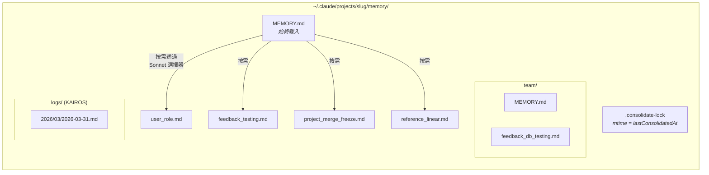
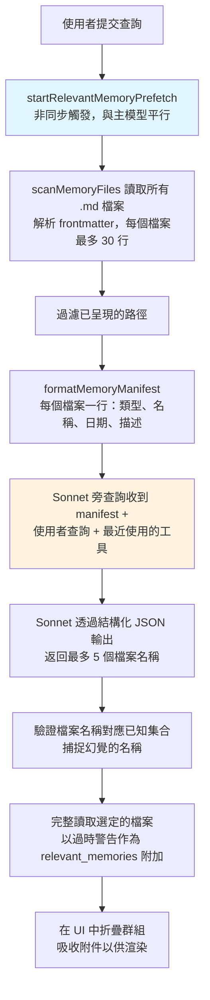
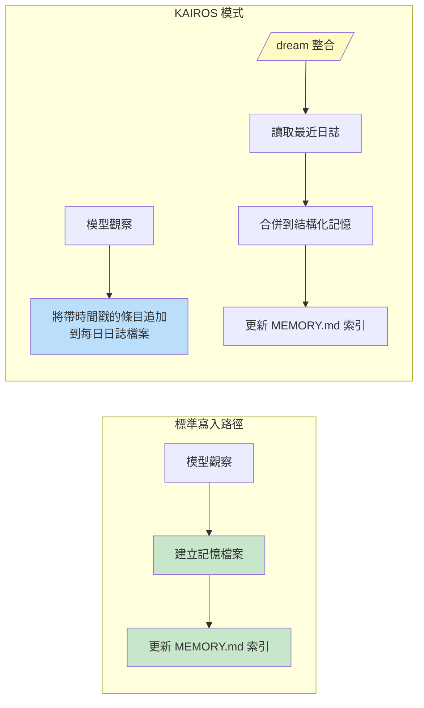

# 第十一章：記憶——跨對話的學習

## 無狀態的問題

到目前為止每一章描述的都是存在於單一會話中的機制。代理迴圈執行、工具執行、子代理協調，當進程退出時，這一切都消失了。下一次對話以相同的系統提示詞、相同的工具定義、相同的模型開始——而且對之前發生的事一無所知。

這是無狀態架構的根本限制。開發者在週一糾正了模型的測試方法，週二模型又犯了同樣的錯誤。使用者解釋了他們的角色、專案的限制、對程式碼風格的偏好，而每個新會話都需要他們再解釋一次。模型不是健忘——它從來就不知道。每次對話都是一個獨立的宇宙。

這個問題不是理論性的。它以具體方式出現，侵蝕信任。使用者說「記住，我們在測試中使用真實的資料庫實例，不用 mock」——下週模型卻生成了使用 mock 的測試。使用者解釋他們是不需要初學者解說的資深工程師——下一個會話卻以教學級別的說明開場。沒有記憶，每個會話從零開始。這個代理永遠是第一天上班的新人。

業界的標準解決方案是檢索增強生成（RAG）：將文件嵌入成向量，存儲在向量資料庫中，並在查詢時檢索相關片段。這對知識庫很有效——文件、FAQ、參考資料。但它在架構上與代理實際需要跨會話記住的東西不匹配。代理的記憶不是知識庫。它是一組觀察：使用者是誰、他們糾正了什麼、專案的當前限制是什麼、東西放在哪裡。這些觀察很小、頻繁變化，且必須是人類可編輯的。向量資料庫解決了錯誤的問題。

Claude Code 的記憶系統是一個完全不同的賭注：磁碟上的檔案、Markdown 格式、LLM 驅動的召回、零基礎設施。這個賭注是：儲存的簡單性結合檢索的智能，能產生比兩者都複雜更好的系統。

這個設計哲學有塑造整個系統的後果：

- **人類可讀。** 想知道 Claude Code 記得什麼的使用者，可以在任何文字編輯器中打開 `~/.claude/projects/<slug>/memory/MEMORY.md`。不需要特殊工具、不需要解密、不需要匯出指令。
- **人類可編輯。** 過時的記憶可以用 vim 更正。錯誤的記憶可以用 `rm` 刪除。使用者對代理的知識有完全的控制權。
- **可版本控制。** 團隊記憶可以提交到 git。記憶修改可以清晰地 diff，因為它們是 Markdown。
- **零基礎設施。** 記憶系統在離線狀態下工作、在沒有伺服器的情況下工作、在任何有檔案系統的作業系統上工作。沒有遷移路徑，因為沒有 schema。
- **可除錯。** 當記憶表現出乎意料時，診斷路徑是 `ls` 和 `cat`，而不是查詢日誌和資料庫檢查。

模型使用 `FileWriteTool` 和 `FileEditTool` 讀取和寫入記憶——與它用來編輯原始碼的工具相同（第六章介紹過）。沒有特殊的記憶 API 存在。系統提示詞教導模型一個兩步驟的寫入協定（建立檔案、更新索引），模型用其現有的能力在新的指令下執行它。這是將工具重用作為架構原則——記憶系統不是一個插入代理的子系統，它是代理用其現有能力的湧現行為。

選擇基於檔案的方法還有一個更深層的原因。對於 AI 代理來說，記憶在根本上不同於傳統應用程式中的記憶。傳統應用程式的資料庫持有權威性狀態——系統資料的事實來源。代理的記憶持有*觀察*——在某個時間點為真且現在可能仍然為真也可能不再為真的事情。檔案以自然的方式傳達這種認識論地位。它們有修改時間，揭示觀察是何時記錄的。它們可以被知道觀察是錯的人類讀取、編輯和刪除。資料庫暗示著永久性和權威性；Markdown 檔案暗示著某人寫下的、可能需要更新的筆記。儲存媒介傳達了資料的本質——這些是工作筆記，不是福音。

### 按專案劃分範疇

記憶的範疇是 git 儲存庫根目錄，而不是工作目錄。如果使用者在 `src/components/` 和 `tests/` 分別開啟終端機，兩個會話都共用相同的記憶目錄。解析邏輯首先找到規範的 git 根目錄，再退回到專案根目錄：

基礎路徑解析首先找到規範的 git 根目錄，再退回到專案根目錄。這確保同一個儲存庫的所有 git worktree 都共用一個記憶目錄。

`findCanonicalGitRoot` 呼叫確保同一個儲存庫的所有 git worktree 都共用一個記憶目錄。git 根目錄被清理（斜線變成破折號，透過 `sanitizePath()`）以產生一個扁平的目錄名稱：

```
~/.claude/projects/-Users-alex-code-myapp/memory/
```

一個充分填充的記憶目錄揭示了系統的結構：



命名慣例具有語意：`<type>_<topic>.md`。類型前綴不受程式碼強制，但是提示詞指令的一部分，讓人一眼掃描目錄就能理解記憶的全貌。

---

## 四類型分類法

不是所有東西都值得記住。記憶系統將所有記憶嚴格限制在四種類型：

四種類型是：**user（使用者）**、**feedback（回饋）**、**project（專案）**和 **reference（參考）**。

這個分類法圍繞一個標準設計：**這個知識可以從當前的專案狀態推導出來嗎？** 程式碼模式、架構、檔案結構、git 歷史——所有這些都可以透過讀取程式庫重新推導。它們被排除在外。四種類型捕獲的是無法重新推導的東西。

**使用者記憶**記錄關於這個人的資訊：他們的角色、目標、職責、專業程度。一個對 React 陌生的資深 Go 工程師，和一個第一次寫程式的人，需要不同的解釋。

**回饋記憶**捕獲關於如何處理工作的指引——既包括糾正，也包括確認。系統明確指示模型兩者都要記錄：「如果你只儲存糾正，你會偏離使用者已驗證的方法。」每條回饋記憶都有特定的結構：規則本身，然後是帶有原因（通常是過去的事故）的 `**為什麼：**` 一行，再然後是帶有觸發條件的 `**如何套用：**` 一行。

**專案記憶**記錄正在進行的工作上下文——誰在做什麼、為什麼、什麼時候完成。提示詞強調將相對日期轉換為絕對日期：「週四」變成「2026-03-05」，這樣記憶在幾週後仍然可以被理解。

**參考記憶**是書籤——指向資訊存在於外部系統何處的指標。Linear 專案 URL、Grafana 儀表板、Slack 頻道。這些告訴模型去哪裡找，而不是找什麼。

### 分類法作為過濾器

四種類型不只是分類——它們是過濾器。透過精確定義什麼算作記憶，系統隱含地定義了什麼不算。沒有這個分類法，一個熱情的模型會儲存一切：程式碼模式、架構圖、錯誤訊息。所有這些都可以從程式庫推導出來。儲存它會建立一個平行的、可能過時的資訊副本，而這些資訊從其來源取得更好。

這個分類法也防止了一個更微妙的失敗：把記憶作為拐杖。如果模型將架構決策儲存為記憶，它就停止讀取程式庫來理解架構。透過排除可推導的資訊，系統迫使模型保持立足於程式碼的當前狀態。

排除清單是明確的：程式碼模式、git 歷史、除錯解決方案、CLAUDE.md 中的任何內容、短暫的任務細節。即使使用者明確要求儲存，這些排除也適用。如果使用者說「記住這個 PR 清單」，模型被指示要回推——「關於它，有什麼是*令人驚訝的*或*非顯而易見的*？」那個令人驚訝的部分值得保留。原始清單不值得。這條指令透過 eval 驗證，當排除覆寫指令被添加時，從 0/2 提升到 3/3。

### Frontmatter 作為契約

每個記憶檔案都使用帶有三個必填欄位的 YAML frontmatter：

```markdown
---
name: {{記憶名稱}}
description: {{一行描述——用於決定相關性}}
type: {{user, feedback, project, reference}}
---
```

`description` 是最重要的欄位。它是相關性選擇器（一個 Sonnet 旁查詢，下面討論）用來決定是否呈現這個記憶的依據。像「測試相關的東西」這樣模糊的描述，要麼匹配太廣，要麼根本匹配不到。像「整合測試必須使用真實資料庫而非 mock——Q4 因 mock 偏差蒙受損失」這樣具體的描述，恰好在相關的對話中匹配。描述是記憶的搜尋索引——不是由搜尋引擎消費，而是由能理解細微差別、上下文和意圖的語言模型消費。

Frontmatter 也是掃描系統在召回時讀取的檔案的唯一部分。`scanMemoryFiles()` 只讀取每個檔案的前 30 行以提取標頭。正文在檔案被明確選擇並載入之前是私有的。

---

## 寫入路徑

寫入記憶是一個用標準檔案工具執行的兩步驟過程。

**步驟 1：寫入記憶檔案。** 模型在記憶目錄中建立一個帶有 YAML frontmatter 的 `.md` 檔案：

```markdown
---
name: 測試政策
description: 整合測試必須使用真實資料庫而非 mock
type: feedback
---

不要在整合測試中 mock 資料庫。

**為什麼：** 上一季我們被教訓了，mocked 測試通過了，但生產環境
的查詢碰到了 mock 未涵蓋的邊緣情況。

**如何套用：** `__tests__/` 目錄下任何觸及資料庫操作的測試檔案，
應使用來自 test-utils 的真實 PGlite 實例。
```

**步驟 2：更新索引。** 模型向 `MEMORY.md` 添加一行指標：

```markdown
- [測試政策](feedback_testing.md) -- 整合測試必須使用真實資料庫
```

每個條目必須保持在大約 150 個字元以內。索引是目錄，不是知識庫。

當模型學習到修改現有記憶的新資訊時，它使用 `FileEditTool` 更新現有檔案，而不是建立重複的檔案。系統內部不對記憶進行版本控制——檔案在本地檔案系統上，如果使用者想要版本控制，可以使用 `git`。在構建提示詞之前，`ensureMemoryDirExists()` 建立記憶目錄，提示詞告訴模型目錄已存在，避免浪費回合在 `ls` 和 `mkdir -p` 上。

---

## 召回路徑

寫入記憶是必要的，但還不夠。更難的問題是檢索：給定使用者的查詢，應該將潛在數百個記憶檔案中的哪些載入到模型的上下文中？全部載入會耗盡 token 預算。一個都不載入會讓記憶失去意義。載入錯誤的記憶會在遺漏本可改變模型行為的知識的同時，浪費 token 在無關資訊上。

召回系統在兩個層次上運作。`MEMORY.md` 索引在會話開始時始終載入到上下文中，提供定向。個別記憶檔案透過 LLM 驅動的相關性查詢按需呈現，每個回合最多選擇五個記憶。

### 完整的召回流水線



步驟 2 中的非同步預取是關鍵的效能決策。等到主模型到達召回的上下文會有用的時間點，旁查詢通常已經完成了。使用者感受不到額外的延遲。

### Sonnet 旁查詢

manifest 被作為旁查詢發送給 Sonnet 模型。這個選擇器的系統提示詞很精確：

選擇器的系統提示詞指示它要保守：只包含對當前查詢有用的記憶、不確定時跳過、避免為已在積極使用中的工具選擇 API/使用文件（因為模型已載入了那些工具）——但仍然呈現那些工具的警告、陷阱或已知問題。

回應使用結構化輸出——`{ selected_memories: string[] }`——且檔案名稱會對應已知集合進行驗證。

這個方法用延遲換精確度，而這個取捨分析是有指導意義的。**關鍵字匹配**會很快，但不理解上下文——它無法表達「不要為已在積極使用中的工具選擇記憶」。**嵌入相似度**能處理語意匹配，但引入了基礎設施（嵌入模型、向量儲存、更新流水線），且在處理否定時很掙扎——「不要使用資料庫 mock」的嵌入和「使用資料庫 mock」非常接近。**Sonnet 旁查詢**理解語意相關性、對上下文進行推理、處理否定，且不需要基礎設施。延遲成本是有界的（數百毫秒）且隱藏在主模型的初始處理後面。

遙測系統即使在沒有選擇任何記憶時也會追蹤選擇率。0/150 的選擇率和 0/3 的選擇率意義不同——前者表示精確度問題，後者表示覆蓋率問題。

---

## 過時性

過時性系統解決了一個從真實使用中浮現的失敗模式。使用者反映，舊記憶——包含對已改變的程式碼的 file:line 引用——正被模型斷言為事實。引用讓過時的聲明聽起來*更*具權威性，而非更少。

解決方案不是過期。舊記憶不會被刪除——它們可能包含多年有效的機構知識。相反，系統附加年齡警告：

過時性函式計算記憶的年齡（以天為單位）。今天或昨天的記憶不獲警告（函式返回空字串）。更舊的所有記憶，都會有一個注意事項注入到記憶內容旁邊：說明年齡（天數）並警告程式碼行為聲明或 file:line 引用可能過時，建議對照當前程式碼驗證。

今天或昨天的記憶不獲警告。所有更舊的記憶都會有一個過時注意事項注入到記憶內容旁邊。人類可讀的格式——「今天」、「昨天」、「47 天前」——存在是因為模型不擅長日期算術。原始的 ISO 時間戳不會像「47 天前」那樣觸發過時性推理。這是關於模型行為的經驗性觀察，透過 eval 驗證：行動提示措辭「在從記憶推薦之前」得到 3/3 的分數，而更抽象的「信任你的回憶」得到 0/3，兩者的正文完全相同。

有一個值得命名的哲學張力。過時性系統將記憶視為假設，而非事實。但模型的自然傾向是自信地呈現資訊。過時性警告在對抗模型自己的聲音——用其指令遵從能力來覆蓋其產生信心的傾向。

---

## MEMORY.md 作為始終載入的索引

每次對話都以 `MEMORY.md` 在上下文中開始。它不是一個記憶——它是一個索引，是實際記憶檔案的目錄。

索引有兩個硬上限：

索引有兩個硬上限：200 行和 25,000 位元組。

200 行的上限捕捉正常的增長。25KB 的位元組上限捕捉一個觀察到的失敗模式：使用者填入長行，保持在 200 行以下，但消耗巨大的 token 預算。在第 97 百分位，一個只有 197 行的 MEMORY.md 重達 197KB。當任一上限觸發時，可操作的指引告訴使用者要修正什麼：「將索引條目保持在約 200 個字元下的一行；將細節移到主題檔案中。」

這個兩層架構——輕量的始終開啟索引加上按需的重度內容——是讓記憶得以擴展的設計。一個有 150 個記憶的專案有一個消耗大約 3,000 個 token 的 150 行索引，而不是消耗 100,000 個 token 的 150 個完整檔案。

---

從個人記憶到共享知識的過渡是自然的。一個測試政策、一個部署慣例、構建系統中的一個已知陷阱——這些需要在團隊中共享。

## 團隊記憶

團隊記憶是位於 `<autoMemPath>/team/` 的自動記憶目錄的子目錄，受功能旗標控制，且需要啟用自動記憶。架構上的嵌套是刻意的：停用自動記憶會傳遞性地停用團隊記憶。

### 縱深防禦

團隊記憶引入了個人記憶所沒有的攻擊面。團隊同步的檔案來自其他使用者，惡意的隊友可能嘗試路徑遍歷。安全模型使用三層防禦。

**第一層：輸入清理。** `sanitizePathKey()` 函式驗證空字元、URL 編碼的遍歷（`%2e%2e%2f`）、Unicode 正規化攻擊（正規化為 `../` 的全形字元）、反斜線和絕對路徑。

**第二層：字串級路徑驗證。** 清理後，`path.resolve()` 正規化剩餘的 `..` 段，解析後的路徑會對照團隊目錄前綴進行檢查（包含尾隨分隔符，防止 `team-evil/` 匹配 `team/`）。

**第三層：符號連結解析。** `realpathDeepestExisting()` 在最深層現有的祖先上解析符號連結，捕捉字串級驗證無法偵測的攻擊。如果 `team/evil` 是指向 `/etc/` 的符號連結，字串驗證會看到有效的前綴，但 `realpath` 會揭示真實目標。

所有驗證失敗都產生 `PathTraversalError`。沒有部分成功，沒有後備方案。失敗時關閉。

### 範疇指引

提示詞教導模型關於私人記憶與共享記憶的區別。使用者記憶始終是私人的。參考記憶通常是團隊共享的。回饋記憶預設為私人，除非它們代表全專案的慣例。交叉檢查指令——「在儲存私人回饋記憶之前，檢查它是否與團隊回饋記憶相矛盾」——防止根據哪個記憶被首先召回而不可預測地出現相衝突的指引。

---

## KAIROS 模式：只追加的每日日誌

標準記憶假設是離散的會話。KAIROS 模式（Claude Code 的助手模式）打破了這個假設——會話是長期存在的，可能持續數天。兩步驟的寫入模式無法擴展到持續操作。

解決方案是捕獲和整合之間的架構分離：



在 KAIROS 模式中，模型追加到以日期命名的日誌檔案（`<autoMemPath>/logs/YYYY/MM/YYYY-MM-DD.md`）。每個條目是一個簡短的帶時間戳的項目符號。模型被指示：「不要重寫或重新組織日誌」——捕獲期間的重構會丟失整合所需的時間順序信號。

提示詞中的路徑被描述為一個*模式*，而非今天的字面日期。這是一個快取最佳化：記憶提示詞被快取，當日期在午夜改變時不會失效。模型從一個單獨的 `date_change` 附件推導當前日期。

### /dream 整合

整合在四個階段執行：**定向**（列出目錄、讀取索引、瀏覽現有檔案）、**收集**（搜尋日誌、檢查偏移的記憶）、**整合**（寫入或更新檔案、合併而非重複）、**精簡**（將索引保持在 200 行以下、移除過時的指標）。強調合併到現有檔案而非建立新檔案的重要性——沒有這個，記憶目錄會隨使用量線性增長。

### 整合鎖

鎖檔案 `.consolidate-lock` 有雙重用途：其內容是持有者的 PID（互斥），其 mtime *就是* `lastConsolidatedAt`（排程狀態）。自動 dream 在三個閘門通過時觸發，從最便宜的先評估：距上次整合的小時數超過 24，自那以後修改的會話超過 5，且沒有其他進程持有鎖。崩潰恢復透過 `process.kill(pid, 0)` 偵測死亡的 PID，並以一小時的過期逾時作為防止 PID 重用的防護。

---

## 背景提取

主代理有寫入記憶的完整主動指令。但代理是不完美的——且這種不完美是可預測的。當使用者說「記住要始終使用整合測試」，然後立即說「現在修復登入 bug」，模型的注意力完全轉向了 bug。記憶保存指令被處理了，但可能不會執行。

在每個完整的查詢迴圈結束時，一個 fork 的代理——共用父代理的提示詞快取——分析最近的訊息並寫入主代理遺漏的任何記憶。當主代理在當前的回合範圍內已經寫入了記憶，提取代理就跳過那個範圍。提取代理有一個受限的工具預算：唯讀工具加上只寫入記憶目錄路徑的存取權。其提示詞指示一個兩回合策略：第一回合平行讀取，第二回合平行寫入。

這種互動是合作性的，不是競爭性的。主代理的提示詞始終包含完整的保存指令。當主代理保存時，背景代理推遲。當它不保存時，背景代理補上缺口。這種模式——一個主路徑加上背景安全網——使記憶捕獲更可靠，而不增加主要互動的負擔。兩者單獨都不夠充分。

---

## 路徑解析與安全性

自動記憶路徑透過一個優先鏈解析：

1. **`CLAUDE_COWORK_MEMORY_PATH_OVERRIDE`** — Cowork 的完整路徑覆寫。
2. **settings.json 中的 `autoMemoryDirectory`** — 僅限受信任的設定來源。專案設定被刻意排除。
3. **預設計算路徑** — `~/.claude/projects/<sanitized-git-root>/memory/`。

排除專案設定是一個安全決策。一個惡意的儲存庫可以提交 `.claude/settings.json`，其中包含 `autoMemoryDirectory: "~/.ssh"`，記憶檔案的權限豁免會授予模型對 SSH 金鑰的自動寫入存取。透過將覆寫限制在策略、旗標、本地和使用者設定——都無法提交到儲存庫——這個攻擊向量被關閉了。

`isAutoMemPath()` 函式在前綴檢查之前正規化路徑以防止遍歷，而尾隨分隔符慣例確保前綴匹配需要目錄邊界。

### 啟用/停用鏈

自動記憶是否活躍由 `isAutoMemoryEnabled()` 決定，它實現自己的優先鏈：環境變數、裸模式、沒有持久儲存的 CCR、設定、預設啟用。停用時，提示詞區段會被捨棄（讓模型收不到記憶指令）且背景進程停止（extract-memories、auto-dream、team sync）。兩個閘門都必須對齊——僅移除提示詞不會停止提取代理，後者有自己的提示詞。

---

## 應用這個思路：設計代理記憶

記憶系統的複雜性在於行為層——提示詞指令、LLM 驅動的召回、過時性管理、背景提取——而非儲存基礎設施。這種複雜性的分佈本身就是一個設計原則。

**檔案勝過資料庫用於代理記憶。** 檔案可以被檢查、編輯和版本控制。透明度建立信任。當替代方案是使用者不容易讀取的資料庫時，檔案單憑信任就能獲勝。

**限制保存的內容，而不只是保存的方式。** 可推導性測試——這個知識可以從當前的專案狀態重新推導出來嗎？——排除了大多數潛在的記憶，同時保留了真正重要的記憶。

**使用 LLM 進行召回，而非關鍵字或嵌入。** LLM 旁查詢理解上下文、推理對話中已有的內容、處理否定，且不需要索引維護。延遲成本是真實的，但有界且隱藏在主模型的處理後面。

**對過時性發出警告，而不是過期。** 機構知識可能多年有效。附加年齡警告讓模型將舊記憶視為假設而非事實。人類可讀的年齡格式以原始時間戳無法做到的方式觸發正確的推理。

**為捕獲建立安全網。** 主代理會遺漏記憶。審查最近對話的背景提取代理使系統更可靠，而不增加主要互動的負擔。當主代理保存時，背景代理推遲。

---

代理現在可以跨會話學習——累積關於使用者、使用者的偏好、專案狀態以及使用者所做糾正的知識。記憶系統做出了一個哲學承諾：代理與使用者的關係應該隨時間深化，而不是在每次互動時重置。基於檔案的實作使這個承諾變得有形——在磁碟上可見、可被人類編輯、與程式碼並行進行版本控制。代理的記憶不是一個黑盒子。它是一個資料夾中的筆記集合，用模型和人類都能讀取的語言寫成。

下一章審視 Claude Code 如何將其能力擴展到核心之外：教導模型新行為的技能系統，以及讓外部程式碼在超過兩打生命週期點上約束和修改這些行為的鉤子系統。
