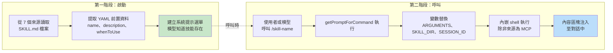
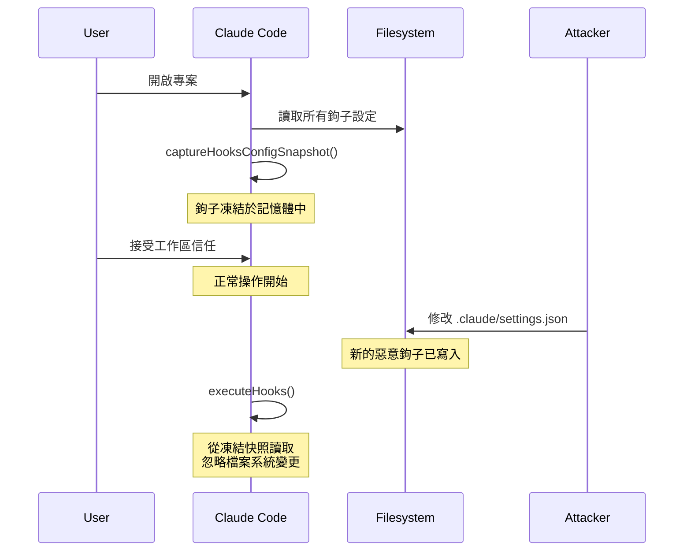
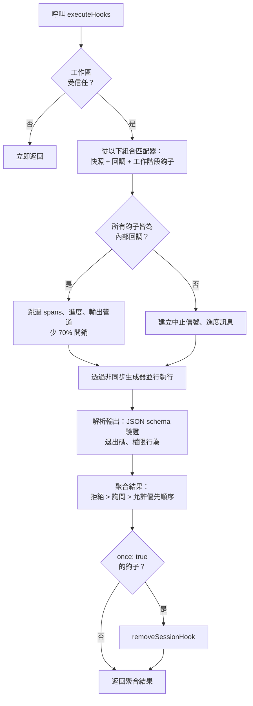

# 第 12 章：可擴展性——技能與鉤子

## 兩個擴展維度

每一套可擴展性系統都必須回答兩個問題：系統能做什麼，以及何時去做。多數框架將這兩者混為一談——外掛在同一個物件中同時註冊能力與生命週期回調，「新增功能」與「攔截功能」之間的界線模糊成一個統一的註冊 API。

Claude Code 將兩者清楚分開。技能（Skills）擴展模型能做什麼。它們是 Markdown 檔案，在呼叫時成為斜線指令，並將新指示注入對話。鉤子（Hooks）擴展事情發生的時機與方式。它們是生命週期攔截器，在一次工作階段中超過二十個不同的節點觸發，執行任意程式碼，可以阻擋動作、修改輸入、強制繼續執行，或靜默觀察。

這種分離並非偶然。技能是內容——它們透過加入提示文字來擴展模型的知識與能力。鉤子是控制流程——它們在不改變模型所知的情況下修改執行路徑。一個技能可以教模型如何執行你團隊的部署流程；一個鉤子可以確保在測試套件通過之前不執行任何部署指令。技能新增能力；鉤子新增限制。

本章深入介紹兩套系統，並探討它們的交集：技能聲明的鉤子，在技能被呼叫時以工作階段範圍的生命週期攔截器形式註冊。

---

## 技能：教模型新技巧

### 兩階段載入

技能系統的核心最佳化在於：前置資料（frontmatter）在啟動時載入，而完整內容只在呼叫時才載入。



**第一階段**讀取每個 `SKILL.md` 檔案，將 YAML 前置資料與 Markdown 主體分開，並提取後設資料。前置資料欄位成為系統提示的一部分，讓模型知道技能的存在。Markdown 主體被捕獲在一個閉包中，但不會被處理。一個擁有 50 個技能的專案只需支付 50 個簡短描述的 token 成本，而非 50 份完整文件的成本。

**第二階段**在模型或使用者呼叫技能時觸發。`getPromptForCommand` 加上基礎目錄，替換變數（`$ARGUMENTS`、`${CLAUDE_SKILL_DIR}`、`${CLAUDE_SESSION_ID}`），並執行內嵌 shell 指令（以 `!` 為反引號前綴）。結果以內容區塊形式注入對話。

### 七個來源與優先順序

技能來自七個不同來源，並行載入後依優先順序合併：

| 優先順序 | 來源 | 位置 | 備註 |
|----------|--------|----------|-------|
| 1 | 受管理（政策） | `<MANAGED_PATH>/.claude/skills/` | 企業控制 |
| 2 | 使用者 | `~/.claude/skills/` | 個人，隨處可用 |
| 3 | 專案 | `.claude/skills/`（向上至家目錄） | 已提交至版本控制 |
| 4 | 額外目錄 | `<add-dir>/.claude/skills/` | 透過 `--add-dir` 旗標 |
| 5 | 舊版指令 | `.claude/commands/` | 向後相容 |
| 6 | 內建 | 編譯至二進位檔 | 功能閘控 |
| 7 | MCP | MCP 伺服器提示 | 遠端，不受信任 |

去重複使用 `realpath` 來解析符號連結和重疊的父目錄。第一個看到的來源勝出。`getFileIdentity` 函數透過 `realpath` 解析至標準路徑，而非依賴 inode 值——因為 inode 值在容器、NFS 掛載和 ExFAT 上並不可靠。

### 前置資料契約

控制技能行為的關鍵前置資料欄位：

| YAML 欄位 | 用途 |
|-----------|---------|
| `name` | 使用者可見的顯示名稱 |
| `description` | 顯示在自動完成與系統提示中 |
| `when_to_use` | 供模型探索的詳細使用情境 |
| `allowed-tools` | 技能可使用的工具 |
| `disable-model-invocation` | 阻擋模型自主使用 |
| `context` | `'fork'` 表示作為子代理執行 |
| `hooks` | 呼叫時註冊的生命週期鉤子 |
| `paths` | 條件啟動的 Glob 模式 |

`context: 'fork'` 選項讓技能作為具備獨立上下文視窗的子代理執行，對於需要大量工作但不應汙染主對話 token 預算的技能而言不可或缺。`disable-model-invocation` 和 `user-invocable` 欄位控制兩個不同的存取路徑——將兩者都設為 true 會讓技能隱形，適用於僅用於鉤子的技能。

### MCP 安全邊界

變數替換之後，內嵌 shell 指令會執行。安全邊界是絕對的：**MCP 技能永遠不會執行內嵌 shell 指令。** MCP 伺服器是外部系統。若允許，一個包含 `` !`rm -rf /` `` 的 MCP 提示將以使用者的完整權限執行。系統將 MCP 技能視為純內容。此信任邊界與第 15 章討論的更廣泛 MCP 安全模型相關。

### 動態探索

技能不僅在啟動時載入。當模型接觸到檔案時，`discoverSkillDirsForPaths` 從每個路徑向上查找 `.claude/skills/` 目錄。帶有 `paths` 前置資料的技能儲存在 `conditionalSkills` 映射中，只有在接觸路徑與其模式匹配時才會啟動。聲明 `paths: "packages/database/**"` 的技能在模型讀取或編輯資料庫檔案之前始終隱形——這是上下文敏感的能力擴展。

---

## 鉤子：控制事情發生的時機

鉤子是 Claude Code 在生命週期節點攔截和修改行為的機制。主要執行引擎超過 4,900 行。系統服務三類使用者：個人開發者（自訂 lint、驗證）、團隊（提交至專案的共享品質關卡）、以及企業（政策管理的合規規則）。

### 真實案例：防止提交至 main

在深入探討機制之前，先來看一個實際的鉤子範例。假設你的團隊希望防止模型直接提交到 `main` 分支。

**步驟 1：settings.json 設定：**

```json
{
  "hooks": {
    "PreToolUse": [
      {
        "matcher": "Bash",
        "hooks": [
          {
            "type": "command",
            "command": "/path/to/check-not-main.sh",
            "if": "Bash(git commit*)"
          }
        ]
      }
    ]
  }
}
```

**步驟 2：Shell 腳本：**

```bash
#!/bin/bash
BRANCH=$(git rev-parse --abbrev-ref HEAD 2>/dev/null)
if [ "$BRANCH" = "main" ]; then
  echo "Cannot commit directly to main. Create a feature branch first." >&2
  exit 2  # Exit 2 = blocking error
fi
exit 0
```

**步驟 3：模型的體驗。** 當模型嘗試在 `main` 分支執行 `git commit` 時，鉤子會在指令執行前觸發。腳本檢查分支，寫入 stderr，並以退出碼 2 結束。模型看到一條系統訊息：「Cannot commit directly to main. Create a feature branch first.」提交從未執行。模型建立分支並在那裡提交。

`if: "Bash(git commit*)"` 條件表示腳本只對 git commit 指令執行——而非每次 Bash 呼叫。退出碼 2 阻擋；退出碼 0 通過；其他任何退出碼產生非阻擋警告。這就是完整的協議。

### 四種使用者可設定的類型

Claude Code 定義了六種鉤子類型——四種使用者可設定，兩種為內部使用。

**指令鉤子（Command hooks）**產生一個 shell 行程。鉤子輸入 JSON 透過管道傳至 stdin；鉤子透過退出碼和 stdout/stderr 回傳結果。這是最主要的類型。

**提示鉤子（Prompt hooks）**發起單次 LLM 呼叫，回傳 `{"ok": true}` 或 `{"ok": false, "reason": "..."}`。這是輕量的 AI 驗證，無需完整代理迴圈。

**代理鉤子（Agent hooks）**執行多輪代理迴圈（最多 50 輪，`dontAsk` 權限，停用思考）。每個鉤子擁有自己的工作階段範圍。這是用於「驗證測試套件通過並覆蓋新功能」的重型機制。

**HTTP 鉤子（HTTP hooks）**將鉤子輸入 POST 至一個 URL。這使遠端政策伺服器和稽核日誌成為可能，而無需產生本地行程。

兩種內部類型是**回調鉤子（callback hooks）**（以程式方式註冊，熱路徑上少 70% 的開銷，透過跳過 span 追蹤的快速路徑實現）和**函數鉤子（function hooks）**（工作階段範圍的 TypeScript 回調，用於代理鉤子中的結構化輸出強制執行）。

### 五個最重要的生命週期事件

鉤子系統在超過二十個生命週期節點觸發。五個在實際使用中佔主導地位：

**PreToolUse**——在每次工具執行前觸發。可以阻擋、修改輸入、自動核准，或注入上下文。權限行為遵循嚴格的優先順序：拒絕 > 詢問 > 允許。這是品質關卡最常見的鉤子點。

**PostToolUse**——在執行成功後觸發。可以注入上下文或完全取代 MCP 工具輸出。適用於工具結果的自動化反饋。

**Stop**——在 Claude 結束其回應前觸發。阻擋鉤子強制繼續執行。這是自動化驗證迴圈的機制：「你真的完成了嗎？」

**SessionStart**——在工作階段開始時觸發。可以設定環境變數、覆蓋第一條使用者訊息，或註冊檔案監控路徑。無法阻擋（鉤子無法阻止工作階段啟動）。

**UserPromptSubmit**——在使用者提交提示時觸發。可以阻擋處理，在模型看到輸入之前實現輸入驗證或內容過濾。

**參考表——其餘事件：**

| 類別 | 事件 |
|----------|--------|
| 工具生命週期 | PostToolUseFailure、PermissionDenied、PermissionRequest |
| 工作階段 | SessionEnd（1.5 秒逾時）、Setup |
| 子代理 | SubagentStart、SubagentStop |
| 壓縮 | PreCompact、PostCompact |
| 通知 | Notification、Elicitation、ElicitationResult |
| 設定 | ConfigChange、InstructionsLoaded、CwdChanged、FileChanged、TaskCreated、TaskCompleted、TeammateIdle |

阻擋的不對稱性是刻意的。代表可恢復決策的事件（工具呼叫、停止條件）支援阻擋。代表不可逆事實的事件（工作階段已啟動、API 失敗）則不支援。

### 退出碼語意

對於指令鉤子，退出碼帶有特定含義：

| 退出碼 | 含義 | 是否阻擋 |
|-----------|---------|--------|
| 0 | 成功，若為 JSON 則解析 stdout | 否 |
| 2 | 阻擋性錯誤，stderr 顯示為系統訊息 | 是 |
| 其他 | 非阻擋警告，僅顯示給使用者 | 否 |

退出碼 2 是刻意選擇的。退出碼 1 太常見——任何未處理的例外、斷言失敗或語法錯誤都會產生退出碼 1。使用退出碼 2 可防止意外強制執行。

### 六個鉤子來源

| 來源 | 信任等級 | 備註 |
|--------|-------------|-------|
| `userSettings` | 使用者 | `~/.claude/settings.json`，最高優先順序 |
| `projectSettings` | 專案 | `.claude/settings.json`，已版本控制 |
| `localSettings` | 本地 | `.claude/settings.local.json`，已加入 gitignore |
| `policySettings` | 企業 | 無法被覆蓋 |
| `pluginHook` | 外掛 | 優先順序 999（最低） |
| `sessionHook` | 工作階段 | 僅記憶體中，由技能註冊 |

---

## 快照安全模型

鉤子執行任意程式碼。一個專案的 `.claude/settings.json` 可以定義在每次工具呼叫前觸發的鉤子。如果一個惡意倉庫在使用者接受工作區信任對話框後修改了其鉤子，會發生什麼事？

什麼都不會發生。鉤子設定在啟動時被凍結。



`captureHooksConfigSnapshot()` 在啟動期間被呼叫一次。從那時起，`executeHooks()` 從快照讀取，永不隱式重新讀取設定檔。快照只能透過明確管道更新：`/hooks` 指令或檔案監控偵測，兩者都透過 `updateHooksConfigSnapshot()` 重建。

政策強制執行的層級：政策設定中的 `disableAllHooks` 清除所有鉤子。`allowManagedHooksOnly` 排除使用者和專案鉤子。使用者可以透過設定 `disableAllHooks` 停用自己的鉤子，但無法停用企業管理的鉤子。政策層永遠勝出。

信任檢查本身（`shouldSkipHookDueToTrust()`）是在兩個漏洞之後引入的：SessionEnd 鉤子在使用者*拒絕*信任對話框時執行，以及 SubagentStop 鉤子在信任呈現之前觸發。兩者都有同樣的根本原因——鉤子在使用者尚未同意執行工作區程式碼的生命週期狀態下觸發。修復方法是在 `executeHooks()` 頂部設置集中式閘道。

---

## 執行流程



內部回調的快速路徑是一項重要最佳化。當所有匹配的鉤子都是內部的（檔案存取分析、提交歸因），系統會跳過 span 追蹤、中止信號建立、進度訊息和完整的輸出處理管道。大多數 PostToolUse 呼叫只觸及內部回調。

鉤子輸入 JSON 透過懶執行的 `getJsonInput()` 閉包序列化一次，並在所有並行鉤子中重複使用。環境注入設定 `CLAUDE_PROJECT_DIR`、`CLAUDE_PLUGIN_ROOT`，以及在特定事件中，設定 `CLAUDE_ENV_FILE`——鉤子可在此寫入環境匯出。

---

## 整合：技能與鉤子的交集

當技能被呼叫時，其前置資料聲明的鉤子以工作階段範圍的鉤子形式註冊。`skillRoot` 成為鉤子 shell 指令的 `CLAUDE_PLUGIN_ROOT`：

```
my-skill/
  SKILL.md          # 技能內容
  validate.sh       # 由前置資料聲明的 PreToolUse 鉤子呼叫
```

技能的前置資料聲明：

```yaml
hooks:
  PreToolUse:
    - matcher: "Bash"
      hooks:
        - type: command
          command: "${CLAUDE_PLUGIN_ROOT}/validate.sh"
          once: true
```

當使用者呼叫 `/my-skill` 時，技能內容載入至對話，同時 PreToolUse 鉤子也完成註冊。下一次 Bash 工具呼叫觸發 `validate.sh`。由於設定了 `once: true`，鉤子在第一次成功執行後自動移除。

對於代理，前置資料中聲明的 `Stop` 鉤子會自動轉換為 `SubagentStop` 鉤子，因為子代理觸發的是 `SubagentStop` 而非 `Stop`。若未進行此轉換，代理的停止驗證鉤子將永遠不會觸發。

### 權限行為優先順序

`executePreToolHooks()` 可以阻擋（透過 `blockingError`）、自動核准（透過 `permissionBehavior: 'allow'`）、強制詢問（透過 `'ask'`）、拒絕（透過 `'deny'`）、修改輸入（透過 `updatedInput`）或新增上下文（透過 `additionalContext`）。當多個鉤子返回不同行為時，拒絕永遠勝出。這是安全相關決策的正確預設值。

### Stop 鉤子：強制繼續

當 Stop 鉤子返回退出碼 2 時，stderr 會作為反饋顯示給模型，並繼續對話。這將單次提示-回應轉變為目標導向的迴圈。Stop 鉤子可以說是整個系統中最強大的整合點。

---

## 應用：設計可擴展性系統

**將內容與控制流程分開。** 技能新增能力；鉤子限制行為。混淆兩者使得無法推斷外掛做什麼與它阻止什麼。

**在信任邊界凍結設定。** 快照機制在同意時刻捕獲鉤子，且不隱式重新讀取。若你的系統執行使用者提供的程式碼，這可以消除 TOCTOU 攻擊。

**使用不常見的退出碼作為語意信號。** 退出碼 1 是雜訊——每個未處理的錯誤都會產生它。將退出碼 2 作為阻擋信號可防止意外強制執行。選擇需要刻意意圖的信號。

**在 socket 層而非應用層驗證。** SSRF 防護在 DNS 查找時運行，而非作為飛行前檢查。這消除了 DNS 重新綁定的時間窗口。驗證網路目的地時，檢查必須與連接是原子性的。

**為常見情況最佳化。** 內部回調快速路徑（少 70% 開銷）認識到大多數鉤子呼叫只觸及內部回調。兩階段技能載入認識到在給定工作階段中，大多數技能從未被呼叫。每個最佳化都針對實際使用分佈。

可擴展性系統反映了對能力與安全之間張力的成熟理解。技能給予模型新能力，以 MCP 安全邊界（第 15 章）為限。鉤子讓外部程式碼影響模型的行動，以快照機制、退出碼語意和政策層級為限。這兩個系統互不信任——而這種相互不信任正是使得組合在大規模部署時安全的原因。

下一章將轉向視覺層：Claude Code 如何以 60fps 渲染響應式終端 UI，以及如何透過五種終端協議處理輸入。
