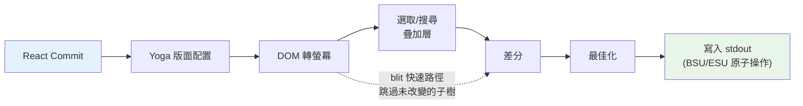
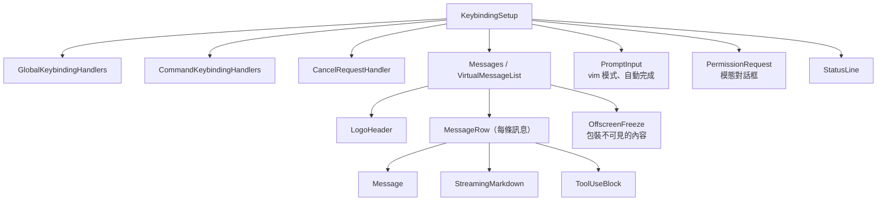

# 第 13 章：終端 UI

## 為什麼要建立自訂渲染器？

終端不是瀏覽器。它沒有 DOM、沒有 CSS 引擎、沒有合成器、沒有保留模式的圖形管道。有的只是流向 stdout 的位元組串流，以及從 stdin 流入的位元組串流。這兩個串流之間的一切——版面配置、樣式、差分（diffing）、點擊測試、捲動、選取——都必須從頭發明。

Claude Code 需要一個響應式 UI：提示輸入、串流 Markdown 輸出、權限對話框、進度指示器、可捲動訊息清單、搜尋高亮，以及 vim 模式編輯器。React 是聲明這類元件樹的顯然選擇，但 React 需要一個宿主環境來渲染，而終端並不提供這個環境。

Ink 是標準答案：一個基於 Yoga flexbox 版面配置的 React 終端渲染器。Claude Code 最初使用 Ink，然後對其進行了大幅度的修改。原版每格、每幀都會分配一個 JavaScript 物件——在 200x120 的終端上，這意味著每 16ms 就會建立並垃圾回收 24,000 個物件。它在字串層級進行差分比較，比較整行 ANSI 編碼文字。它沒有 blit 最佳化的概念，沒有雙緩衝，沒有格層級的髒追蹤。對於每秒刷新一次的簡單 CLI 儀表板而言這沒問題。但對於一個在使用者捲動包含數百條訊息的對話時，以 60fps 串流 token 的 LLM 代理而言，這是不可接受的。

Claude Code 保留的是一個自訂渲染引擎，它與 Ink 在概念上有相同的 DNA——React reconciler、Yoga 版面配置、ANSI 輸出——但重新實現了關鍵路徑：以填充型別陣列取代逐格物件、以基於池的字串駐留取代逐幀字串、雙緩衝渲染與格層級差分，以及一個將相鄰終端寫入合併為最少跳脫序列的最佳化器。

結果是在串流 Claude token 時，在 200 列終端上以 60fps 運行。要理解這是如何實現的，我們需要探討四個層次：React 進行 reconcile 的自訂 DOM、將該 DOM 轉換為終端輸出的渲染管道、在長達數小時工作階段中讓系統不被垃圾回收淹沒的基於池的記憶體管理，以及將一切串聯起來的元件架構。

---

## 自訂 DOM

React 的 reconciler 需要一些東西來 reconcile。在瀏覽器中，那是 DOM。在 Claude Code 的終端中，那是一個具有七種元素類型和一種文字節點類型的自訂記憶體內樹。

元素類型直接對應終端渲染概念：

- **`ink-root`** -- 文件根節點，每個 Ink 實例一個
- **`ink-box`** -- flexbox 容器，終端版的 `<div>`
- **`ink-text`** -- 具有 Yoga measure function 用於換行的文字節點
- **`ink-virtual-text`** -- 另一個文字節點內的巢狀樣式文字（在文字上下文中自動從 `ink-text` 提升）
- **`ink-link`** -- 超連結，透過 OSC 8 跳脫序列渲染
- **`ink-progress`** -- 進度指示器
- **`ink-raw-ansi`** -- 具有已知尺寸的預渲染 ANSI 內容，用於語法高亮的程式碼區塊

每個 `DOMElement` 攜帶渲染管道所需的狀態：

```typescript
// 示意性描述——實際介面在此基礎上有顯著擴展
interface DOMElement {
  yogaNode: YogaNode;           // Flexbox 版面配置節點
  style: Styles;                // 映射至 Yoga 的類 CSS 屬性
  attributes: Map<string, DOMNodeAttribute>;
  childNodes: (DOMElement | TextNode)[];
  dirty: boolean;               // 需要重新渲染
  _eventHandlers: EventHandlerMap; // 與屬性分開儲存
  scrollTop: number;            // 命令式捲動狀態
  pendingScrollDelta: number;
  stickyScroll: boolean;
  debugOwnerChain?: string;     // 用於偵錯的 React 元件堆疊
}
```

將 `_eventHandlers` 與 `attributes` 分開是刻意的。在 React 中，處理器的識別在每次渲染時都會改變（除非手動 memoize）。若將處理器儲存為屬性，每次渲染都會將節點標記為髒並觸發完整重繪。透過分開儲存，reconciler 的 `commitUpdate` 可以更新處理器而不將節點標記為髒。

`markDirty()` 函數是 DOM 變更與渲染管道之間的橋梁。當任何節點的內容改變時，`markDirty()` 向上遍歷每個祖先，對每個元素設定 `dirty = true`，並在葉子文字節點上呼叫 `yogaNode.markDirty()`。這就是深度巢狀文字節點中單個字元的改變如何排程從根到該節點路徑的重新渲染——但僅限於該路徑。兄弟子樹保持乾淨，可以從前一幀進行 blit。

`ink-raw-ansi` 元素類型值得特別說明。當一個程式碼區塊已經語法高亮（產生 ANSI 跳脫序列）後，重新解析這些序列以提取字元和樣式是浪費的。取而代之，預高亮的內容被包裹在一個 `ink-raw-ansi` 節點中，其 `rawWidth` 和 `rawHeight` 屬性告訴 Yoga 確切的尺寸。渲染管道直接將原始 ANSI 內容寫入輸出緩衝區，無需將其分解為個別的樣式字元。這使得語法高亮程式碼區塊在初始高亮處理後幾乎零成本——UI 中最昂貴的視覺元素也是渲染成本最低的。

`ink-text` 節點的 measure function 值得理解，因為它在 Yoga 的版面配置過程中同步且阻塞地執行。該函數接收可用寬度，並必須返回文字的尺寸。它執行換行（遵循 `wrap` 樣式屬性：`wrap`、`truncate`、`truncate-start`、`truncate-middle`）、處理字素叢集邊界（因此不會在多個碼點的表情符號中間分行）、正確測量 CJK 雙寬字元（每個佔 2 列），並從寬度計算中去除 ANSI 跳脫碼（跳脫序列的視覺寬度為零）。所有這些必須在每個節點的微秒內完成，因為一個包含 50 個可見文字節點的對話意味著每次版面配置過程有 50 次 measure function 呼叫。

---

## React Fiber 容器

reconciler 橋接使用 `react-reconciler` 建立自訂宿主設定。這是 React DOM 和 React Native 使用的相同 API。關鍵差異：Claude Code 在 `ConcurrentRoot` 模式下運行。

```typescript
createContainer(rootNode, ConcurrentRoot, ...)
```

ConcurrentRoot 啟用 React 的並發功能——用於延遲載入語法高亮的 Suspense，以及在串流期間非阻塞狀態更新的 transitions。替代方案 `LegacyRoot` 會強制同步渲染，並在大量 Markdown 重新解析時阻塞事件迴圈。

宿主設定方法將 React 操作映射至自訂 DOM：

- **`createInstance(type, props)`** 透過 `createNode()` 建立 `DOMElement`，應用初始樣式和屬性，附加事件處理器，並捕獲 React 元件擁有者鏈以進行偵錯歸因。擁有者鏈儲存為 `debugOwnerChain`，由 `CLAUDE_CODE_DEBUG_REPAINTS` 模式用於將全螢幕重置歸因至特定元件
- **`createTextInstance(text)`** 建立 `TextNode`——但僅當我們處於文字上下文中時。reconciler 強制要求原始字串必須包裹在 `<Text>` 中。嘗試在文字上下文之外建立文字節點會拋出錯誤，在 reconcile 時而非渲染時捕獲一類錯誤
- **`commitUpdate(node, type, oldProps, newProps)`** 透過淺比較對舊新 props 進行差分，然後只應用已改變的部分。樣式、屬性和事件處理器各有自己的更新路徑。若無任何改變，差分函數返回 `undefined`，完全避免不必要的 DOM 變更
- **`removeChild(parent, child)`** 從樹中移除節點，遞迴釋放 Yoga 節點（在 `free()` 之前呼叫 `unsetMeasureFunc()` 以避免存取已釋放的 WASM 記憶體），並通知焦點管理器
- **`hideInstance(node)` / `unhideInstance(node)`** 切換 `isHidden` 並在 `Display.None` 和 `Display.Flex` 之間切換 Yoga 節點。這是 React 的 Suspense 備援轉換機制
- **`resetAfterCommit(container)`** 是關鍵鉤子：它呼叫 `rootNode.onComputeLayout()` 來執行 Yoga，然後呼叫 `rootNode.onRender()` 排程終端繪製

reconciler 在每個 commit 週期追蹤兩個效能計數器：Yoga 版面配置時間（`lastYogaMs`）和總 commit 時間（`lastCommitMs`）。這些流入 Ink 類別報告的 `FrameEvent`，支援生產環境的效能監控。

事件系統鏡像瀏覽器的捕獲/冒泡模型。一個 `Dispatcher` 類別實現完整的事件傳播，包含三個階段：捕獲（根到目標）、目標處，以及冒泡（目標到根）。事件類型映射至 React 排程優先順序——鍵盤和點擊為離散型（最高優先順序，立即處理），捲動和調整大小為連續型（可延遲）。dispatcher 將所有事件處理包裝在 `reconciler.discreteUpdates()` 中以正確批次 React 更新。

在終端中按下一個按鍵時，產生的 `KeyboardEvent` 透過自訂 DOM 樹傳遞，從焦點元素向上冒泡至根，與鍵盤事件在瀏覽器 DOM 元素中冒泡的方式完全相同。路徑上的任何處理器都可以呼叫 `stopPropagation()` 或 `preventDefault()`，其語意與瀏覽器規範相同。

---

## 渲染管道

每一幀穿越七個階段，每個階段都單獨計時：



每個階段都單獨計時，並在 `FrameEvent.phases` 中報告。這種逐階段的監控對於診斷效能問題至關重要：當一幀花費 30ms 時，你需要知道瓶頸是 Yoga 重新測量文字（第 2 階段）、渲染器遍歷大型髒子樹（第 3 階段），還是來自慢速終端的 stdout 背壓（第 7 階段）。答案決定了修復方案。

**第 1 階段：React commit 和 Yoga 版面配置。** reconciler 處理狀態更新並呼叫 `resetAfterCommit`。這將根節點的寬度設定為 `terminalColumns` 並執行 `yogaNode.calculateLayout()`。Yoga 在一次過程中計算整個 flexbox 樹，遵循 CSS flexbox 規範：解析 flex-grow、flex-shrink、padding、margin、gap、對齊和換行。結果——`getComputedWidth()`、`getComputedHeight()`、`getComputedLeft()`、`getComputedTop()`——在每個節點快取。對於 `ink-text` 節點，Yoga 在版面配置期間呼叫自訂 measure function（`measureTextNode`），通過換行和字素測量計算文字尺寸。這是每個節點最昂貴的操作：它必須處理 Unicode 字素叢集、CJK 雙寬字元、表情符號序列，以及嵌入文字內容的 ANSI 跳脫碼。

**第 2 階段：DOM 轉螢幕。** 渲染器深度優先遍歷 DOM 樹，將字元和樣式寫入 `Screen` 緩衝區。每個字元成為一個填充格。輸出是一個完整的幀：終端上的每個格都有定義的字元、樣式和寬度。

**第 3 階段：疊加層。** 文字選取和搜尋高亮就地修改螢幕緩衝區，翻轉匹配格上的樣式 ID。選取應用反向影像以建立熟悉的「高亮文字」外觀。搜尋高亮應用更激進的視覺處理：當前匹配使用反向 + 黃色前景 + 粗體 + 底線，其他匹配僅使用反向。這會汙染緩衝區——透過 `prevFrameContaminated` 旗標追蹤，讓下一幀知道跳過 blit 快速路徑。汙染是刻意的取捨：就地修改緩衝區避免了分配單獨的疊加緩衝區（在 200x120 終端上節省 48KB），代價是清除疊加後的一幀完整損壞。

**第 4 階段：差分。** 新螢幕與前幀螢幕逐格比較。只有已改變的格才產生輸出。比較是每格兩次整數比較（兩個填充的 `Int32` 字），差分遍歷損壞矩形而非整個螢幕。在穩態幀（只有一個指示器在跳動）中，24,000 格中可能只有 3 個格產生補丁。每個補丁是一個包含游標移動序列和 ANSI 編碼格內容的 `{ type: 'stdout', content: string }` 物件。

**第 5 階段：最佳化。** 同一行上的相鄰補丁合併為單一寫入。消除冗餘的游標移動——若補丁 N 在第 10 列結束，補丁 N+1 在第 11 列開始，游標已在正確位置，不需要移動序列。樣式轉換透過 `StylePool.transition()` 快取預先序列化，因此從「粗體紅色」切換到「暗淡綠色」是一次快取字串查找，而非差分和序列化操作。最佳化器通常比樸素的逐格輸出減少 30-50% 的位元組數。

**第 6 階段：寫入。** 最佳化後的補丁序列化為 ANSI 跳脫序列，並在單個 `write()` 呼叫中寫入 stdout，在支援的終端上用同步更新標記（BSU/ESU）包裝。BSU（開始同步更新，`ESC [ ? 2026 h`）告訴終端緩衝所有後續輸出，ESU（`ESC [ ? 2026 l`）告訴它刷新。這在支援此協議的終端上消除了可見的撕裂——整個幀以原子方式出現。

每幀透過 `FrameEvent` 物件報告其時序分解：

```typescript
interface FrameEvent {
  durationMs: number;
  phases: {
    renderer: number;    // DOM 轉螢幕
    diff: number;        // 螢幕比較
    optimize: number;    // 補丁合併
    write: number;       // stdout 寫入
    yoga: number;        // 版面配置計算
  };
  yogaVisited: number;   // 遍歷的節點數
  yogaMeasured: number;  // 執行了 measure() 的節點數
  yogaCacheHits: number; // 有快取版面配置的節點數
  flickers: FlickerEvent[];  // 全重置歸因
}
```

當啟用 `CLAUDE_CODE_DEBUG_REPAINTS` 時，全螢幕重置透過 `findOwnerChainAtRow()` 歸因至其來源 React 元件。這是 React DevTools「高亮更新」的終端等效——它顯示哪個元件導致了整個螢幕重繪，這是渲染管道中最昂貴的事情。

blit 最佳化值得特別關注。當一個節點不是髒的，且其位置自上一幀以來沒有改變（透過節點快取檢查），渲染器直接從 `prevScreen` 複製格到當前螢幕，而不是重新渲染子樹。這使穩態幀非常廉價——在只有一個指示器在跳動的典型幀中，blit 覆蓋 99% 的螢幕，只有指示器的 3-4 個格從頭重新渲染。

blit 在三種條件下停用：

1. **`prevFrameContaminated` 為 true** —— 選取疊加層或搜尋高亮就地修改了前幀的螢幕緩衝區，因此這些格不能作為「正確」的先前狀態信任
2. **移除了絕對定位的節點** —— 絕對定位意味著節點可能在非兄弟格上繪製，這些格需要從實際擁有它們的元素重新渲染
3. **版面配置已移位** —— 任何節點的快取位置與其當前計算位置不同，意味著 blit 會將格複製到錯誤的座標

損壞矩形（`screen.damage`）追蹤渲染期間所有已寫格的邊界框。差分只檢查此矩形內的行，完全跳過完全未改變的區域。在一個串流訊息佔據 120 行終端的第 80-100 行的情況下，差分只檢查 20 行而非 120 行——比較工作減少 6 倍。

---

## 雙緩衝渲染與幀排程

Ink 類別維護兩個幀緩衝區：

```typescript
private frontFrame: Frame;  // 當前顯示在終端上
private backFrame: Frame;   // 正在渲染的幀
```

每個 `Frame` 包含：

- `screen: Screen` —— 格緩衝區（填充的 `Int32Array`）
- `viewport: Size` —— 渲染時的終端尺寸
- `cursor: { x, y, visible }` —— 停放終端游標的位置
- `scrollHint` —— alt-screen 模式的 DECSTBM（捲動區域）最佳化提示
- `scrollDrainPending` —— `ScrollBox` 是否有待處理的捲動增量

每次渲染後，幀交換：`backFrame = frontFrame; frontFrame = newFrame`。舊的前幀成為下一個後幀，為 blit 最佳化提供 `prevScreen`，以及格層級差分的基準。

這種雙緩衝設計消除了分配。渲染器重用後幀的緩衝區，而不是每幀建立新的 `Screen`。交換是一次指標賦值。此模式借鑑自圖形編程，其中雙緩衝透過確保顯示器從完整幀讀取，而渲染器寫入另一個來防止撕裂。在終端上下文中，撕裂不是問題（BSU/ESU 協議處理這個問題）；問題是每 16ms 分配和丟棄包含 48KB+ 型別陣列的 `Screen` 物件所產生的 GC 壓力。

渲染排程使用 lodash `throttle` 在 16ms（大約 60fps），啟用前緣和後緣：

```typescript
const deferredRender = () => queueMicrotask(this.onRender);
this.scheduleRender = throttle(deferredRender, FRAME_INTERVAL_MS, {
  leading: true,
  trailing: true,
});
```

微任務延遲並非偶然。`resetAfterCommit` 在 React 的版面配置效果階段之前執行。若渲染器在此同步執行，它將錯過在 `useLayoutEffect` 中設定的游標聲明。微任務在版面配置效果之後但在同一事件迴圈 tick 內執行——終端看到一個單一、一致的幀。

對於捲動操作，單獨的 `setTimeout` 在 4ms（FRAME_INTERVAL_MS >> 2）提供更快的捲動幀，不干擾節流器。捲動變更完全繞過 React：`ScrollBox.scrollBy()` 直接變更 DOM 節點屬性，呼叫 `markDirty()`，並透過微任務排程渲染。沒有 React 狀態更新，沒有 reconciliation 開銷，不會因單個滾輪事件而重新渲染整個訊息清單。

**調整大小處理**是同步的，不防抖。當終端調整大小時，`handleResize` 立即更新尺寸以保持版面配置一致。對於 alt-screen 模式，它重置幀緩衝區，並將 `ERASE_SCREEN` 推遲到下一個原子 BSU/ESU 繪製區塊，而不是立即寫入。立即寫入清除會讓螢幕在渲染所需的約 80ms 期間保持空白；將其推遲到原子區塊中意味著舊內容在新幀完全就緒之前保持可見。

**Alt-screen 管理**增加了另一層。`AlternateScreen` 元件在掛載時進入 DEC 1049 備用螢幕緩衝區，將高度限制在終端行數。它使用 `useInsertionEffect`——而非 `useLayoutEffect`——確保 `ENTER_ALT_SCREEN` 跳脫序列在第一個渲染幀之前到達終端。使用 `useLayoutEffect` 會太晚：第一幀將渲染到主螢幕緩衝區，在切換之前產生可見的閃爍。`useInsertionEffect` 在版面配置效果和瀏覽器（或終端）繪製之前運行，使轉換無縫。

---

## 基於池的記憶體：為什麼駐留很重要

一個 200 列 x 120 行的終端有 24,000 個格。若每個格是一個具有 `char` 字串、`style` 字串和 `hyperlink` 字串的 JavaScript 物件，那每幀就有 72,000 次字串分配——加上格本身的 24,000 次物件分配。以 60fps 計，每秒有 576 萬次分配。V8 的垃圾回收器可以處理這個，但不可避免地出現暫停，表現為掉幀。GC 暫停通常為 1-5ms，但它們是不可預測的：它們可能在串流 token 更新期間發生，在使用者正在觀察輸出時引起可見的卡頓。

Claude Code 透過填充型別陣列和三個駐留池完全消除了這個問題。結果：格緩衝區的每幀物件分配為零。唯一的分配在池本身（攤銷的，因為大多數字元和樣式在第一幀就被駐留並在之後重複使用）以及差分產生的補丁字串（不可避免的，因為 stdout.write 需要字串或 Buffer 參數）。

**格佈局**每格使用兩個 `Int32` 字，儲存在連續的 `Int32Array` 中：

```
word0: charId        (32 位元，CharPool 的索引)
word1: styleId[31:17] | hyperlinkId[16:2] | width[1:0]
```

在同一緩衝區上的並行 `BigInt64Array` 視圖支援批量操作——清除一行是對 64 位元字的單次 `fill()` 呼叫，而不是將各個欄位歸零。

**CharPool** 將字元字串駐留至整數 ID。它有 ASCII 的快速路徑：一個 128 項的 `Int32Array` 直接將字元代碼映射至池索引，完全避免 `Map` 查找。多位元組字元（表情符號、CJK 表意文字）回退至 `Map<string, number>`。索引 0 始終是空格，索引 1 始終是空字串。

```typescript
export class CharPool {
  private strings: string[] = [' ', '']
  private ascii: Int32Array = initCharAscii()

  intern(char: string): number {
    if (char.length === 1) {
      const code = char.charCodeAt(0)
      if (code < 128) {
        const cached = this.ascii[code]!
        if (cached !== -1) return cached
        const index = this.strings.length
        this.strings.push(char)
        this.ascii[code] = index
        return index
      }
    }
    // 多位元組字元的 Map 回退
    ...
  }
}
```

**StylePool** 將 ANSI 樣式代碼陣列駐留至整數 ID。巧妙之處：每個 ID 的第 0 位編碼樣式是否對空格字元有可見效果（背景色、反向、底線）。僅前景的樣式得到偶數 ID；對空格可見的樣式得到奇數 ID。這讓渲染器以單個位元遮罩檢查跳過不可見的空格——`if (!(styleId & 1) && charId === 0) continue`——無需查找樣式定義。該池還快取任意兩個樣式 ID 之間預序列化的 ANSI 轉換字串，因此從「粗體紅色」轉換至「暗淡綠色」是一次快取字串查找，而非差分和序列化操作。

**HyperlinkPool** 駐留 OSC 8 超連結 URI。索引 0 表示無超連結。

所有三個池在前幀和後幀之間共享。這是一個關鍵的設計決策。因為池是共享的，駐留的 ID 在幀之間有效：blit 最佳化可以直接從 `prevScreen` 複製填充格字到當前螢幕，無需重新駐留。差分可以以整數比較 ID，無需字串查找。若每幀都有自己的池，blit 就需要重新駐留每個複製的格（通過舊 ID 查找字串，然後在新池中駐留它），這將否定 blit 大部分的效能優勢。

池每 5 分鐘定期重置，以防止長時間工作階段中的無限增長。遷移過程將前幀的活躍格重新駐留至新池中。

**CellWidth** 以 2 位元分類處理雙寬字元：

| 值 | 含義 |
|-------|---------|
| 0（Narrow） | 標準單列字元 |
| 1（Wide） | CJK/表情符號頭部格，佔兩列 |
| 2（SpacerTail） | 寬字元的第二列 |
| 3（SpacerHead） | 軟換行延續標記 |

這儲存在 `word1` 的低 2 位，使填充格的寬度檢查幾乎零成本——在常見情況下不需要欄位提取。

每格的額外後設資料存在於並行陣列中，而非填充格內：

- **`noSelect: Uint8Array`** —— 每格旗標，將內容排除在文字選取之外。用於不應出現在複製文字中的 UI 裝飾（邊框、指示器）
- **`softWrap: Int32Array`** —— 每行標記，指示換行延續。當使用者在軟換行行之間選取文字時，選取邏輯知道不在換行點插入換行符
- **`damage: Rectangle`** —— 當前幀中所有已寫格的邊界框。差分只檢查此矩形內的行，完全跳過完全未改變的區域

這些並行陣列避免了擴展填充格格式（這會增加差分內層迴圈中的快取壓力），同時提供選取、複製和最佳化所需的後設資料。

`Screen` 還提供一個接受尺寸和池引用的 `createScreen()` 工廠函數。建立螢幕通過在 `BigInt64Array` 視圖上呼叫 `fill(0n)` 將 `Int32Array` 歸零——一次原生呼叫在微秒內清除整個緩衝區。這在調整大小（需要新幀緩衝區時）和池遷移（舊螢幕的格重新駐留至新池時）期間使用。

---

## REPL 元件

REPL（`REPL.tsx`）大約有 5,000 行。它是程式碼庫中最大的單一元件，這是有充分理由的：它是整個互動體驗的協調者。一切都流經它。

元件大致分為九個部分：

1. **導入**（約 100 行）——引入啟動狀態、指令、歷史記錄、鉤子、元件、按鍵綁定、成本追蹤、通知、群組/團隊支援、語音整合
2. **功能旗標導入**——透過 `feature()` 守衛和 `require()` 條件載入語音整合、主動模式、brief 工具和協調代理
3. **狀態管理**——大量的 `useState` 呼叫，涵蓋訊息、輸入模式、待處理權限、對話框、成本閾值、工作階段狀態、工具狀態和代理狀態
4. **QueryGuard**——管理活躍 API 呼叫的生命週期，防止並行請求相互干擾
5. **訊息處理**——處理查詢迴圈傳入的訊息，正規化排序，管理串流狀態
6. **工具權限流程**——協調工具使用區塊和 PermissionRequest 對話框之間的權限請求
7. **工作階段管理**——恢復、切換、匯出對話
8. **按鍵綁定設置**——連接按鍵綁定提供者：`KeybindingSetup`、`GlobalKeybindingHandlers`、`CommandKeybindingHandlers`
9. **渲染樹**——從以上所有內容組合最終 UI

其渲染樹在全螢幕模式下組合完整介面：



`OffscreenFreeze` 是針對終端渲染的效能最佳化。當一條訊息捲出視口時，其 React 元素被快取，子樹被凍結。這防止了螢幕外訊息中基於計時器的更新（指示器、已過時間計數器）觸發終端重置。若沒有這個，訊息 3 中的旋轉指示器即使使用者正在查看訊息 47 也會導致完整重繪。

元件由 React Compiler 全面編譯。編譯器使用槽陣列插入逐表達式的 memoization，而不是手動使用 `useMemo` 和 `useCallback`：

```typescript
const $ = _c(14);  // 14 個 memoization 槽
let t0;
if ($[0] !== dep1 || $[1] !== dep2) {
  t0 = expensiveComputation(dep1, dep2);
  $[0] = dep1; $[1] = dep2; $[2] = t0;
} else {
  t0 = $[2];
}
```

這個模式出現在程式碼庫的每個元件中。它提供比 `useMemo`（在 hook 層級 memoize）更細的粒度——渲染函數中的個別表達式各有自己的依賴追蹤和快取。對於像 REPL 這樣 5,000 行的元件，這消除了每次渲染中數百個潛在的不必要重新計算。

---

## 選取與搜尋高亮

文字選取和搜尋高亮作為螢幕緩衝區疊加層運作，在主渲染之後、差分之前應用。

**文字選取**僅限 alt-screen。Ink 實例持有一個 `SelectionState`，追蹤錨點和焦點、拖曳模式（字元/單詞/行），以及已捲出螢幕的已捕獲行。當使用者點擊並拖曳時，選取處理器更新這些座標。在 `onRender` 期間，`applySelectionOverlay` 遍歷受影響的行，並使用 `StylePool.withSelectionBg()` 就地修改格樣式 ID，它返回添加了反向影像的新樣式 ID。對螢幕緩衝區的這種直接修改就是 `prevFrameContaminated` 旗標存在的原因——前幀的緩衝區已被疊加層修改，因此下一幀不能信任它進行 blit 最佳化，必須進行完整損壞差分。

滑鼠追蹤使用 SGR 1003 模式，報告帶有列/行座標的點擊、拖曳和移動。`App` 元件實現多次點擊偵測：雙擊選取單詞，三擊選取行。偵測使用 500ms 逾時和 1 格位置容差（滑鼠可以在點擊之間移動一格而不重置多次點擊計數器）。超連結點擊被刻意延遲這個逾時——雙擊連結選取單詞而不是打開瀏覽器，符合使用者對文字編輯器的期望行為。

丟失釋放恢復機制處理使用者在終端內開始拖曳，將滑鼠移到視窗外，然後釋放的情況。終端報告按下和拖曳，但不報告釋放（發生在視窗外）。若沒有恢復，選取將永久卡在拖曳模式。恢復透過偵測無按鍵按下的滑鼠移動事件來工作——若我們處於拖曳狀態並收到無按鍵移動事件，我們推斷按鍵在視窗外釋放並完成選取。

**搜尋高亮**有兩個並行機制。基於掃描的路徑（`applySearchHighlight`）遍歷可見格尋找查詢字串並應用 SGR 反向樣式。基於位置的路徑使用從 `scanElementSubtree()` 預計算的 `MatchPosition[]`，以相對訊息的方式儲存，並以「當前匹配」黃色高亮使用堆疊 ANSI 代碼（反向 + 黃色前景 + 粗體 + 底線）在已知偏移處應用。黃色前景與反向結合成為黃色背景——終端在反向啟用時交換前景/背景色。底線是主題中黃色與現有背景色衝突時的備援可見性標記。

**游標聲明**解決了一個微妙的問題。終端模擬器在物理游標位置渲染 IME（輸入法）預編輯文字。正在組成字元的 CJK 使用者需要游標在文字輸入的插入點，而不是在終端自然停放的螢幕底部。`useDeclaredCursor` 鉤子讓元件聲明每幀後游標應在的位置。Ink 類別從 `nodeCache` 讀取已聲明節點的位置，將其轉換為螢幕座標，並在差分後發出游標移動序列。螢幕閱讀器和放大鏡也追蹤物理游標，因此此機制也為輔助功能帶來好處。

在主螢幕模式中，已聲明的游標位置與 `frame.cursor` 分開追蹤（後者必須留在內容底部以維持 log-update 的相對移動不變量）。在 alt-screen 模式中，問題更簡單：每幀以 `CSI H`（游標首頁）開始，因此已聲明的游標只是在幀結束時發出的絕對位置。

---

## 串流 Markdown

渲染 LLM 輸出是終端 UI 面臨的最艱鉅任務。Token 一次一個地到達，每秒 10-50 個，每個都改變可能包含程式碼區塊、清單、粗體文字和內聯代碼的訊息內容。樸素的做法——在每個 token 上重新解析整個訊息——在大規模下將是災難性的。

Claude Code 使用三種最佳化：

**Token 快取。** 一個模組層級的 LRU 快取（500 項）儲存以內容雜湊為鍵的 `marked.lexer()` 結果。快取在虛擬捲動期間的 React 卸載/重新掛載週期中存活。當使用者捲回到先前可見的訊息時，Markdown token 從快取中提供，而不是重新解析。

**快速路徑偵測。** `hasMarkdownSyntax()` 通過單個正規表達式檢查前 500 個字元中的 Markdown 標記。若找不到語法，它直接構建單段落 token，繞過完整的 GFM 解析器。這在純文字訊息的每次渲染中節省約 3ms——在每秒 60 幀的情況下這很重要。

**延遲語法高亮。** 程式碼區塊高亮通過 React `Suspense` 延遲載入。`MarkdownBody` 元件立即以 `highlight={null}` 作為備援渲染，然後以 cli-highlight 實例異步解析。使用者立即看到代碼（無樣式），然後一兩幀後顏色出現。

串流情況增加了一個複雜性。當模型的 token 到達時，Markdown 內容增量增長。在每個 token 上重新解析整個內容在訊息過程中將是 O(n²)。快速路徑偵測有所幫助——大多數串流內容是純文字段落，完全繞過解析器——但對於包含程式碼區塊和清單的訊息，LRU 快取提供了真正的最佳化。快取鍵是內容雜湊，因此當 10 個 token 到達且只有最後一段改變時，未改變前綴的快取解析結果被重用。Markdown 渲染器只重新解析已改變的尾部。

`StreamingMarkdown` 元件與靜態 `Markdown` 元件不同。它處理內容仍在生成的情況：不完整的代碼柵欄（沒有閉合柵欄的 ` ``` `）、部分粗體標記，以及截斷的清單項。串流變體在解析上更寬容——它不會因未閉合語法而報錯，因為閉合語法尚未到達。當訊息完成串流後，元件轉換至靜態 `Markdown` 渲染器，應用帶有嚴格語法檢查的完整 GFM 解析。

程式碼區塊的語法高亮是渲染管道中每個元素最昂貴的操作。一個 100 行的程式碼區塊用 cli-highlight 高亮可能需要 50-100ms。載入高亮庫本身需要 200-300ms（它捆綁了幾十種語言的語法定義）。兩個成本都隱藏在 React `Suspense` 後面：程式碼區塊立即作為純文字渲染，高亮庫異步載入，當解析時，程式碼區塊帶著顏色重新渲染。使用者立即看到代碼，片刻後看到顏色——比庫載入時的 300ms 空白幀體驗好得多。

---

## 應用：高效渲染串流輸出

終端渲染管道是消除工作的案例研究。三個原則驅動設計：

**駐留一切。** 若你有一個出現在數千個格中的值——樣式、字元、URL——儲存一次並以整數 ID 引用。整數比較是一條 CPU 指令。字串比較是一個迴圈。當你的內層迴圈以 60fps 運行 24,000 次時，整數上的 `===` 和字串上的 `===` 之間的差異是流暢捲動和可見延遲之間的差異。

**在正確的層級進行差分。** 格層級差分聽起來很昂貴——每幀 24,000 次比較。但每格只有兩次整數比較（填充字），而在穩態幀上，差分在檢查第一個格後就從大多數行退出。替代方案——重新渲染整個螢幕並將其寫入 stdout——每幀將產生 100KB+ 的 ANSI 跳脫序列。差分通常產生不到 1KB。

**將熱路徑與 React 分開。** 捲動事件以滑鼠輸入頻率到達（每秒可能數百次）。將每個事件通過 React 的 reconciler 路由——狀態更新、reconciliation、commit、版面配置、渲染——每個事件增加 5-10ms 的延遲。通過直接變更 DOM 節點並透過微任務排程渲染，捲動路徑保持在 1ms 以下。React 只在最終繪製時參與，無論如何都會運行。

這些原則適用於任何串流輸出系統，不只是終端。若你正在建立一個渲染實時數據的 Web 應用——日誌查看器、聊天客戶端、監控儀表板——同樣的取捨適用。駐留重複值。與上一幀差分。讓熱路徑遠離你的響應式框架。

第四個原則，特定於長時間運行的工作階段：**定期清理。** Claude Code 的池隨著新字元和樣式的駐留而單調增長。在多小時的工作階段中，池可能累積數千個不再被任何活躍格引用的項目。5 分鐘重置週期限制了這種增長：每 5 分鐘，建立新池，前幀的格被遷移（重新駐留到新池中），舊池成為垃圾。這是一種代際回收策略，在應用層面應用，因為 JavaScript GC 對池項目的語意活躍性沒有可見性。

使用 `Int32Array` 而非普通物件還有一個更微妙的好處，超越 GC 壓力：記憶體局部性。當差分比較 24,000 個格時，它遍歷連續的型別陣列。現代 CPU 預取順序記憶體存取，因此整個螢幕比較在 L1/L2 快取內運行。逐物件格佈局會將格分散在堆中，使每次比較都成為快取未命中。效能差異是可測量的：在 200x120 螢幕上，型別陣列差分在 0.5ms 以下完成，而等效的基於物件的差分需要 3-5ms——與其他管道階段結合時足以超出 16ms 的幀預算。

第五個原則適用於渲染到固定大小網格的任何系統：**追蹤損壞邊界。** 每個螢幕上的 `damage` 矩形記錄渲染期間寫入的格的邊界框。差分查閱此矩形並完全跳過其外的行。當串流訊息佔據 120 行終端的底部 20 行時，差分檢查 20 行而非 120 行。與 blit 最佳化結合（只在損壞矩形中填充重新渲染的區域，而非 blit 的區域），這意味著常見情況——一條訊息在串流，其餘對話靜止——只觸及螢幕緩衝區的一小部分。

更廣泛的教訓：渲染系統的效能不在於讓任何單一操作更快，而在於完全消除操作。blit 消除了重新渲染。損壞矩形消除了差分。池共享消除了重新駐留。填充格消除了分配。每個最佳化移除了一整類工作，它們以乘法方式疊加。

用數字來說：在 200x120 終端上，最壞情況的幀（所有東西都是髒的，沒有 blit，全螢幕損壞）大約需要 12ms。最好情況的幀（一個髒節點，blit 其他一切，3 行損壞矩形）在 1ms 以下。系統大部分時間處於最好情況。串流 token 到達觸發一個髒文字節點，它讓祖先直到訊息容器都變髒，通常佔螢幕的 10-30 行。blit 處理其他 90-110 行。損壞矩形將差分限制在髒區域。池查找是整數操作。串流一個 token 的穩態成本由 Yoga 版面配置（重新測量髒文字節點及其祖先）和 Markdown 重新解析主導——而非渲染管道本身。


---


