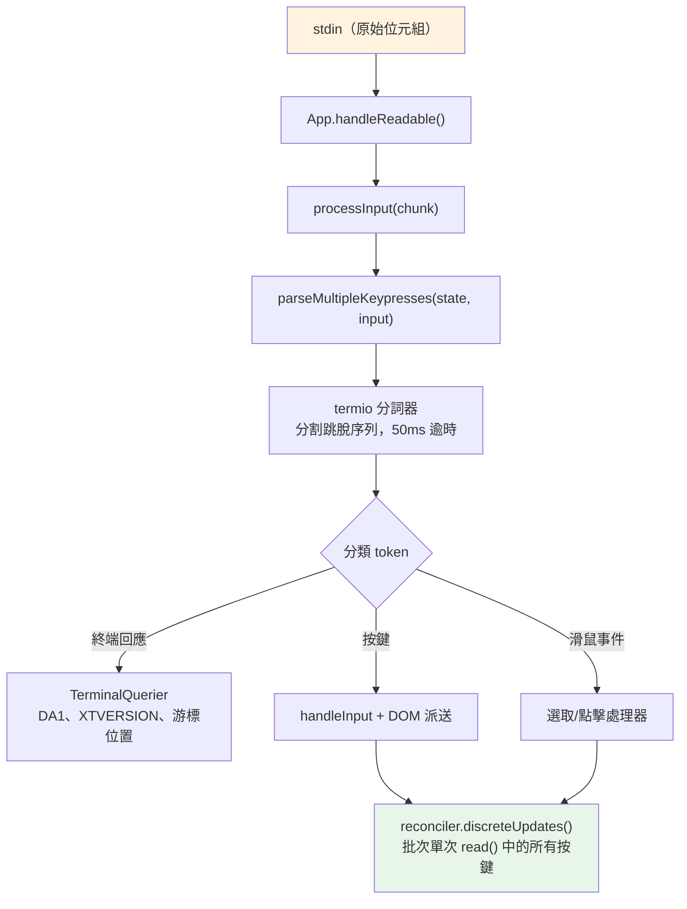
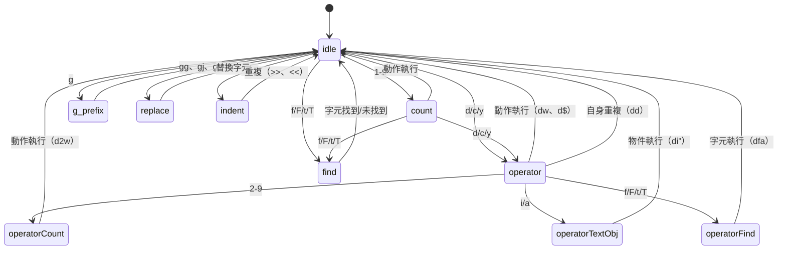

# 第 14 章：輸入與互動

## 原始位元組，有意義的動作

在 Claude Code 中按下 Ctrl+X 再按 Ctrl+K 時，終端會發送兩個位元組序列，之間相隔大約 200 毫秒。第一個是 `0x18`（ASCII CAN）。第二個是 `0x0B`（ASCII VT）。這兩個位元組本身除了「控制字元」之外並無任何固有含義。輸入系統必須識別出這兩個在逾時視窗內依序到達的位元組，構成和弦 `ctrl+x ctrl+k`，映射到動作 `chat:killAgents`，終止所有正在執行的子代理。

從原始位元組到被終止的代理，六個系統被啟動：一個分詞器將跳脫序列分割，一個解析器跨五種終端協議對其分類，一個按鍵綁定解析器將序列與上下文特定的綁定匹配，一個和弦狀態機管理多按鍵序列，一個處理器執行動作，然後 React 將產生的狀態更新批次為單一渲染。

難點不在於這些系統中的任何一個，而在於終端多樣性的組合爆炸。iTerm2 發送 Kitty 鍵盤協議序列。macOS Terminal 發送傳統 VT220 序列。Ghostty 透過 SSH 發送 xterm modifyOtherKeys。tmux 可能會吞噬、轉換或直通這些序列，取決於其設定。Windows Terminal 在 VT 模式下有自己的特殊行為。輸入系統必須從所有這些生成正確的 `ParsedKey` 物件，因為使用者不應該需要知道自己的終端使用哪種鍵盤協議。

本章追蹤從原始位元組到有意義動作在這個複雜環境中的路徑。

設計哲學是漸進式增強與優雅降級。在支援 Kitty 鍵盤協議的現代終端上，Claude Code 獲得完整的修飾鍵偵測（Ctrl+Shift+A 與 Ctrl+A 不同）、super 鍵回報（Cmd 快捷鍵），以及明確的按鍵識別。在透過 SSH 的傳統終端上，它退回至最佳可用協議，失去一些修飾鍵區別，但保持核心功能完整。使用者永遠不會看到關於其終端不被支援的錯誤訊息。他們可能無法使用 `ctrl+shift+f` 進行全域搜尋，但 `ctrl+r` 用於歷史搜尋在任何地方都有效。

---

## 按鍵解析管道

輸入以 stdin 上的位元組塊到達。管道分階段處理它們：



分詞器是基礎。終端輸入是一個位元組串流，混合了可列印字元、控制碼和多位元組跳脫序列，沒有明確的框架。從 stdin 的單次 `read()` 可能返回 `\x1b[1;5A`（Ctrl+向上箭頭），也可能在一次讀取中返回 `\x1b`，在下一次讀取中返回 `[1;5A`，取決於位元組從 PTY 到達的速度。分詞器維護一個狀態機，緩衝部分跳脫序列並發出完整的 token。

不完整序列問題是根本性的。當分詞器看到獨立的 `\x1b` 時，它無法知道這是 Escape 鍵還是 CSI 序列的開始。它緩衝位元組並啟動 50ms 計時器。若沒有後續位元組到達，緩衝區被刷新，`\x1b` 成為一個 Escape 按鍵。但在刷新之前，分詞器檢查 `stdin.readableLength`——若核心緩衝區中有位元組等待，計時器重新武裝而不是刷新。這處理了事件迴圈被阻塞超過 50ms、後續位元組已在緩衝區中但尚未讀取的情況。

對於貼上操作，逾時延長至 500ms。貼上的文字可能很大，可能分多個塊到達。

單次 `read()` 中的所有解析按鍵都在一個 `reconciler.discreteUpdates()` 呼叫中處理。這批次 React 狀態更新，使得貼上 100 個字元只產生一次重新渲染，而非 100 次。批次處理是必不可少的：若沒有它，貼上的每個字元都會觸發一個完整的 reconciliation 週期——狀態更新、reconciliation、commit、Yoga 版面配置、渲染、差分、寫入。每個週期 5ms，100 個字元的貼上將需要 500ms 來處理。有了批次處理，同樣的貼上只需一個 5ms 的週期。

### stdin 管理

`App` 元件透過引用計數管理原始模式。當任何元件需要原始輸入（提示、對話框、vim 模式）時，它呼叫 `setRawMode(true)`，增加計數器。當它不再需要原始輸入時，呼叫 `setRawMode(false)`，減少計數器。原始模式只在計數器達到零時才停用。這防止了終端應用中的一個常見錯誤：元件 A 啟用原始模式，元件 B 啟用原始模式，元件 A 停用原始模式，而突然元件 B 的輸入中斷，因為原始模式被全域停用了。

當原始模式首次啟用時，App：

1. 停止早期輸入捕獲（收集 React 掛載前擊鍵的啟動階段機制）
2. 將 stdin 置於原始模式（無行緩衝、無回顯、無信號處理）
3. 附加 `readable` 監聽器用於異步輸入處理
4. 啟用括號貼上（使貼上的文字可識別）
5. 啟用焦點回報（使應用知道終端視窗何時獲得/失去焦點）
6. 啟用擴展按鍵回報（Kitty 鍵盤協議 + xterm modifyOtherKeys）

停用時，所有這些以相反順序反轉。謹慎的序列防止跳脫序列洩漏——在停用原始模式之前停用擴展按鍵回報，確保終端在應用停止解析後不會繼續發送 Kitty 編碼的序列。

`onExit` 信號處理器（透過 `signal-exit` 套件）確保即使在意外終止時也進行清理。若行程收到 SIGTERM 或 SIGINT，處理器在行程退出前停用原始模式、恢復終端狀態、若啟用了備用螢幕則退出，並重新顯示游標。若沒有這個清理，崩潰的 Claude Code 工作階段將使終端處於原始模式，沒有游標，沒有回顯——使用者需要盲目地輸入 `reset` 來恢復終端。

---

## 多協議支援

終端對於如何編碼鍵盤輸入沒有共識。像 Kitty 這樣的現代終端模擬器發送具有完整修飾鍵資訊的結構化序列。透過 SSH 的傳統終端發送需要上下文解釋的模糊位元組序列。Claude Code 的解析器同時處理五種不同的協議，因為使用者的終端可能是其中任何一種。

**CSI u（Kitty 鍵盤協議）**是現代標準。格式：`ESC [ codepoint [; modifier] u`。範例：`ESC[13;2u` 是 Shift+Enter，`ESC[27u` 是沒有修飾鍵的 Escape。碼點明確識別按鍵——Escape 鍵與 Escape 序列前綴之間沒有歧義。修飾鍵字將 shift、alt、ctrl 和 super（Cmd）編碼為個別位元。Claude Code 在支援的終端上透過啟動時的 `ENABLE_KITTY_KEYBOARD` 跳脫序列啟用此協議，並在退出時透過 `DISABLE_KITTY_KEYBOARD` 停用。協議透過查詢/回應握手偵測：應用發送 `CSI ? u`，終端回應 `CSI ? flags u`，其中 `flags` 指示支援的協議層級。

**xterm modifyOtherKeys** 是 Ghostty 透過 SSH 等終端（Kitty 協議未協商時）的備援。格式：`ESC [ 27 ; modifier ; keycode ~`。注意參數順序與 CSI u 相反——修飾鍵在 keycode 之前，然後是 keycode。這是解析器錯誤的常見來源。協議透過 `CSI > 4 ; 2 m` 啟用，由 Ghostty、tmux 和 xterm 在終端的 TERM 識別未被偵測時（SSH 中常見，因為 `TERM_PROGRAM` 不被轉發）發出。

**傳統終端序列**涵蓋其他所有：通過 `ESC O` 和 `ESC [` 序列的功能鍵、方向鍵、數字鍵盤、Home/End/Insert/Delete，以及 40 年終端演進積累的 VT100/VT220/xterm 變體大全。解析器使用兩個正規表達式來匹配這些：用於 `ESC O/N/[/[[` 前綴模式的 `FN_KEY_RE`（匹配功能鍵、方向鍵及其修飾變體），以及用於 meta 鍵碼的 `META_KEY_CODE_RE`（`ESC` 後跟單個字母數字，傳統的 Alt+鍵編碼）。

傳統序列的挑戰是歧義性。`ESC [ 1 ; 2 R` 可能是 Shift+F3 或游標位置報告，取決於上下文。解析器通過私有標記檢查解決這個問題：游標位置報告使用 `CSI ? row ; col R`（帶有 `?` 私有標記），而修飾功能鍵使用 `CSI params R`（沒有它）。這種消歧是 Claude Code 請求 DECXCPR（擴展游標位置報告）而非標準 CPR 的原因——擴展形式是明確的。

終端識別增加了另一層複雜性。在啟動時，Claude Code 發送 `XTVERSION` 查詢（`CSI > 0 q`）來探索終端的名稱和版本。回應（`DCS > | name ST`）在 SSH 連接中存活——不像 `TERM_PROGRAM`，它是一個不透過 SSH 傳播的環境變數。知道終端身份允許解析器處理終端特定的特殊行為。例如，xterm.js（VS Code 整合終端使用的）與原生 xterm 的跳脫序列行為不同，識別字串（`xterm.js(X.Y.Z)`）允許解析器處理這些差異。

**SGR 滑鼠事件**使用格式 `ESC [ < button ; col ; row M/m`，其中 `M` 是按下，`m` 是釋放。按鈕碼編碼動作：0/1/2 對應左/中/右點擊，64/65 對應滾輪向上/向下（0x40 與滾輪位 OR），32+ 對應拖曳（0x20 與移動位 OR）。滾輪事件被轉換為 `ParsedKey` 物件，以便流經按鍵綁定系統；點擊和拖曳事件成為路由到選取處理器的 `ParsedMouse` 物件。

**括號貼上**將貼上內容包裹在 `ESC [200~` 和 `ESC [201~` 標記之間。標記之間的所有內容成為帶有 `isPasted: true` 的單個 `ParsedKey`，無論貼上的文字可能包含什麼跳脫序列。這防止貼上的代碼被解釋為指令——當使用者貼上包含 `\x03`（作為原始位元組的 Ctrl+C）的代碼片段時，這是一個關鍵的安全功能。

解析器的輸出類型形成一個乾淨的可辨識聯合：

```typescript
type ParsedKey = {
  kind: 'key';
  name: string;        // 'return'、'escape'、'a'、'f1' 等
  ctrl: boolean; meta: boolean; shift: boolean;
  option: boolean; super: boolean;
  sequence: string;    // 用於偵錯的原始跳脫序列
  isPasted: boolean;   // 在括號貼上內
}

type ParsedMouse = {
  kind: 'mouse';
  button: number;      // SGR 按鈕碼
  action: 'press' | 'release';
  col: number; row: number;  // 1 為基準的終端座標
}

type ParsedResponse = {
  kind: 'response';
  response: TerminalResponse;  // 路由到 TerminalQuerier
}
```

`kind` 判別子確保下游代碼明確處理每種輸入類型。一個按鍵不可能被意外處理為滑鼠事件；一個終端回應不可能被意外解釋為按鍵。`ParsedKey` 類型還攜帶原始 `sequence` 字串用於偵錯——當使用者回報「按 Ctrl+Shift+A 沒有反應」時，偵錯日誌可以顯示終端發送的確切位元組序列，使診斷問題是在終端的編碼、解析器的識別還是按鍵綁定的設定成為可能。

`ParsedKey` 上的 `isPasted` 旗標對於安全性至關重要。啟用括號貼上時，終端將貼上內容包裹在標記序列中。解析器在產生的按鍵事件上設定 `isPasted: true`，按鍵綁定解析器跳過貼上按鍵的按鍵綁定匹配。若沒有這個，貼上包含 `\x03`（作為原始位元組的 Ctrl+C）或跳脫序列的文字將觸發應用指令。有了它，貼上的內容無論其位元組內容如何都被視為字面文字輸入。

解析器也識別終端回應——終端本身回應查詢發送的序列。這些包括設備屬性（DA1、DA2）、游標位置報告、Kitty 鍵盤旗標回應、XTVERSION（終端識別）和 DECRPM（模式狀態）。這些被路由到 `TerminalQuerier` 而非輸入處理器：

```typescript
type TerminalResponse =
  | { type: 'decrpm'; mode: number; status: number }
  | { type: 'da1'; params: number[] }
  | { type: 'da2'; params: number[] }
  | { type: 'kittyKeyboard'; flags: number }
  | { type: 'cursorPosition'; row: number; col: number }
  | { type: 'osc'; code: number; data: string }
  | { type: 'xtversion'; version: string }
```

**修飾鍵解碼**遵循 XTerm 慣例：修飾鍵字是 `1 + (shift ? 1 : 0) + (alt ? 2 : 0) + (ctrl ? 4 : 0) + (super ? 8 : 0)`。`ParsedKey` 中的 `meta` 欄位映射到 Alt/Option（位元 2）。`super` 欄位是不同的（位元 8，macOS 上的 Cmd）。這種區別很重要，因為 Cmd 快捷鍵被 OS 保留，無法被終端應用捕獲——除非終端使用 Kitty 協議，它回報其他協議靜默吞噬的 super 修飾按鍵。

stdin 間隙偵測器在 5 秒無輸入後觸發終端模式重新斷言。這處理 tmux 重新附加和筆記型電腦喚醒場景，其中終端的鍵盤模式可能已被多路器或 OS 重置。重新斷言觸發時，它重新發送 `ENABLE_KITTY_KEYBOARD`、`ENABLE_MODIFY_OTHER_KEYS`、括號貼上和焦點回報序列。若沒有這個，從 tmux 工作階段分離並重新附加將靜默地將鍵盤協議降級至傳統模式，在工作階段的剩餘時間破壞修飾鍵偵測。

### 終端 I/O 層

解析器下方是 `ink/termio/` 中的結構化終端 I/O 子系統：

- **csi.ts** —— CSI（控制序列引導符）序列：游標移動、清除、捲動區域、括號貼上啟用/停用、焦點事件啟用/停用、Kitty 鍵盤協議啟用/停用
- **dec.ts** —— DEC 私有模式序列：備用螢幕緩衝區（1049）、滑鼠追蹤模式（1000/1002/1003）、游標可見性、括號貼上（2004）、焦點事件（1004）
- **osc.ts** —— 作業系統指令：剪貼簿存取（OSC 52）、索引標籤狀態、iTerm2 進度指示器、tmux/screen 多路器包裝（需要穿越多路器邊界的序列的 DCS 直通）
- **sgr.ts** —— 選擇圖形呈現：ANSI 樣式代碼系統（顏色、粗體、斜體、底線、反向）
- **tokenize.ts** —— 用於跳脫序列邊界偵測的有狀態分詞器

多路器包裝值得一提。當 Claude Code 在 tmux 內運行時，某些跳脫序列（如 Kitty 鍵盤協議協商）必須傳遞到外部終端。tmux 使用 DCS 直通（`ESC P ... ST`）轉發它不理解的序列。`osc.ts` 中的 `wrapForMultiplexer` 函數偵測多路器環境並適當地包裝序列。若沒有這個，Kitty 鍵盤模式在 tmux 內會靜默失敗，使用者永遠不知道為什麼他們的 Ctrl+Shift 綁定停止工作。

### 事件系統

`ink/events/` 目錄實現了一個與瀏覽器相容的事件系統，具有七種事件類型：`KeyboardEvent`、`ClickEvent`、`FocusEvent`、`InputEvent`、`TerminalFocusEvent` 和基礎 `TerminalEvent`。每個攜帶 `target`、`currentTarget`、`eventPhase`，並支援 `stopPropagation()`、`stopImmediatePropagation()` 和 `preventDefault()`。

包裝 `ParsedKey` 的 `InputEvent` 存在是為了與傳統 `EventEmitter` 路徑向後相容，舊的元件可能仍在使用。新元件使用帶有捕獲/冒泡階段的 DOM 風格鍵盤事件派送。兩個路徑都從同一個解析按鍵觸發，因此它們始終一致——在 stdin 上到達的按鍵產生一個 `ParsedKey`，它衍生出一個 `InputEvent`（用於傳統監聽器）和一個 `KeyboardEvent`（用於 DOM 風格派送）。這種雙路徑設計允許從 EventEmitter 模式逐步遷移到 DOM 事件模式，而不破壞現有元件。

---

## 按鍵綁定系統

按鍵綁定系統分離了三個經常混在一起的關注點：什麼按鍵觸發什麼動作（綁定）、動作觸發時發生什麼（處理器），以及哪些綁定現在是活躍的（上下文）。

### 綁定：聲明式設定

預設綁定在 `defaultBindings.ts` 中定義為 `KeybindingBlock` 物件陣列，每個都限定在一個上下文中：

```typescript
export const DEFAULT_BINDINGS: KeybindingBlock[] = [
  {
    context: 'Global',
    bindings: {
      'ctrl+c': 'app:interrupt',
      'ctrl+d': 'app:exit',
      'ctrl+l': 'app:redraw',
      'ctrl+r': 'history:search',
    },
  },
  {
    context: 'Chat',
    bindings: {
      'escape': 'chat:cancel',
      'ctrl+x ctrl+k': 'chat:killAgents',
      'enter': 'chat:submit',
      'up': 'history:previous',
      'ctrl+x ctrl+e': 'chat:externalEditor',
    },
  },
  // ... 還有 14 個上下文
]
```

平台特定的綁定在定義時處理。圖片貼上在 macOS/Linux 上是 `ctrl+v`，但在 Windows 上是 `alt+v`（因為 `ctrl+v` 是系統貼上）。模式循環在支援 VT 模式的終端上是 `shift+tab`，在沒有 VT 模式的 Windows Terminal 上是 `meta+m`。功能旗標綁定（快速搜尋、語音模式、終端面板）被有條件地包含。

使用者可以透過 `~/.claude/keybindings.json` 覆蓋任何綁定。解析器接受修飾鍵別名（`ctrl`/`control`、`alt`/`opt`/`option`、`cmd`/`command`/`super`/`win`）、按鍵別名（`esc` -> `escape`、`return` -> `enter`）、和弦記法（用空格分隔的步驟，如 `ctrl+k ctrl+s`），以及用於解除綁定預設按鍵的 null 動作。null 動作與未定義綁定不同——它明確阻止預設綁定觸發，這對於想要為其終端用途回收一個按鍵的使用者而言很重要。

### 上下文：16 個活動範圍

每個上下文代表一種互動模式，其中一組特定的綁定適用：

| 上下文 | 何時活躍 |
|---------|------------|
| Global | 始終 |
| Chat | 提示輸入已聚焦 |
| Autocomplete | 完成選單可見 |
| Confirmation | 權限對話框顯示中 |
| Scroll | 具有可捲動內容的 alt-screen |
| Transcript | 唯讀抄本查看器 |
| HistorySearch | 反向歷史搜尋（ctrl+r） |
| Task | 後台任務正在執行 |
| Help | 幫助疊加層顯示中 |
| MessageSelector | 回溯對話框 |
| MessageActions | 訊息游標導覽 |
| DiffDialog | 差異查看器 |
| Select | 通用選取清單 |
| Settings | 設定面板 |
| Tabs | 索引標籤導覽 |
| Footer | 頁尾指示器 |

當按鍵到達時，解析器從當前活躍上下文（由 React 元件狀態決定）建立上下文清單，去重複同時保持優先順序，並搜尋匹配的綁定。最後一個匹配的綁定勝出——這就是使用者覆蓋優先於預設值的方式。上下文清單在每次擊鍵時重建（它很廉價：最多 16 個字串的陣列連接和去重複），因此上下文更改立即生效，無需任何訂閱或監聽器機制。

上下文設計處理了一個棘手的互動模式：巢狀模態。當在執行任務期間出現權限對話框時，`Confirmation` 和 `Task` 上下文可能都是活躍的。`Confirmation` 上下文優先（它在元件樹中稍後註冊），因此 `y` 觸發「核准」而不是任何任務層級的綁定。當對話框關閉時，`Confirmation` 上下文停用，`Task` 綁定恢復。這種堆疊行為自然地從上下文清單的優先順序排序中浮現——不需要特殊的模態處理代碼。

### 保留快捷鍵

並非所有東西都可以重新綁定。系統強制執行三個保留層級：

**不可重新綁定**（硬編碼行為）：`ctrl+c`（中斷/退出）、`ctrl+d`（退出）、`ctrl+m`（在所有終端中與 Enter 相同——重新綁定它會破壞 Enter）。

**終端保留**（警告）：`ctrl+z`（SIGTSTP）、`ctrl+\`（SIGQUIT）。這些技術上可以綁定，但在大多數設定中終端會在應用看到它們之前攔截它們。

**macOS 保留**（錯誤）：`cmd+c`、`cmd+v`、`cmd+x`、`cmd+q`、`cmd+w`、`cmd+tab`、`cmd+space`。OS 在這些到達終端之前攔截它們。綁定它們會創建一個永遠不會觸發的快捷鍵。

### 解析流程

當按鍵到達時，解析路徑是：

1. 建立上下文清單：元件已註冊的活躍上下文加上 Global，去重複同時保持優先順序
2. 針對合併的綁定表呼叫 `resolveKeyWithChordState(input, key, contexts)`
3. `match` 時：清除任何待處理的和弦，呼叫處理器，在事件上呼叫 `stopImmediatePropagation()`
4. `chord_started` 時：儲存待處理的擊鍵，停止傳播，啟動和弦逾時
5. `chord_cancelled` 時：清除待處理的和弦，讓事件繼續傳遞
6. `unbound` 時：清除和弦——這是明確的解除綁定（使用者將動作設為 `null`），因此傳播被停止但沒有處理器執行
7. `none` 時：繼續傳遞至其他處理器

「最後勝出」的解析策略意味著若預設綁定和使用者綁定都在 `Chat` 上下文中定義了 `ctrl+k`，使用者的綁定優先。這在匹配時通過按定義順序迭代綁定並保留最後一個匹配來評估，而不是在載入時建立覆蓋映射。優勢：上下文特定的覆蓋自然組合。使用者可以在 `Chat` 中覆蓋 `enter` 而不影響 `Confirmation` 中的 `enter`。

---

## 和弦支援

`ctrl+x ctrl+k` 綁定是一個和弦：兩個擊鍵共同形成一個動作。解析器用狀態機管理這個。

當按鍵到達時：

1. 解析器將其附加到任何待處理的和弦前綴
2. 它檢查是否有任何綁定的和弦以這個前綴開始。若是，返回 `chord_started` 並儲存待處理的擊鍵
3. 若完整和弦與綁定完全匹配，返回 `match` 並清除待處理狀態
4. 若和弦前綴不匹配任何東西，返回 `chord_cancelled`

`ChordInterceptor` 元件在和弦等待狀態期間攔截所有輸入。它有 1000ms 逾時——若第二個擊鍵在一秒內沒有到達，和弦被取消，第一個擊鍵被丟棄。`KeybindingContext` 提供 `pendingChordRef` 用於同步存取待處理狀態，避免 React 狀態更新延遲，這可能導致第二個擊鍵在第一個擊鍵的狀態更新完成之前被處理。

和弦設計避免遮蔽 readline 編輯按鍵。若沒有和弦，「終止代理」的按鍵綁定可能是 `ctrl+k`——但那是 readline 的「刪除到行尾」，使用者在終端文字輸入中期望這個。通過使用 `ctrl+x` 作為前綴（匹配 readline 自己的和弦前綴慣例），系統獲得了一個不與單鍵編輯快捷鍵衝突的綁定命名空間。

實現處理了大多數和弦系統遺漏的邊緣情況：當使用者按下 `ctrl+x` 但接著輸入不屬於任何和弦的字元時會發生什麼？若沒有謹慎處理，那個字元將被吞噬——和弦攔截器消耗了輸入，和弦被取消，字元消失了。Claude Code 的 `ChordInterceptor` 在這種情況下返回 `chord_cancelled`，這會導致待處理的輸入被丟棄，但允許不匹配的字元繼續正常輸入處理。字元並未丟失；只有和弦前綴被丟棄。這符合使用者對 Emacs 風格和弦前綴的期望行為。

---

## Vim 模式

### 狀態機

vim 實現是一個具有詳盡型別檢查的純狀態機。型別即文件：

```typescript
export type VimState =
  | { mode: 'INSERT'; insertedText: string }
  | { mode: 'NORMAL'; command: CommandState }

export type CommandState =
  | { type: 'idle' }
  | { type: 'count'; digits: string }
  | { type: 'operator'; op: Operator; count: number }
  | { type: 'operatorCount'; op: Operator; count: number; digits: string }
  | { type: 'operatorFind'; op: Operator; count: number; find: FindType }
  | { type: 'operatorTextObj'; op: Operator; count: number; scope: TextObjScope }
  | { type: 'find'; find: FindType; count: number }
  | { type: 'g'; count: number }
  | { type: 'operatorG'; op: Operator; count: number }
  | { type: 'replace'; count: number }
  | { type: 'indent'; dir: '>' | '<'; count: number }
```

這是一個具有 12 個變體的可辨識聯合。TypeScript 的詳盡性檢查確保每個在 `CommandState.type` 上的 `switch` 語句處理所有 12 個情況。向聯合中添加新狀態會導致每個不完整的 switch 產生編譯錯誤。狀態機不能有死狀態或缺失的轉換——型別系統禁止這樣做。

注意每個狀態如何攜帶下一次轉換所需的確切資料。`operator` 狀態知道哪個運算符（`op`）和之前的計數。`operatorCount` 狀態添加了數字累加器（`digits`）。`operatorTextObj` 狀態添加了範圍（`inner` 或 `around`）。沒有狀態攜帶它不需要的資料。這不只是好品味——它防止了一整類錯誤，即處理器從上一個指令讀取了陳舊資料。若你在 `find` 狀態，你有 `FindType` 和 `count`。你沒有運算符，因為沒有待處理的運算符。型別使不可能的狀態無法表示。

狀態圖說明了故事：



從 `idle`，按下 `d` 進入 `operator` 狀態。從 `operator`，按下 `w` 以 `w` 動作執行 `delete`。再次按下 `d`（`dd`）觸發行刪除。按下 `2` 進入 `operatorCount`，因此 `d2w` 成為「刪除接下來的 2 個單詞」。按下 `i` 進入 `operatorTextObj`，因此 `di"` 成為「刪除引號內的內容」。每個中間狀態攜帶下一次轉換所需的確切上下文——不多不少。

### 作為純函數的轉換

`transition()` 函數根據當前狀態類型派送到 10 個處理器函數之一。每個返回一個 `TransitionResult`：

```typescript
type TransitionResult = {
  next?: CommandState;    // 新狀態（省略 = 保持當前狀態）
  execute?: () => void;   // 副作用（省略 = 尚無動作）
}
```

副作用被返回，而非執行。轉換函數是純的——給定狀態和按鍵，它返回下一個狀態和可選的執行動作的閉包。呼叫者決定何時執行效果。這使狀態機易於測試：輸入狀態和按鍵，在返回的狀態上斷言，忽略閉包。這也意味著轉換函數對編輯器狀態、游標位置或緩衝區內容沒有依賴。這些細節在建立閉包時被捕獲，而不是在轉換時由狀態機消費。

`fromIdle` 處理器是入口點，涵蓋完整的 vim 詞彙：

- **計數前綴**：`1-9` 進入 `count` 狀態，累加數字。`0` 是特殊的——它是「行首」動作，不是計數數字，除非已有數字累積
- **運算符**：`d`、`c`、`y` 進入 `operator` 狀態，等待動作或文字物件定義範圍
- **查找**：`f`、`F`、`t`、`T` 進入 `find` 狀態，等待要搜尋的字元
- **G 前綴**：`g` 進入 `g` 狀態用於複合指令（`gg`、`gj`、`gk`）
- **替換**：`r` 進入 `replace` 狀態，等待替換字元
- **縮排**：`>`、`<` 進入 `indent` 狀態（用於 `>>` 和 `<<`）
- **簡單動作**：`h/j/k/l/w/b/e/W/B/E/0/^/$` 立即執行，移動游標
- **立即指令**：`x`（刪除字元）、`~`（切換大小寫）、`J`（連接行）、`p/P`（貼上）、`D/C/Y`（運算符快捷鍵）、`G`（前往結尾）、`.`（點重複）、`;/,`（查找重複）、`u`（撤銷）、`i/I/a/A/o/O`（進入插入模式）

### 動作、運算符和文字物件

**動作**是將按鍵映射到游標位置的純函數。`resolveMotion(key, cursor, count)` 將動作應用 `count` 次，若游標停止移動則短路（你不能移動超過第 0 列的左邊）。這種短路對於行尾的 `3w` 很重要——它在最後一個單詞停止，而不是換行或報錯。

動作按其與運算符的互動方式分類：

- **獨占**（預設）—— 目的地的字元不包含在範圍中。`dw` 刪除到下一個單詞第一個字元之前，但不包含它
- **包含**（`e`、`E`、`$`）—— 目的地的字元包含在範圍中。`de` 刪除到當前單詞的最後一個字元
- **行式**（`j`、`k`、`G`、`gg`、`gj`、`gk`）—— 與運算符一起使用時，範圍延伸至覆蓋完整行。`dj` 刪除當前行和下面的行，而不只是兩個游標位置之間的字元

**運算符**應用於範圍。`delete` 刪除文字並保存到緩衝區。`change` 刪除文字並進入插入模式。`yank` 複製到緩衝區而不做修改。`cw`/`cW` 特殊情況遵循 vim 慣例：change-word 到當前單詞結尾，而不是下一個單詞的開始（不像 `dw`）。

一個有趣的邊緣情況：`[Image #N]` 晶片捕捉。當單詞動作落在圖片參考晶片內（在終端中渲染為單個視覺單元）時，範圍延伸至覆蓋整個晶片。這防止了使用者認為是原子元素的部分刪除——你不能刪除 `[Image #3]` 的一半，因為動作系統將整個晶片視為一個單詞。

其他指令涵蓋完整的預期 vim 詞彙：`x`（刪除字元）、`r`（替換字元）、`~`（切換大小寫）、`J`（連接行）、`p`/`P`（帶行式/字元式意識的貼上）、`>>`/`<<`（以 2 格停頓縮排/縮出）、`o`/`O`（在下方/上方開新行並進入插入模式）。

**文字物件**在游標周圍尋找邊界。它們回答問題：「游標所在的『東西』是什麼？」

單詞物件（`iw`、`aw`、`iW`、`aW`）將文字分割為字素，將每個分類為詞字元、空白或標點，並將選取擴展到單詞邊界。`i`（inner，內部）變體只選取單詞。`a`（around，周圍）變體包含周圍的空白——優先考慮後置空白，若在行尾則回退到前置空白。大寫變體（`W`、`aW`）將任何非空白序列視為一個單詞，忽略標點邊界。

引號物件（`i"`、`a"`、`i'`、`a'`、`` i` ``、`` a` ``）在當前行上尋找配對的引號。配對按順序匹配（第一和第二引號形成一對，第三和第四形成下一對，依此類推）。若游標在第一和第二引號之間，那就是匹配。`a` 變體包含引號字元；`i` 變體排除它們。

括號物件（`ib`/`i(`、`ab`/`a(`、`i[`/`a[`、`iB`/`i{`/`aB`/`a{`、`i<`/`a<`）從游標向外進行深度追蹤搜尋，維護嵌套計數，直到在深度零找到匹配的配對。這正確處理了嵌套括號——在 `foo((bar))` 中 `d i (` 刪除 `bar`，而不是 `(bar)`。

### 持久狀態和點重複

vim 模式維護一個在指令間存活的 `PersistentState`——讓 vim 感覺像 vim 的「記憶」：

```typescript
interface PersistentState {
  lastChange: RecordedChange;   // 用於點重複
  lastFind: { type: FindType; char: string };  // 用於 ; 和 ,
  register: string;             // 複製緩衝區
  registerIsLinewise: boolean;  // 貼上行為旗標
}
```

每個變更指令將自身記錄為 `RecordedChange`——一個可辨識聯合，涵蓋插入、運算符+動作、運算符+文字物件、運算符+查找、替換、刪除字元、切換大小寫、縮排、開新行和連接。`.` 指令從持久狀態重播 `lastChange`，使用記錄的計數、運算符和動作在當前游標位置重現完全相同的編輯。

查找重複（`;` 和 `,`）使用 `lastFind`。`;` 指令在同一方向重複最後的查找。`,` 指令翻轉方向：`f` 變成 `F`，`t` 變成 `T`，反之亦然。這意味著在 `fa`（查找下一個 'a'）之後，`;` 向前找下一個 'a'，`,` 向後找下一個 'a'——而使用者不需要記住他們搜尋的方向。

緩衝區追蹤複製和刪除的文字。當緩衝區內容以 `\n` 結尾時，它被標記為行式，這改變了貼上行為：`p` 在當前行下方插入（不是在游標後），`P` 在上方插入。這種區別對使用者不可見，但對於 vim 使用者依賴的「刪除一行，在別處貼上」工作流程至關重要。

---

## 虛擬捲動

長時間的 Claude Code 工作階段會產生長對話。一個繁重的偵錯工作階段可能會產生 200+ 條訊息，每條都包含 Markdown、程式碼區塊、工具使用結果和權限記錄。若沒有虛擬化，React 將在記憶體中維護 200+ 個元件子樹，每個都有自己的狀態、效果和 memoization 快取。DOM 樹將包含數千個節點。Yoga 版面配置將在每幀訪問所有這些節點。終端將無法使用。

`VirtualMessageList` 元件通過只渲染視口中可見的訊息加上上下方的小緩衝區來解決這個問題。在包含數百條訊息的對話中，這是在掛載 500 個 React 子樹（每個都有 Markdown 解析、語法高亮和工具使用區塊）和掛載 15 個之間的差異。

元件維護：

- 每條訊息的**高度快取**，當終端列數改變時失效
- 抄本搜尋導覽的**跳轉控制代碼**（跳至索引、下一個/上一個匹配）
- 具有熱快取支援的**搜尋文字提取**（當使用者進入 `/` 時預先小寫所有訊息）
- **黏性提示追蹤**——當使用者從輸入捲走時，他們的最後提示文字在頂部作為上下文顯示
- **訊息動作導覽**——用於回溯功能的基於游標的訊息選取

`useVirtualScroll` 鉤子根據 `scrollTop`、`viewportHeight` 和累積訊息高度計算要掛載哪些訊息。它在 `ScrollBox` 上維護捲動夾緊邊界，以防止突發的 `scrollTo` 呼叫在 React 異步重新渲染之前超前時出現空白螢幕——這是虛擬化清單的一個典型問題，其中捲動位置可能超過 DOM 更新。

虛擬捲動與 Markdown token 快取之間的互動值得注意。當訊息捲出視口時，其 React 子樹卸載。當使用者向後捲動時，子樹重新掛載。若沒有快取，這將意味著為使用者捲過的每條訊息重新解析 Markdown。模組層級的 LRU 快取（500 項，以內容雜湊為鍵）確保昂貴的 `marked.lexer()` 呼叫對於每個唯一訊息內容最多發生一次，無論元件掛載和卸載多少次。

`ScrollBox` 元件本身透過 `useImperativeHandle` 提供命令式 API：

- `scrollTo(y)` —— 絕對捲動，打破黏性捲動模式
- `scrollBy(dy)` —— 累積至 `pendingScrollDelta`，以限速方式由渲染器排空
- `scrollToElement(el, offset)` —— 通過 `scrollAnchor` 將位置讀取推遲到渲染時
- `scrollToBottom()` —— 重新啟用黏性捲動模式
- `setClampBounds(min, max)` —— 限制虛擬捲動視窗

所有捲動變更直接修改 DOM 節點屬性，並透過微任務排程渲染，完全繞過 React 的 reconciler。`markScrollActivity()` 呼叫通知後台間隔（指示器、計時器）跳過下一次滴答，減少活躍捲動期間的事件迴圈競爭。這是一種協作排程模式：捲動路徑告訴後台工作「我正在進行延遲敏感的操作，請讓路。」後台間隔在排程下一次滴答之前檢查此旗標，若捲動活躍則延遲一幀。結果是即使多個指示器和計時器在後台執行，捲動也保持一致的流暢性。

---

## 應用：建立上下文感知的按鍵綁定系統

Claude Code 的按鍵綁定架構提供了任何具有模態輸入的應用的範本——編輯器、IDE、繪圖工具、終端多路器。關鍵洞見：

**將綁定與處理器分開。** 綁定是資料（哪個按鍵映射到哪個動作名稱）。處理器是代碼（動作觸發時發生什麼）。將它們分開意味著綁定可以序列化為 JSON 用於使用者自訂，而處理器保留在擁有相關狀態的元件中。使用者可以重新綁定 `ctrl+k` 為 `chat:submit` 而無需觸及任何元件代碼。

**上下文作為一等概念。** 不是一個扁平的按鍵映射，而是定義根據應用狀態啟動和停用的上下文。當對話框開啟時，`Confirmation` 上下文啟動，其綁定優先於 `Chat` 綁定。當對話框關閉時，`Chat` 綁定恢復。這消除了散布在事件處理器中的 `if (dialogOpen && key === 'y')` 條件湯。

**和弦狀態作為顯式機器。** 多按鍵序列（和弦）不是單按鍵綁定的特殊情況——它們是一種不同類型的綁定，需要帶有逾時和取消語意的狀態機。使這個顯式（帶有專用的 `ChordInterceptor` 元件和 `pendingChordRef`）防止微妙的錯誤，即和弦的第二個擊鍵被不同的處理器消費，因為 React 的狀態更新尚未傳播。

**早期保留，清晰警告。** 在定義時識別不能重新綁定的按鍵（系統快捷鍵、終端控制字元），而非在解析時。當使用者嘗試綁定 `ctrl+c` 時，在設定載入期間顯示錯誤，而不是靜默接受一個永遠不會觸發的綁定。這是一個有效的按鍵綁定系統與產生神秘錯誤報告的系統之間的差異。

**為終端多樣性設計。** Claude Code 的按鍵綁定系統在綁定層級而非處理器層級定義平台特定的替代方案。圖片貼上取決於 OS 是 `ctrl+v` 或 `alt+v`。模式循環取決於 VT 模式支援是 `shift+tab` 或 `meta+m`。每個動作的處理器無論哪個按鍵觸發它都是相同的。這意味著測試每個動作涵蓋一個代碼路徑，而不是每個平台-按鍵組合一個。當新的終端特殊行為出現時（例如，Node 24.2.0 之前 Windows Terminal 缺少 VT 模式），修復是綁定定義中的一個條件，而不是處理器代碼中散布的 `if (platform === 'windows')` 檢查。

**提供逃生出口。** null 動作解除綁定機制很小但很重要。在終端多路器內執行 Claude Code 的使用者可能會發現 `ctrl+t`（切換待辦事項）與其多路器的索引標籤切換快捷鍵衝突。通過在其 keybindings.json 中添加 `{ "ctrl+t": null }`，他們完全停用該綁定。按鍵傳遞到多路器。若沒有 null 解除綁定，使用者唯一的選項是將 `ctrl+t` 重新綁定到他們不想要的其他動作，或重新設定其多路器——這兩種都不是好的體驗。

vim 模式實現增加了另一個教訓：**讓型別系統強制執行你的狀態機**。12 個變體的 `CommandState` 聯合使得在 switch 語句中忘記一個狀態成為不可能。`TransitionResult` 型別將狀態變更與副作用分開，使機器可作為純函數測試。若你的應用有模態輸入，將模式表示為可辨識聯合，讓編譯器驗證詳盡性。花在定義型別上的時間在消除執行時錯誤方面物有所值。

考慮替代方案：使用可變狀態和命令式條件的 vim 實現。`fromOperator` 處理器將是一堆 `if (mode === 'operator' && pendingCount !== null && isDigit(key))` 檢查，每個分支都變更共享變數。添加新狀態（比如，宏記錄模式）需要審計每個分支以確保新狀態被處理。有了可辨識聯合，編譯器做審計——添加新變體的 PR 在每個 switch 語句處理它之前不會構建。

這是 Claude Code 輸入系統的更深層教訓：在每一層——分詞器、解析器、按鍵綁定解析器、vim 狀態機——架構盡早將非結構化輸入轉換為型別化、詳盡處理的結構。原始位元組在解析器邊界成為 `ParsedKey`。`ParsedKey` 在按鍵綁定邊界成為動作名稱。動作名稱在元件邊界成為型別化處理器。每次轉換縮小了可能狀態的空間，每次縮小都由 TypeScript 的型別系統強制執行。當擊鍵到達應用邏輯時，歧義消失了。沒有「如果按鍵未定義怎麼辦？」也沒有「如果修飾鍵組合不可能怎麼辦？」型別已經禁止這些狀態存在。

兩章合在一起講述一個故事。第 13 章展示了渲染系統如何消除不必要的工作——blit 未改變的區域、駐留重複值、在格層級差分、追蹤損壞邊界。第 14 章展示了輸入系統如何消除歧義——將五種協議解析為一種型別、根據上下文綁定解析按鍵、將模態狀態表示為詳盡的聯合。渲染系統回答「如何每秒 60 次繪製 24,000 個格？」輸入系統回答「如何在零散的生態系統中將位元組串流轉換為有意義的動作？」兩個答案遵循相同的原則：將複雜性推向邊界，在那裡它可以被一次且正確地處理，使下游的一切都在乾淨、型別化、有良好邊界的資料上操作。終端是混沌。應用是秩序。邊界代碼做了將一者轉換為另一者的艱難工作。

---

## 總結：兩個系統，一種設計哲學

第 13 章和第 14 章涵蓋了終端介面的兩半：輸出和輸入。儘管關注點不同，兩個系統都遵循相同的架構原則。

**駐留和間接引用。** 渲染系統將字元、樣式和超連結駐留到池中，在整個熱路徑中以整數比較替代字串比較。輸入系統在解析器邊界將跳脫序列駐留到結構化的 `ParsedKey` 物件中，在整個處理器路徑中以型別化欄位存取替代位元組層級的模式匹配。

**分層消除工作。** 渲染系統堆疊五個最佳化（髒旗標、blit、損壞矩形、格層級差分、補丁最佳化），每個消除一類不必要的計算。輸入系統堆疊三個（分詞器、協議解析器、按鍵綁定解析器），每個消除一類歧義。

**純函數和型別化狀態機。** vim 模式是具有型別化轉換的純狀態機。按鍵綁定解析器是從（按鍵、上下文、和弦狀態）到解析結果的純函數。渲染管道是從（DOM 樹、上一個螢幕）到（新螢幕、補丁）的純函數。副作用發生在邊界——寫入 stdout、派送到 React——而非在核心邏輯中。

**跨環境的優雅降級。** 渲染系統適應終端大小、alt-screen 支援和同步更新協議的可用性。輸入系統適應 Kitty 鍵盤協議、xterm modifyOtherKeys、傳統 VT 序列和多路器直通需求。這兩個系統都不需要特定的終端才能運作；兩者在更有能力的終端上都能更好地工作。

這些原則不是終端應用特有的。它們適用於任何必須在各種執行時環境中處理高頻輸入並產生低延遲輸出的系統。終端只是一個約束足夠尖銳的環境，違反這些原則會產生立即可見的退化——掉幀、被吞噬的擊鍵、閃爍。這種尖銳性使它成為一個出色的老師。

下一章從 UI 層轉移到協議層：Claude Code 如何實現 MCP——讓任何外部服務成為一等工具的通用工具協議。終端 UI 處理使用者體驗的最後一哩路——將資料結構轉換為螢幕上的像素，將擊鍵轉換為應用動作。MCP 處理可擴展性的第一哩路——探索、連接和執行存在於代理自身程式碼庫之外的工具。在它們之間，記憶體系統（第 11 章）和技能/鉤子系統（第 12 章）定義了智能和控制層。整個系統的品質上限依賴於所有四者：再多的模型智能也無法補償滯後的 UI，再多的渲染效能也無法補償無法到達所需工具的模型。
