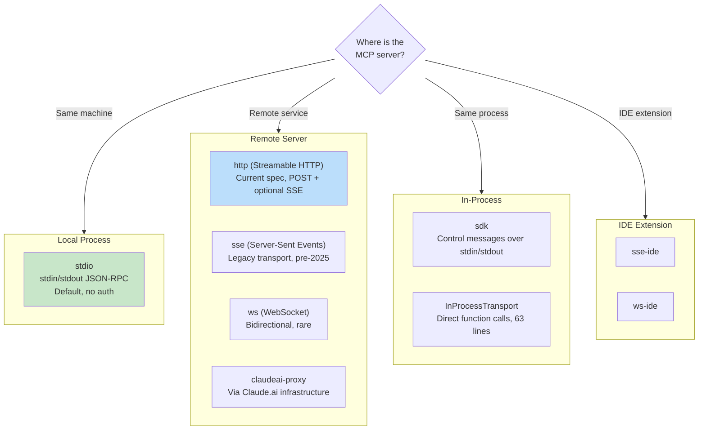
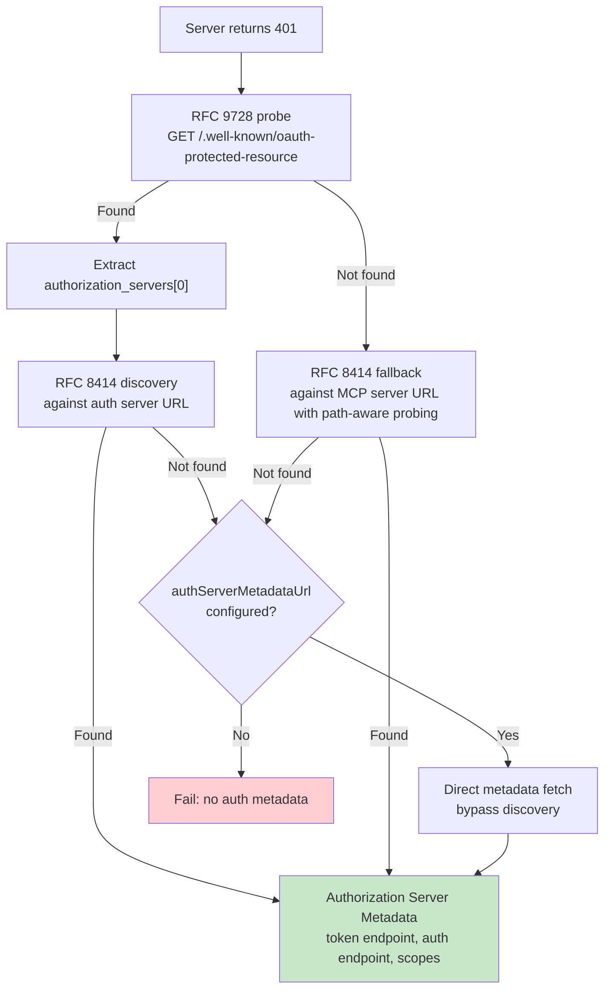

# 第十五章：MCP——通用工具協定

## 為何 MCP 的意義超越 Claude Code

本書其他章節都在討論 Claude Code 的內部機制，這一章不同。模型上下文協定（Model Context Protocol）是一套開放規範，任何代理程式都可以實作，而 Claude Code 的 MCP 子系統是現存最完整的生產環境用戶端之一。如果你正在開發一個需要呼叫外部工具的代理程式——無論使用何種語言、何種模型——本章的模式都可以直接套用。

核心主張很直接：MCP 定義了一套 JSON-RPC 2.0 協定，用於用戶端（代理程式）與伺服器（工具提供者）之間的工具探索與呼叫。用戶端送出 `tools/list` 來探索伺服器提供哪些工具，再用 `tools/call` 執行。伺服器以名稱、描述與 JSON Schema 描述每個工具的輸入。這就是整份契約的全部。其餘的部分——傳輸選擇、認證、設定載入、工具名稱正規化——是將一份乾淨規範轉化為能夠接受現實世界考驗的實作工程。

Claude Code 的 MCP 實作橫跨四個核心檔案：`types.ts`、`client.ts`、`auth.ts` 與 `InProcessTransport.ts`。它們共同支援八種傳輸類型、七種設定範疇、跨越兩份 RFC 的 OAuth 探索，以及一個讓 MCP 工具與內建工具無從區分的工具封裝層——也就是第六章介紹過的同一套 `Tool` 介面。本章將逐層說明。

---

## 八種傳輸類型

MCP 整合的第一個設計決策，是用戶端如何與伺服器通訊。Claude Code 支援八種傳輸設定：



有三個設計選擇值得注意。第一，`stdio` 是預設值——當 `type` 省略時，系統假設是本機子行程。這與最早的 MCP 設定向下相容。第二，fetch 封裝層層疊加：逾時封裝在外，往內是升級偵測，再往內是基礎 fetch。每個封裝層各自負責一件事。第三，`ws-ide` 分支有 Bun/Node 執行環境的區別——Bun 的 `WebSocket` 原生接受代理與 TLS 選項，而 Node 需要 `ws` 套件。

**何時使用哪種。** 本機工具（檔案系統、資料庫、自訂腳本）使用 `stdio`——沒有網路、不需認證、只要管道。遠端服務使用 `http`（Streamable HTTP），這是目前規範建議的方式。`sse` 雖屬遺留格式，但部署廣泛。`sdk`、IDE 以及 `claudeai-proxy` 類型則各自內建於其所屬的生態系統。

---

## 設定載入與範疇

MCP 伺服器設定從七個範疇載入，合併後去重複：

| 範疇 | 來源 | 信任程度 |
|------|------|----------|
| `local` | 工作目錄中的 `.mcp.json` | 需要使用者核准 |
| `user` | `~/.claude.json` 的 mcpServers 欄位 | 使用者自行管理 |
| `project` | 專案層級設定 | 共用的專案設定 |
| `enterprise` | 受管企業設定 | 由組織預先核准 |
| `managed` | 外掛程式提供的伺服器 | 自動探索 |
| `claudeai` | Claude.ai 網頁介面 | 透過網頁預先授權 |
| `dynamic` | 執行時期注入（SDK） | 以程式方式新增 |

**去重複是以內容為基礎，而非名稱。** 兩個名稱不同但指令或 URL 相同的伺服器，會被識別為同一台。`getMcpServerSignature()` 函式計算正規化的鍵值：本機伺服器用 `stdio:["command","arg1"]`，遠端用 `url:https://example.com/mcp`。外掛程式提供的伺服器若簽章與手動設定相符，則會被忽略。

---

## 工具封裝：從 MCP 到 Claude Code

連線成功後，用戶端呼叫 `tools/list`。每個工具定義都會被轉換為 Claude Code 內部的 `Tool` 介面——與內建工具所用的介面完全相同。封裝完成後，模型無法分辨內建工具與 MCP 工具的差異。

封裝流程分四個階段：

**1. 名稱正規化。** `normalizeNameForMCP()` 將無效字元替換為底線。完整限定名稱遵循 `mcp__{serverName}__{toolName}` 的格式。

**2. 描述截斷。** 上限為 2,048 字元。觀察到有 OpenAPI 自動產生的伺服器會將 15–60KB 的內容塞入 `tool.description`——相當於每次呼叫就消耗約 15,000 個 token 在單一工具上。

**3. Schema 直通。** 工具的 `inputSchema` 直接傳至 API，封裝時不做任何轉換或驗證。Schema 錯誤在呼叫時才會浮現，而非在註冊時。

**4. 標記對應。** MCP 標記（annotation）對應至行為旗標：`readOnlyHint` 標記工具可安全地並行執行（詳見第七章的串流執行器），`destructiveHint` 則觸發額外的權限審查。這些標記來自 MCP 伺服器——惡意伺服器可能將破壞性工具標記為唯讀。這是一個被接受的信任邊界，但值得理解：使用者已主動選擇啟用該伺服器，而惡意伺服器將破壞性工具標記為唯讀確實是一個真實的攻擊向量。系統接受這個取捨，因為另一個選擇——完全忽略標記——會阻礙合法伺服器改善使用者體驗。

---

## MCP 伺服器的 OAuth

遠端 MCP 伺服器通常需要認證。Claude Code 實作了完整的 OAuth 2.0 + PKCE 流程，包含基於 RFC 的探索機制、跨應用程式存取（Cross-App Access）以及錯誤訊息正規化。

### 探索鏈



`authServerMetadataUrl` 的逃生艙口存在，是因為有些 OAuth 伺服器兩份 RFC 都沒實作。

### 跨應用程式存取（XAA）

當 MCP 伺服器設定包含 `oauth.xaa: true` 時，系統會透過身份識別提供者（Identity Provider）執行聯合權杖交換——登入一次 IdP 就能解鎖多台 MCP 伺服器。

### 錯誤訊息正規化

`normalizeOAuthErrorBody()` 函式處理違反規範的 OAuth 伺服器。Slack 會對錯誤回應傳回 HTTP 200，並將錯誤資訊藏在 JSON 主體中。此函式會偷看 2xx POST 回應的主體，當主體符合 `OAuthErrorResponseSchema` 但不符合 `OAuthTokensSchema` 時，將回應改寫為 HTTP 400。它也會將 Slack 特有的錯誤碼（`invalid_refresh_token`、`expired_refresh_token`、`token_expired`）正規化為標準的 `invalid_grant`。

---

## 同行程傳輸

不是每個 MCP 伺服器都需要獨立的行程。`InProcessTransport` 類別讓 MCP 伺服器與用戶端可以在同一個行程中執行：

```typescript
class InProcessTransport implements Transport {
  async send(message: JSONRPCMessage): Promise<void> {
    if (this.closed) throw new Error('Transport is closed')
    queueMicrotask(() => { this.peer?.onmessage?.(message) })
  }
  async close(): Promise<void> {
    if (this.closed) return
    this.closed = true
    this.onclose?.()
    if (this.peer && !this.peer.closed) {
      this.peer.closed = true
      this.peer.onclose?.()
    }
  }
}
```

整個檔案只有 63 行。有兩個設計決策值得關注。第一，`send()` 透過 `queueMicrotask()` 傳遞訊息，以防止同步請求/回應循環中的堆疊深度問題。第二，`close()` 會級聯至對等端，避免半開放（half-open）狀態。Chrome MCP 伺服器與 Computer Use MCP 伺服器都採用這個模式。

---

## 連線管理

### 連線狀態

每個 MCP 伺服器連線存在於五種狀態之一：`connected`（已連線）、`failed`（失敗）、`needs-auth`（需要認證，帶有 15 分鐘 TTL 快取，避免 30 台伺服器各自發現同一個過期的 token）、`pending`（等待中）或 `disabled`（已停用）。

### 工作階段過期偵測

MCP 的 Streamable HTTP 傳輸使用工作階段 ID。伺服器重新啟動後，請求會收到帶有 JSON-RPC 錯誤碼 -32001 的 HTTP 404。`isMcpSessionExpiredError()` 函式同時檢查這兩個訊號——注意它使用字串包含比對來偵測錯誤碼，這種做法雖然務實卻較脆弱：

```typescript
export function isMcpSessionExpiredError(error: Error): boolean {
  const httpStatus = 'code' in error ? (error as any).code : undefined
  if (httpStatus !== 404) return false
  return error.message.includes('"code":-32001') ||
    error.message.includes('"code": -32001')
}
```

偵測到後，連線快取清除，並重試一次。

### 批次連線

本機伺服器以每批 3 個的方式連線（大量產生行程會耗盡檔案描述符），遠端伺服器則以每批 20 個。React 上下文提供者 `MCPConnectionManager.tsx` 管理生命週期，比對當前連線與新設定的差異。

---

## Claude.ai 代理傳輸

`claudeai-proxy` 傳輸說明了一個常見的代理程式整合模式：透過中介者連線。Claude.ai 訂閱者透過網頁介面設定 MCP「連接器」，CLI 再透過 Claude.ai 的基礎設施路由，由該設施處理廠商端的 OAuth。

`createClaudeAiProxyFetch()` 函式在請求時擷取 `sentToken`，而非在 401 後重新讀取。在多個連接器同時發生 401 的情況下，另一個連接器的重試可能已刷新了 token。該函式也會在刷新處理器傳回 false 時檢查是否有並行刷新——即另一個連接器已搶先獲得鎖定檔的「ELOCKED 競爭」情況。

---

## 逾時架構

MCP 逾時是分層的，每一層防範不同的故障模式：

| 層級 | 持續時間 | 防範對象 |
|------|----------|----------|
| 連線 | 30 秒 | 無法連線或啟動緩慢的伺服器 |
| 每次請求 | 60 秒（每次請求重置） | 過期逾時訊號的錯誤 |
| 工具呼叫 | 約 27.8 小時 | 合法的長時間操作 |
| 認證 | 每次 OAuth 請求 30 秒 | 無法連線的 OAuth 伺服器 |

每次請求的逾時值得特別說明。早期實作在連線時建立一個 `AbortSignal.timeout(60000)`。閒置 60 秒後，下一個請求會立即中止——訊號已經過期。解決方法：`wrapFetchWithTimeout()` 為每個請求建立全新的逾時訊號。它也在最後一步正規化 `Accept` 標頭，以防範某些執行環境或代理將其丟棄。

---

## 實際應用：將 MCP 整合進你自己的代理程式

**從 stdio 開始，日後再增加複雜性。** `StdioClientTransport` 處理一切：產生行程、建立管道、終止行程。一行設定、一個傳輸類別，就有了 MCP 工具。

**正規化名稱並截斷描述。** 名稱必須符合 `^[a-zA-Z0-9_-]{1,64}$`。加上 `mcp__{serverName}__` 前綴以避免衝突。描述上限設為 2,048 字元——OpenAPI 自動產生的伺服器否則會浪費大量 context token。

**懶惰地處理認證。** 在伺服器傳回 401 之前不要嘗試 OAuth。大多數 stdio 伺服器不需要認證。

**對內建伺服器使用同行程傳輸。** `createLinkedTransportPair()` 可以省去你控制的伺服器的子行程開銷。

**遵守工具標記並清理輸出。** `readOnlyHint` 允許並行執行。對回應進行清理，過濾可能誤導模型的惡意 Unicode（雙向覆寫字元、零寬度連接符等）。

MCP 協定刻意保持最簡——只有兩個 JSON-RPC 方法。介於這兩個方法與生產部署之間的一切，都是工程：八種傳輸、七個設定範疇、兩份 OAuth RFC，以及分層的逾時機制。Claude Code 的實作展示了這些工程在規模化後的樣貌。

下一章將探討代理程式跨越本機邊界的情況：讓 Claude Code 能夠在雲端容器中執行、接受網頁瀏覽器的指令，並透過注入憑證的代理來路由 API 流量的遠端執行協定。
