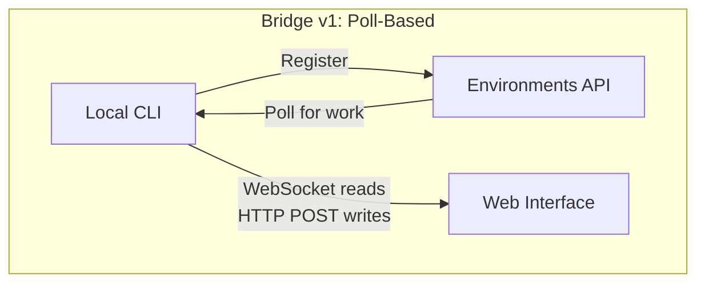
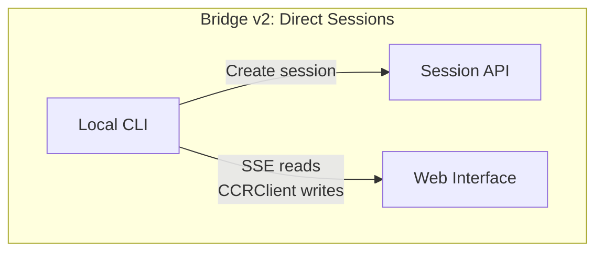
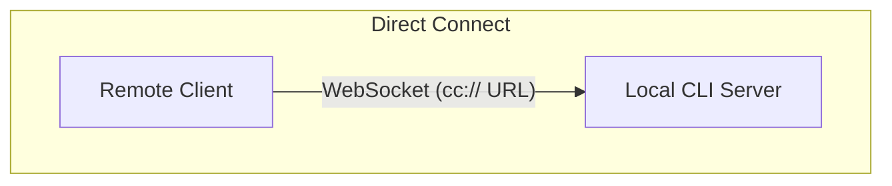
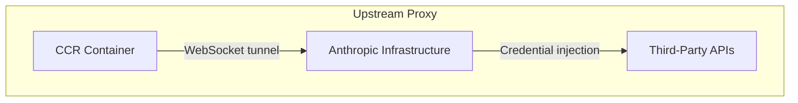

# 第十六章：遠端控制與雲端執行

## 代理程式跨越本機邊界

前面所有章節都假設 Claude Code 與程式碼執行於同一台機器上。終端機是本機的，檔案系統是本機的，模型回應串流回到一個同時擁有鍵盤和工作目錄的行程。

一旦你想從瀏覽器控制 Claude Code、在雲端容器中執行，或將其作為區域網路上的服務對外提供，這個假設就不成立了。代理程式需要一種方式來接收來自網頁瀏覽器、行動應用程式或自動化流水線的指令——將權限提示轉發給不在終端機前的使用者，並透過可能注入憑證或代表代理程式終止 TLS 的基礎設施來路由 API 流量。

Claude Code 以四個系統解決這個問題，每個系統針對不同的拓撲結構：

<div class="diagram-grid">









</div>

這些系統共享一個設計哲學：讀取與寫入是非對稱的，重新連線是自動的，故障會優雅地降級。

---

## Bridge v1：輪詢、分派、產生子行程

v1 橋接是基於環境的遠端控制系統。當開發者執行 `claude remote-control` 時，CLI 向 Environments API 註冊、輪詢工作，並為每個工作階段產生一個子行程。

在註冊前，會先通過一連串的飛行前（pre-flight）檢查：執行時期功能開關、OAuth token 驗證、組織政策檢查、失效 token 偵測（同一個過期 token 連續三次失敗後的跨行程退避），以及主動式 token 刷新（消除約 9% 會在第一次嘗試失敗的註冊）。

註冊完成後，橋接進入長輪詢循環。工作項目以工作階段形式到達（包含含有工作階段 token、API 基礎 URL、MCP 設定及環境變數的 `secret` 欄位）或以健康檢查形式到達。橋接將「無工作」的日誌訊息節流至每 100 次空輪詢才輸出一次。

每個工作階段都會產生一個子 Claude Code 行程，透過 stdin/stdout 上的 NDJSON 溝通。權限請求透過橋接傳輸流向網頁介面，由使用者核准或拒絕。整個來回必須在約 10–14 秒內完成。

---

## Bridge v2：直接工作階段與 SSE

v2 橋接完全省去了 Environments API 層——沒有註冊、沒有輪詢、沒有確認、沒有心跳、沒有登出。動機在於：v1 要求伺服器在分派工作前先知道機器的能力。v2 將生命週期壓縮為三個步驟：

1. **建立工作階段**：用 OAuth 憑證 `POST /v1/code/sessions`。
2. **連線橋接**：`POST /v1/code/sessions/{id}/bridge`。回傳 `worker_jwt`、`api_base_url` 與 `worker_epoch`。每次 `/bridge` 呼叫都會遞增 epoch——這本身就是註冊動作。
3. **開啟傳輸**：讀取用 SSE，寫入用 `CCRClient`。

傳輸抽象層（`ReplBridgeTransport`）在 v1 與 v2 背後提供統一介面，因此訊息處理不需要知道它在與哪個世代通訊。

當 SSE 連線因 401 而中斷時，傳輸層會用來自新 `/bridge` 呼叫的新憑證重建，同時保留序號游標——不會遺失任何訊息。寫入路徑使用每個實例的 `getAuthToken` 閉包，而非全行程的環境變數，防止 JWT 在並行工作階段間洩漏。

### FlushGate

一個微妙的排序問題：橋接在傳送對話歷史的同時，也必須接受來自網頁介面的即時寫入。如果即時寫入在歷史刷新期間抵達，訊息可能會亂序傳遞。`FlushGate` 在刷新 POST 期間將即時寫入排入佇列，並在完成後依序排空。

### Token 刷新與 Epoch 管理

v2 橋接在 worker JWT 過期前主動刷新。新的 epoch 告知伺服器這是同一個 worker 但帶有新憑證。Epoch 不符（409 回應）被積極處理：兩個連線都關閉，並拋出例外以展開呼叫堆疊，防止腦裂（split-brain）情況。

---

## 訊息路由與 Echo 去重複

兩個世代的橋接都以 `handleIngressMessage()` 作為中央路由器：

1. 解析 JSON，正規化控制訊息的鍵名。
2. 將 `control_response` 路由至權限處理器，`control_request` 路由至請求處理器。
3. 對照 `recentPostedUUIDs`（echo 去重複）與 `recentInboundUUIDs`（重複投遞去重複）檢查 UUID。
4. 轉發經過驗證的使用者訊息。

### BoundedUUIDSet：O(1) 查詢，O(capacity) 記憶體

橋接有 echo 問題——訊息可能在讀取串流上被 echo 回來，或在傳輸切換期間被投遞兩次。`BoundedUUIDSet` 是一個由環形緩衝區支撐的 FIFO 有界集合：

```typescript
class BoundedUUIDSet {
  private buffer: string[]
  private set: Set<string>
  private head = 0

  add(uuid: string): void {
    if (this.set.size >= this.capacity) {
      this.set.delete(this.buffer[this.head])
    }
    this.buffer[this.head] = uuid
    this.set.add(uuid)
    this.head = (this.head + 1) % this.capacity
  }

  has(uuid: string): boolean { return this.set.has(uuid) }
}
```

兩個實例並行執行，各自容量為 2000。透過 Set 實現 O(1) 查詢，透過環形緩衝區驅逐實現 O(capacity) 記憶體，無需計時器或 TTL。未知的控制請求子類型會收到錯誤回應而非靜默忽略——避免伺服器等待一個永遠不會到來的回應。

---

## 非對稱設計：持久讀取，HTTP POST 寫入

CCR 協定使用非對稱傳輸：讀取透過持久連線（WebSocket 或 SSE），寫入透過 HTTP POST。這反映了通訊模式中一個根本性的不對稱。

讀取是高頻、低延遲、由伺服器發起的——在 token 串流期間每秒可能有數百條小訊息。持久連線是唯一合理的選擇。寫入是低頻、由客戶端發起，且需要確認——每分鐘幾條，而非每秒。HTTP POST 提供可靠傳遞、透過 UUID 實現冪等性，以及與負載平衡器的自然整合。

試圖將兩者統一在單一 WebSocket 上會產生耦合：如果 WebSocket 在寫入期間斷線，你需要重試邏輯，而且必須區分「未傳送」和「已傳送但遺失確認」。分離的通道讓每個通道都能獨立優化。

---

## 遠端工作階段管理

`SessionsWebSocket` 管理 CCR WebSocket 連線的客戶端。它的重連策略根據故障類型做出區分：

| 故障 | 策略 |
|------|------|
| 4003（未授權） | 立即停止，不重試 |
| 4001（找不到工作階段） | 最多重試 3 次，線性退避（壓縮期間的暫時現象） |
| 其他暫時性故障 | 指數退避，最多 5 次 |

`isSessionsMessage()` 型別守衛接受任何具有字串 `type` 欄位的物件——刻意寬鬆。硬式編碼的允許清單會在客戶端更新前靜默丟棄新訊息類型。

---

## 直接連線：本機伺服器

直接連線是最簡單的拓撲：Claude Code 作為伺服器執行，客戶端透過 WebSocket 連線。沒有雲端中介、沒有 OAuth token。

工作階段有五種狀態：`starting`（啟動中）、`running`（執行中）、`detached`（已分離）、`stopping`（停止中）、`stopped`（已停止）。中繼資料持久化至 `~/.claude/server-sessions.json`，以便在伺服器重新啟動後恢復。`cc://` URL 機制為本機連線提供整潔的定址方式。

---

## 上游代理：容器中的憑證注入

上游代理執行於 CCR 容器內部，解決一個特定問題：在代理程式可能執行不受信任指令的容器中，將組織憑證注入到對外的 HTTPS 流量。

設置順序精心安排：

1. 從 `/run/ccr/session_token` 讀取工作階段 token。
2. 透過 Bun FFI 呼叫 `prctl(PR_SET_DUMPABLE, 0)`——封鎖對行程堆積的同 UID ptrace。若無此步驟，提示注入的 `gdb -p $PPID` 可從記憶體中抓取 token。
3. 下載上游代理 CA 憑證並與系統 CA 套件合併。
4. 在臨時連接埠啟動本機 CONNECT 至 WebSocket 的中繼。
5. 取消連結 token 檔案——token 此後只存在於堆積上。
6. 為所有子行程匯出環境變數。

每個步驟都是失敗開放（fail open）的：錯誤會停用代理，而不是終止工作階段。這是正確的取捨——代理失敗意味著某些整合將無法運作，但核心功能仍然可用。

### Protobuf 手工編碼

透過隧道傳輸的位元組被包裝在 `UpstreamProxyChunk` protobuf 訊息中。Schema 極為簡單——`message UpstreamProxyChunk { bytes data = 1; }`——Claude Code 以十行程式碼手工編碼，而非引入 protobuf 執行時期：

```typescript
export function encodeChunk(data: Uint8Array): Uint8Array {
  const varint: number[] = []
  let n = data.length
  while (n > 0x7f) { varint.push((n & 0x7f) | 0x80); n >>>= 7 }
  varint.push(n)
  const out = new Uint8Array(1 + varint.length + data.length)
  out[0] = 0x0a  // field 1, wire type 2
  out.set(varint, 1)
  out.set(data, 1 + varint.length)
  return out
}
```

十行程式碼取代了完整的 protobuf 執行時期。單一欄位的訊息不值得引入一個依賴——位元操作的維護負擔遠低於供應鏈風險。

---

## 實際應用：設計遠端代理程式執行

**分離讀取與寫入通道。** 當讀取是高頻串流而寫入是低頻 RPC 時，統一它們會造成不必要的耦合。讓每個通道獨立地失敗與恢復。

**限制去重複記憶體的上限。** BoundedUUIDSet 模式提供固定記憶體的去重複。任何至少投遞一次的系統都需要有界的去重複緩衝區，而非無界的 Set。

**讓重連策略與故障訊號成比例。** 永久性故障不應重試。暫時性故障應帶退避地重試。模糊的故障應以低上限重試。

**在對抗性環境中讓機密只存在於堆積中。** 從檔案讀取 token、停用 ptrace、取消連結檔案，能同時消除檔案系統與記憶體檢查的攻擊向量。

**輔助系統應採用失敗開放。** 上游代理採用失敗開放，因為它提供的是增強功能（憑證注入），而非核心功能（模型推論）。

遠端執行系統體現了一個更深層的原則：代理程式的核心循環（第五章）應該對指令來自何處、結果去往何處保持不知情。橋接、直接連線與上游代理都是傳輸層。無論使用者是坐在終端機前，還是在 WebSocket 的另一端，其上的訊息處理、工具執行與權限流程都是完全相同的。

下一章將探討另一個操作面向：效能——Claude Code 如何在啟動、渲染、搜尋與 API 成本各方面，讓每一毫秒和每一個 token 都物盡其用。
