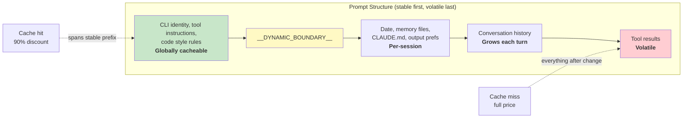

# 第十七章：效能——每一毫秒與每一個 Token 都很重要

## 資深工程師的應對手冊

代理系統的效能優化不是單一問題，而是五個：

1. **啟動延遲**——從按下按鍵到第一個有用輸出的時間。使用者會放棄感覺啟動緩慢的工具。
2. **Token 效率**——上下文視窗中有用內容與額外開銷的比例。上下文視窗是最受限的資源。
3. **API 成本**——每次呼叫的金額。提示快取可以降低 90%，但前提是系統在各次呼叫間保持快取穩定性。
4. **渲染吞吐量**——串流輸出期間的每秒幀數。第十三章介紹了渲染架構；本章介紹讓渲染保持快速的效能量測與優化。
5. **搜尋速度**——在每次按鍵時，於 270,000 個路徑的程式碼庫中搜尋檔案的時間。

Claude Code 以各種技術攻克這五個問題，從顯而易見的（記憶化）到細緻入微的（用於模糊搜尋預過濾的 26 位元點陣圖）。關於方法論的說明：這些不是理論優化。Claude Code 搭載了超過 50 個啟動分析檢查點，在 100% 的內部使用者及 0.5% 的外部使用者上採樣。以下每項優化都是由這套儀器的數據驅動，而非直覺。

---

## 節省啟動的毫秒數

### 模組層級 I/O 並行化

進入點 `main.tsx` 刻意違反了「模組範疇不應有副作用」的慣例：

```typescript
profileCheckpoint('main_tsx_entry');
startMdmRawRead();       // fires plutil/reg-query subprocesses
startKeychainPrefetch();  // fires both macOS keychain reads in parallel
```

兩個 macOS 鑰匙圈條目若循序執行，會花費約 65 毫秒的同步產生行程時間。將兩者作為即發即忘的 Promise 在模組層級啟動，讓它們與約 135 毫秒的模組載入並行執行——而在那段期間 CPU 本來是閒置的。

### API 預連線

`apiPreconnect.ts` 在初始化期間向 Anthropic API 發出 `HEAD` 請求，讓 TCP+TLS 握手（100–200 毫秒）與設置工作重疊進行。在互動模式中，重疊時間是無界的——在使用者打字的同時，連線就在預熱。該請求在 `applyExtraCACertsFromConfig()` 和 `configureGlobalAgents()` 之後才觸發，確保已預熱的連線使用正確的傳輸設定。

### 快速路徑分派與延遲匯入

CLI 進入點包含針對特定子指令的提前返回路徑——`claude mcp` 永遠不會載入 React REPL，`claude daemon` 永遠不會載入工具系統。重型模組透過動態 `import()` 按需載入：OpenTelemetry（約 400KB + 約 700KB gRPC）、事件日誌、錯誤對話框、上游代理。`LazySchema` 將 Zod schema 的建構延遲至第一次驗證時，將成本推到啟動之後。

---

## 節省上下文視窗的 Token

### 槽位預留：預設 8K，升級至 64K

影響最大的單一優化：

預設輸出槽位預留為 8,000 個 token，截斷時升級至 64,000。API 會為模型的回應保留 `max_output_tokens` 的容量。預設 SDK 值為 32K–64K，但生產數據顯示 p99 輸出長度為 4,911 個 token。預設值過度保留了 8–16 倍，每次呼叫浪費 24,000–59,000 個 token。Claude Code 設上限為 8K，並在少數截斷情況（不到 1% 的請求）下重試時升至 64K。對於 200K 的視窗，這等於可用上下文提升了 12–28%——而且完全免費。

### 工具結果預算

| 限制 | 數值 | 用途 |
|------|------|------|
| 每工具字元數 | 50,000 | 超出時持久化至磁碟 |
| 每工具 token 數 | 100,000 | 約 400KB 文字的上限 |
| 每訊息總計 | 200,000 字元 | 防止 N 個並行工具在一次呼叫中打爆預算 |

每訊息總計是關鍵洞見。若無此限制，「讀取 src/ 中的所有檔案」可能產生 10 個並行讀取，每個各回傳 40K 字元。

### 上下文視窗大小

預設的 200K token 視窗可透過模型名稱的 `[1m]` 後綴或實驗性處理擴展至 1M。當使用量接近上限時，一套四層壓縮系統會逐步摘要較舊的內容。Token 計數錨定於 API 實際的 `usage` 欄位，而非客戶端估算——以反映提示快取積分、思考 token 與伺服器端轉換。

---

## 節省 API 呼叫的費用

### 提示快取架構



Anthropic 的提示快取基於精確的前綴比對。若前綴中間有一個 token 改變，其後的一切都是快取未命中。Claude Code 將整個提示的結構安排為穩定部分在前、易變部分在後。

當 `shouldUseGlobalCacheScope()` 傳回 true 時，動態邊界之前的系統提示條目會取得 `scope: 'global'`——執行同一版本 Claude Code 的兩個使用者共享前綴快取。當有 MCP 工具存在時，全域範疇會被停用，因為 MCP schema 是每個使用者專屬的。

### 黏性鎖存欄位

五個布林欄位採用「一旦為真就保持為真」的模式——在工作階段中一旦設為 true 就不再改變：

| 鎖存欄位 | 防範的問題 |
|----------|-----------|
| `promptCache1hEligible` | 工作階段中途的超額翻轉改變快取 TTL |
| `afkModeHeaderLatched` | Shift+Tab 切換破壞快取 |
| `fastModeHeaderLatched` | 冷卻期進入/退出雙重破壞快取 |
| `cacheEditingHeaderLatched` | 工作階段中途的設定切換破壞快取 |
| `thinkingClearLatched` | 在確認快取未命中後切換思考模式 |

每個欄位對應一個標頭或參數——若在工作階段中途改變，將破壞約 50,000–70,000 個 token 的已快取提示。鎖存機制犧牲了工作階段中途的切換能力，以換取快取的穩定性。

### 記憶化的工作階段日期

```typescript
const getSessionStartDate = memoize(getLocalISODate)
```

若無此機制，日期會在午夜改變，破壞整個已快取的前綴。一個稍微過時的日期只是外觀問題；快取被破壞則意味著要重新處理整段對話。

### Section 記憶化

系統提示 section 使用兩層快取。大多數內容使用 `systemPromptSection(name, compute)`，快取至 `/clear` 或 `/compact` 為止。終極手段 `DANGEROUS_uncachedSystemPromptSection(name, compute, reason)` 每次呼叫都重新計算——命名慣例迫使開發者說明為何需要破壞快取。

---

## 節省渲染的 CPU

第十三章深入介紹了渲染架構——壓縮的型別化陣列、基於物件池的字符駐留、雙緩衝，以及儲存格層級的差異比對。本章專注於保持渲染快速的效能量測與自適應行為。

終端機渲染器透過 `throttle(deferredRender, FRAME_INTERVAL_MS)` 節流至 60fps。當終端機失去焦點時，間隔加倍至 30fps。捲動排空幀以四分之一間隔執行，以達到最大捲動速度。這種自適應節流確保渲染永遠不會消耗超過必要的 CPU。

React 編譯器（`react/compiler-runtime`）在整個程式碼庫中自動記憶化元件渲染。手動的 `useMemo` 和 `useCallback` 容易出錯；編譯器在建構時就能正確處理。預先分配的凍結物件（`Object.freeze()`）消除了常見渲染路徑值的記憶體配置——在替代螢幕模式下每幀節省一次配置，在數千幀後累積效果顯著。

如需完整的渲染流水線細節——`CharPool`/`StylePool`/`HyperlinkPool` 字符駐留系統、位元映射優化、損傷矩形追蹤、`OffscreenFreeze` 元件——請參閱第十三章。

---

## 節省搜尋的記憶體與時間

模糊檔案搜尋在每次按鍵時執行，搜尋 270,000 個以上的路徑。三層優化讓它保持在幾毫秒以內。

### 點陣圖預過濾

每個已索引的路徑都有一個 26 位元的點陣圖，記錄它包含哪些小寫字母：

```typescript
// Pseudocode — illustrates the 26-bit bitmap concept
function buildCharBitmap(filepath: string): number {
  let mask = 0
  for (const ch of filepath.toLowerCase()) {
    const code = ch.charCodeAt(0)
    if (code >= 97 && code <= 122) mask |= 1 << (code - 97)
  }
  return mask  // Each bit represents presence of a-z
}
```

搜尋時：`if ((charBits[i] & needleBitmap) !== needleBitmap) continue`。任何缺少查詢字母的路徑會立即被排除——一次整數比較，無需字串操作。排除率：廣泛查詢（如 "test"）約 10%，含罕見字母的查詢達 90% 以上。成本：每條路徑 4 位元組，270,000 條路徑約 1MB。

### 分數上限排除與融合的 indexOf 掃描

通過點陣圖的路徑在進行昂貴的邊界/駝峰式計分之前，會先接受分數上限檢查。如果最佳情況的分數無法超越目前前 K 名的門檻，該路徑就被跳過。

實際比對將位置尋找與間距/連續加分的計算融合在一起，使用 `String.indexOf()`——這在 JSC（Bun）和 V8（Node）中都有 SIMD 加速。引擎優化過的搜尋比手動字元循環快得多。

### 帶部分可查詢性的非同步索引

對於大型程式碼庫，`loadFromFileListAsync()` 每約 4 毫秒工作就讓出事件循環（基於時間，而非計數——能適應機器速度）。它回傳兩個 Promise：`queryable`（第一個區塊完成時解析，允許立即取得部分結果）和 `done`（完整索引建立完成）。使用者可以在檔案清單可用後 5–10 毫秒內開始搜尋。

讓出檢查使用 `(i & 0xff) === 0xff`——一個無分支的模 256 運算，以分攤 `performance.now()` 的成本。

---

## 記憶相關性側查詢

有一項優化位於 token 效率與 API 成本的交叉點。如第十一章所述，記憶系統使用輕量級的 Sonnet 模型呼叫——而非主要的 Opus 模型——來選擇要包含哪些記憶檔案。這項成本（快速模型上最多 256 個輸出 token）與不包含不相關記憶檔案所節省的 token 相比微乎其微。一個不相關的 2,000 token 記憶，其浪費的上下文成本遠高於側查詢的 API 費用。

---

## 推測性工具執行

`StreamingToolExecutor` 在工具串流進來時就開始執行，無需等待完整回應。唯讀工具（Glob、Grep、Read）可以並行執行；寫入工具需要獨佔存取。`partitionToolCalls()` 函式將連續的安全工具分成批次：[Read, Read, Grep, Edit, Read, Read] 變成三個批次——[Read, Read, Grep] 並行、[Edit] 序列、[Read, Read] 並行。

結果始終以原始工具順序傳遞，以確保模型推理的確定性。當 Bash 工具發生錯誤時，一個兄弟中止控制器會終止並行子行程，避免資源浪費。

---

## 串流與原始 API

Claude Code 使用原始串流 API，而非 SDK 的 `BetaMessageStream` 輔助工具。該輔助工具在每個 `input_json_delta` 上呼叫 `partialParse()`——其時間複雜度對工具輸入長度是 O(n²)。Claude Code 累積原始字串，並在區塊完成時才解析一次。

串流監視器（`CLAUDE_STREAM_IDLE_TIMEOUT_MS`，預設 90 秒）在沒有區塊抵達時中止並重試，在代理故障時退回至非串流的 `messages.create()`。

---

## 實際應用：代理系統的效能

**審計你的上下文視窗預算。** 你的 `max_output_tokens` 預留值與實際 p99 輸出長度之間的差距就是浪費的上下文。設定一個緊湊的預設值，在截斷時升級。

**以快取穩定性作為架構考量。** 你提示中的每個欄位不是穩定的就是易變的。穩定的放前面，易變的放後面。將對話中途對穩定前綴的任何改動視為有金錢成本的錯誤。

**並行化啟動 I/O。** 模組載入是 CPU 密集的。鑰匙圈讀取和網路握手是 I/O 密集的。在匯入之前啟動 I/O。

**對搜尋使用點陣圖預過濾。** 一個便宜的預過濾器在昂貴計分之前排除 10–90% 的候選者，在每條目 4 位元組的成本下效益顯著。

**在重要的地方量測。** Claude Code 有超過 50 個啟動檢查點，在內部 100% 採樣，在外部 0.5% 採樣。沒有量測的效能工作只是猜測。

---

最後一個觀察：這些優化大多在演算法上並不複雜。點陣圖預過濾、環形緩衝區、記憶化、字符駐留——這些都是計算機科學的基礎。複雜性在於知道在哪裡應用它們。啟動分析器告訴你毫秒在哪裡。API 使用欄位告訴你 token 在哪裡。快取命中率告訴你金錢在哪裡。永遠是先量測，後優化。
